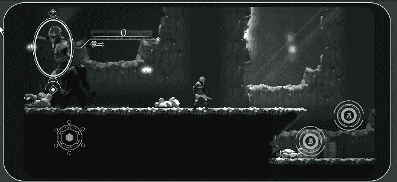

# 向 Unity 添加 Android 触摸控制

> 原文：<https://medium.com/nerd-for-tech/adding-android-touch-controls-to-unity-ad57ba213fef?source=collection_archive---------5----------------------->

## 在 Unity 开始手机游戏开发

## //来自标准资产的跨平台控件

让我们的控件适用于 Android

现在我们可以将我们的目标平台切换到 Unity([Unity 3D Switching Your Target Platform | by James West | Aug，2021 | Medium](https://valdarixgames.medium.com/unity-3d-switching-your-platform-45753f49e75f) )我们需要开始实现 UI 元素并将其连接到游戏代码中。