# 向过场动画添加音频

> 原文：<https://medium.com/nerd-for-tech/adding-audio-to-a-cutscene-ed51b481aed2?source=collection_archive---------27----------------------->

现在我们已经完成了一些小的过场动画，让我们开始制作一个大的。这个接近一分钟长，将覆盖我们将要工作的整个房间。因为它带有配音，我们需要调整我们的剪辑以适应配音和导演的视觉。首先，让我们看看导演的想法:

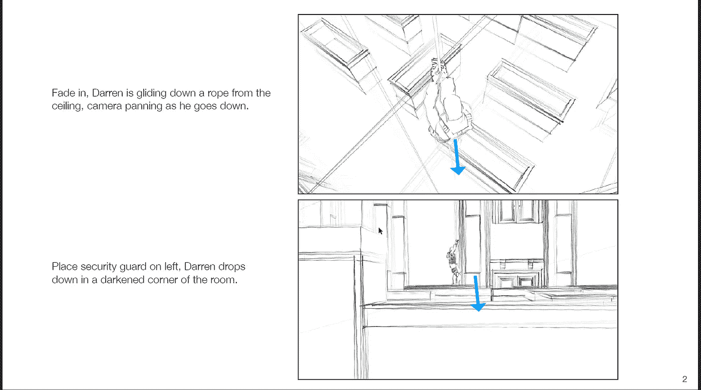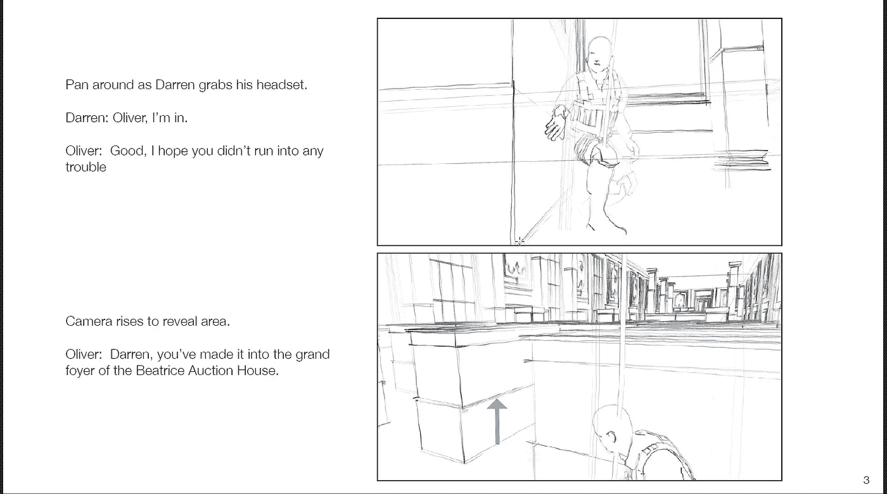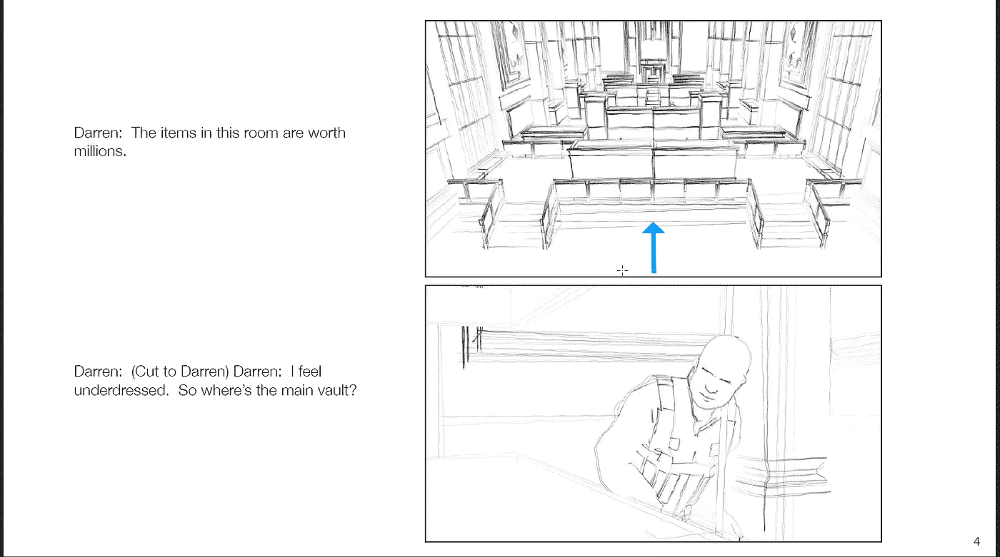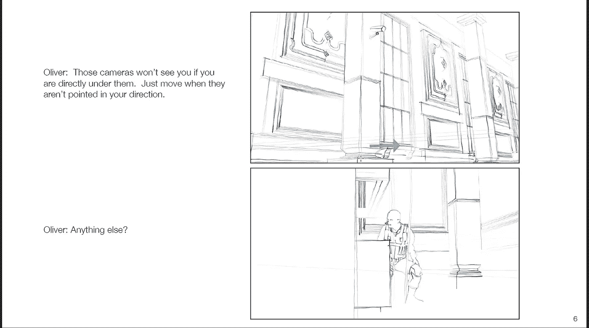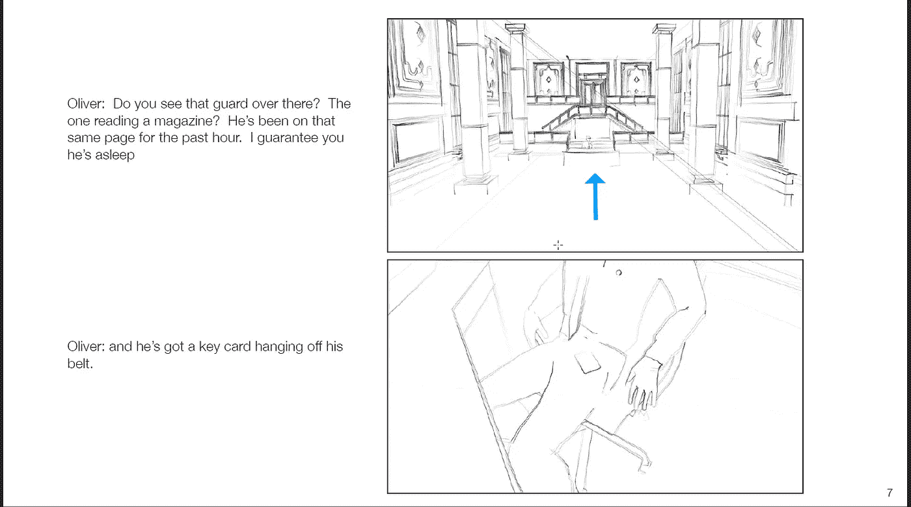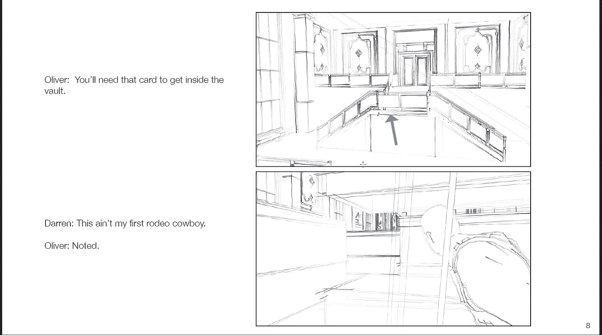

首先，让我们设置好所有的虚拟摄像机，这样我们就有了我们想要的场景的大致区域，然后我们可以用小的动作来润色实际的位置。这将节省我们的时间，因为我们能够计算出有多少镜头，我们想工作。至于创建相机的，我将跳过这些细节，因为我们已经过如何调整我们的相机视图到我们想要的场景:

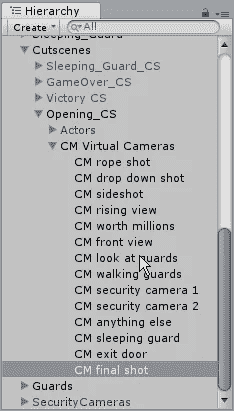

这些将是我们最终要处理的所有镜头。接下来，我们将创建我们的时间线，并尝试将我们的摄像机镜头放入剪辑中。

在时间轴中创建动画序列后，让我们添加音频。首先，我们要在过场动画组中为我们的音频创建一个新的空白，并为要链接的音频添加占位符。在那里，我们将向对象添加一个音频源组件:

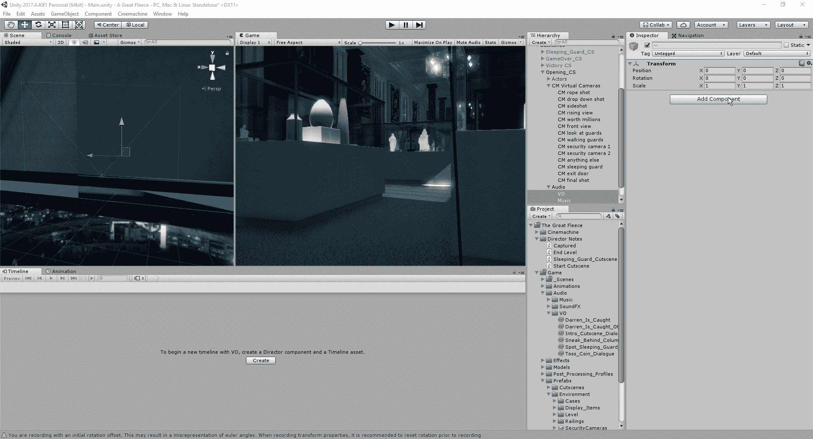

接下来，让我们进入我们的时间线，并通过创建音轨来添加它们:

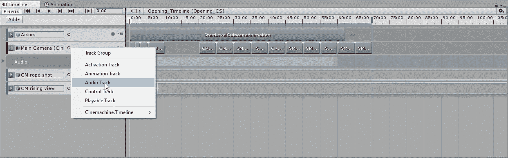

从这里开始，我们将重复之前添加动画的过程，但是升级我们需要的音频文件。之后，我们将创建一个跟踪组。轨道组将允许我们保持时间轴层次结构的整洁，这样，如果有我们需要处理的特定部分，就更容易找到，而不是滚动浏览我们对其进行的所有添加:

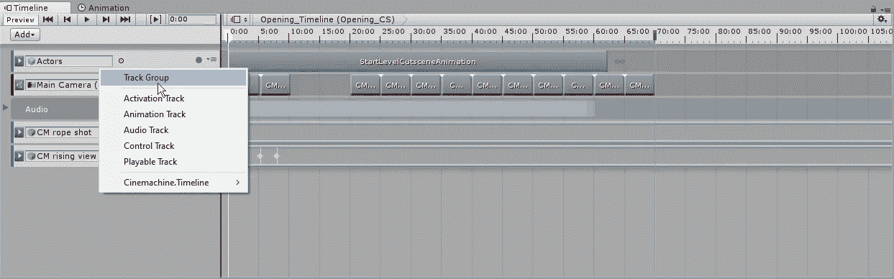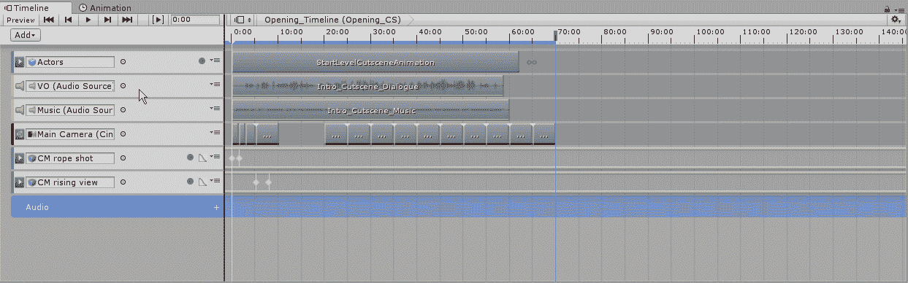

现在我们可以开始我们的工作了，把我们的镜头对准我们已经就位的摄像机。为了让这项工作，但是，我们将不得不在播放模式下听到音频剪辑。然而，好的一面是我们在时间线内所做的任何编辑即使在我们停止游戏时也会保留下来，所以用这种方式编辑就可以了。你唯一需要考虑的是，当你移动时间轴时，你会不断地听到停止和剪切的声音。