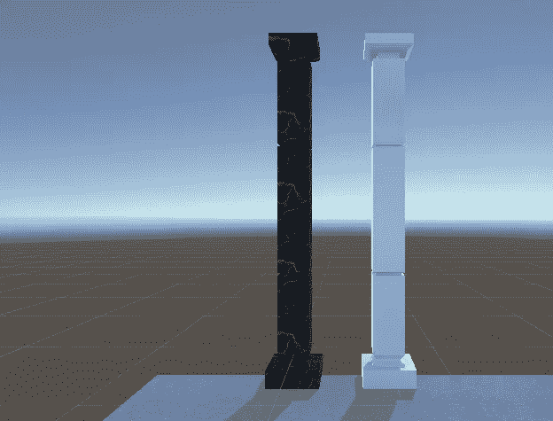
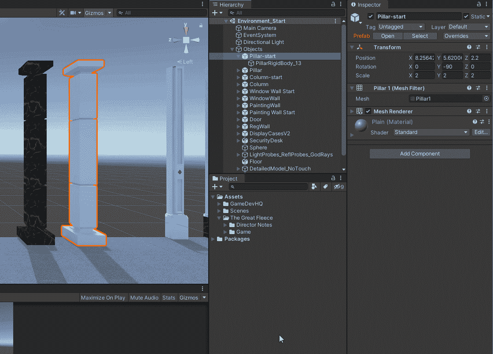
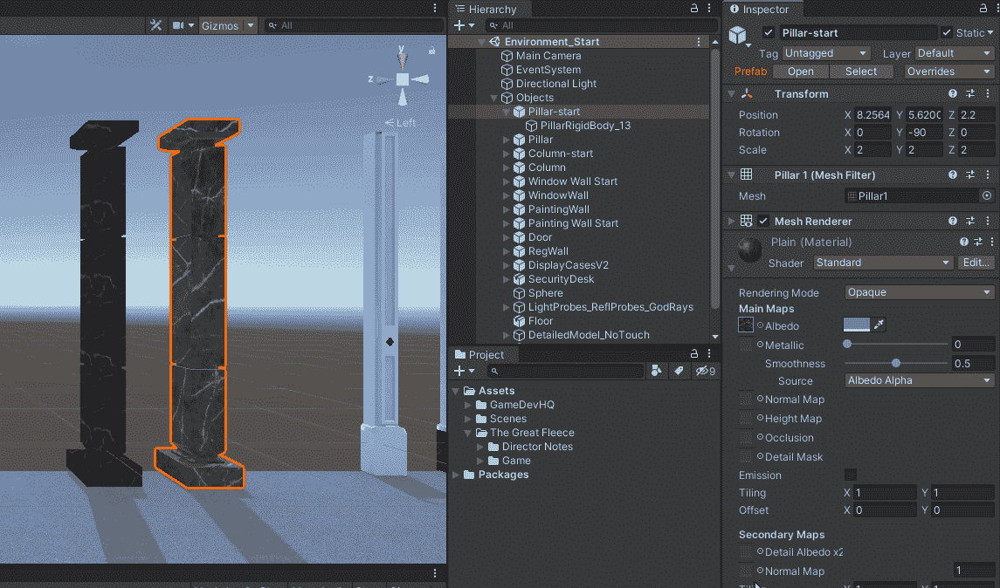
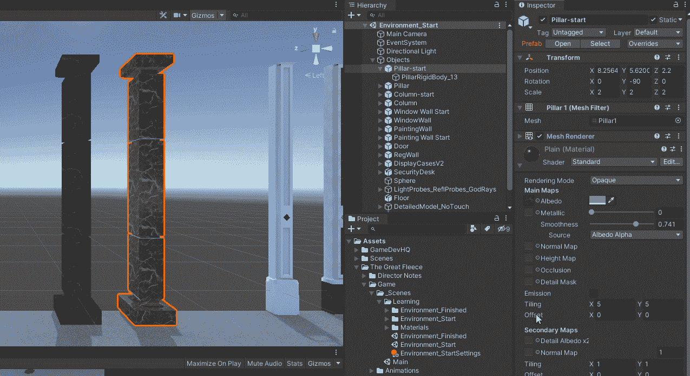
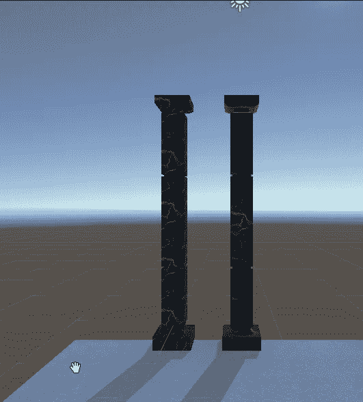

# 向 3D 对象添加颜色和纹理

> 原文：<https://medium.com/nerd-for-tech/adding-color-and-texture-to-3d-objects-74baeecf0438?source=collection_archive---------15----------------------->

目标:为 3d 艺术家提供的 3D 对象添加颜色和纹理。

柱子在前

上面是 2 根柱子，我们的工作是让右边的柱子看起来像左边的柱子。我们的 3D 艺术家已经提供了柱子和纹理 UV 映射。

我将使用标准着色器的反照率通道以及着色器的一些其他元素。

添加纹理

上面我添加了一个黑色大理石纹理。如你所见，它看起来和柱子不太一样。这是因为纹理在整个对象上被拉伸。下面我将展示如何使用瓷砖属性来调整纹理。

调整平铺

既然已经应用了纹理并调整了平铺，我们可以继续讨论另外两个属性；金属质感和平滑度。金属将调整纹理或光泽的金属属性。在 0 时，它是暗淡的，在 1 时，它是非常明亮的。你可以通过表面反射的光看到。我会把金属漆调到 0.80 到 0.90 之间。平滑度将调整纹理的平滑程度，0 表示纹理粗糙，1 表示纹理平滑。我会把平滑度设置在 0.75 左右。

调整金属和光滑度

好了，现在让我们看看最终产品，一个完美的匹配。

皮拉尔之后

编码快乐！！！！