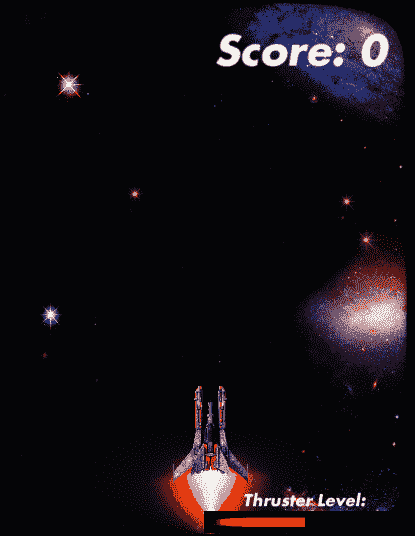
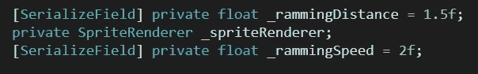
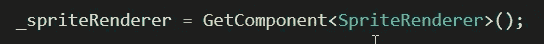
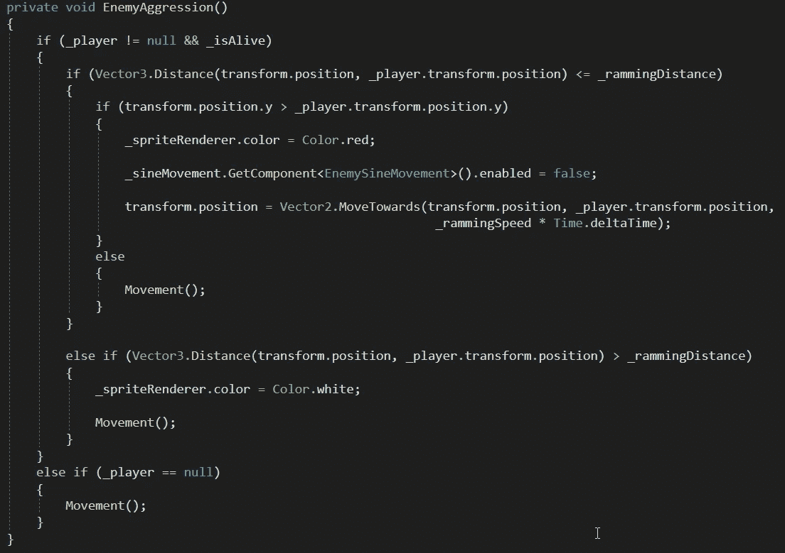
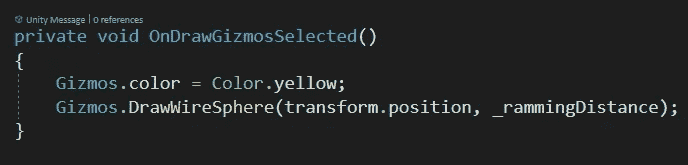
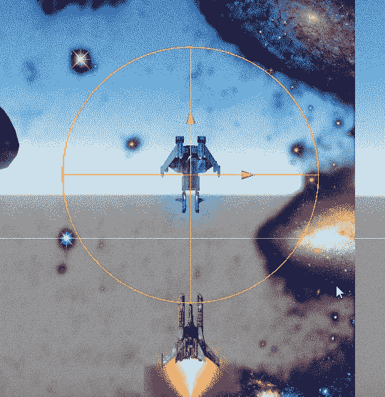

# 随着距离增加敌人的侵略性

> 原文：<https://medium.com/nerd-for-tech/adding-enemy-aggression-with-distance-807f9b2fa044?source=collection_archive---------28----------------------->

我们创造了我们的**神风特攻队敌人**，**总是**向我们的**玩家**移动。但是，如果我们增加一些功能，让我们的老敌人在**离**太近的时候能够"**撞****玩家**呢？

这就是今天的文章将要发生的事情！

“宝贝回来！”

# 在剧本里面

我们所有的**冲击逻辑**都将在当前**敌方脚本**内。

首先，我们可以创建一些在整个脚本中使用的**全局变量**:

*   距离我们触发敌人入侵还有多远
*   我们可以改变敌人的颜色，让玩家知道他们处于“侵略”模式
*   **_rammingSpeed** =敌人向玩家冲锋的速度

我们将在 Start()中初始化对 Sprite 渲染器的引用:

不要忘记空检查！

然后我们将为 **EnemyAggression()** 逻辑创建逻辑:

我已经设置好了，这样**敌人**只会**试图**向玩家**冲锋**如果他们在之上**他们在**屏幕上**(**if(transform . position . y>_ Player . transform . position . y**)，让玩家可以躲避来势汹汹的敌人。**

# 小发明是你的朋友

当确定正确的值来设置某些东西时，比如我们例子中的距离，使用**小发明**来**在你的**场景窗口**中可视化**距离是非常有帮助的。

通过在您的脚本中添加 **OnDrawGizmosSelected()** ，您可以**可视化**您的值，并且**在**检查器**中调整**它们(使用**【serialize field】**或**公共**变量)以获得正确的距离！

可视化:

在 2D，DrawWireSphere 显示为圆形！

就这样，我们成功地给了我们的敌人更多的勇气！现在躲避敌人不像以前那么容易了！

在下一篇文章中，我们将创造另一个新的敌人…这一次给他们向后射击的能力！