# 添加最终 Boss

> 原文：<https://medium.com/nerd-for-tech/adding-final-boss-eb3e6d14cd07?source=collection_archive---------22----------------------->

第 52 天-制作 2D 太空射击游戏

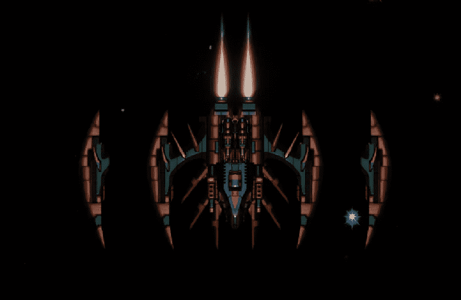

**目标:**创造一个被击败后结束游戏的 Boss。

首先，boss 由三部分组成，两臂会跟随玩家并开火，中间的主体会发射激光束。

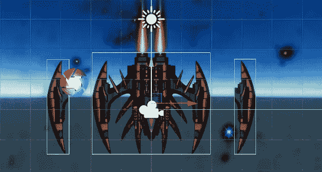

将这三个部分添加到一个空的游戏对象中，使其成为一个实体。

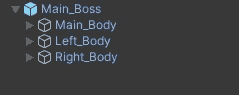

现在，创建一个脚本，并将其添加到 Main_Boss gameobject 中，这样就可以从整体上控制 Boss 的行为。

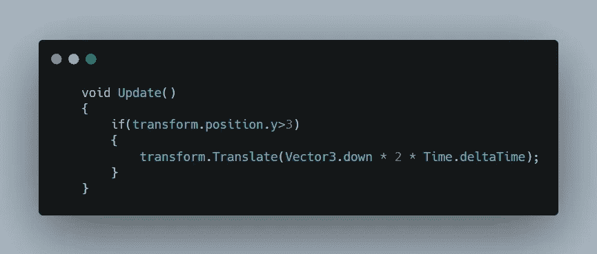

然后在 Update 中添加移动功能，这将使 boss 向下移动，直到到达 Y 轴上的所需位置。

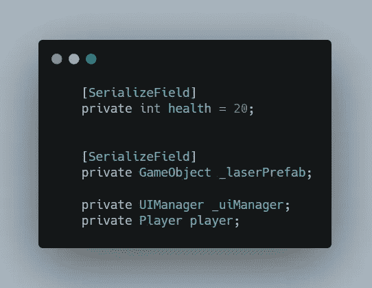

现在为 Main_Body 游戏对象创建另一个脚本，它将处理单个游戏对象的行为。

在脚本中，添加变量来引用其他脚本，并定义一个健康变量来确定在 boss 被摧毁之前主体可以受到伤害的次数。

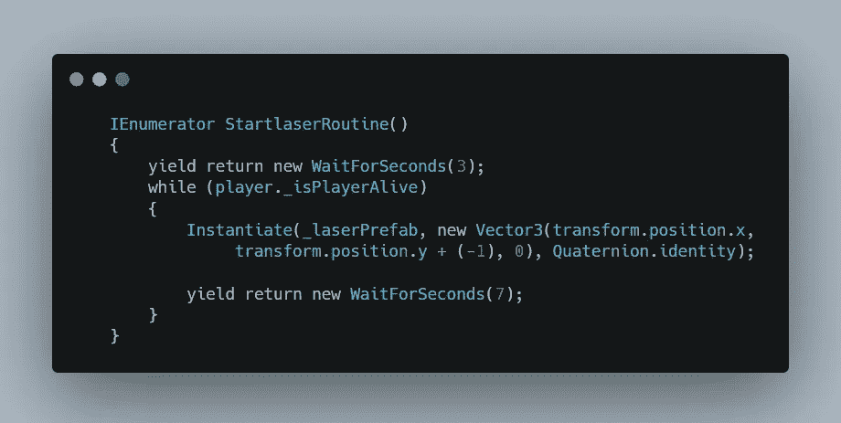

现在定义一个协程，它将为主 boss 处理激光束的产生。

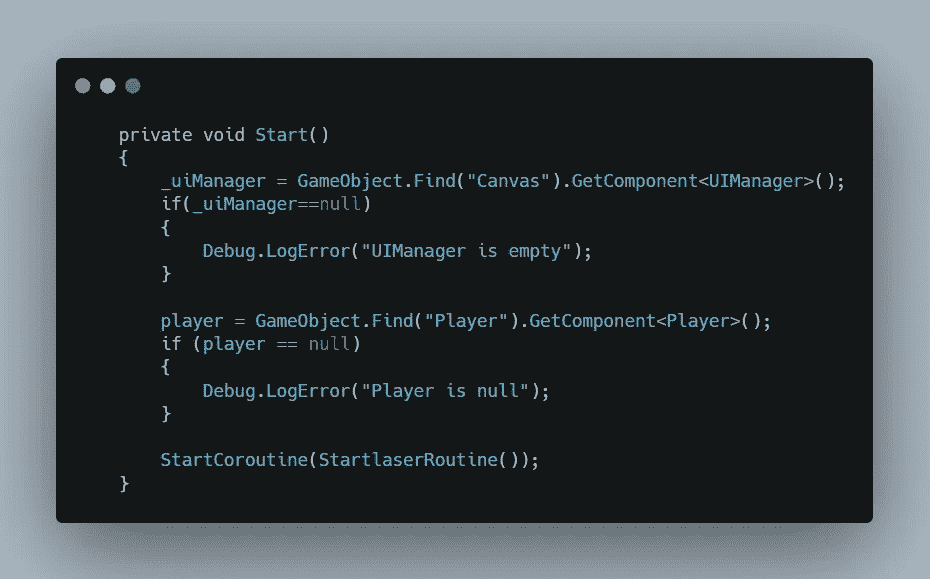

现在在产卵的时候创建一个对所有需要的脚本的引用，并启动创建的协程，这样 boss 将在一定的时间间隔开始发射激光束。

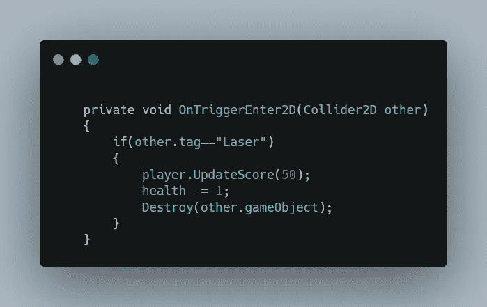

然后创建一个 OnTrigger 函数，该函数将处理与玩家发射的激光接触时的 boss 行为。

每一次击中 boss 的激光都会减少 boss 的生命值 1，每次击中都会给玩家的总得分增加 50，并摧毁击中 boss 的激光。

当玩家成功击中了生命值为 0 的 boss 时，调用 UIManager 显示玩家击败了 boss 并赢得了游戏。然后摧毁父游戏对象，因为它是主体，所以如果玩家在手臂之前摧毁主体，那么整个 boss 都会被摧毁。

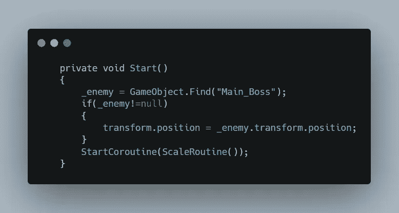

至于激光束，创建一个激光束精灵，添加碰撞器和刚体，然后创建一个新的脚本并将其添加到精灵中。

在脚本内部，创建一个 gameobject 变量并将其引用到主 boss。参考完成后，将激光束的位置更改为参考游戏对象的位置

最后启动协程，使激光束精灵可以缩放，以给出射束的感觉。

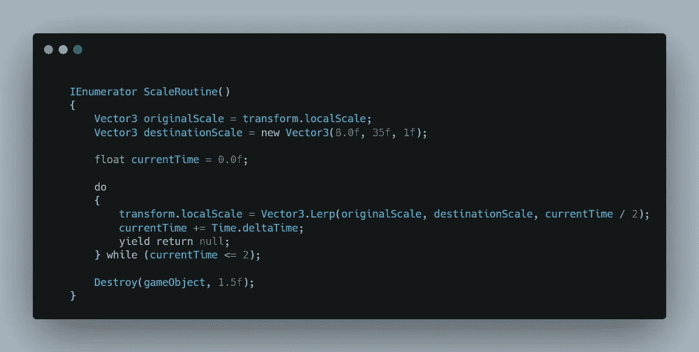

现在在协程中，使用 Lerp 函数将激光精灵从原始比例缩放到目标比例。

所有这些都完成后，我们还需要设计我们的侧臂的行为，因此为手臂创建一个新的脚本。

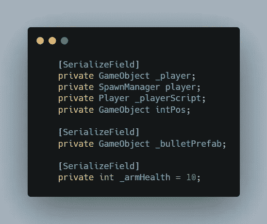

根据需要在脚本中声明变量。

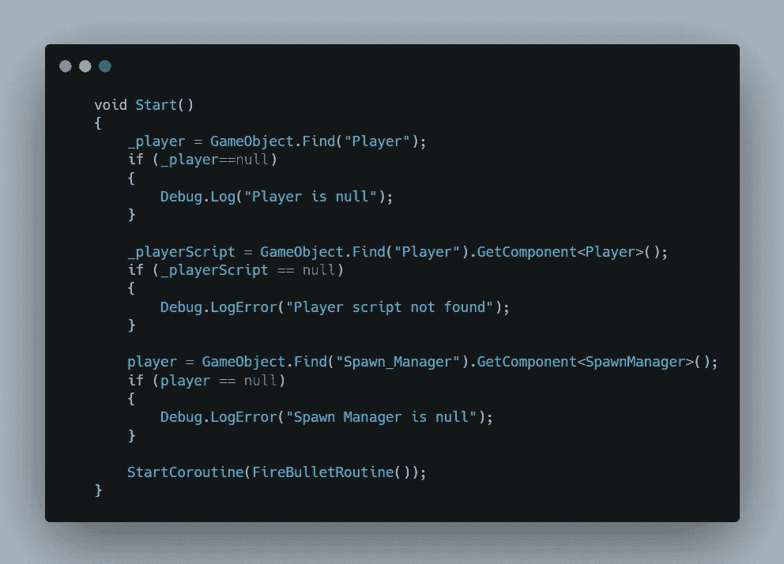

然后在 Start 中创建一个对所有必要的游戏对象和脚本的引用，然后启动一个协程向我们的玩家发射子弹。

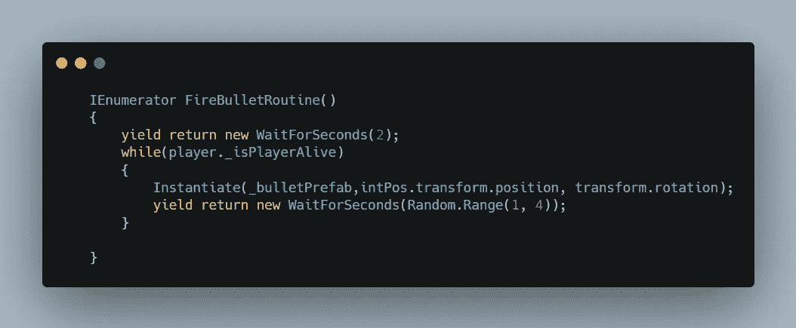

然后在协程中启动一个 while 循环，只要玩家还活着，它就会一直工作。在循环内部实例化项目符号，其位置在 intPos gameobject 的位置。还要确保实例化的项目符号在繁殖过程中保持手臂的旋转角度，这样项目符号将朝着实例化过程中手臂倾斜的方向移动。

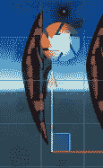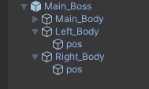

在两臂内添加一个新的空游戏对象，并将其放置在两臂的顶端。这个游戏对象将保持子弹的实例化位置，这样子弹总是从手臂的尖端射出。

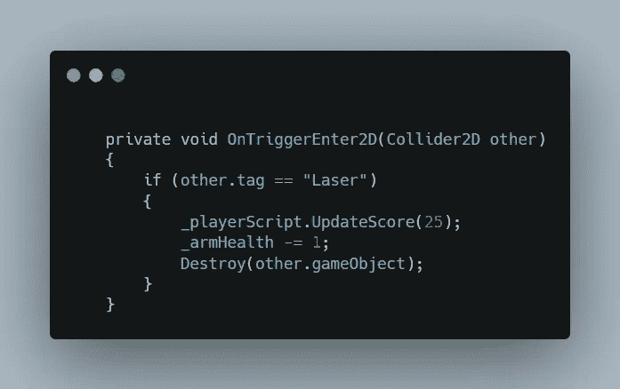

然后创建一个 OnTrigger 函数来检测手臂何时接触玩家发射的激光，并通过减少 1 的生命值来受到伤害，并在玩家每次击中时提供 25 的分数。

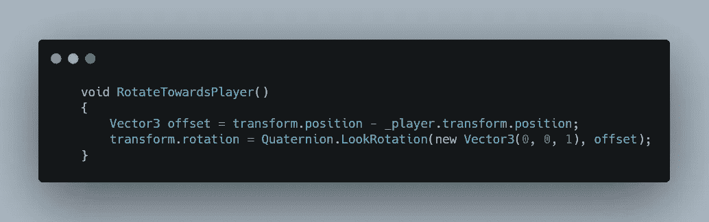

现在旋转手臂，使它总是看着玩家的方向。

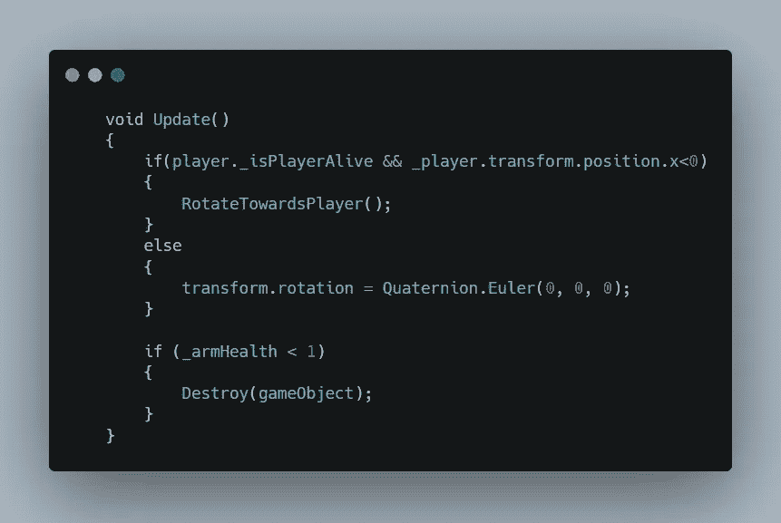

最后，在 Update 函数中创建一个条件来检查玩家是否还活着，以及玩家是否被留在了原点。如果为真，则旋转手臂看向玩家，如果为假，则直视下方。

然后如果手臂生命值达到 0，摧毁手臂。

确保对右臂也做同样的操作，但是在更新中改变条件来检查玩家是否在原点的右边。

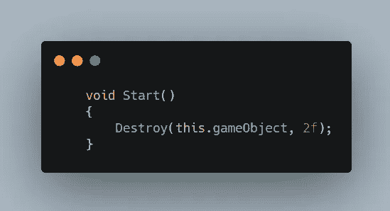

要创建一个手臂发射的子弹，创建一个新的脚本，并添加一个语句，在 2 秒后摧毁游戏对象，这是足够的时间击中玩家或出界。

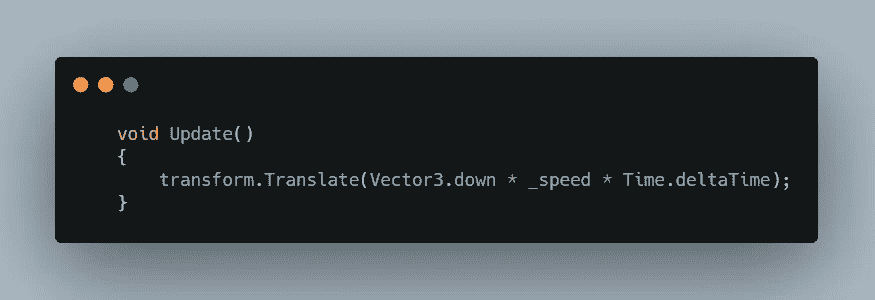

然后在 Update 里面添加一个语句，以 _speed 变量确定的速度向下移动子弹。

请注意，项目符号是通过旋转进行实例化的，因此即使在脚本中，它是向下移动的，它也将向实例化期间预定的方向移动。举例来说，你正向 A 点移动，如果你想再向 B 点移动，你要看着 B 点，所以你的角度改变了，但是你仍然在向前移动。

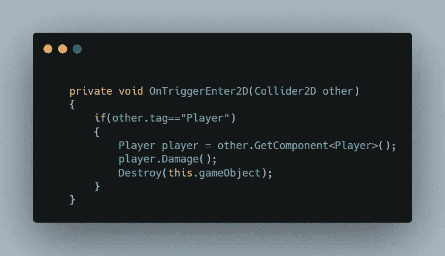

最后，当子弹成功击中玩家时，玩家受到伤害，子弹会自我毁灭。

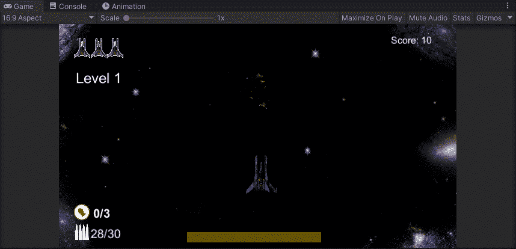

这是最后的样子。