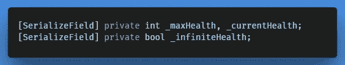
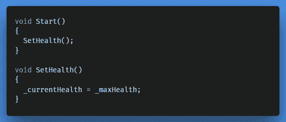
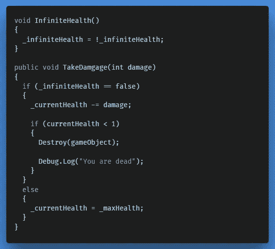
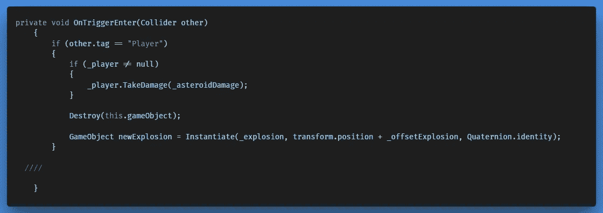

# 给玩家增加一个健康系统

> 原文：<https://medium.com/nerd-for-tech/adding-health-to-the-player-24d594b8fb11?source=collection_archive---------14----------------------->

为了让玩家被一颗小行星伤害，我们必须设定承受伤害和失去生命的逻辑。然而，我们希望在其他情况下使用这种方法，最好每次使用不同的值，例如当我们撞上一个真正的敌人时，或者我们被敌人击中时。我们可以通过在方法名中公开一个变量来实现，让我们来看看。

**目标:**

为玩家增加一个健康系统，并增加一个以模块化方式破坏玩家的方法，这样我们就可以重复使用它。

**案例解答:**

添加一个带有负责减去生命值的暴露变量的方法。

**逻辑:**

首先，我们必须在 Players.cs 脚本中添加两个整数变量。一个代表我们当前的健康，一个代表我们最大的健康。

此外，添加一个 bool 变量，该变量将为无限生命值返回 true 或 false。

在检查器中，我们可以指定最大健康。我已经把它调到 100 了。

那么在开始时，我们简单地说当前健康等于最大健康。信不信由你，只是为了给玩家增加我们的健康系统。如果你点击播放，你会看到玩家现在有 100 点生命值。

除此之外，我们希望有一种方法可以从我们当前的健康值中减去健康值。为了方便起见，我们创建了一个额外的方法，允许我们在检查器中启用/禁用无限健康。我们声明，如果无限生命值被设置为假，我们从当前生命值中减去我们传入的伤害点数，如果当前生命值小于 1，我们消灭玩家。否则，当前健康设置为最大健康。

回到 Asteroid.cs 脚本，现在我们所要做的就是在 OnTriggerEnter 事件中传递一个损害量。您可以将它缓存在成员变量中，以便以后调整。

我们现在可以在游戏模式下的检查器中查看玩家的健康状况，我们很快就会看到增加用户界面元素，让玩家也能看到。

祝你建立自己的健康系统好运！

← [上一张](/nerd-for-tech/animating-sprites-in-unity-d3156c30ea41) | [下一张](https://gert-coppens.medium.com/adding-a-modular-power-up-system-d1d683519752) →