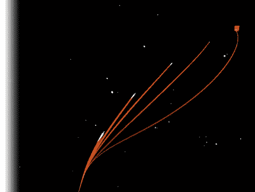
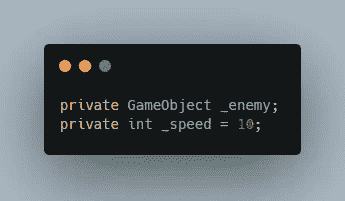
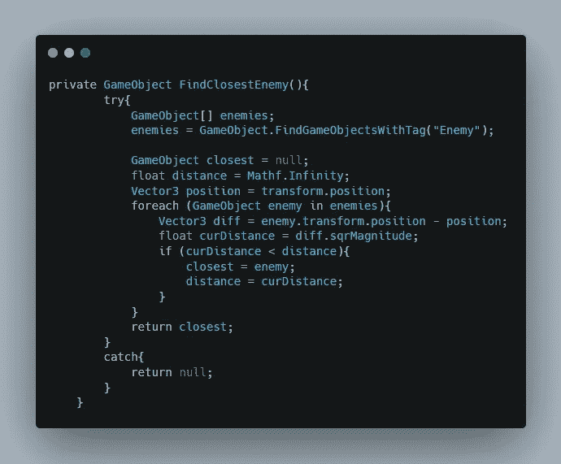
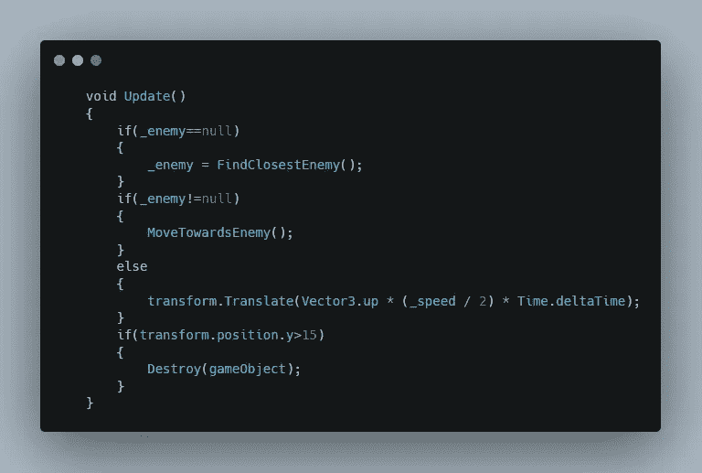
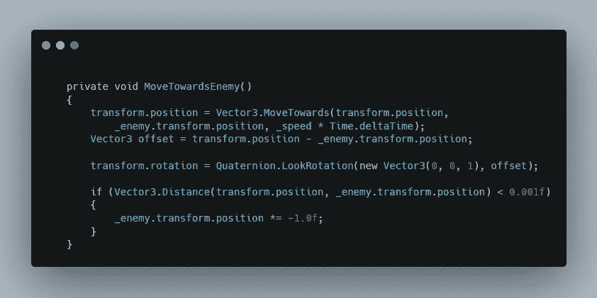
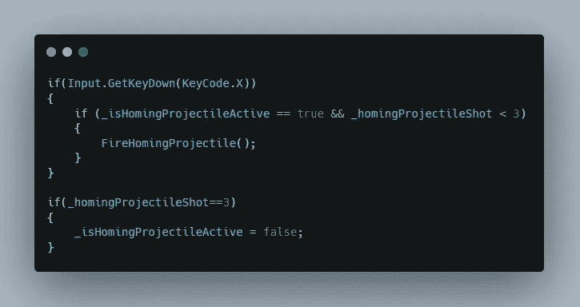
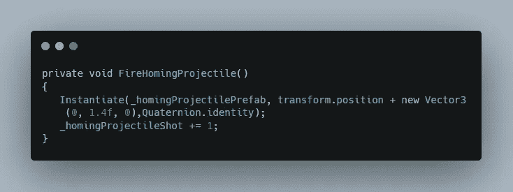
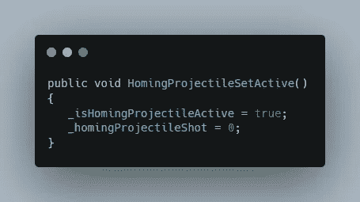
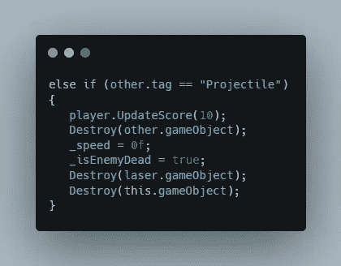

# 添加寻的导弹

> 原文：<https://medium.com/nerd-for-tech/adding-homing-missile-d205a7373b07?source=collection_archive---------17----------------------->

第 51 天-制作 2D 太空射击游戏

目标:制造一种寻的导弹，它能探测到最近的敌人并在开火时将其击落

首先添加一个寻的导弹精灵，并添加碰撞器和刚体作为它的组件。然后为寻的导弹的行为创建一个新的脚本并把它添加到里面。最后，把它拖到你的项目中来创建一个预置实例。

声明两个变量，一个用于速度，另一个用于存储最近的敌人游戏对象。

现在找到场景中的所有敌人，并将其存储在一个数组中。然后计算敌人和导弹之间的距离。如果当前距离小于先前距离，那么用当前距离和当前敌人替换。检查与所有敌人的距离后，返回距离最短的敌人游戏对象。

然后将最近的敌人游戏对象存储在 Update 中创建的敌人变量中。此外，只有当敌人为空时才调用此函数，这样导弹就不会总是检查最近的敌人，而是会找到最近的敌人并向其移动，直到敌人再次为空或导弹击中敌人。

探测到最近的敌人后，向那个敌人移动，其他的则一直向上移动，直到它出界并摧毁自己。

探测到敌人后，向敌人移动，直到击中敌人或敌人被其他方式消灭。当导弹向敌人移动时，也要旋转导弹使其朝向敌人。

现在进入玩家脚本，添加一个条件，当投射物激活且发射的导弹少于 3 枚时发射一枚投射物。

在总共发射了三枚导弹后，将发射物设置为非活动状态，这样玩家就不能发射更多的寻的导弹。

每当 fir 导弹函数被调用时，产生导弹并把发射的导弹数加 1。

然后，每当玩家启动寻的导弹时，从启动脚本中调用该函数，将导弹设置为活动状态，并将发射的导弹数量重置为零。

最后增加了当寻的导弹碰到敌人时的摧毁功能。