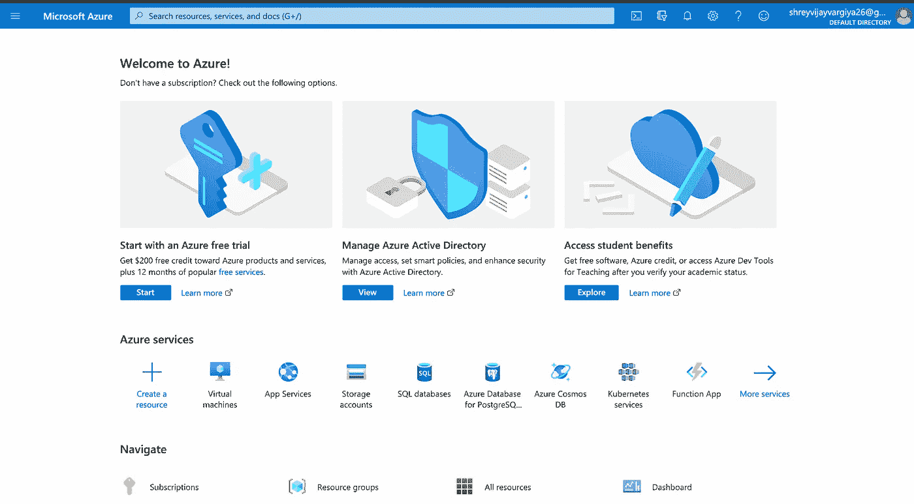
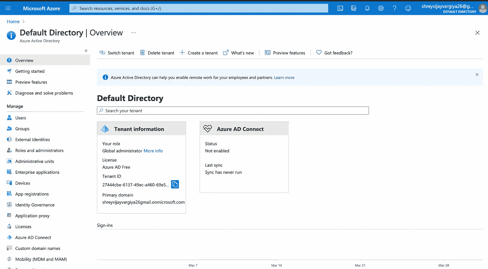
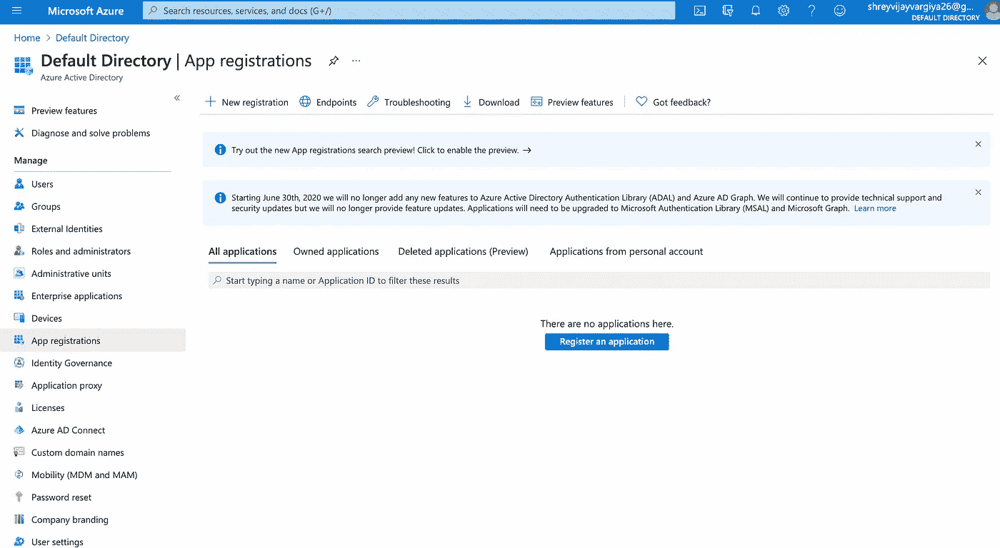
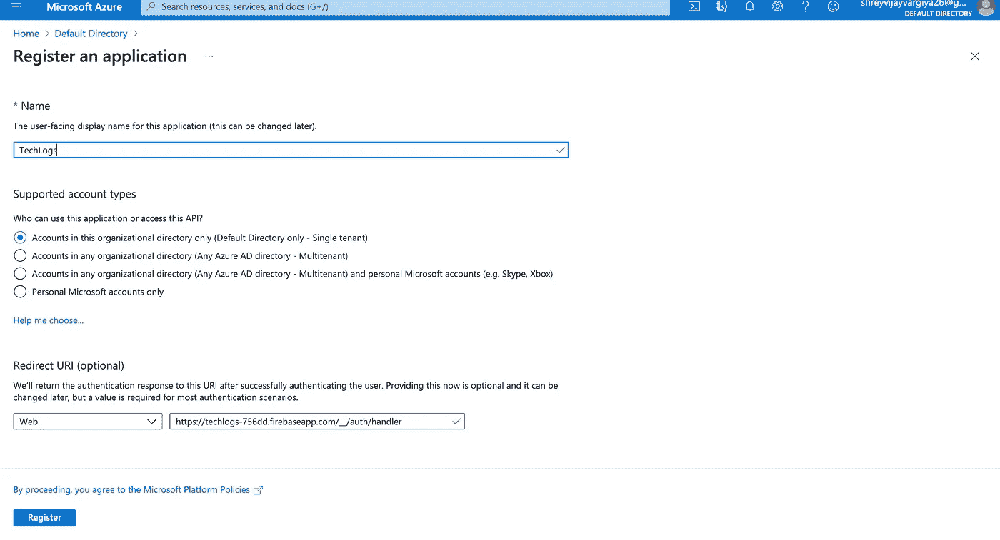
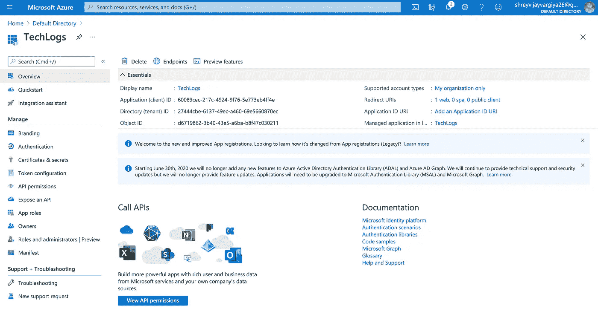
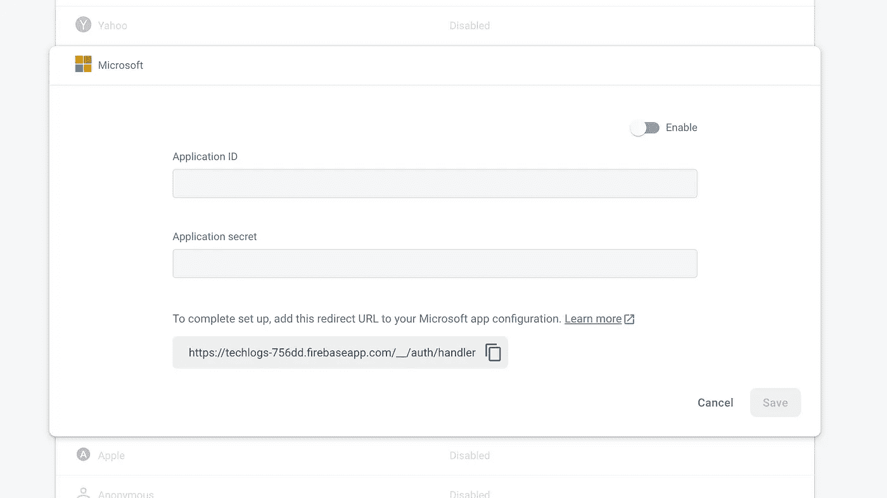
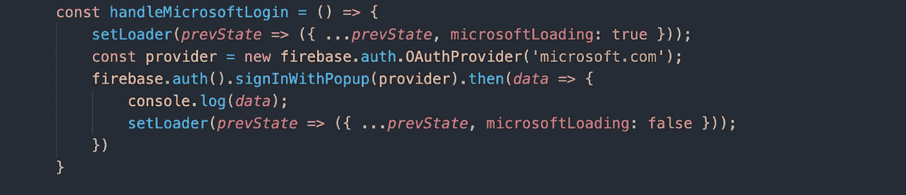

# 使用 Firebase 添加 Microsoft 身份验证

> 原文：<https://medium.com/nerd-for-tech/adding-microsoft-authentication-using-firebase-485f0bd1e3eb?source=collection_archive---------2----------------------->

使用 Firebase 通过 Microsoft 验证您的用户


[阅读文章](http://i-hate-reading-logs.vercel.app/)

我已经写了一大堆关于如何通过 Firebase 使用 Google、Twitter、Github、Email & Password 和电话号码认证用户的文章。你可以通过下面的链接阅读这些文章。

```
[http://i-hate-reading-logs.vercel.app/](http://i-hate-reading-logs.vercel.app/)
```

# 概观

1.  在 Azure 门户上创建 Microsoft Azure 目录。
2.  在 azure 上创建一个新注册，并获得 **applicationID** 和 **applicationSecret。**
3.  在 Firebase 控制台上复制粘贴 applicationID 和 applicationSecret。
4.  添加 Microsoft 登录方法并收集用户凭据。

# Microsoft Azure 目录

去 Azure 门户网站，如果你有一个帐户，你可以直接登录，或者你可以在 Azure 门户网站上使用 Github 创建一个新帐户([https://portal.azure.com/](https://portal.azure.com/#home))。



登录后的 Azure 门户

下一步是点击“**管理 Azure Active Directory** ”。它将带您到活动目录仪表板。



Active directory 仪表板

在 active directory 仪表板中，转到左侧边栏管理部分下的“**应用程序注册”**。



应用注册

在应用程序注册中，单击顶部标签栏上的新注册按钮。它将显示应用程序名称和重定向 URI 表单。



申请的新注册

继续操作，只输入应用程序的显示名称。

> 注意->多个应用程序可以有多个帐户。

点击“**注册”后，**您将被重定向回应用程序注册页面，在这里您可以找到您的**应用程序 ID。**



新申请的申请 ID

对于 applicationSecret，您需要再做一步，转到“管理”下的“**证书&机密】**部分，创建一个新令牌，该令牌将成为您的 **applicationSecret** 。

# 在 Firebase 中启用 Microsoft 身份验证

转到 Firebase ->控制台->身份验证->登录方法选项卡。从方法列表中启用 Microsoft 部分，并在此处添加您的 Microsoft 帐户 ID 和密码。



消防基地控制台

一旦 ID 和秘密被添加，复制粘贴您的重定向 URI，并添加到微软应用重定向 URI 部分。通过身份验证后，Microsoft 会将用户重定向到此 URL。

# **写代码**

最典型的部分现在完成了。接下来是添加一个按钮，用于 Microsoft 登录，并添加 Firebase 提供的身份验证方法。我们将首先使用 firebase auth 方法为 **MicrosoftAuthProvider** 创建一个提供者，然后使用 signInWithPopup 创建一个 firebase auth 方法，它接受提供者作为参数，并为我们处理身份验证部分。**signInWithPopup 方法返回一个承诺，在使用。**然后是**和。**抓**的方法。**

```
const provider = new firebase.auth.OAuthProvider(‘microsoft.com’);
```

****

**Microsoft 登录方法**

**在通过 **signInWithPopup** 方法解决承诺返回后，我们可以将控制台中的数据记录到微软返回的凭证中。**

****

**最终登录页面**

# **结论**

**添加微软登录方法并不难，但创建 azure 帐户然后获取客户端 ID 和秘密是一项任务。您也可以在后端使用 passport.js 来添加这个方法，以便将凭证存储在数据库中，我将在一篇文章中对此进行介绍。**

**直到，下一次，有一个美好的一天，人们。**

```
Code repository => [https://github.com/shreyvijayvargiya/iHateReadingLogs/tree/main/TechLogs/MicrosoftAuthentication](https://github.com/shreyvijayvargiya/iHateReadingLogs/tree/main/TechLogs/MicrosoftAuthentication)
```