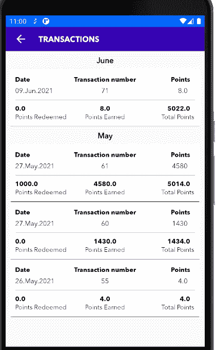
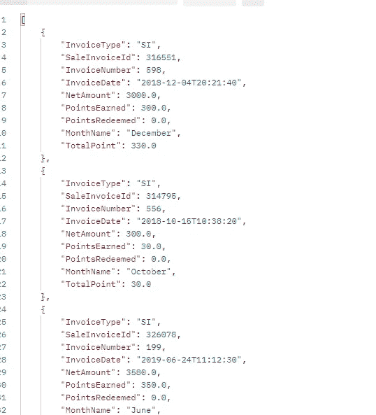
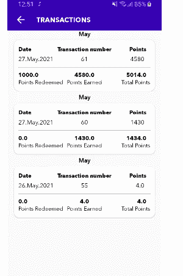
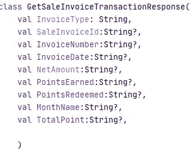
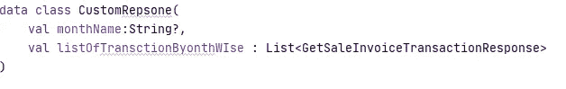

# 使用 kotlin 和 MVVM 从带有多个视图的 API 添加嵌套回收器视图

> 原文：<https://medium.com/nerd-for-tech/adding-nested-recycler-view-in-android-using-kotlin-and-mvvm-with-custom-model-from-api-with-506bff5a1032?source=collection_archive---------8----------------------->



REciClarrview 是安卓系统中最重要的组件之一。同样，回收者看到的计划也日益复杂，比如回收者看到的种子种类繁多，解决了回收者看到的，解决了回收者看到的种子类型众多。

我陷入了一个问题，我想在嵌套列表中显示来自 Api 的数据，因为我是 Recyclerview，所以最好的方法是做一个子-父嵌套列表，另外我有一个模型，我必须显示两个列表一个用于月，另一个用于事务数据。

**我用的是 MVVM，用的是 Kotlin，用的是改装版 Api！好吧，我们将在稍后讨论这个问题，现在，我们将只讨论如何在 One RecyclerView 中嵌套。**

# **这是我从 API** 得到的回复



> 所以你可以看到我在每个对象列表中都有月名，所以基本上我的场景是制作其他月份的列表，并显示响应那个特定月份的数据，你可以看到，换句话说，我想用月名在 kot Lin**分组**

# 它会是什么样子？


所以在这里，你可以看到我已经分别按照月份的清单和交易清单进行了分类和分组，并再次设定了具体的月份。

这是之前的场景，有一个简单的月份名称，所有数据都在它下面。

# **在**之前:



在这之前

# 关键理念

在开始代码之前，让我们了解设计嵌套回收器视图所涉及的基本关键思想。因此，关键思想是，在顶层，我们将有一个卡片视图对象列表，我们将在回收器视图中显示。因此，在顶层，我们将有一个不同视图的单一回收视图。现在，每个视图都将有一个回收器视图，因为它是子视图之一，并且这个子回收器视图将充当垂直转盘。

# 酷，密码！

我不会像之前那样展示完整的步骤，因为这是另一个主题，所以我们现在可以直接跳到最后的代码！

**数据类**

这是我的模型类，它被称为 POJO 类，现在很简单，但是在接下来的步骤中，我将告诉你我们必须在一个回收器视图中为嵌套列表视图做什么！



我在我的同一个数据类(POJO)下面做了这个自定义响应，这是自定义的，所以通过名字你可以理解我是为了嵌套而做这个方法的

我在自定义响应中做了一个列表，并将列表类型作为我的来自 API 的 Pojo 类。

接下来的步骤，

在我的片段中，我制作了一个 hashmap，因为从技术上来说，我将把 hashmap 的值放在列表中，所以我正在编写代码，这样它就会有一个清晰的图像

```
val hashMapMonthWise = HashMap<String, ArrayList<GetSaleInvoiceTransactionResponse>>()
```

然后:

```
fun getMonthWiseData(List: List<GetSaleInvoiceTransactionResponse>) {

    val customRepsone = ArrayList<CustomRepsone>()
    List.*forEach* **{** if (hashMapMonthWise.*contains*(**it**.MonthName)) {
            val list = hashMapMonthWise[**it**.MonthName]
            list!!.add(**it**)
            hashMapMonthWise[**it**.MonthName.*toString*()] = list
        } else {
            val consolidatedList = ArrayList<GetSaleInvoiceTransactionResponse>()
            consolidatedList.add(**it**)
            hashMapMonthWise[**it**.MonthName.*toString*()] = consolidatedList
        }
    **}** Timber.d("Text ${hashMapMonthWise}")

    hashMapMonthWise.*forEach* **{** customRepsone.add(CustomRepsone(**it**.key, **it**.value))
    **}** listOfCustomResp.clear()
    listOfCustomResp.addAll(customRepsone)
    recylerViewTransactions.*adapter*?.notifyDataSetChanged()
}
```

我必须用这个方法，通过使用 Hashmap 在另一个列表中列出月份。

所以现在我们将制作两个物品和两个适配器。

所以对于第一个子适配器

```
import android.os.Build
import android.view.LayoutInflater
import android.view.ViewGroup
import androidx.annotation.RequiresApi
import androidx.recyclerview.widget.RecyclerView
import com.technosys.clubcardapp.data.models.CustomRepsone
import com.technosys.clubcardapp.data.models.GetSaleInvoiceTransactionResponse
import com.technosys.clubcardapp.databinding.ItemTransactionHistoryBinding
import com.technosys.clubcardapp.databinding.ItemTransactionMonthWiseBinding
import java.text.SimpleDateFormat
*//child* class MonthWiseAdapter(
    private val list: List<GetSaleInvoiceTransactionResponse>,
    *// private val listener: ClickItemListener* ) : RecyclerView.Adapter<MonthWiseAdapter.ViewHolder>() {

    val parser = SimpleDateFormat("yyyy-MM-dd'T'HH:mm:ss")
    val formateStyle8 = "dd-MMM-yyyyThh:mm:ss"
    val formatter = SimpleDateFormat("dd.MMM.yyyy")
    var output = formatter.format(parser.parse("2019-06-24T11:12:3"))

*//    interface ClickItemListener {
//        fun onClicked(position: Int)
//    }* override fun onCreateViewHolder(
        parent: ViewGroup,
        viewType: Int
    ): MonthWiseAdapter.ViewHolder {
        return ViewHolder(ItemTransactionMonthWiseBinding.inflate(LayoutInflater.from(parent.*context*)))
    }

    override fun getItemCount(): Int {
        return list.size
    }

    @RequiresApi(Build.VERSION_CODES.*O*)
    override fun onBindViewHolder(holder: ViewHolder, position: Int) {
        val model = list[position]
        holder.bind.tvDate.*text* = formatter.format(parser.parse(model.InvoiceDate))
        holder.bind.transcationNumbers.*text* = model.InvoiceNumber.*toString*()
        holder.bind.tvPoints.*text* = model.PointsEarned!!.*toDouble*().toString()
        holder.bind.tvPointsRedeemed.*text* = model.PointsRedeemed.*toString*()
        holder.bind.tvPointsEarned.*text* = model.PointsEarned.toString()
        holder.bind.tvTotalPoints.*text* = model.TotalPoint.*toString*()

*//
//        Picasso.get().load(model.profile_pic).fit().centerCrop().into(holder.bind.profileImage)
//        holder.bind.name.text = "${model.full_name}"
//        holder.bind.commentMessage.text = "${model.comment}"
//
//        holder.itemView.setOnClickListener {
//            listener.onClicked(position)
//        }* }

    class ViewHolder(binding: ItemTransactionMonthWiseBinding) :
        RecyclerView.ViewHolder(binding.*root*) {
        val bind = binding
    }

}
```

在这一点上，我做了单独的项目，我说如果我一步一步地讲，它会深入很多，所以也将是单独的主题

> 现在父适配器也将在 **onBindViewHolder** 中，我们将**实现**这个:

```
holder.itemView.recylerViewMonthData.*apply* **{** *adapter* = MonthWiseAdapter(model.listOfTransctionByonthWIse)
    *adapter*?.notifyDataSetChanged()
**}**
```

因此，我们将把它放在父适配器的 OnBindViewHolder 方法的末尾

# **然后在关于成功改造 Api 的方法片段中，我们将首先这样做**

```
Resource.Status.*SUCCESS* -> {
    **it**?.*let* **{** data **->** loadingDialog.dismiss()
        **it**.*let* **{** data.data?.*let* **{** if (**it**.isEmpty()) {
                    relativeNoRecordFound.*visibility* = View.*VISIBLE* relativeListOfTransactions.*visibility* = View.*GONE* } else {
                    relativeListOfTransactions.*visibility* = View.*VISIBLE* relativeNoRecordFound.*visibility* = View.*GONE

                    //CustomList for Months* getMonthWiseData(**it**)
                    ListOfTransactions.clear()
                    ListOfTransactions.addAll(**it**)
                }

            **}**
```

我们已经创建了那个方法，所以我们在添加列表的地方调用，所以我们也调用那个方法并传递列表。

# **所以在最后的**

```
recylerViewTransactions.*adapter* = TransactionHistoryAdapter(listOfCustomResp)
```

# 一切正常，点击运行！

现在一切似乎都很好，点击运行，看看你美丽的最终结果。因此，您可以看到添加嵌套回收器视图是多么容易，并且使用 Kotlin 进行开发使开发变得更加有趣和容易。

注意:**我的方法是我已经使用了 hashmap 和 List，所以从这我已经做了，并解决了这个问题**

请欣赏它，这样我就可以在未来写更多！也

> ***快乐编码***
> 
> 请关注我并欣赏它，因为我可以在未来写更多更好的主题。

**https://github.com/SaaifKhan**