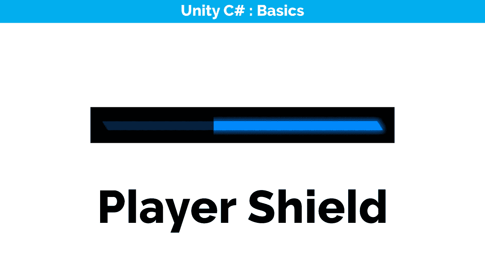
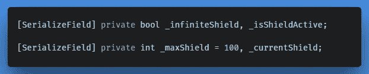
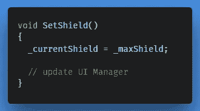
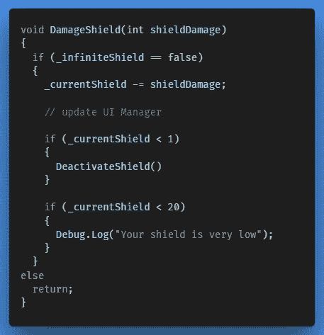
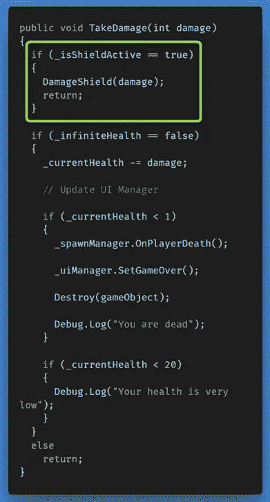
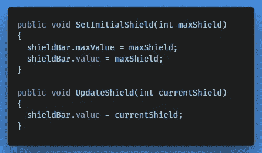
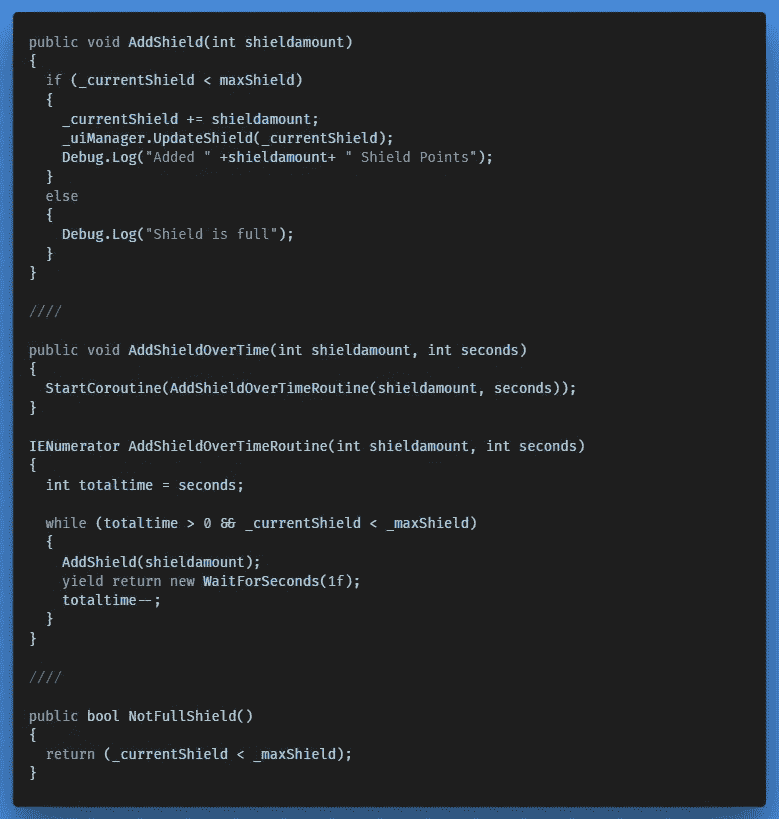
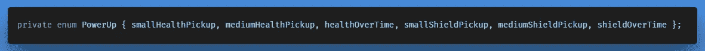
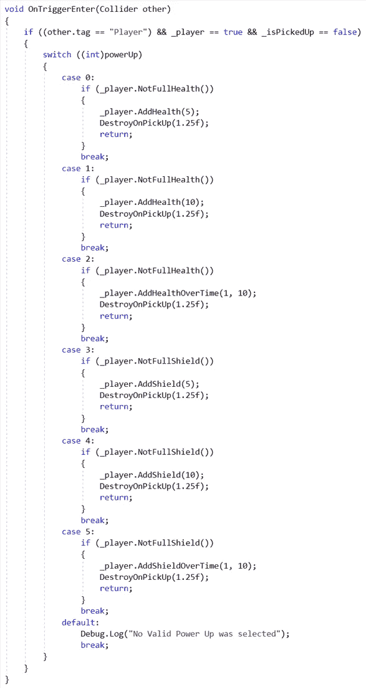

# 添加玩家盾

> 原文：<https://medium.com/nerd-for-tech/adding-the-player-shield-f56b7fea039b?source=collection_archive---------15----------------------->

## 游戏功能

几乎与我们如何设置 [*玩家生命值*](/nerd-for-tech/adding-health-to-the-player-24d594b8fb11) 、 [*玩家生命值条*](https://gert-coppens.medium.com/adding-a-player-health-bar-d59d629c1311) 和 [*生命值提升*](https://gert-coppens.medium.com/adding-various-health-power-ups-2d36296c40ea) 完全相同，在本文中我们将介绍一个玩家护盾系统，以及将其链接到护盾条 UI 元素，并创建新的护盾提升。

## 创建玩家保护系统

首先，我们创建几个新的变量来初始化玩家护盾，并检查它是否处于活动状态:

在 Player.cs

在 *Start()* 中，我们将当前屏蔽设置为最大屏蔽:

开始时电流屏蔽= 100

接下来我们创建一个方法来破坏护盾:

类似于 TakeDamage()方法

此外，在 *Update()* 中，我们执行了另一个方法，负责在护盾耗尽时停用护盾，并且通常负责在 *DamageShield()* 方法之外的护盾行为:

## 履行

现在我们有了一个护盾系统，只要护盾有效，我们基本上可以将护盾伤害降低为正常伤害。

一旦防护罩被解除，它会继续执行它的逻辑。

## 创建屏蔽栏

为了创建护盾条，我复制了健康条，重新命名并在 x 轴上反转。我将填充图像的颜色设置为蓝色。

008AFF

在 *UI Manager.cs* 中，与健康栏非常相似，我们创建了两个新方法(就像我们创建健康栏一样有一个对它的引用)；一个允许我们设置初始护盾，一个更新当前护盾。这一次，我们不会使用自定义梯度，因为我不认为这是必要的盾牌。

更新我们的方法后，屏蔽栏现在应该可以工作了。

## 创建屏蔽电源 ups

同样，非常类似于我们如何创建健康电源 ups，我们现在可以制造屏蔽电源 Ups 的逻辑。

上电逻辑

然后，我们必须更新 Item.cs 脚本中的 PowerUp Enum 和 OnTriggerEnter()方法:

现在，我们可以创建三个新的预置，我们可以产卵:

在接下来的文章中，我们将改进玩家的速度提升，为其创建一个可视化的 UI 元素，并为游戏添加速度提升功能。

← [上一张](https://gert-coppens.medium.com/adding-a-player-health-bar-d59d629c1311) | [下一张](https://gert-coppens.medium.com/introducing-a-fuel-system-cef229d1bcfd) →