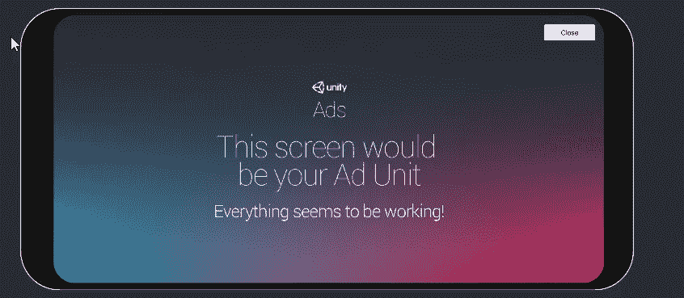

# 将您的首个 Unity 广告添加到手机游戏中

> 原文：<https://medium.com/nerd-for-tech/adding-your-first-unity-ad-to-mobile-games-b9c197434ac5?source=collection_archive---------7----------------------->

## 开始 Unity 移动开发

## //该在游戏中放广告了

广告起作用了！

昨天我们看了如何通过在引擎中启用 Unity 广告来赚钱。今天我们将看看如何将这些添加到我们的游戏中，并奖励观看广告的玩家。

## 广告管理器脚本