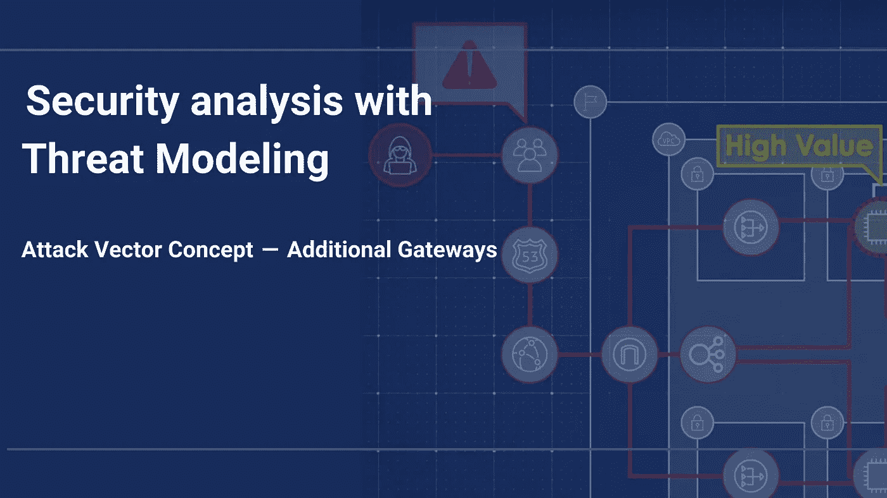
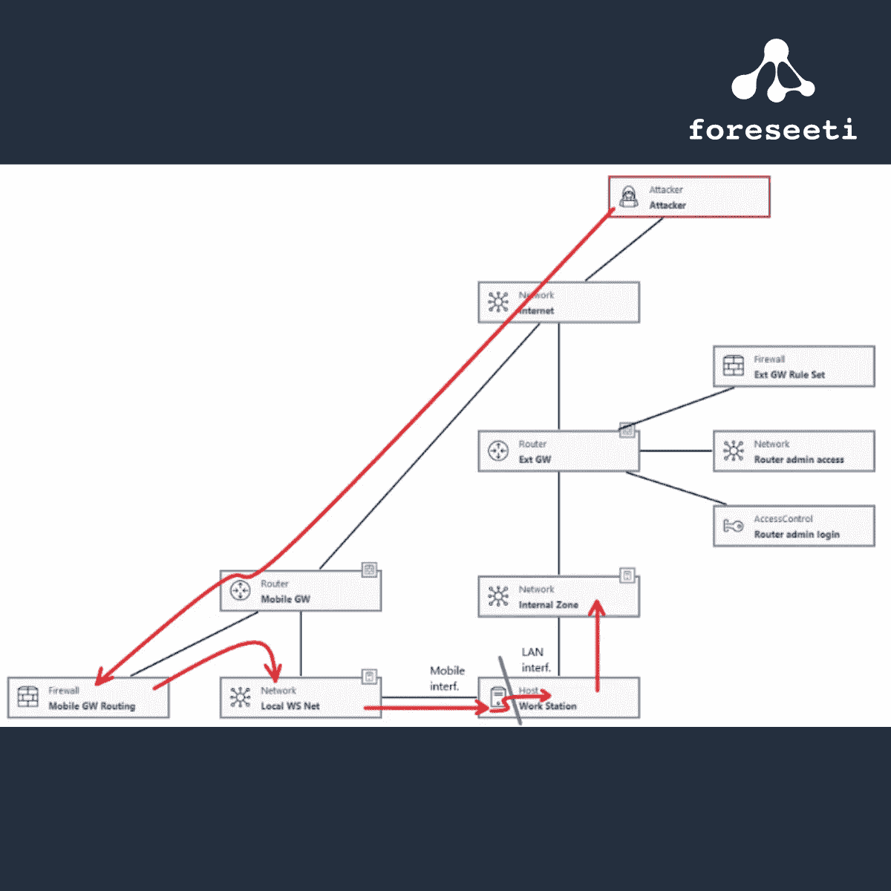

# 攻击媒介概念—附加网关—通过威胁建模进行安全分析

> 原文：<https://medium.com/nerd-for-tech/additional-gateways-security-analysis-with-threat-modeling-ad0ada6fe714?source=collection_archive---------12----------------------->

# 附加网关—描述

我所说的“[附加网关](https://docs.foreseeti.com/docs/attack-vector-additional-gateways)是指体系结构内的主机向外部网络(如互联网)开放一个附加网关。根据工作站的配置，这是可能的。当这种情况可能发生时，例如当像办公室用户或 IT 经理这样的雇员需要访问被公司的普通网关/路由器/防火墙阻挡的外部资源时(如果 IMAP 被禁用，则通过 IMAP 获取外部电子邮件，访问更新库，下载非公司标准软件进行测试，等等)。根据主机的配置，可以使用手机或类似的移动宽带路由器将主机连接到互联网。

# 模型

使用 foreseeti 的[威胁建模](https://foreseeti.com/threat-modeling/)工具 [securiCAD](https://foreseeti.com/securicad/) 创建

# 攻击向量衰减

削弱这种攻击媒介有点棘手，因为它代表了一种与网络和防火墙相关的攻击路径，这意味着最好用一种类似“如果外部通信路径被该网络区域中的主机打开，会发生什么情况？”。

# 结论

当引入像这样的额外网关时，由外部网关的配置(工作站的移动宽带设置)负责网关保护参数，即“移动 GW FW”对象的“启用”和“已知规则集”参数。实际上，启动这个外部连接的用户或多或少与运行公司主要外部网关的 IT 人员具有相同的角色。

“Mobile GW”路由器的“管理”和“通信”连接都应连接到“本地 WS Net”区域，因为该连接由工作站管理。

在这种攻击场景中，攻击者不能立即/只能通过绕过“移动 GW”保护机制来访问“内部区域”网络。相反，它将首先到达工作站的额外网关(虚拟)接口，然后必须从那里继续攻击。这并不难，但是攻击需要在到达工作站所连接的其他网络区域之前穿过工作站。