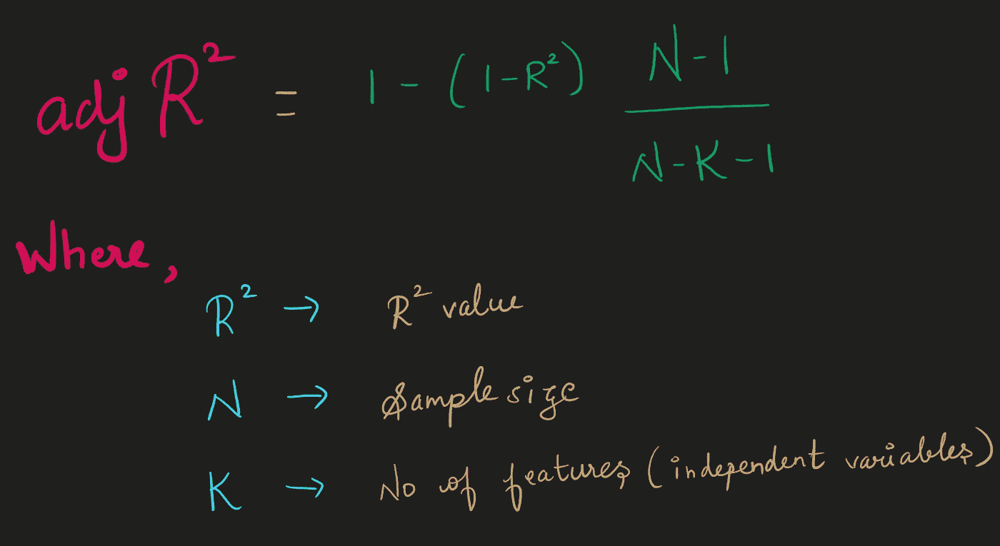

# 调整后的 r 平方

> 原文：<https://medium.com/nerd-for-tech/adjusted-r-square-391e9ad86cb0?source=collection_archive---------26----------------------->

在开始之前，请检查下面的 r 广场博客。

 [## r 广场

### 我们都知道相关性(R)，相关值接近 1 或-1 是好的，并告诉你两个定量变量…

medium.com](/nerd-for-tech/r-square-4bcb08bb597e) 

向模型中添加变量会增加 r 平方值。这个新变量对我们的模型可能有用，也可能没用。因为 r square 搜索最佳拟合，r square 不关心新变量，只要你添加一个新变量，它就会不断增加。

**所以问题是**我们如何解决这个问题？

**回答:**使用调整后的**r 方**

当添加了无用的变量时

1.  **“k”增加**
2.  反过来，整体**“分母”**得到**减少。**
3.  我们看到向您的模型添加一个变量会增加 r 平方值，因此等式**中的 **r 平方值**会增加。**
4.  这又使**减小调整后的 r 平方值。**

从逻辑上讲，只要考虑比例(直接或反比)，我们就可以理解调整后的 r 平方在增加一个新的无用变量时是如何减少的。

所以**调整后的 R** - **的平方**用来确定相关性有多可靠，以及有多少是由自变量相加决定的。