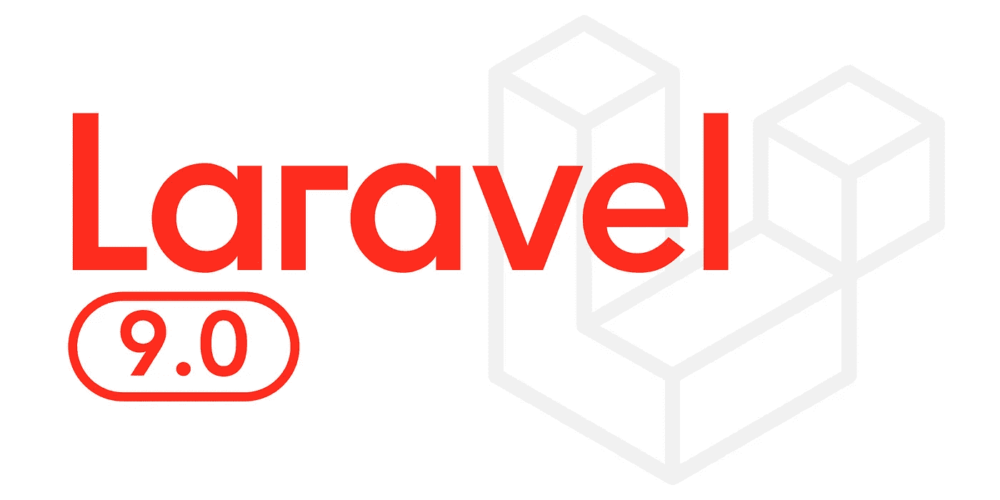

# 高级 Laravel:2022 年学习它们的 7 个主题和链接

> 原文：<https://medium.com/nerd-for-tech/advanced-laravel-7-topics-and-links-to-learn-them-in-2022-67ee19b3dc88?source=collection_archive---------1----------------------->

一个简短的指南，用一些有趣和高级的主题来改进你的 Laravel 编码。

如果你来到这里，你可能在 php 和 laravel 方面有很好的经验，你已经研究过这项技术，并且想知道 Laravel 中的一些高级主题来装饰你的技能。因此，我们在这里讨论了 7 个高级主题。

## 发送电子邮件和通知:

在应用程序中发送电子邮件是邮件功能之一，有多种用途，比如我们需要用电子邮件在应用程序中注册用户，也可以用电子邮件来验证用户。

链接:[https://laravel.com/docs/9.x/verification#main-content](https://laravel.com/docs/9.x/verification#main-content)

## 队列和作业:

在创建应用程序时，我们需要一些任务，如解析文件和上传 CSV 或其他格式的文件，这需要太多的时间来完成请求。

这里 laravel 提供了内置的机制来处理后台队列和作业中的工作。

链接:【https://laravel.com/docs/9.x/queues#main-content 

## 高级雄辩和数据库查询:

在构建应用程序时，我们用 Laravel 处理数据库。我们有两种连接数据库的方法:要么像在 sql 中一样使用原始查询，要么使用雄辩模型。但是有时我们需要复杂的查询来从数据库中获取数据，那么我们就需要高级的口才。

链接:[https://laravel . com/docs/9 . x/melatorian-serialization # main-content](https://laravel.com/docs/9.x/eloquent-serialization#main-content)

## 创建 Artisan 命令:

我们可能会使用 artisan 命令，如 PHP artisan make:Controller demo Controller 和 php artisan make:model DemoModel 来分别创建控制器和模型。但是，如果我们需要创建我们的自定义命令，laravel 用 PHP artisan make:command demo function 提供这个特性。

链接:[https://laravel.com/docs/9.x/artisan#writing-commands](https://laravel.com/docs/9.x/artisan#writing-commands)

## API 的 Auth 和 Passport:

现在，如果我们需要创建一个移动应用程序，并希望与数据库连接，那么 API 就出现了。如果我们想创建 API，我们还需要一些认证系统来认证用户，这样一些恶意用户就不会进入我们的应用程序。在这种情况下，laravel 提供了一个名为 Passport 的包，帮助您实现身份验证。

链接:[https://laravel.com/docs/9.x/passport#installation](https://laravel.com/docs/9.x/passport#installation)

## 事件和侦听器:

这很简单，因为它的名字就像是在应用程序内部发生了一个事件，另一边是一个侦听器，它不断地侦听要发生的事件，然后执行某个操作。

链接:【https://laravel.com/docs/9.x/events#main-content 

## 包装开发:

首先，我们讨论什么是包，包是一个预构建的代码，用来执行我们在应用程序中使用的特定任务。因此，如果我们需要在您的几个应用程序中使用某个功能，尽管为所有应用程序创建了功能，您需要创建包，以便该包可以在需要相同功能的每个应用程序中使用。

链接:【https://laravel.com/docs/9.x/packages 

# 结论:

这里我们简单讨论一些 laravel 中的高级话题，所有链接都参考 Laravel 官网。如果您想详细了解某些主题，请在下面发表评论，并且需要一些 Laravel 项目想法和教程，请随时在下面发表评论，并订阅时事通讯以获取最新更新。

谢谢！