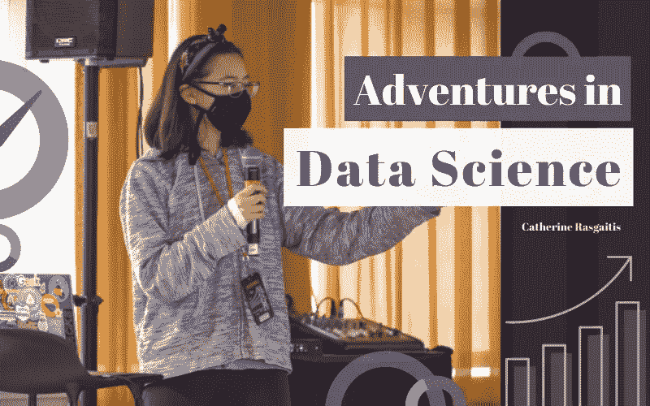

# 数据科学历险记

> 原文：<https://medium.com/nerd-for-tech/adventures-in-data-science-d0f65f99e58f?source=collection_archive---------0----------------------->

## 我的数据科学之旅+从零开始构建数据集

照片(编辑)由[库纳尔·博特拉](https://kunalbotla.com)

# 走进数据科学的世界

## 克洛斯·柯德

今年初夏，我获得了一份奖学金，和 Klossy 一起参加了由 [Kode 举办的虚拟夏令营。Kode with Klossy，缩写为 KWK，是一个为女孩和非二元…](https://www.kodewithklossy.com/)