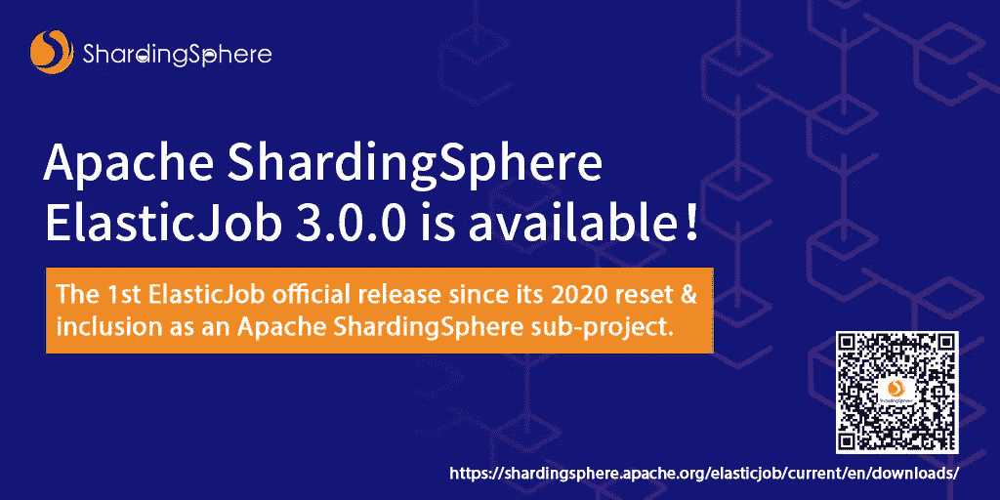
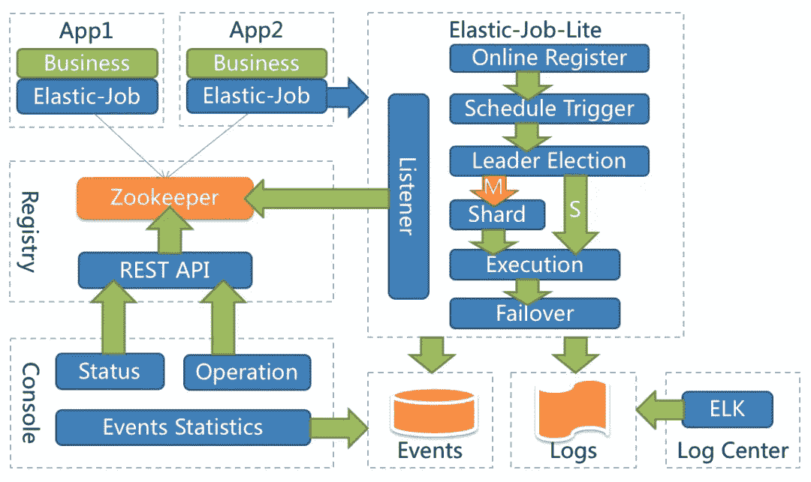
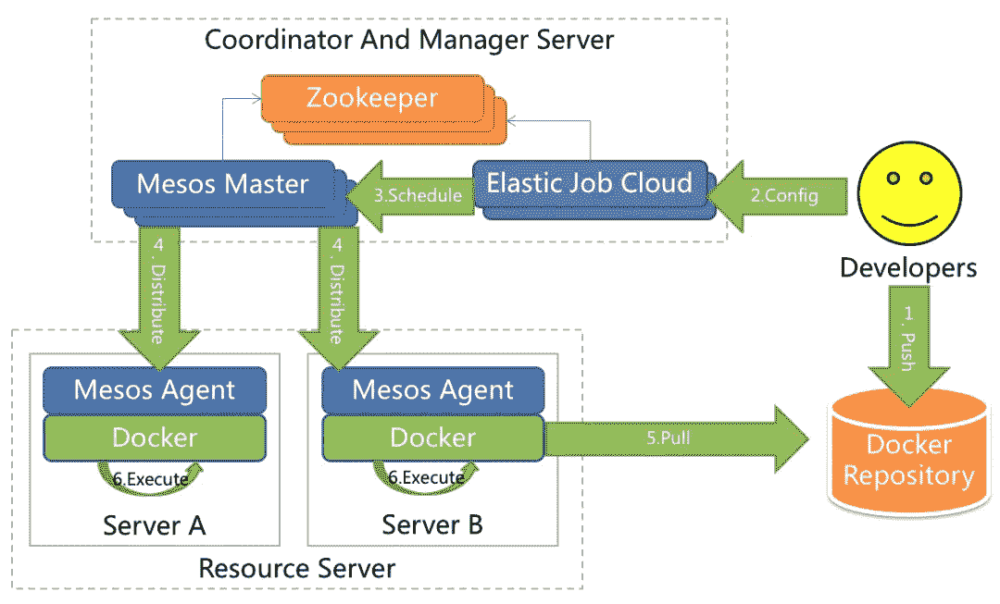
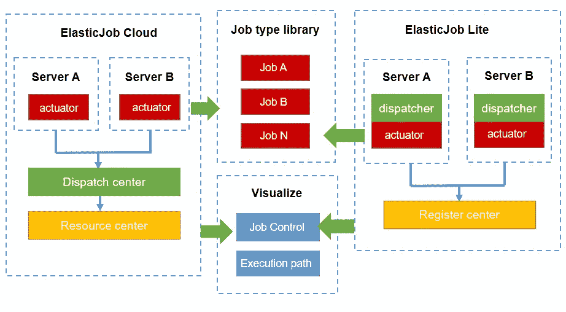

# 经过多年的停滞，ElasticJob 带着第一个 Apache 版本 3.0.0-alpha 回来了

> 原文：<https://medium.com/nerd-for-tech/after-years-of-stagnation-elasticjob-is-back-with-the-first-apache-version-3-0-0-alpha-d8e9b7b3d0f0?source=collection_archive---------17----------------------->

# ElasticJob 回来了！作为一个分布式调度解决方案，它包括两个项目，ElasticJob-Lite 提供分布式任务分片服务，ElasticJob-Cloud 使用 Mesos 来管理和隔离资源。

在 ElasticJob 被纳入 Apache ShardingSphere 子项目的几个月内，535 个问题和拉请求被修复和合并。更重要的是，ElasticJob 社区在加入 Apache Software Foundation 后发布了第一个正式版本:3.0.0-alpha。

# 背景

elastic job([https://github.com/apache/shardingsphere-elasticjob](https://github.com/apache/shardingsphere-elasticjob))是一个用于互联生态系统和大规模任务的分布式调度解决方案。ElasticJob 由两个独立的子项目组成，即 ElasticJob-Lite 和 ElasticJob-Cloud。它诞生于 2015 年，当时业界有 QuartZ 等优秀的作业调度库，但在分布式领域缺乏探索。分布式调度云平台产品的缺乏，导致 ElasticJob 从一开始就备受关注。有效弥补了分布式领域运营的不足，提供了一站式自动化运维管控终端。每个产品都使用统一的操作 API。开发者只需要开发一次，随意部署。

在为 ElasticJob 进行技术选择时，它选择站在巨人的肩膀上，而不是重新发明轮子。它完美地结合了标准作业调度库 QuartZ，和分布式协调的利器 ZooKeeper，快速稳定地构建了一个全新概念的分布式调度框架。

# 弹性作业调度模型

ElasticJob 的调度模型分为支持线程级调度的进程内调度 ElasticJob-Lite 和支持进程级调度的 ElasticJob-Cloud。

**在制品调度**

ElasticJob-Lite 是一个线程级的进程内调度框架。可以配合 Spring、Dubbo 等 Java 框架使用，Spring 注入的 Beans 可以在操作中自由使用，如数据源连接池、Dubbo 远程服务等。它很好地适应了业务发展，使开发更加方便。

ElasticJob-Lite 与业务应用程序一起部署，并且具有与业务应用程序相同的生命周期。它是典型的嵌入式轻量级架构。ElasticJob-Lite 非常适合资源使用稳定、部署架构简单的普通 Java 应用。可以理解为 Java 开发框架。

ElasticJob-Lite 本身是非集中式架构，不需要独立的集中式调度节点。分布式系统下的每个任务节点都是一个自主调度的及时调度作业。任务之间只需要一个注册表来协调分布式场景中的任务状态，目前 ZooKeeper 作为一个注册表被支持。

架构图如下所示:

图 1

如图 1 所示，ElasticJob-Lite 的分布式作业节点通过选举获得主节点，并通过主节点分片。碎片化完成后，主节点和副本节点是相同的，都以自我调度的方式执行任务。

**流程级调度**

ElasticJob-Cloud 有两种方法:进程内调度和进程级调度。由于 ElasticJob-Cloud 可以控制作业服务器的资源，因此其作业类型可以分为永久任务和临时任务。像 ElasticJob-Lite 这样的常驻任务，也就是进程内调度，有着完全不同的即时任务。它充分利用了资源分配的削峰填谷功能。它是进程级调度，每个任务启动一个新的进程。

ElasticJob-Cloud 需要通过 Mesos 控制资源，通过部署在 Mesos Master 中的调度器分配任务和资源。云采用集中式架构，将调度中心的高可用性转移到 Mesos。

其架构图如下所示:

图 2

如图 2 所示，ElasticJob-Cloud 不仅拥有 Lite 的所有功能，还具备资源分配和任务分发的能力。它完全管理作业开发、打包、分发、调度、治理和分片的一系列生命周期。是真正的作业云调度系统。

与 ElasticJob-Lite 的简单易用相比，ElasticJob-Cloud 对 Mesos 的强烈依赖增加了系统部署的复杂度，更适合大规模操作系统。

# 功能列表

ElasticJob 功能主要包括灵活调度、资源分配、作业管理和可视化控制。

**灵活调度**

弹性调度是 ElasticJob 最重要的功能，也是产品名称的由来。这是一个任务处理系统，允许任务通过分片进行水平缩放。

ElasticJob 中任务分片项的概念使任务能够在分布式环境中运行，每个任务服务器只运行分配给该服务器的分片。随着服务器的增加或停机，ElasticJob 会近乎实时地感知服务器数量的变化，从而为分布式任务服务器重新分配更合理的任务碎片项，使任务随着资源的增加而提高效率。

**资源分配**

调度是指在合适的时间为任务分配合适的资源并使其有效。ElasticJob 具有分配资源的能力，它可以像分布式操作系统一样调度任务。资源分配由 Mesos 实现。

Mesos 负责分配任务声明的所需资源(CPU 和内存)并隔离分配的资源。ElasticJob 将在获得资源后执行任务。

考虑到 Mesos 系统部署相对复杂，ElasticJob 将这部分拆分到 ElasticJob cloud 中，供高级用户使用。随着 Kubernetes 的强势发展，未来 ElasticJob 也将完成云部分与它的连接。

**工作治理**

治理和协调分布式场景中的高可用性、故障转移和错过的作业的重新执行。

**视觉控制终端**

主要包括操作生命周期管控、执行历史查询、配置中心管理等。

# 3.0.0-alpha 功能预览

**建立&依赖关系**

1.  升级到 Java 8
2.  将支持的最低 ZooKeeper 版本升级到 3.6.x

**API 变更**

1.  将 Maven 坐标的 groupId 更改为 org . Apache . sharding sphere . elastic job
2.  将包名改为 org . Apache . sharding sphere . elastic job
3.  将 Spring 名称空间的名称改为[http://shardingsphere.apache.org/schema/elasticjob](http://shardingsphere.apache.org/schema/elasticjob)
4.  全新的作业 API，您可以使用 SPI 来定制作业类型
5.  使用 SPI 来引用配置策略，例如任务分段、线程池使用和错误处理策略
6.  将控制台代码与作业核心模块分开

**新功能**

1.  多个计划程序，添加一次性任务计划程序
2.  提供 ElasticJob-Lite 项目的官方 Spring Boot 启动程序
3.  支持使用多种数据库类型来存储作业历史跟踪数据
4.  允许用户通过环境变量指定合适的 IP 地址
5.  全新的控制台界面

# 3.x 版本设计解读

如发行说明所示，ElasticJob 3.x 不是 2.x 的补丁版本，而是通过创新设计理念实现的一组新产品。

ElasticJob 3.x 最直观的变化就是将原来个位数的模块拆分成几十个负责清理的微模块。

新版本的关键词是微核、可扩展性、生态对接。

**微核**

ElasticJob 3.x 抽象了 API 和基础设施模块，将注册表、历史执行轨迹、控制台、作业执行器、Lite、Cloud 等所有模块分离出来。

内核模块的高度是可扩展的，但不依赖于可扩展模块本身的实现。它继承了 ElasticJob 之前的能力，同时继续为开发者提供分布式服务的工具包，同时开放了一个可以自由定制和扩展给开发者的脚手架。

**可扩展**

ElasticJob 3.x 在微内核的基础上定义了丰富的可扩展接口，包括作业类型、配置策略、历史执行轨迹存储、待做注册表存储等可扩展接口。

开发者可以在不修改 ElasticJob 源代码的情况下编织定制功能，真正做到了对修改封闭，对扩展开放。

**生态系统对接* *

ElasticJob 3.x 提供了官方的 Spring Boot 启动程序，并已开始开发基于 Apache SkyWalking 的自动探针，从而更方便地集成到现有的技术系统中。

另外，如发行说明所示，ElasticJob 3.x 对 Cloud 的更新并不明显，主要变化集中在内核和 Lite 模块。

部署复杂的 Mesos 不再流行。ElasticJob 3.x 将逐渐弱化对它的依赖，并计划在未来提供更广义的资源隔离 API，使云产品线可以连接 Mesos、Kubernetes，甚至是独立的独立部署和使用。

# 3 . 0 . 0-测试版功能预览

在调整项目和包结构后，ElasticJob 3.0.0-beta 将专注于新功能的开发和操作 API 的标准化。

**新功能预告**

1.  工作依赖性

支持基于有向无环图(DAG)的作业依赖。依赖关系包括基于作业整体维度的依赖关系，以及基于作业碎片的依赖关系，以创建更加灵活的作业治理解决方案。

2.HTTP 作业类型

支持 HTTP 作业类型，提供除脚本之外的另一种跨语言作业类型。

**操作 API 标准化**

1.  提供基于 RESTful 操作的统一 API 接口
2.  简化基于 SDK 的操作 API 接口

# 未来计划

ElasticJob 开发将继续向前发展。主要计划如下:

**调度执行分离**

将计划者和执行者完全分开。调度器可以和执行器一起部署，执行器是 ElasticJob lite 的一个去中心化的轻量级版本。调度器可以与执行器分开部署，执行器是用于 ElasticJob 云资源管理和控制的一站式分布式调度系统。

**成为直观易用的云管理产品**

目前只支持 Mesos 的 ElasticJob cloud 内置了一个支持 Mesos 和 Kubernetes 的作业云管理平台，提供了一个可以独立使用的纯作业管理和控制平台，没有 Mesos 和 Kubernetes，没有资源控制。

**可插拔生态**

与 Apache ShardingSphere 一样，ElasticJob 也将提供更具可插拔性和模块化的架构，为开发者提供基础设施。方便开发者基于 ElasticJob 进行二次开发，添加各种定制功能，包括但不限于作业类型(如大数据作业、HTTP 作业等。)、注册表类型(如 Eureka 等。)、执行轨迹存储介质(如其他数据库类型)等。

ElasticJob 最终将使 Lite 和 Cloud 以更紧密的方式供开发工程师和运维工程师使用，共享他们的调度、执行和作业库。总体计划如下:

# 关于 ElasticJob 社区

ElasticJob 社区在过去的几年里停滞不前，主要是因为作者的个人精力有限，并且被工作压得喘不过气来。鉴于 Apache ShardingSphere 灵活迁移对调度基础设施的需求，ElasticJob 社区决定重置并继续作为 Apache ShardingSphere 的子项目进行开发。目前的 ElasticJob 已经正式将项目源代码移入 Apache 的 GitHub 库，并且在重置后的几个月里一直非常活跃，并且在 GitHub 每周和每月的趋势排行榜上。

ElasticJob 现在正式成为 Apache sharding sphere(【https://github.com/apache/shardingsphere】)的一个子项目。目标是成为一个独立的顶级 Apache 项目，并为 Apache ShardingSphere 的弹性迁移提供数据调度的基础。

**下载链接:**[https://sharding sphere . Apache . org/document/current/en/downloads/](https://shardingsphere.apache.org/document/current/en/downloads/)

**更新日志:**[https://github . com/Apache/sharding sphere/blob/master/RELEASE-notes . MD](https://github.com/apache/shardingsphere/blob/master/RELEASE-NOTES.md)

**项目地址:**[https://shardingsphere.apache.org/](https://shardingsphere.apache.org/)

**邮件列表:**[https://sharding sphere . Apache . org/community/en/contribute/subscribe/](https://shardingsphere.apache.org/community/en/contribute/subscribe/)

**官方推特:**【https://twitter.com/ShardingSphere】T2

bit.ly/3qB2GGc 阿帕奇