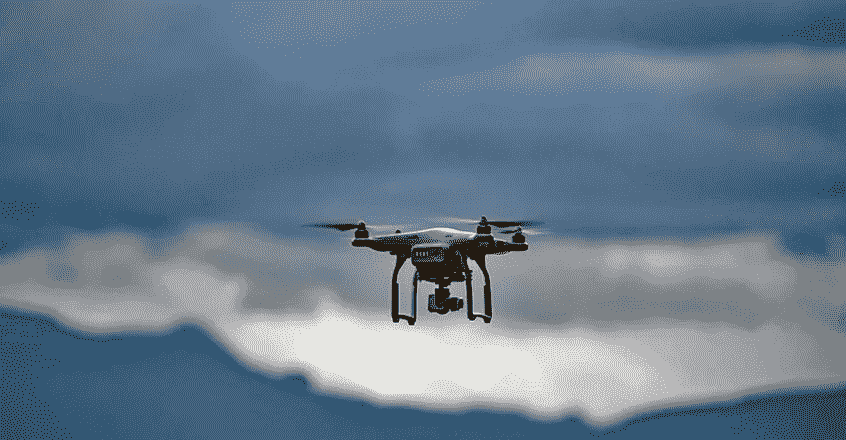
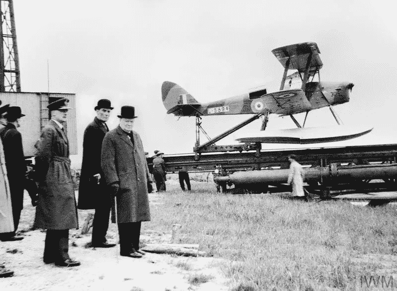
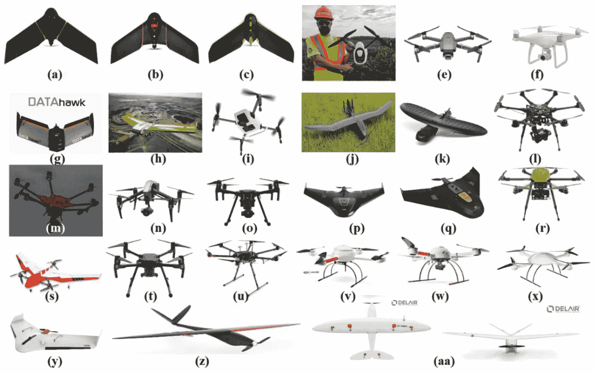
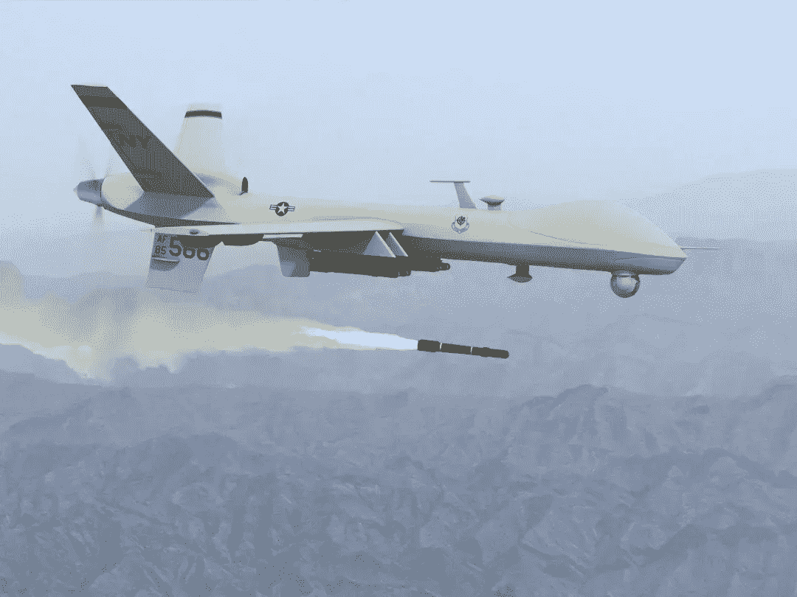
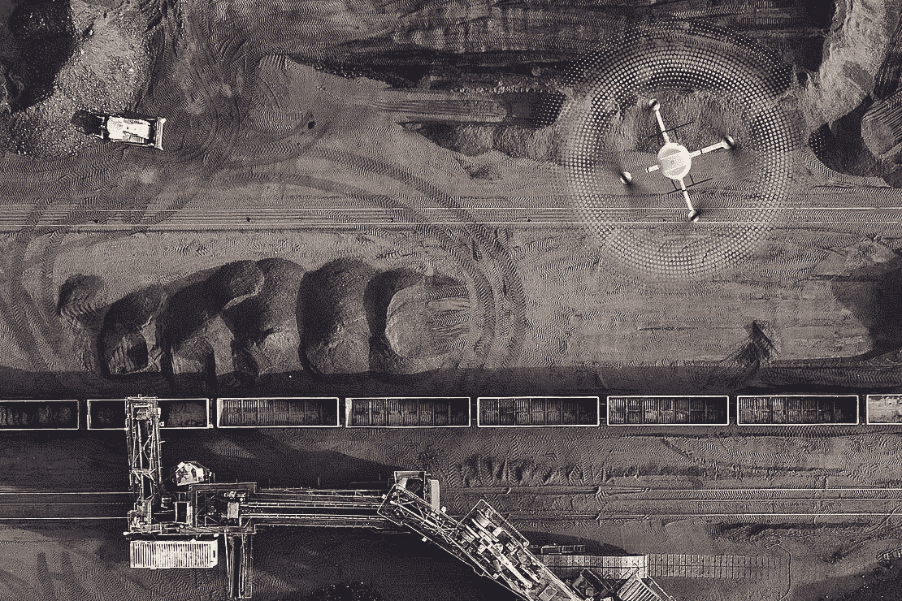
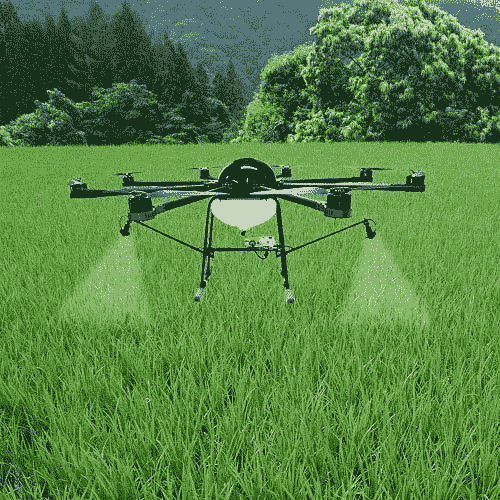
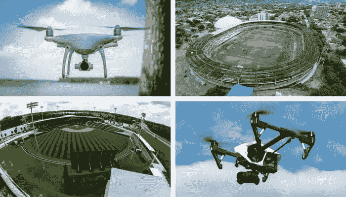
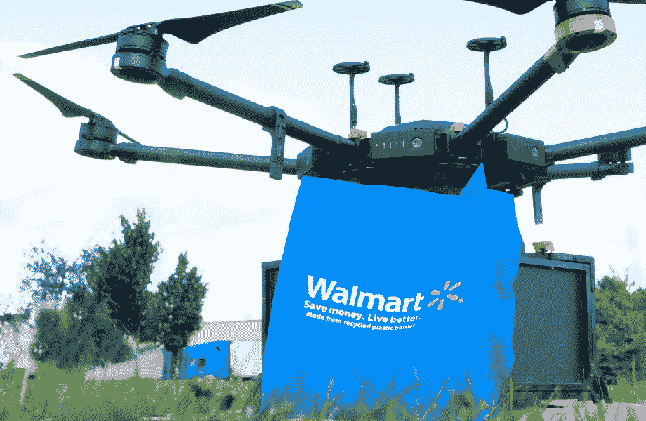

# 无人机时代

> 原文：<https://medium.com/nerd-for-tech/age-of-drones-4a8d8f1c81d6?source=collection_archive---------1----------------------->

无人机如何成为人类的左右手？

当你想到无人机时，你会想到什么？飞碟、不明飞行物、星际迷航、战斗机器、神话飞行物或现代 DJI。如果上面提到的任何一个是你的答案，那么你没有错。即使不是以上任何一个，相信我，这也不是你的错误，这是由于我们还没有利用的巨大空间。

在本文中，我们将深入了解无人机的简史、现代无人机、无人机的不同应用、无人机经济以及无人机的未来。

**什么是无人机？**

无人驾驶飞机是一种无人驾驶飞机，它的飞行不需要飞机上的人类飞行员的直接帮助或控制。无人驾驶飞机通常由人类飞行员遥控，这就是为什么无人驾驶飞机也被称为遥控车辆(RPV)的原因。但这可能并不总是正确的，许多现代无人机使用遥感，全球定位系统和预编译的指令，在不需要远程飞行员的情况下自行飞行。简而言之，我们可以说无人机是一种无人驾驶的飞行物体，可以遥控也可以不遥控。

**无人机的历史**

像历史上许多其他伟大的发明一样，无人机的想法产生于一场战争。早在 19 世纪中期，无人驾驶飞机被军方用于各种目的，如监视、训练、攻击等。。这些无人机与现代先进的无人驾驶飞机相差甚远。1849 年，奥地利海军在攻占威尼斯的任务中使用了携带炸药的无人驾驶气球。这些无人机不是很有效，因为它们依靠风而不是指令。

现代无人机的第一个版本开始出现在第一次世界大战中。在第一次世界大战期间，英国和美国开始开发第一架无人驾驶车辆。英国的空中目标是一架小型无线电控制飞机，于 1917 年 3 月首次测试，而美国的空中鱼雷凯特林虫于 1918 年 10 月首飞。这些看起来很有希望，但都没有用于战争。但这激发了无人驾驶车辆的想法，并导致了现代无人机的发展。

> 上面提到的历史是前现代无人机的历史，当时人造无人机刚刚起步。无人机的故事还有另一面，它可能是我们想象的产物(也可能不是；) )不明飞行物。是的，不明飞行物，我们从一开始就听到的故事是另一种可能存在的无人机。我们不会深入这个话题，并开始探索不明飞行物的故事，但这可能是另一个有趣的话题。

## 现代无人机

无人机从诞生的那一天起，已经走过了漫长的道路。从不受控制的奥地利气球无人机到高度可控的飞行物。从英国和美国第一次世界大战时非常大、笨重、低效的原型机到现代小型、轻便、高效的无人机。从仅限于战争和破坏的应用到农业、探索、媒体和我们最喜欢的军事领域的广泛应用。

无人驾驶飞机的这种转变是惊人的。今天，无人机有不同的形状和形式。有顶部单翼的无人机，有四臂的无人机(四轴飞行器)，有类似空气动力学飞机的无人机，还有很多。这些不同形状和大小的无人机实现了以前不可能实现的应用。

## 无人机的应用

由于设计的灵活性、远程操作、效率和安全性，无人机具有广泛的应用。每天都有无人机的新应用被发现，无人机能够在每个应用中证明自己。接下来，我们将看看无人机的一些重要应用。

**军事**

这是无人机最初的主要应用之一。虽然事情已经发生了很大的变化，世界正在从军事应用转向军事应用，但我们不能忽视无人机在军事上的进步。军用无人机是最先进和最复杂的之一，这可能是投入大量资金的结果。几乎世界上所有的主要军队现在都在他们的行动中使用无人机。无人驾驶飞机的 R&D 可能需要大量的时间和金钱，但使用无人驾驶飞机仍然比其他类似的军事装备便宜，这可能是经济成本或我们士兵生命中最重要的成本。军方现在是，将来也仍然是无人机的主要用户。

捕食者无人机发射导弹

**探险**

这是无人机最有趣的应用之一，因为这有助于人类扩展他们在地球上甚至地球以外的视野。无人机帮助人类到达了他们从未想过的地方。几个世纪以前，仅仅为了发现一块土地，就要花上几十年的探索时间。然后是空中旅行的时代，它使我们能够在几个小时内在地球上的任何两点之间旅行，这使我们能够探索地球上遥远的地方，甚至更远的地方。无人机的帮助覆盖了这两者之间的所有中间地带。很多时候我们需要的不是探索遥远的地方，而是探索不容易探索的地方，快速探索地方，这就是无人机更有帮助的地方。

无人机正在成为探索地球上许多无法到达的地方的伟大工具(相信我还有很多…)它可能是亚马逊的丛林，印度高止山脉的洞穴，撒哈拉沙漠的残酷炎热，或者超级寒冷的南极洲。你说出它的名字，无人机就能到达那里。探索该地区的另一个有趣的角度是快速探索该地区。无论何时何地，当谈到城市规划和发展的话题时，无人机凭借其多功能性和速度成为所有可用选项中最好和最便宜的选项。

用于勘探的带激光雷达的无人机

**农业**

农业是人类已知的第一职业。我们总是不断寻找新的方法来提高我们的效率和给定土地的产量。农业已经从动物耕地发展到现代的约翰迪尔。无人机以其灵活性非常适合农业领域。从美国的粗放型农业到印度的精耕细作，无人机有很多应用。

无人机可以帮助农民优化投入(种子、肥料、水)的使用，更快地对威胁(杂草、害虫、真菌)做出反应，节省作物侦察的时间(验证处理/采取的行动)，实时改进可变速率处方，并估计田地的产量。凭借其广阔的航程和速度，无人机可以很容易地用于照看广阔的领域。无人机也可以成为农民在给田地施肥等任务中的延伸。不久，我们将会看到这些小东西遍布田野，为农民省钱省力，并提高他们的产量。

喷洒农药的无人机

**媒体**

媒体是采用无人机技术的领跑者。媒体的目标是提供最佳质量和即时报道。无人机是解决这一系列问题的绝佳选择。从新闻到体育报道，或者从超高预算的好莱坞电影到超低预算的 YouTubers，无人驾驶飞机无处不在。

新闻机构正在使用无人机尽快到达并报道犯罪现场。这些小型无人机已经取代了新机构使用的直升机。所有这些有趣和富有挑战性的好莱坞场景，如果没有视觉效果，在早期根本不可能出现，无人机不仅使这些场景成为现实，还增加了导演的想象力。随着无人机变得越来越便宜和面向消费者，许多 YouTubers 也开始使用无人机进行视觉效果和讲故事。一个主要的例子就是 Casey Niestat 的视频博客，里面有美丽迷人的无人机照片。

用于体育报道的无人机

**交付**

世界正在走向网络，人们在网上购买的东西比线下多。以前通常是 10 天和 1 周交货，现在通过优化供应链，这一时间缩短到 1 或 2 天。沃尔玛和亚马逊一直在努力缩短送货时间，为顾客提供更好的体验，从而增加他们的收入。顾客希望东西越早越好，这导致了沃尔玛 Plus 和亚马逊 prime 的出现。亚马逊提供免费 2 天送货服务，而拥有更广泛商店的沃尔玛甚至可以为他们的 plus 客户提供免费 2 小时送货服务。

这可能是 2 天的运输或 2 小时的运输，其中最具挑战性的部分是最后一英里的交付。这也是巨头们最花钱的部分。这就是无人机的用武之地。不同形状和大小的无人机可以用来运送不同类型的产品，随着 GPS 变得越来越精确，无人机可以直接将产品送到你家门口。沃尔玛已经开始用无人机送货，从现在开始，无人机送货的使用只会越来越多。

沃尔玛的送货无人机

这些都是无人机的应用。有大量的应用，这里无法一一介绍。此外，每天都在发现无人机的新应用。

## 无人机经济

世界经济的引擎不断需要创新和变革。无人机将成为经济中的新的颠覆，对各个领域产生巨大影响。随着数百万美元投入无人机，R&D 世界对无人机寄予厚望，新冠肺炎只是放大了这一点。随着人们被困在家中无法旅行和走出墙壁，大公司已经开始使用更多的无人机和自动化来完成工作。

各行各业的无人机市场估计有 1270 亿美元。这只是冰山一角。这些数字会告诉你无人机的直接销售和市场。无人机的影响和无人机的间接好处，如果我们说是估计的 5 倍以上，那就不是过度拉伸。在宏观经济层面上，无人机的集成可以创造超过 10 万个就业岗位。无人机已经为颠覆做好了准备，全世界都在关注并为此做准备。

## 结论

我们已经讨论了无人机的历史和现代无人机。我们还深入研究了无人机在军事、农业、勘探、媒体和交付领域的各种应用。以这种创新速度，无人机不再需要人类的命令来操作，而是可以自己操作的日子不远了。

最后，如果我们说……就不会错。

> 这绝对是一个无人机的**时代**

希望你会喜欢这篇文章。如果你喜欢我的作品，请喜欢并与朋友分享，并关注更多类似的文章。