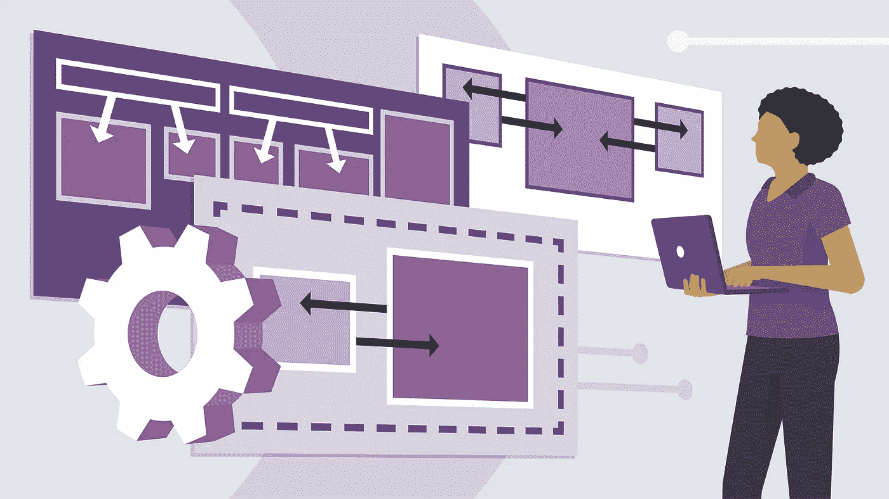
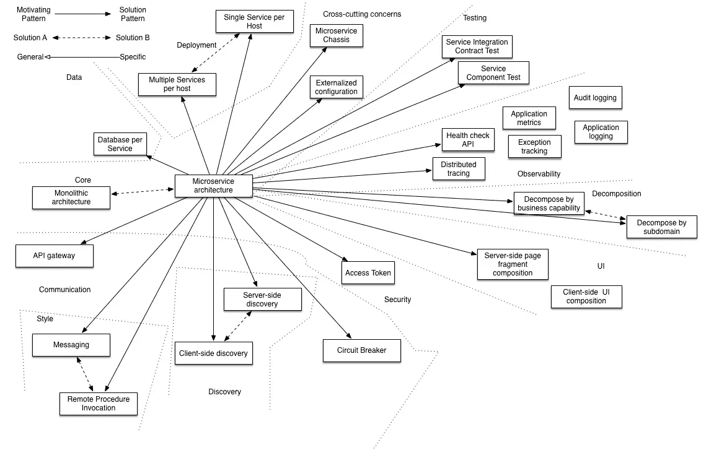
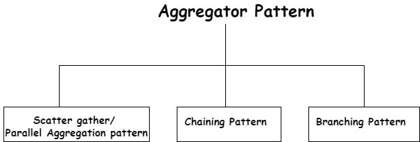
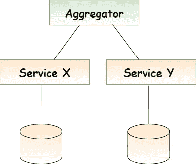
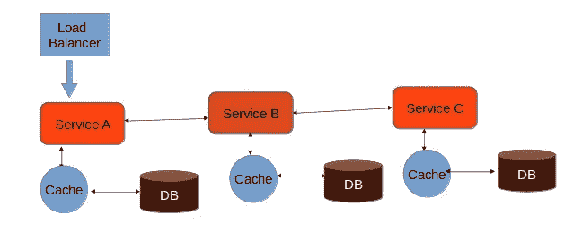
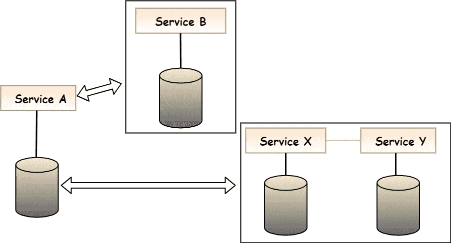

# 聚合器微服务设计模式🧮

> 原文：<https://medium.com/nerd-for-tech/aggregator-microservice-design-pattern-998609f498d6?source=collection_archive---------2----------------------->

(设计模式— **第一部分**)

📍在进入设计模式之前，首先，我们应该理解它们背后的原理。下面是一些用于设计微服务的原则。

▪️可用性

▪️弹性服务

▪️与失败的隔绝

▪️可扩展性和自动配置

▪️自治服务

▪️独立报

## **为什么我们需要微服务的设计模式？** 🧐

📍微服务中的设计模式是产生自主服务的软件设计模式，这些服务是**可重用的**(因为当一个问题的解决方案众所周知时，那么我们可以在将来将它们应用到相同类型的问题中)并且有助于克服我们在开发系统时必须面对的常见问题和挑战。因此，通过对适当的问题使用相应的设计模式，我们可以避免这些问题以及挑战。

## **微服务的设计模式**

📍有一组设计模式可以分类，例如通信、可观察性、分解、用户界面、数据库、安全性、部署、测试等等。所以其中，聚合器、断路器、异步消息、事件源、命令查询责任分离器、API 网关、分解是我们在微服务中发现的一些设计模式。

参考文献:理查森 2017

▪️:很难说一种设计模式比另一种好。这取决于我们正在开发的应用程序的上下文和需求。然而，在本文中，我将介绍**聚合器微服务设计模式**😁

# **聚合器微服务设计模式**

📍聚合器是一个简单的 web 页面，它调用多个服务并聚合来自不同服务的所需信息，然后将其作为最终响应发送回消费者。

该模式有如下 3 种不同的聚合器模式。

示例:

▪️假设我们有两个服务，分别是 x 和 y，每个服务都有自己的数据库。聚合器从客户端接收请求，因此它将从每个服务 X 和服务 y 收集信息，然后它将相应地合并收集的数据，并将其作为响应发送回消费者。(下图将显示这是如何工作的)

让我们用下面的例子来试着理解一下 ***散聚模式、连锁模式、*** 和 ***分支模式*** 。

示例:

▪️假设你被要求为一家信息技术公司实现一个微服务平台。

▪️现在你想出了下面的设计➙

服务 **①** ➞服务获取一个人的信息

服务 **②** ➞服务获取休假信息

服务 **③** ➞服务获取评估信息

服务 **④** ➞服务获取分配信息

并且你有 2 个消费者作为考勤管理系统和项目管理系统。

这家特殊的信息技术公司有一套完整的系统。所以现在你有责任将这个整体系统转换为微服务架构。

📍假设您将创建:

**获取个人信息的一项服务**

****获取休假信息的一项服务****

******获取评估信息的一项服务******

********一个服务获取分配信息，现在您可以为这 4 个不同的服务创建 4 个 dockers 并相应地部署它们。********

## ******但是有一个问题😭******

******▪️你没有任何服务获得个人信息和离开信息的考勤管理和获得个人信息和分配信息的项目管理。******

## ******这个问题的解决方案是🤓******

******◼️:你可以创建一个服务来使用这两个微服务，并将响应返回给消费者。因此，相应地，该服务将接受来自消费者的请求，调用个人信息并留下信息，汇总这些响应，然后将其发送回消费者。******

******▪️我们可以使用**平行聚集/分散聚集模式**作为选项，如下所示:******

## ****怎么会？****

****▪️当您调用出勤服务时，您可以发送并行调用到个人信息服务和休假信息服务。获得这些响应，将它们聚合为一个响应，并将其发送回消费者，这称为“**并行聚合/分散收集模式”**。****

## ****但是还有另一个 problem☹️****

****️Assume:休假信息服务**依赖于个人信息服务**☹️****

## ****这个问题的解决方案是🤓****

****▪️调用个人信息服务，从那里获取雇员代码，将该代码和其他信息一起传递给休假信息服务，获取休假信息，并将响应发送回消费者。所以这被称为**“链式模式”。******

******✨Chained 模式******

****📍正如我们在前面的例子中所讨论的，链式设计模式遵循链式结构。我们在服务和消费者之间不使用任何东西。在这种设计模式中，消费者获得直接与服务通信的许可。这里所有的服务都被链接起来，下一步的输入就是另一个服务接收到的输出。****

********

****ref:[https://www . tutorialspoint . com/microservice _ architecture/microservice _ architecture _ composition _ patterns . htm](https://www.tutorialspoint.com/microservice_architecture/microservice_architecture_composition_patterns.htm)****

> *******注:📝*** *并行聚合比链式模式更快。*****

******举例:******

****▪️假设个人信息服务需要 5 毫秒，离开服务需要另外 5 毫秒。如果你使用链式模式，你将花费 10 毫秒。但是如果使用并行聚合，理论上可以在 5 毫秒内获得两个响应。因此，我们可以确定并行聚合比链接模式更快。****

> *******注:📝:*** *这种链式设计模式的主要缺点是，消费者会被封锁，直到整个过程完成。因此，链必须短，不应该太长(如果不是这样，消费者将不得不等待很长时间才能得到回应，这是不好的。)*****

******✨分枝模式******

****▪️分公司微服务设计模式可以定义为聚合器模式和链式模式的混合版本。根据业务需求，该模式还可以用于调用单个服务链或不同的服务链。此外，这可以同时处理来自 2 个或更多独立微服务的请求和响应。****

********

******示例:******

****▪️假设你有一个服务，像一个用户发送信息作为员工 ID 和分支机构代码。现在您调用个人信息服务，如果分支代码是“Dev ”,它将调用项目分配，如果分支是“Sale ”,它将调用销售信息服务。****

****所以▪️根据上面的例子，基于一个因素，它做出了一个决定，这个决定叫做“分支”。****

> *******现在，业务逻辑已经改变如下:*******

******之前:**您有 4 个服务，并且为考勤管理系统创建了一个聚合服务。然后，您为项目管理系统创建了另一个聚合服务。因此项目管理系统将调用人员信息服务和分配信息服务。****

******更改业务逻辑后:**项目管理人员将他们的业务逻辑更改为在分配给新项目之前“检查休假信息”。****

****️So 您可以通过创建一个新的服务来调用 3 个服务(人员信息、休假信息和分配信息)来开发它。因此，现在您的项目管理系统中有两种不同的服务。****

****▪️:您可以将两者都部署到生产环境中，并要求消费者迁移到新版本。****

****▪️:所以在所有用户迁移到新版本后，你可以关闭以前的版本，只保留新版本。****

## ******聚合器设计模式的优势******

****📍很好理解。****

****📍容易实现。****

****📍为微服务提供单一访问点。****

****📍减少服务和客户端之间的通信开销。****

# ****参考****

****[**为微服务设计模式——这样你就不会滥用了:)**](https://youtu.be/DZeXqbFvYNA?list=PLD-mYtebG3X9HaZ1T39-aF4ghEtWy9-v3)****

**** [## 构图模式

### 软件合成意味着构建你的软件产品的方法。基本上，它处理高级软件…

www.tutorialspoint.com](https://www.tutorialspoint.com/microservice_architecture/microservice_architecture_composition_patterns.htm)  [## 微服务的设计模式

### 微服务架构已经成为现代应用开发事实上的选择。虽然它解决了某些…

dzone.com](https://dzone.com/articles/design-patterns-for-microservices)  [## 微服务设计模式|微服务模式| Edureka

### 在当今的市场上，微服务已经成为构建应用程序的首选解决方案。众所周知，它们可以解决…

www。Edureka.co](https://www.edureka.co/blog/microservices-design-patterns#Chained)****