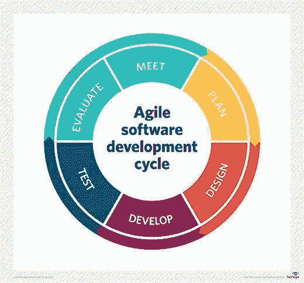

# 敏捷开发

> 原文：<https://medium.com/nerd-for-tech/agile-development-d21a6ca9ee26?source=collection_archive---------13----------------------->

# 描述

*   敏捷软件开发可能是一种开发应用程序的实践方法。
    敏捷方法被描述为“迭代”和“增量”方法。
*   术语敏捷管理适用于管理工程、信息技术和其他业务领域的规划和构建活动的迭代、增量方法，旨在以高度灵活和交互的方式提供新产品或服务开发，支持敏捷软件开发宣言中表达的原则
*   [敏捷开发人员](https://www.technologiesinindustry4.com/)将软件想象成一个复杂部件的混合体，这些部件相互作用，而不是一个大块的结构。
*   实际上，在瀑布方法中，开发团队将只有一次机会来推动项目的每个阶段(如设计、开发、测试等)。
*   然而，在敏捷方法中，这些阶段被周期性地不断重新访问，以了解项目的进展和方向。
*   敏捷方法[中的“检查和调整”方法](https://www.technologiesinindustry4.com/)大大降低了开发成本和时间，因为在这里团队可以在收集需求变化的同时开发软件。
*   利益相关者可以向活动团队提供反馈，以提高商品的标准。
*   敏捷开发确实节省了大量资源，这些资源本可以用在不再需要的东西上。
*   它提倡适应性计划、进化开发、早期交付和持续改进，并鼓励灵活应对变化。
*   [敏捷软件开发](https://www.technologiesinindustry4.com/)方法被广泛用于软件产品的开发，其中一些使用软件的某些特征，如对象技术。
*   敏捷软件开发范例经常被用在生活的其他领域，比如抚养孩子。它在儿童发展方面的成功可以建立在一些基本的管理原则上；交流、适应和意识。

# 软件开发价值观

*   过程和工具之上的个人和交互
*   综合文档之上的工作软件
*   合同谈判中的客户协作
*   对一个想法的不同反应

# 软件开发原则

敏捷软件开发有十二条原则。

1.  通过早期和持续交付有价值的软件来满足客户。
2.  欢迎不断变化的需求，即使是在开发后期。
3.  经常交付工作软件(几周而不是几个月)
4.  业务人员和开发人员之间密切的日常合作
5.  项目是围绕有积极性的个人建立的，他们应该被信任
6.  面对面的交谈是最好的交流方式(共处一地)
7.  工作软件是进步的主要衡量标准
8.  [可持续发展](https://www.technologiesinindustry4.com/)，准备保持持续的步伐
9.  持续关注技术优势和优秀设计
10.  简单——最大化未完成劳动量的艺术——至关重要
11.  最好的架构、需求和风格来自自组织团队
12.  团队定期反思变得更简单的方法，并相应地进行调整

# 适应周期

*   在敏捷[软件开发](https://www.technologiesinindustry4.com/)中，团队成员相互汇报他们前一天为团队迭代目标所做的事情。

# 开发方法

*   敏捷软件开发有多种选择方法。
*   它支持软件开发生命周期。
*   一些支持需求规格和开发的活动(例如，FDD)，而一些试图隐藏完整的开发生命周期(例如，DSDM，RUP)
*   动态系统开发方法(DSDM)、适应性软件开发(ASD)、敏捷统一过程(AUP)和特征驱动开发(FDD)是著名的敏捷软件开发框架。

更多详情请访问:[https://www . technologiesinindustry 4 . com/2020/08/agile-development . html](https://www.technologiesinindustry4.com/2020/08/agile-development.html)