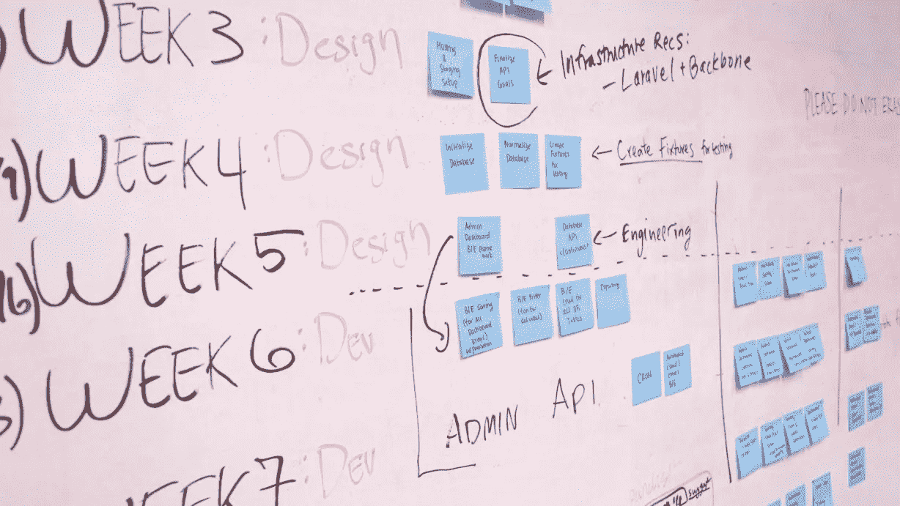

# 敏捷项目管理——第 1 部分:理解和好处

> 原文：<https://medium.com/nerd-for-tech/agile-project-management-part-1-understanding-and-benefits-eb079b563288?source=collection_archive---------0----------------------->

每个人都可以使用的敏捷项目管理指南！

敏捷是一种高效管理项目的方法。它可以用于任何类型的项目，但它主要是在软件开发中建立的。敏捷将较大的项目分解成小的、可管理的块，称为迭代。在每次迭代的末尾，有价值的东西是…