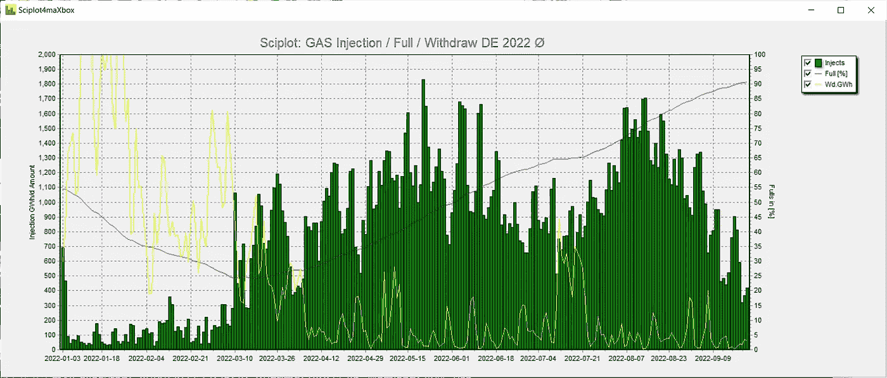
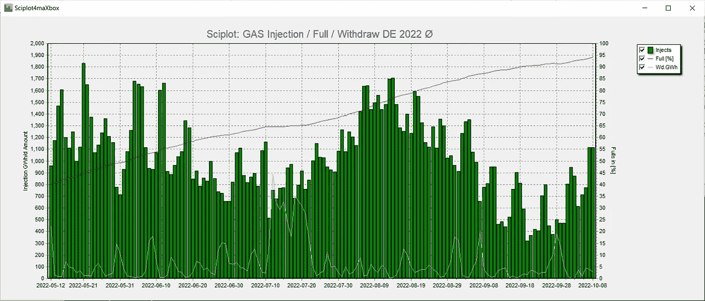
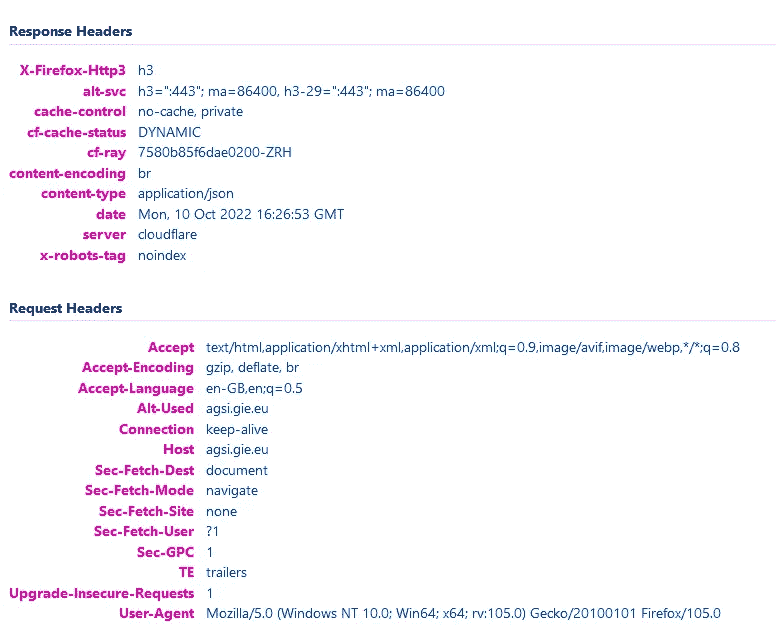
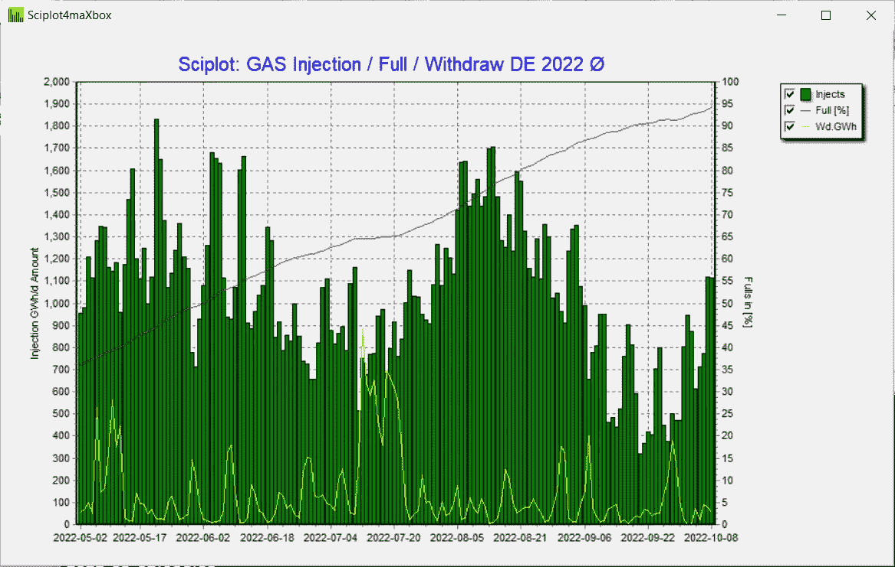
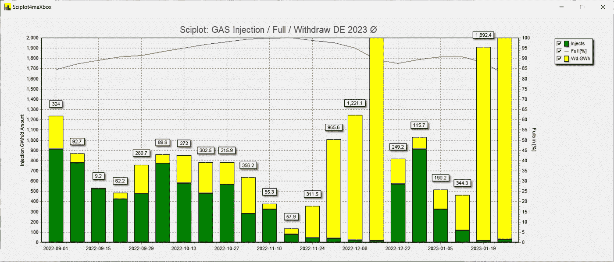

# AGSI 数据存储

> 原文：<https://medium.com/nerd-for-tech/agsi-data-storage-df40490adf7d?source=collection_archive---------2----------------------->

////////////////////////////////////////////////////////////////////////////

AGSI 数据存储报告

_____________________________________________________________

maXbox Starter 99 作为时间轴 AGSI 数据集的存储气体的数据表示。

数据科学家有很多种:

a)潜心钻研数据的人是最好的。

这个数据科学教程解释了所谓的 AGSI 数据存储和他的时间线可视化。AGSI 是一个总的气体存储库存，只要我们的数据提供商在网站上发布新的服务公告或更新，您就可以随时了解最新信息。

欧洲天然气基础设施公司(GIE)也在 https://www.gie.eu/publications/maps/[提供相关数据，如储存地图和储存投资数据库](https://www.gie.eu/publications/maps/)

数据的结果将如下图所示:



时线

Pic: 1154_agsi_plot13.png

我们使用 *WinHttp。WinHttpRequest* 、 *JSONObjects* 和 *TEECharts* 库加载并测试剧情。还需要一个 API 密钥，首先在:[https://agsi.gie.eu/account](https://agsi.gie.eu/account)获取密钥

该数据代表前一个气体日结束时储存的气体。数据每天在欧洲中部时间 19:30 更新，23:00 更新一次。在我们深入研究代码之前，这是脚本的主要部分:

> plotform:= getForm2(1400，600，clsilver，' sciplot 4 max box ')；
> plot form . icon . loadfromresourcename(h instance，' ZHISTOGRAM ')；
> 
> http response:=
> getenergystreamjson 2(URL _ AGS iapi 2，' DE，2022–01–03，150 '，AGSI _ API key)；
> 
> JSON2Plot(plotform，letgeneratejson 2(HttpResponse))；

主要部分生成一个表单，调用 API 并绘制数据。

GIE 在其 AGSI 和 ALSI 透明出版物平台上提供 API(应用程序编程接口)服务。

使用 API 访问，消费者可以绕过 AGSI 和 ALSI 网站，直接和持续地获得数据。它能够提取、过滤、聚合数据，并根据需要创建任何子集，而不必从网站上单独下载每个数据集。API 导出格式是 JSON。例如 150 天的子集:



存储子集

Pic: 1154_agsi_plot14.png

公布的数据集基于提供给宏碁的 EIC 代码映射表。存储数据按公司和国家汇总。

通过电话，我传递国家、开始日期和天数:

> getenergystreamjson 2(URL _ AGS iapi 2，' DE，2022–01–03，150 '，AGSI _ API key)；

所有可用的数据集也可以 Excel、CSV 和 JSON 格式下载。此报告中的数据显示了一个聚合视图—还可以访问按公司和存储设施划分的单个数据集。

所以让我们从 API 调用开始:

> http response:=
> getenergystreamjson 2(URL _ AGS iapi 2，' DE，2022–01–03，150 '，AGSI _ API key)；

这个命令和脚本运行 *WinHttp。WinHttpRequest* 。当您失败时，您会得到一系列异常，如下所示:

例外:WinHttp。WinHttpRequest:完成此操作所需的数据尚不可用；或者您丢失了一个有效的密钥:

## AGSIPost:获取响应失败:403 *{*

## *【错误】:{*

## *【代码】:403，*

## *"message ":"请求缺少有效的 API 密钥。"，*

## *“状态”:“权限 _ 被拒绝”*

## *}* }

有趣的是 JSON 格式的异常。当我从 Git 得到你的密钥时，也要小心暴露你的密钥: *GitGuardian* 已经检测到你的 GitHub 账户中暴露了以下 Google API 密钥。

接下来是用函数 *energyStream()* 中的有效 API-key 请求格式化 get-call

> **函数** getEnergyStreamJSON2(AURL，feedstream，aApikey: **字符串** ): **字符串**；
> 
> …
> 
> encodURL:= Format(AURL，[HTTPEncode(asp[0])，(asp[1])，ASP[2]])；
> 
> writeln(encodurl)//调试
> 
> hr:= httpRq。Open('GET '，encodURL，false)；
> 
> httprq . setrequestheader(' user-agent '，user agente)；
> 
> httpRq.setRequestheader('x-key '，aapi key)；

…

精彩的内容类型在哪里？据我所知，在 web 请求中只有两个地方可以设置内容类型:

1.  客户端为他发送到服务器的主体设置内容类型(例如 get 和 post)。
2.  服务器为响应设置内容类型。

生成包含有效载荷主体的消息的发送方必须在该消息中生成内容类型报头字段，除非所封装的表示的预期媒体类型对于发送方是未知的；否则，我们无法获得响应:503503-服务不可用。

## (' headers = { " Content-Type ":" application/JSON " } ')

## httprq . setrequestheader(' Content-Type '，application/JSON)；

这意味着应该只为 PUT 和 POST 请求设置 content-type HTTP 头。GET 请求可以有“Accept”头，它表示客户端理解哪种类型的内容。然后，服务器可以使用它来决定发送回哪种内容类型。

作为一个选项，您也可以使用 *TALWinInetHttpClient* 。这是一个易于使用的基于 WinInet 的协议，并支持 HTTPs。HTTP 客户端组件，允许通过 HTTP 协议从 Web 上发布和获取任何数据。

> **函数**TALHTTPClient _ Get(aUrl:ansi string；feedstream，aApikey: **字符串** ): **字符串**；
> 
> **Var**LHttpClient:TALWininetHttpClient；ASP:tstring array；
> 
> **begin** LHttpClient:= talwininethttpclient . create；
> asp:= splitStr(feedstream，'，')；
> lhttpclient . URL:= Format(AURL，[HTTPEncode(asp[0])，(asp[1])，ASP[2]])；LHttpClient。request method:= http mt _ Get；*//http RM _ Post；* LHttpClient。request header . user agent:= user agente；
> LHttpClient。request header . RawHeaderText:= ' x-key:'+aapi key；
> 
> **尝试** 结果:= LHttpClient。get1(lhttpclient . URL)；*//过载；* **最后** LHttpClient。免费；
> **结束**；
> **结束**；

任何缺失或不完整的数据也可以在 AGSI 上看到。接下来，我们使用 *TJSONObject* 来转换我们的 JSON 响应:

> **函数**letgeneratejson 2(HttpRqresponseText:**string**):TJSONArray；
> varjo:tjson object；
> 
> **begin** jo:= tjson object。create 4(HttpRqresponseText)；
> **try** *//writeln(jo . getstring(' data ')；* writeln(itoa(jo . getjsonarray(' data ')。getjsonobject(0)。length))
> writeln(itoa(jo . getjsonarray(' data ')。length))
> 结果:= jo . getjsonarray(' data ')；
> 
> *//写出检查* **for****it**:= 0**to**result . length-1**do** writeln(result . getjsonobject(**it**)。getstring(' gasDayStart ')+':'+
> result . getjsonobject(**it**)。getstring(' injection ')；
> 
> **exception** writeln(' EJson:'+exception string(exception type，exception param))；
> **结束**；
> **结束**；

并且这个 JSON 数组作为上面的函数返回，我们传递到下一个图:

> **程序**JSON 2 plot(form 1:t form；jar:TJSONArray)；
> **var**chart 1:t chart；cnt:整数；sumup，tmp2，tmp:double；gday: **字符串**；
> 
> **begin** Form 1 . onclose:= @ Form _ close click；
> chart 1:= chart 注射器(form 1)；
> sumup:= 0；tmp 2:= 0；tmp:= 0；
> **试试**
> 
> **for**CNT:= 0**to**jar . length-1**do**begin
> *//writeln(locate . getjsonobject(it))。getstring(' gasDayStart ')+':'+* tmp:= jar . getjsonobject(jar . length-1-CNT)。get double(' injection ')；
> tmp 2:= jar . getjsonobject(jar . length-1-CNT)。get double(' full ')；
> sumup:= sumup+tmp；
> gday:= jar . getjsonobject(jar . length-1-CNT)。getstring(' gasDayStart ')；图表 1。系列[0]。Addxy(cnt，tmp，gday，cl green)；
> 图表 1。系列[1]。Addxy(cnt，tmp2，''，clred)；
> 图表 1。系列[2]。Addxy(cnt，jar . getjsonobject(jar . length-1-CNT)。getdouble('取款')，''，clyellow)；
> **结束**；
> 
> **除了** writeln(' e plot:'+exception string(exception type，exception param))；
> **结束**；
> 
> PrintF(' land range % d:Injection sum:% . 2f '，[jar.length-1，sumup])；
> **结束**；

如我们所见，我们有 4 个系列要绘制(包括时间线):

1.  注射(气体日注射)
2.  完整(存储/ WGV 百分比)
3.  取款(加油日取款(2 位数精度))。
4.  GasDayStart(报告的气体日的开始时间)

时间序列是气体日的结果，并且趋势是可用的。

“天然气日”是指世界协调时 5:00 至第二天 5:00(冬季时间)和世界协调时 4:00 至第二天 4:00(采用夏令时)的时间段。燃气日在欧洲中部时间被解释为 UTC+1，在 CEST 的夏季时间被解释为 UTC+2。(定义:见 CAM 网络代码规范)。

API 访问是在一个类似 REST 的接口中提供的(表述性状态转移),以 JSON 格式公开数据库资源，在提到的响应头中有 content-type。



头球

pic:1154 _ JSON _ https _ _ agsi . gie . eu . png

数据科学愿景的代码包含示例用法，并在 Python3、Delphi、Jupyter-Notebook、Lazarus 和 maXbox4 下运行。请注意，API 服务是免费提供给公众的。只有平台上当前可用的数据才是可用的。

提示:要直接从系统中提取数据，您可以在浏览器中单击其中一个链接(web 流量与 API 流量；-)):

https://agsi.gie.eu/api?type=eu AGSI+

**结论:**

GIE 正在为其 AGSI 和 AGSI+存储数据提供 API(应用编程接口)服务。API 文档正在编写中，提供了关于如何使用该服务的示例和指导，注册后可以获得 API 密钥。下图为过去半年的情况:



直到 2022 年 8 月 10 日 1154_agsi_plot15.png

另一种堆叠视图是可能的:



1154_agsi_plot14stacked.png

Pic: 1154_agsi_plot15.png

可以在以下位置找到脚本和图像:

【https://github.com/maxkleiner/agsi-data 

参考:

[**http://www.softwareschule.ch/download/maxbox_starter99.pdf**](http://www.softwareschule.ch/download/maxbox_starter99.pdf)

[https://agsi.gie.eu/api](https://agsi.gie.eu/api)

[https://www . GIE . eu/transparency-platform/GIE _ API _ documentation _ v 006 . pdf](https://www.gie.eu/transparency-platform/GIE_API_documentation_v006.pdf)

[https://SVN . code . SF . net/p/alcinoe/code/demos/ALWinInetHTTPClient/_ source/unit 1 . pas](https://svn.code.sf.net/p/alcinoe/code/demos/ALWinInetHTTPClient/_source/Unit1.pas)

[https://docwiki.embarcadero.com/Libraries/Sydney/en/System.net . http client . thttpclient . post](https://docwiki.embarcadero.com/Libraries/Sydney/en/System.Net.HttpClient.THTTPClient.Post)

文件和工具:【https://maxbox4.wordpress.com 

脚本引用:1154 _ energy _ API _ agsi _ plot 14 . txt

```
**Appendix:** shows an WinAPIDownload class from maXbox4 integration
```

***{ *——————————】***

TWinApiDownload = class(to object)

**私人**

fEventWorkStart:TEventWorkStart；

fEventWork:TEventWork；

fEventWorkEnd:TEventWorkEnd；

fEventError:TEventError；

fURL: **字符串**；

fUserAgent: **字符串**；

fs top:Boolean；

fActive:布尔型；

fCachingEnabled:Boolean；

fProgressUpdateInterval:Cardinal；

**函数**GetIsActive:Boolean；

**公开**

**构造器**创建；

**析构器**销毁；**超驰**；

**函数**CheckURL(aURL:**string**):整数；

**函数**下载(Stream: TStream):整数；**过载**；

**函数**下载(**var**RES:**string**):整数；**过载**；

**函数**ErrorCodeToMessageString(aerorcode:Integer):**字符串**；

**程序**停止；

**程序**清晰；

**属性**用户代理:**字符串** **读取**熔丝代理**写入**熔丝代理；

**属性** URL: **字符串** **读取** fURL **写入**fURL；

**属性**download active:Boolean**read**GetIsActive；

**属性**cachingeenabled:Boolean**read**fCachingEnabled**write**fCachingEnabled；

**属性**update interval:Cardinal**read**fProgressUpdateInterval

**写**fProgressUpdateInterval；

**属性**OnWorkStart:TEventWorkStart**改为** fEventWorkStart

**写**fEventWorkStart；

**属性** OnWork: TEventWork **读** fEventWork **写**fEventWork；

**属性**OnWorkEnd:teventkworkend**读**feventkworkend**写**feventkworkend；

**属性** OnError: TEventError **读** fEventError **写**fEventError；

**结束**；

**马克斯·凯鹏华盈 2022 年 10 月 10 日**