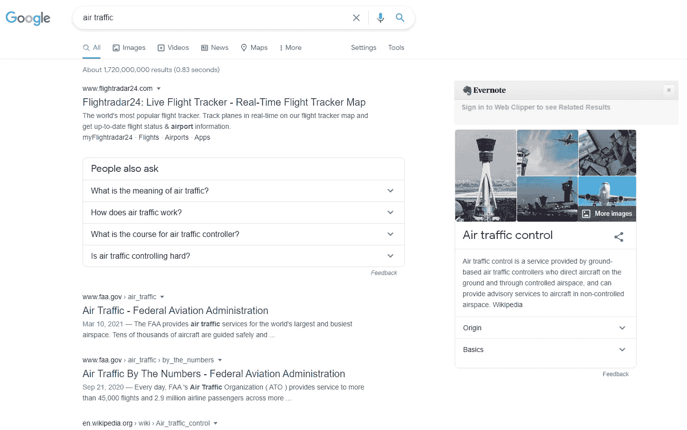

# 人工智能和机场图表

> 原文：<https://medium.com/nerd-for-tech/ai-and-airports-graph-293dbce6c773?source=collection_archive---------14----------------------->

机场图

你有这个地区的飞行数据，比方说欧洲或美洲大陆在某一特定时间的数据。一个或多个机场的关闭将如何影响全球交通？其余机场将如何通过消化通常由故障机场处理的交通来处理机场故障？这是一个关于图的弹性的练习，世界需要为这样的事件做好准备。碰巧你可以有这个数据集，你可以应用你的机器学习和人工智能技能来训练一个模型，最终给我们关于这个的聪明见解。您可以通过构建预测模型和创建创新数据集来使用数据集，这些数据集可以是提高已构建模型准确性的功能。也许就像飞机在紧急情况下会改道降落在其他机场而不是计划中的机场一样，你将通过这个数据科学练习获得你梦想中的工作。如果目标是用这些飞机建立一个有弹性的电信网络呢？这就是 Widrone 的意义所在，它是一个连接欧洲与美洲、欧洲与非洲、非洲与亚洲、亚洲与欧洲的网络，所有飞机都为陆地上的人们嵌入了电信系统。希望你能用这个找到你梦想的工作。

去造吧！

去做吧！

飞行雷达谷歌搜索