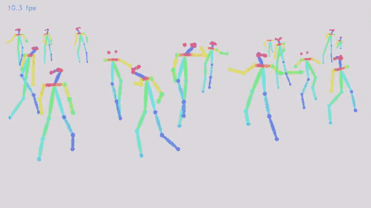
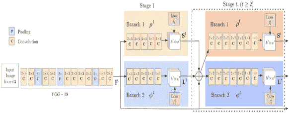
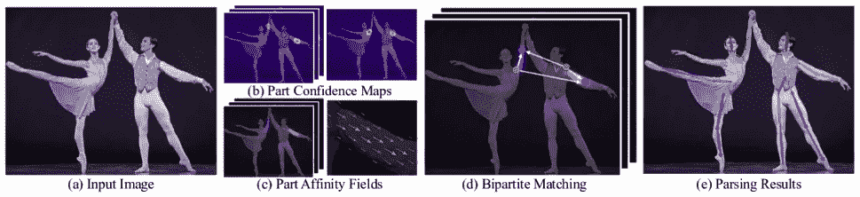
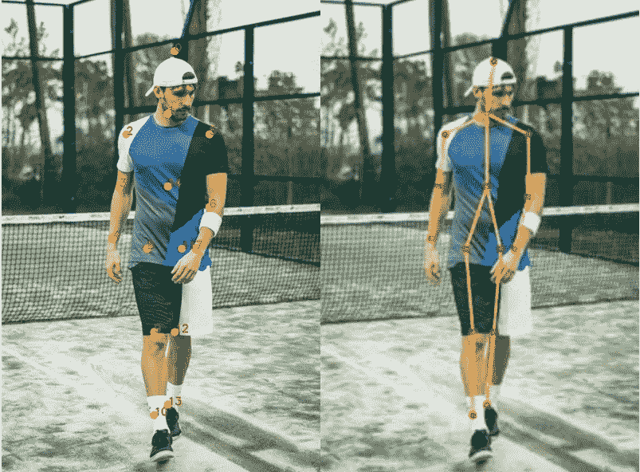

# 基于人体姿态估计的人工智能舞蹈

> 原文：<https://medium.com/nerd-for-tech/ai-dance-based-on-human-pose-estimation-738ac2ff6d1f?source=collection_archive---------1----------------------->

> 人体姿态骨架以图形格式表示人的方向。本质上，它是一组可以连接起来描述人的姿态的坐标。骨架中的每个坐标称为一个部分(或一个关节，或一个关键点)。两个部分之间的有效连接称为一对(或一个分支)。下面显示了一个人体姿势骨架示例。

因此，在本文中，我们将研究如何使用深度神经网络模型在 OpenCV 中执行人体姿态估计。

# 目录

1.  数据集
2.  模型架构
3.  实验和结果

## 数据集

迄今为止，由于缺乏高质量的数据集，人体姿态估计仍是一个具有挑战性的问题。现在，每一个人工智能挑战都需要一个好的数据集。在过去几年中，具有挑战性的数据集已经发布，这使得研究人员更容易有效地解决问题。

一些数据集包括:

1.  [可可关键点挑战](http://cocodataset.org/#keypoints-2018)
2.  [MPII 人体姿态数据集](http://human-pose.mpi-inf.mpg.de/)
3.  [VGG 姿态数据集](http://www.robots.ox.ac.uk/~vgg/data/pose_evaluation/)
4.  [超现实](https://www.di.ens.fr/willow/research/surreal/)(执行真实任务的合成人)
5.  [UP-3D](http://files.is.tuebingen.mpg.de/classner/up/)

对于本文，我们使用 COCO 数据集进行人体姿态估计。

## 模型架构

OpenPose 首先检测属于图像中每个人的部分(关键点)，然后将部分分配给不同的个人。下面显示的是 OpenPose 模型的架构。

OpenPose 架构的流程图。

该模型将尺寸为 w × h 的彩色图像作为输入，并产生图像中每个人的关键点的 2D 位置作为输出。检测分三个阶段进行:

> **阶段 0:**VGGNet 的前 10 层用于创建输入图像的特征图。
> 
> **阶段 1:** 使用 2 分支多阶段 CNN，其中第一分支预测一组身体部位(例如，肘、膝等)的 2D 置信图。).下面给出了关键点的置信度图和相似度图。第二个分支预测一组零件亲缘关系的 2D 矢量场(L ),其编码零件之间的关联程度。
> 
> **阶段 2:** 通过贪婪推理来解析置信度和相似度图，以产生图像中所有人的 2D 关键点。

使用 OpenPose 进行人体姿态估计的步骤。([来源](https://arxiv.org/pdf/1812.08008.pdf))

## 实验和结果

在这一节中，为了简单起见，我们将在单个人上加载用于理解人体姿势估计的训练模型。以下是步骤:

*从* [*这里*](https://drive.google.com/file/d/1WYWwZR_mtUSfRCR-Rwi0mDGNlL_Uvbei/view?usp=sharing) *下载* ***模型权重*** *。*

***加载网络*** *:* 我们使用的是在 Caffe 深度学习框架上训练的模型。Caffe 型号有两个文件——

1.  。指定神经网络架构的 prototxt 文件。
2.  。存储训练模型权重的 caffemodel 文件

***读取图像并准备对网络的输入*** :我们使用 OpenCV 读取的输入帧应该被转换成一个输入 blob(像 Caffe)以便它能被馈送到网络。这是使用 blobFromImage 函数完成的，该函数将图像从 OpenCV 格式转换为 Caffe blob 格式。首先，我们将像素值归一化为(0，1)。然后我们指定图像的尺寸。接下来，要减去的平均值，即(0，0，0)。

***进行预测并解析关键点*** *:* 一旦将图像传递给模型，就可以进行预测了。输出是 4D 矩阵:

1.  第一维是图像 ID(如果您向网络传递多个图像)。
2.  第二维表示关键点的索引。该模型产生置信度图和零件相似性图，它们都被连接起来。对于 COCO 模型，它由 57 个部分组成——18 个关键点置信度图+ 1 个背景+ 19*2 个部分相似性图。
3.  第三个维度是输出地图的高度。
4.  第四维是输出地图的宽度。

***画骨架*** *:* 我们只要把这些对连起来，有了关键点就可以画出骨架了。

上述代码的输出是:

代码可从 github . com/Devashi-choudh ary/AI-Dance-based-on-Human-Pose-Estimation 获得。如有任何问题或疑问，请直接联系我，电话:[**github.com/Devashi-Choudhary**。](https://github.com/Devashi-Choudhary)

# 参考

提供参考总是好的

1.  [打开姿势](https://github.com/CMU-Perceptual-Computing-Lab/openpose)
2.  [跳舞——艾](https://github.com/keshavoct98/DANCING-AI)