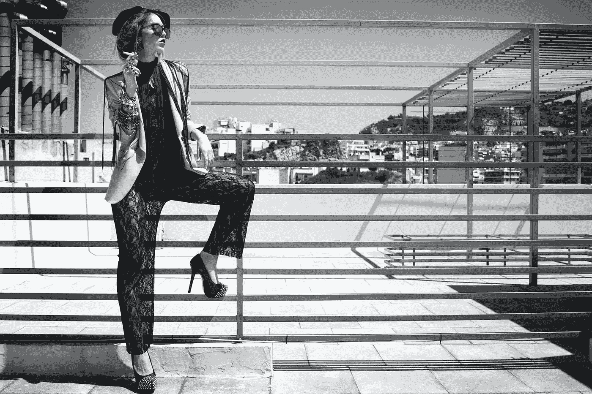

# AI+时尚，AI 怎么知道下一季的热门款式和流行趋势？

> 原文：<https://medium.com/nerd-for-tech/ai-fashion-how-does-ai-knows-the-hot-styles-and-fashion-trends-of-the-next-season-1ab48faffb24?source=collection_archive---------2----------------------->

有时候，新的流行趋势看似突然出现，但实际上，这些时尚通常是幕后流行趋势预测者数月甚至数年精心观察和策划的产物。

那些热衷于潮流的人会注意到时装秀和名人穿着的趋势。他们收集关于政治、娱乐、环境、技术和消费者行为的数据。**文化观察是一个起点，**让人们提前两年推断什么颜色、轮廓和面料会成为下一个流行趋势。

## **时尚从何而来？**

时尚预测公司 Fashion Snoops 的专栏主编卡雷拉·库尔尼克说:“**时尚总是对环境的反应**。经济环境、情感环境、政治环境以及我们周围的所有不同事物都会影响我们的时尚观，包括我们的穿着方式、我们希望别人如何看待我们，以及我们如何向别人展示我们是谁。”时尚趋势预测者会观察这些环境的任何变化。

据 WGSN 预测公司的时尚副总裁弗朗西丝卡·莫斯顿说，真正的分析是在一系列类似的观察之后开始的。在识别出一种文化趋势后，分析师将其转化为相应的时尚动态。除了从社交媒体上的潜在消费者那里获得源源不断的信息，预测公司还收集了大量的历史数据(秀场照片、时尚杂志档案以及他们自己的研究)。

在过去，几乎所有的潮流都来自时尚界的精英。但是社交媒体和影响者文化改变了这一点。库尔尼克表示，互联网的确在很大程度上改变了时尚信息的来源。

## 人工智能如何成为时尚趋势预测专家？

现在，除了分析社交媒体，许多公司还使用人工智能程序来追求新趋势。例如，Fashion Snoops 使用 AI 来搜索互联网上具有潜在趋势的流行语和小说俚语。

IBM 的沃森人工智能可以分析时装秀的数千张图像，并分析零售商在即将到来的季节应该寻找哪些颜色和图案的见解。该算法可以忽略无关的数据，如背景的类型和模型的肤色，然后找到并记录每幅图像中的突出颜色，最终获得关于每种颜色出现频率的数据。

它还可以对织物图案进行类似的分析，并找到不同时装秀之间的相似之处。时尚趋势预测者不可能及时分析下一季的这么多数据，使用人工智能来做这项繁重的工作可以让时尚人士专注于在电影、电视甚至政治等不太传统的领域寻找即将到来的趋势。

研究人员表示，人工智能在趋势预测方面的力量不止于此。众所周知，**时尚行业是一个给生态环境带来很多麻烦的行业，占全球碳排放量的 10%，每年将多达 900 万吨纺织品投入垃圾填埋场**。为了缓解这个问题，人工智能系统可以帮助服装制造商预测每种款式的需求。当一种新产品上市时，如果人工智能可以提前两个月预测该产品的销售，它可以帮助最大限度地减少未售出的库存。减少浪费可能是时尚品牌可持续发展的重要一步。

## 高质量标记数据

随着 AI 商业化进程的加快，以及辅助驾驶、客服聊天机器人等 AI 技术在各行各业的应用，人们对特殊场景下的数据质量的期望越来越高。高质量的标签数据将是人工智能公司的核心竞争力之一。

如果说之前的算法模型使用的一般数据集是粗粮，那么算法模型目前需要的是定制的营养餐。如果公司想要进一步提高某些模型的商业化，他们必须逐步从通用数据集向前发展，以创建独特的数据集。

# NLP 服务

我们在电子商务、零售、搜索引擎、社交媒体等领域提供不同类型的自然语言处理。我们的服务包括语音分类、情感分析、文本识别和文本分类(聊天机器人相关性)。

# 结束

将你的数据标注任务外包给 [bytebridge.io](https://tinyurl.com/2p979dc2) ，你可以更便宜更快的获得高质量的 ML 训练数据集！

*   无需信用卡的免费试用:您可以快速获得样品结果，检查输出，并直接向我们的项目经理反馈。
*   100%人工验证
*   透明标准定价:[有明确定价](https://www.bytebridge.io/#/?module=price)(含人工成本)

为什么不试一试呢？

资料来源:https://baijiahao.baidu.com/s?id = 1692197701977257005 & wfr =蜘蛛&for=pc