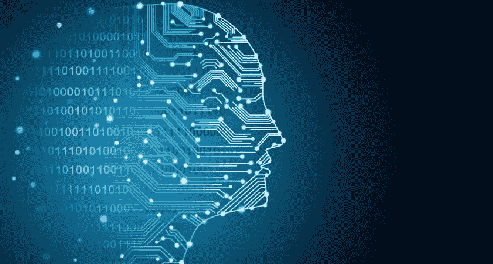
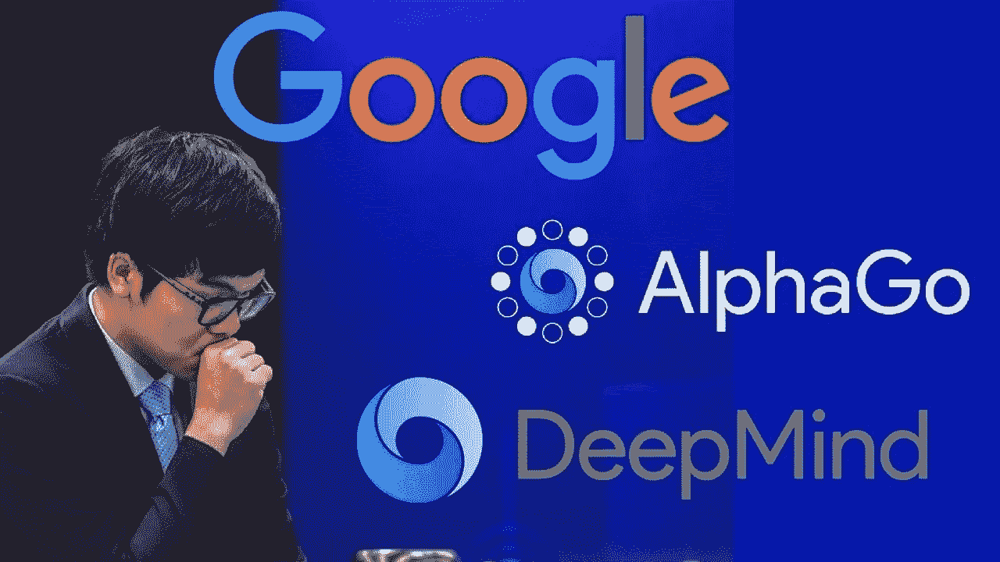
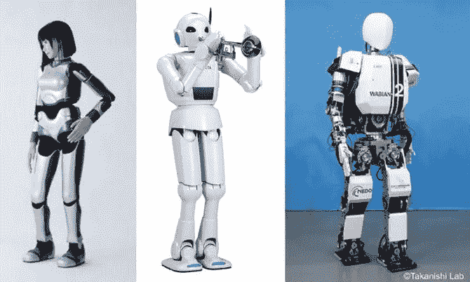

# 人工智能取证:在显微镜下

> 原文：<https://medium.com/nerd-for-tech/ai-forensics-under-the-microscope-9ccdec20519b?source=collection_archive---------15----------------------->

[维基百科](https://www.google.com/url?sa=t&rct=j&q=&esrc=s&source=web&cd=&cad=rja&uact=8&ved=2ahUKEwiH6Pja0cHwAhVSXBoKHSv_AaUQmhMwJ3oECEYQAg&url=https%3A%2F%2Fen.wikipedia.org%2Fwiki%2FArtificial_intelligence&usg=AOvVaw0svSWXI233PfYA4MrKZd4I)定义的人工智能，是指机器表现出来的智能，不像人类和动物表现出来的自然智能，涉及意识和情感性。用专业术语来说，人工智能通常包含两个主要领域:机器学习和深度学习。这两个领域涉及数学算法的工作，最终使计算机能够以智能的方式思考和决策。

尽管人工智能仍处于早期发展阶段，但它在人类生活中的应用是无穷无尽的。日复一日，我们使用人工智能系统执行任务，有时甚至不知道我们在做什么。一些医疗机构现在集成了人工智能系统，帮助他们分析某些领域的数据，以便做出准确的决策。随着人工智能一天天变得越来越大，它的未来是我们所有人都期待的。

# 进退两难

人工智能通常被概念化为一个巨大而神秘的领域，对我们的未来构成威胁。它在现实世界应用中日益增加的复杂性有时会让新手很难进入这个领域。本文试图揭开这种复杂性的神秘面纱。在这篇文章中，不同的人工智能领域将被分解，对不同的人工智能领域是什么以及人工智能实际上是如何应用的给予更广泛和更轻松的理解。

# 崩溃

从**机器学习**开始，IBM 将其定义为[人工智能(AI)](https://www.ibm.com/cloud/learn/what-is-artificial-intelligence) 和计算机科学的一个分支，专注于使用数据和算法来模仿人类学习的方式，逐步提高其准确性。机器学习主要与使用数学和统计关系有关，将它们放在一起，使机器从给定的数据集学习，以便做出推理决策。机器学习有不同的领域，包括:

*   分类
*   回归

**分类**机器学习中的分类是对给定的一组数据进行采样并分组到不同类别的过程。这个过程可以在结构化或非结构化数据上执行。它从预测给定数据点的类别开始。这些类别通常被称为目标、标签或类别。

分类通常应用于约会网站或社交媒体平台等领域，在这些领域中，用户根据他们的兴趣、喜欢的新闻提要以及可能访问过的地方进行分组。

另一方面，机器学习中的**回归**由数学方法组成，使得基于一个或多个预测变量(x)的值预测连续结果(y)成为可能。线性回归可能是最流行的回归分析形式，因为它易于预测和预报。在诸如确定特定公司产品的客户流失的领域中，可以应用回归来从用户的活动中学习，诸如花费的时间、购买的产品、续订的订阅、反馈等。

回归可用于了解用户活动，并对公司产品或订阅服务的用户流失进行预测

**深度学习**然而，它是机器学习的一个子领域，涉及受大脑结构和功能启发的算法。它包括以模拟人脑运作的方式建立复杂的计算功能。在这方面，计算功能，通常称为层，是称为神经网络的更大功能的较小部分。深度学习是一个快速发展的领域，在医学研究、语言领域、空间探索等领域有许多应用。

诸如深度神经网络、深度信念网络、图形神经网络、递归神经网络和卷积神经网络之类的深度学习架构已经被应用于包括计算机视觉、语音识别、自然语言处理、机器翻译、生物信息学、药物设计、医学图像分析、材料检查和棋盘游戏程序在内的领域，在这些领域中，它们已经产生了与人类专家的表现相当的结果，并且在某些情况下超过了人类专家的表现。

# 现实世界的应用

值得注意的是，机器学习和深度学习只是整合到系统中以产生所需输出的工具。在现实世界的应用中，人工智能模型是整个系统的一部分，用来执行特定的功能。下面是一些突出的例子，以及人工智能如何在实现预期输出方面发挥巨大作用。

## **——谷歌 DeepMind 的 AlphaGo**

围棋是一种古老的中国棋盘游戏，被认为是世界上最难的棋盘游戏之一，棋盘的数量比宇宙中的原子还要多。由于这种复杂程度，普通的计算机程序越来越难以学会所有可能的动作并与人对弈。为此，谷歌的 DeepMind 团队建立了一个名为 AlphaGo 的人工智能系统。这个深度神经网络人工智能系统是建立在残差神经网络的基础上，并通过使用残差神经网络对其进行改进。

AlphaGo 没有受过任何走法训练，必须完全从零开始学习。它通过与自己对抗几天，从错误中学习，并在每次迭代中进行调整来做到这一点。本文中这个人工智能系统的主要焦点是残差神经网络(ResNet)。ResNet 使从过去的棋步中学习的迭代步骤成为可能，提高了 AlphaGo 的下棋能力。通过学习它的动作并进行调整，产生了一组可能的动作。这显示了 AI 系统在整个 AlphaGo AI 系统中的相关性部分。点击查看 AlphaGo 纪录片[。](https://youtu.be/WXuK6gekU1Y)

## -人形机器人

人工智能的另一个重要应用领域，特别是深度学习，是在人形机器人领域。[维基百科](http://A humanoid robot is a robot with its body shape built to resemble the human body. The design may be for functional purposes, such as interacting with human tools and environments, for experimental purposes, such as the study of bipedal locomotion, or for other purposes)将人形机器人定义为身体形状模仿人类身体的机器人。仿人机器人的核心工作结构是基于先进的软件和硬件编程，以及人工智能的高级应用。

以人形机器人的行走能力为例，结合了几个传感器和硬件组件，例如接近传感器、陀螺仪、加速器等，以共同引导机器人系统行走。人工智能经常被用于从所有这些组件的数据中学习，人类认为这是让机器人移动的正确方法。

这里的重点是人工智能系统，以及机器人如何利用它的输出。也可以应用一些人工智能系统，如计算机视觉，可以对机器人的周围环境进行分析，然后从过去的数据中学习，然后它可以确定在它所处的环境中移动是否安全。

# 结论

从一般意义上看人工智能，不考虑太多的技术方面，人们可以看到，对于利用人工智能的系统，人工智能只代表整个系统的一小部分，即使它的作用可能在很大程度上影响整个系统的功能。

希望现在，人们将能够学习人工智能，并完全理解它如何应用于系统中，并确定人工智能系统将在系统中扮演的角色。