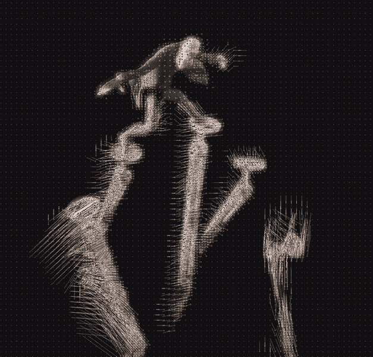
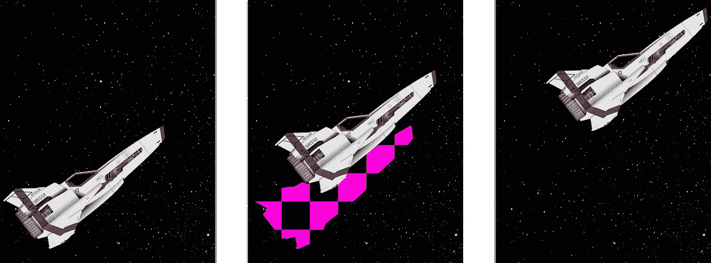

# 利用人工智能让视频流行起来

> 原文：<https://medium.com/nerd-for-tech/ai-frame-interpolation-a221f6b37220?source=collection_archive---------8----------------------->

在 [Unsplash](https://unsplash.com?utm_source=medium&utm_medium=referral) 上由 [Ed Leszczynskl](https://unsplash.com/@ed_leszczynskl?utm_source=medium&utm_medium=referral) 拍摄的照片

帧内插是在录制视频后，通过猜测中间帧的样子来提高视频帧速率的过程。如果操作正确，这将产生更平滑的视频，几乎没有伪像。

# 它是如何工作的？

虽然有许多不同的帧插值方法，但我将只关注其中的三种。我选择了帧平均、运动估计和人工智能插值。

## 帧平均

当试图设计帧插值算法时，帧平均可能是您首先想到的。它的工作原理是将两个相邻的帧叠加在一起。虽然这种算法很容易实现，但通常不值得使用，因为它会产生不和谐的结果。

当用于没有太多运动的视频时，这种算法不会做太多，只会创建稍微模糊的插值帧。另一方面，运动较多的视频会出现鬼帧，导致模糊和抖动的混乱——当目标是创建更平滑的镜头时，这并不理想。

帧平均示例—中间帧为插值帧

## 运动估计

运动估计是一种复杂得多的帧内插算法，其工作原理是:

1.  将帧分解成离散块的集合
2.  估计这些块如何在帧之间移动。

让我们更深入地看看这些步骤，好吗？

运动估计的可视化，W [ikipedia](https://en.wikipedia.org/wiki/Motion_compensation#/media/File:Elephantsdream_vectorstill04_crop.png)

该算法的第一部分是将帧分解成更小块的集合。使用更少的块将加速算法，但也会扭曲细节运动。因此，该算法的实现通常使用根据两个帧之间的差异而变化的动态大小的块。

一旦一帧被分割，就为每个块计算速度向量。这个速度表示给定的块如何在两个帧之间移动。然后可以通过扭曲图像来构建中间帧，使得细胞向它们的下一个位置移动。

一般来说，这种方法会产生比帧平均更精确的结果。在平滑运动的拍摄中，它会产生几乎与地面真实无法区分的图像。然而，在具有更复杂运动的视频上，这种算法往往很难实现。首先，由于中间的帧是通过扭曲前一帧来构建的，因此运动元素周围的区域可能会被扭曲。第二，加速物体会断断续续，因为速度向量假设线性运动。最后，非常快速移动的物体可能会被完全错过，并产生重影。

## 人工智能驱动的插值

人工智能驱动的插值比前两种方法要强大得多，因为机器学习模型能够更准确地理解视频的运动。这有助于减轻以前方法中出现的许多问题，如图像重影、失真和断断续续。最重要的是，人工智能模型能够区分前景和背景元素。这使他们能够逻辑地重建，这是以前的方法经常遇到的问题。

缺失背景信息的示例—以紫色突出显示

重建背景信息是帧内插最重要的部分之一。由于视频几乎总是在视角上发生变化，因此需要产生新的信息。不正确地填充这些区域将导致真实帧和插值帧之间的明显差异，从而破坏幻觉。

很幸运，在使用 AI 插值的时候，我们完全不用担心这个问题！人工智能自然会学习如何以现实的方式重建缺失的背景信息。这通常是通过给予 AI 不仅仅是直接围绕内插图像的两个帧，而是多达十个相邻帧来实现的。从这些图像中，人工智能可以预测背景看起来像什么，从而在它变得可见时填充它。

# 帧插值的用例

除了只是为了好玩而增加帧速率这一明显的用例之外，为什么还要费心去学习帧内插呢？嗯，这里有几个实际用途。

## 虚拟现实

在 [Unsplash](https://unsplash.com?utm_source=medium&utm_medium=referral) 上由 [Minh Pham](https://unsplash.com/@minhphamdesign?utm_source=medium&utm_medium=referral) 拍摄的照片

虚拟现实对计算要求极高。现代耳机的像素超过 700 万，几乎和 4k 显示器一样大。此外，为了保持流畅的用户体验，VR 头戴设备需要每秒更新 120 次图像。这意味着你可怜的 GPU 每秒产生超过 7 亿个像素。

假设每秒产生这么多帧，这些帧之间的差异非常小。这正是帧内插所擅长的！使用人工智能驱动的帧插值可以轻松地将生成这些帧所需的计算减半。

## 视频压缩

当前的视频压缩技术通过混合使用帧间和帧内压缩来工作。虽然这些算法是有效的，但在一幅图像变得无法识别之前，你可以对它进行多大程度的压缩是有限制的。

这就是 NVIDIA 最近关于视频会议图像合成的论文的用武之地。这篇文章谈到了很多东西，但我将只关注其中的一部分，视频压缩。通过首先在网络上发送完整的未压缩图像，NVIDIA 能够从相对少量的信息中构建后续帧。本文的实施将允许互联网连接速度慢或有限的人参加高清网络会议。

# TL；速度三角形定位法(dead reckoning)

*   帧插值是创建中间帧以增加流畅性的过程
*   帧插值可以通过硬编码或人工智能驱动的算法来实现。
*   帧内插有许多用途，包括视频压缩和质量增强。

> *感谢您阅读我的文章！请随时查看我的* [*作品集*](https://tks.life/profile/robert.macwha#portfolio) *，在*[*LinkedIn*](https://www.linkedin.com/in/robert-macwha-0555141b6/)*上给我留言，如果你有什么要说的，或者在 Medium 上关注我，当我发布另一篇文章时，你会收到通知！*