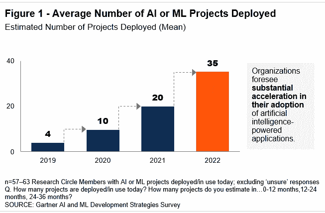
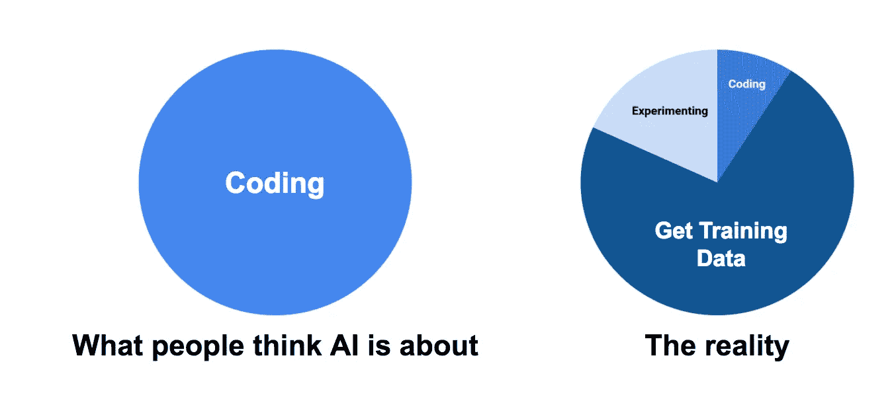

# 醒醒吧，经理们！！AI 不是魔法！

> 原文：<https://medium.com/nerd-for-tech/ai-manager-db798bba0174?source=collection_archive---------27----------------------->

资料来源:皇后大学史密斯商学院

> 就在两年前，Gartner 预测 85%的人工智能项目将无法交付。这意味着，在 20 个人工智能项目中，只有 3 个会成功！可怕不是吗？

你们中有多少人听说过经理和技术负责人计划将人工智能(AI)或机器学习(ML)引入他们的项目？我很确定有很多，但是说到他们的 AI 或者 ML 知识！问题来了！

来源:Gartner

让我们试着去理解 Gartner 给出的说法的理由。

## 1)风险

来源:印度福布斯

因为替换公司中的遗留系统要困难得多，而且这样的过程并不总是像听起来那样容易。

在开发成功的人工智能项目上投入时间、培训和金钱本身就是一个巨大的风险！

## 2)困惑

资料来源:Scrabbl

在任何当前的项目中采用人工智能或者创建一个人工智能项目都会导致日常的混乱。这肯定不是一件可以顺利执行的事情。

即使参与人工智能项目的人普遍缺乏对数据和统计的理解，也会导致对许多事情的混淆。

好吧，除了 Gartner 提到的这两点，还有其他原因也可能导致这些人工智能故障

这些原因在公司里不被注意，不被说出来，甚至不为人知！其中一些原因是:

## a)在看不到数据的情况下规划人工智能项目

来源:媒体

在大多数情况下，只是为了使用人工智能，没有人工智能背景的经理试图听起来“酷”，并在项目中使用人工智能

这还不错，也许他们正在努力适应新技术，但他们需要明白，AI 不仅仅是一种可以非常快速地学习或处理的新编程语言！

数据是 ML 中最重要的东西。也有可能是这样的情况，即使你有足够的数据，它是如此的无用，以至于不能从中做出任何预测！

## b)从事人工智能工作的团队缺乏人工智能背景

来源:LinkedIn

关于人工智能的基础课程不会起作用，至少 ML 中的一些迷你项目可以让团队了解人工智能实际上不是什么！

甚至领导项目的技术领导或经理也应该理解并经历人工智能的课程。这将有助于规划项目，因为它完全不同于他们正在管理或过去已经管理的通常的软件开发项目！

> “到 2035 年，人类的思维没有理由也不可能跟得上人工智能机器。”—格雷·斯科特