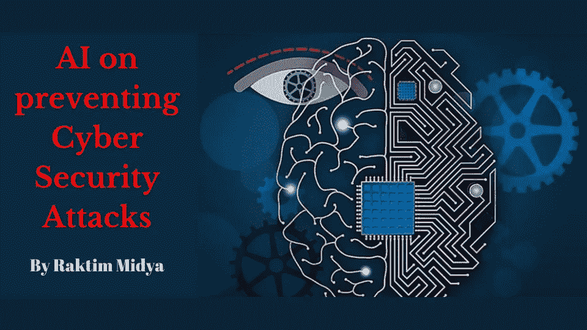
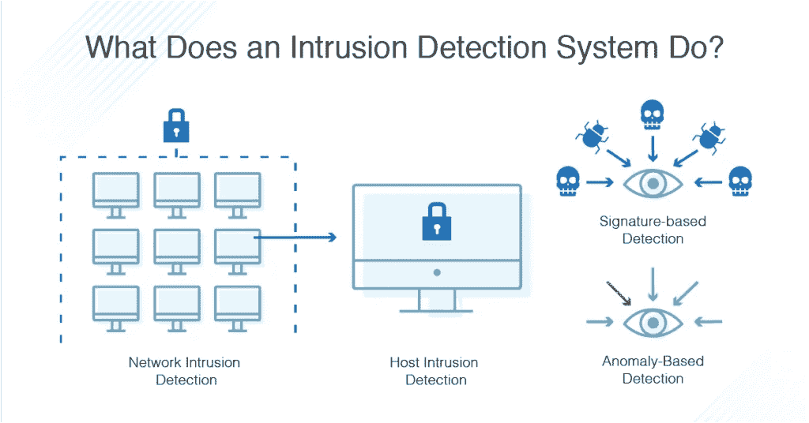
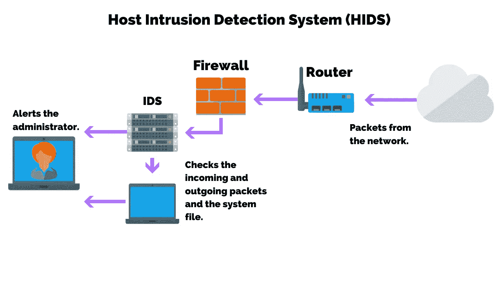
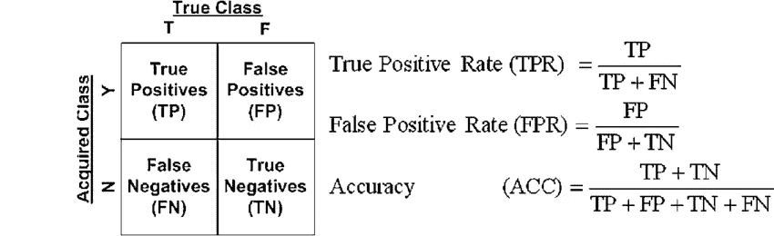

# 人工智能预防网络安全攻击

> 原文：<https://medium.com/nerd-for-tech/ai-on-preventing-cyber-security-attacks-781d3cd8d5d2?source=collection_archive---------12----------------------->

由 Raktim 创建

## 每一家提供在线服务的公司都有大量的客户数据。但是他们是如何保护这些数据的呢？请继续阅读这篇文章，了解人工智能是如何帮助他们实现这一目标的…

# 数据保护:

来源:谷歌

当今世界有 47.2 亿用户每天都在使用互联网。他们中的大多数将互联网用于**社交媒体平台、视频流媒体平台、银行交易**等。这就是为什么像**谷歌、脸书、亚马逊、微软**等受欢迎的公司。有太多关于他们用户的数据。同样受欢迎的银行有汇丰银行、花旗集团、摩根大通等。拥有客户的非常敏感的数据。

**当今世界上没有一家公司希望这些数据泄露到互联网的任何地方。因为…**

> “数据即业务，数据即隐私”

**但是正如我们所知，所有这些技术都是人类创造的，没有一项技术是 100%没有错误的。一些有头脑的天才发现了这些漏洞，开始从中获利。网络犯罪由此诞生。**

# 什么是网络攻击？

来源:谷歌

*   **简单来说，网络攻击是指网络罪犯使用一台或多台计算机对一台或多台计算机或网络发起的攻击。**网络攻击可以恶意瘫痪计算机、窃取数据，或将被攻破的计算机用作其他攻击的发动点。
*   网络罪犯使用各种方法发动网络攻击，包括恶意软件、网络钓鱼、勒索软件、拒绝服务等方法。

> 这个博客显然不是关于学习网络攻击&如何进行攻击。这个博客主要关注公司日常使用的防止这些攻击的技术。但是不知道问题所在，我们就永远无法找到解决方案。所以，让我们学习一些网络攻击的例子，然后我们将学习预防方法。

# 网络攻击的例子:

来源:谷歌

## 网络安全管理软件产品旭日攻击:

*   这是 IT 行业遇到的最复杂的攻击。当黑客能够在网络安全管理软件产品软件更新中嵌入后门时，这种攻击就成为可能。**超过 18，000 家公司和政府机构下载了他们电脑上看似常规的软件更新，但实际上是一个特洛伊木马。**
*   通过利用软件更新的常见 IT 实践，攻击者利用后门来危害组织的资产，使他们能够监视组织并访问其数据。

## 勒索软件攻击:

*   当公司开始使用云计算、基于云的订阅、移动应用等时，数字化转型就开始了。更快地接触到他们的客户。现在很明显，越来越多的公司开始通过添加更多载体来增加他们的平台，这为攻击者创造了更多选择。
*   **2020 年第三季度，Check Point Research 发现，与上半年相比，勒索软件攻击的日均数量增长了 50%。**世界各地的组织都遭受了一波巨大的勒索软件攻击，医疗保健行业是最受攻击的行业。随着这些攻击在频率和强度上不断成熟，它们对业务的影响也呈指数级增长。

这是两种广为人知的攻击，但同样每天都有许多攻击发生，例如…

*   **网络勒索**攻击者索要钱财以阻止他们正在持续进行的攻击。
*   **身份欺诈**攻击者窃取某人的公共资料，如社交媒体账户、YouTube 频道等。分享虚假信息。
*   **网络间谍**攻击者主要针对政府数据中心窃取这些数据。
*   **数据窃取**通常攻击者会持续窃取&出售某人的个人银行账户信息、公司数据等。

还有很多。

# 防止网络攻击的人工智能:

来源:谷歌

*   当今世界最大的 IT 领域是人工智能。我们使用机器学习在我们的系统中创造这种人工智能。如今，ML 非常强大，随着我们不断向 ML 模型中输入更多数据，它将变得更加强大。
*   我们可以训练我们的机器学习模型来检测可能的网络攻击。为此，我们有许多不同种类的模型和应用程序，基于我们想要防止的攻击类型。让我们讨论一个非常简单的数学公式，我们用在 ML 预测中，以防止网络攻击。

# 混淆矩阵:

在机器学习中，基于我们想要预测的东西，我们有很多不同种类的问题。其中一个著名的问题是**二元分类**。在这个问题中，我们的目标是预测二进制输出，如是或否，真或假等。

混淆矩阵是一种帮助我们计算和分析二元分类模型性能的表格。这是一个 2x2 矩阵。混淆矩阵中的**列**对应于机器学习算法**预测的**，混淆矩阵中的**行**对应于已知的**真值**(实际值)。

来源:谷歌

## 让我们举个例子:

现在以这种方式思考，我们创建了一个机器学习模型，它接受一些输入，如体重和身高，血糖水平，血液 SPO2 水平，患者年龄等。最后，它预测——病人有没有任何疾病？

接下来，我们将 165 名患者的数据放入我们的模型中进行预测。一旦预测完成，我们可以创建一个混淆矩阵作为总结，以查看我们的模型的性能。我们来分析一下这个表格里有什么…

来源:谷歌

## 了解四种不同类型的输出:

*   ***真阴性(TN) :*** 真阴性的意思是我们的机器预测 50 个病人没有病&那就是真的意思是无论我们的机器预测的是对的。
*   ***真阳性(TP) :*** 真阴性的反义词是指总共有 100 名患者预测患有某种疾病&那是真的，意思是实际上那些患者已经患病。
*   ***假阳性(FP) :*** 在这种情况下，模型预测 10 名患者患有该疾病，但这是一个错误的预测。事实上，这 10 名患者并没有患病。这种输出也称为 I 型误差。
*   ***【假阴性(FN) :***
    挑战来了，因为我们的模型预测 5 个病人没有疾病，但那是假的意味着预测是错的。这意味着实际上这 5 个病人都有疾病。这种输出也称为第二类误差。

现在，如果我们再次思考，我们可以很容易地判断出，预测没有任何疾病的那 5 名患者处于最危险的情况。因为实际上他们有疾病&通过观察预测，如果我们不诊断他们，那会引起问题。

但是如果你看看那 10 个没有患病的病人，但是被预测为患病的，问题就不大了。因为虽然我们需要诊断他们，但他们不需要担心。

因此，我们可以得出结论，在医学领域，第二类错误是最危险的。现在我们知道了混淆矩阵对我们的作用，我们可以在网络攻击中实施同样的方法。

# **入侵检测系统(IDS) :**

**入侵检测系统(IDS)** 是监控**网络流量**可疑活动并在发现此类活动时发出警报的系统。通常使用安全信息和事件管理系统集中报告或收集任何恶意活动或违规行为。

来源:谷歌

## IDS 检测类型:

有各种各样的 IDS，从防病毒软件到跟踪整个网络流量的分层监控系统。最常见的分类是:

*   **网络入侵检测系统(NIDS):** 分析传入网络流量的系统。
*   **基于主机的入侵检测系统(HIDS):** 监控重要操作系统文件的系统。

## 还有 id 类型的子集，例如:

*   **基于签名的 IDS** **通过寻找特定模式来检测可能的威胁，**例如网络流量中的字节序列，或者恶意软件使用的已知恶意指令序列。该术语源自反病毒软件，该软件将这些检测到的模式称为特征码。虽然基于特征的入侵检测系统可以很容易地检测出已知的攻击，但是它不可能检测出新的攻击，因为没有可用的模式。
*   **基于异常的入侵检测系统是一种较新的技术，旨在检测和适应未知攻击，**主要是由于恶意软件的激增。**这种检测方法使用机器学习**来创建可信任活动的定义模型，然后将新行为与该信任模型进行比较。虽然这种方法能够检测到以前未知的攻击，**但它可能会出现误报。**

# 这些 id 的后端是什么？

来源:谷歌

我们可以看到，NIDS 主要分析网络流量&试图检测那些试图窃取我们的数据或试图破坏我们的服务器的流量。**为了实现这一点，后端 IDS 使用机器学习。** **数据科学家&安全运营团队总是不断从服务器&收集日志，然后从中创建机器学习模型。**

机器学习中有很多算法可以从服务器日志中创建模型。但是**在 IDS 中大多使用决策树、*K*-最近邻(KNN)、支持向量机(SVM)、*K*-均值聚类等算法。科学家还使用人工神经网络等深度学习算法来创建更强大的模型。**

# IDS 中的混淆矩阵:

由 Raktim 创建

再次，如果我们认为在入侵检测系统中，我们的机器学习模型需要预测特定的网络流量是来自真实的客户端还是来自攻击者。这意味着这是一个二元分类问题。

在基于异常的入侵检测系统中，我们主要使用无监督学习，我们的混淆矩阵为我们提供了 4 个输出。让我们再次尝试理解混淆矩阵的 4 个输出&尝试理解学习它们的重要性。

*   ***真阳性:***
    我们的 ML 预测这些流量来自真实的客户&实际上我们可以看到那些来自我们客户的正常流量。所以 IDS 允许这些流量。
*   ***真否定:***
    在此场景中，我们发现我们的 ML 预测这些流量不是来自普通客户端&实际上，我们可以看到这些流量来自攻击者。这意味着 IDS 将能够阻止它们。
*   ***误报:***
    在这种情况下，我们的 ML 预测这些流量来自真实的客户，但这是错误的。这意味着 IDS 将允许这些流量，但由于这些流量来自攻击者，所以我们的系统可能会被黑客攻击或破坏。
*   ***假阴性:***
    在这种情况下，我们的 ML 将预测这些流量不是来自通常的客户端，而是实际上来自实际的客户端。这意味着他们将阻止这些流量。

**如果我们现在尝试比较第一类错误(假阳性)&第二类错误(假阴性)，我们可以说两者都有自己的缺点。因为在第二类错误的情况下，我们正在失去我们的客户。但是如果出现 I 型错误，这是最危险的。在类型 I 中，错误 id 允许来自黑客的流量，这显然是我们不想要的。**

## 找到我们模型性能的一些基本术语:

*   **精度:**
    是正确预测的攻击与预测为攻击的所有样本的比值。
*   **回忆:**
    它是所有被正确分类为攻击的样本与所有实际为攻击的样本的比值。它也被称为检测率。

*   **误报率:**
    也叫误报率，定义为误报攻击样本占所有正常样本的比例。
*   **真阴性率:**
    定义为正确分类的正常样本数与所有正常样本数之比。
*   **准确率:**
    是正确分类的实例占实例总数的比率。它也称为检测准确性，仅当数据集平衡时才是有用的性能度量。

*   **F-Measure:**
    定义为精度和召回率的调和平均值。换句话说，它是一种统计技术，通过考虑系统的精确度和召回率来检查系统的精确度。

# 最后的话:

*   我们现在可以理解混淆矩阵是一种寻找我们 ML 性能的方法。此外，了解 I 型和 II 型错误非常重要，因为正如我在开始时所说的，没有一种技术是 100 %无错误的，同样，也没有一种 ML 可以预测 100%准确。尽管如此，这些 IDS 设备还是有了很大的改进，科学家们一直在调整他们的模型，以尽量减少这些错误，主要是 I 类错误。
*   我试图只是展示一个人工智能防止网络安全攻击的例子。但是在工业中，我们使用更多的算法、方法、工具等来防止不同类型的攻击。希望你能从这篇文章中学到一些东西。
*   我一直在写关于机器学习、DevOps 自动化、云计算、大数据等方面的博客。所以，如果你想看我以后的博客，请在 Medium 上关注我。您也可以在 LinkedIn 上 ping 我，在下面查看我的 LinkedIn 个人资料…

 [## Raktim Midya -微软学生学习大使(测试版)-微软| LinkedIn

### ★我是一名技术爱好者，致力于更好地理解不同热门技术领域背后的核心概念…

www.linkedin.com](https://www.linkedin.com/in/raktimmidya/) 

**感谢大家的阅读。就这样…结束…😊**

