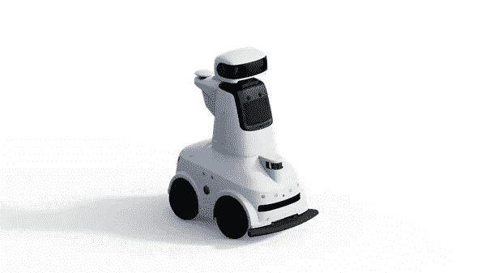

# 人工智能“取代”了人类

> 原文：<https://medium.com/nerd-for-tech/ai-replaces-human-f4ddfafbb902?source=collection_archive---------2----------------------->

[https://www.robot-china.com/news/202111/04/68095.html](https://www.robot-china.com/news/202111/04/68095.html)

人工智能的一个本质使命是把人类从复杂、重复、低价值的劳动中解放出来，比如用起重机代替人工搬运，用扫地机器人代替家庭清洁。服务机器人的推出，尤其是安全巡逻机器人，也有助于完成一些服务性、重复性、甚至是危险性的任务。

自 2013 年以来，中国已成为世界上最大的机器人市场，并有可能在未来 10-15 年内保持这一地位。据我们了解，与国家政策的持续支持密切相关。提出未来十年 AI 机器人的环境感知、自然交互、自主学习、人机协作将实现技术突破，智能家庭服务机器人、公共服务机器人实现量产应用。

同时，人口老龄化进一步催生了智能服务机器人市场。随着劳动人口的减少，劳动力成本增加、劳动力红利消失等问题逐渐被提上日程。

在政策和市场的相当推动下，资本市场和科技巨头参与竞争。“机器换人”的发展速度和探索进度正在逐步加快。

## **安全巡逻机器人**

近年来，公司在智能社区、智能园区、工业检查、电力检查、社区安全和其他场景中成功推出了多条机器人产品线。

比如阿里云安全巡逻机器人，实现了人工智能自动化巡逻巡查。智能巡检设备用于工业园区、社区、广场、景区等大空间公共场所。，具有无人值守、环境监控、视频巡检、远程通信、AI 分析等多种可定制功能。为了更好地适应多种场景，阿里云安全巡逻机器人还有机结合了数字孪生技术，AR 技术。此外，还引入了元宇宙的概念。配备了 AR 套件，机器人观察到的所有信息都可以通过 80 英寸的虚拟屏幕及时呈现给安保人员。

## **医疗机器人**

在医学放射科，每天有数百张 CT 图像。负责的医生需要长时间集中精神才能发现可疑病变。一般来说，每幅图像的阅读时间在 5 到 15 分钟之间。AI 辅助分析系统的帮助可以将读取时间缩短到 1 分钟，提高了效率，并帮助医生提高诊断的准确性，在更早的时间捕捉微观病变。

科学家正在研究“更聪明”的类脑智能，这种智能受大脑神经和认知行为机制的启发，可以通过大数据模拟人脑训练。更接近人类的认知行为和智力。如果把类脑智能应用到放射科，它可以通过学习人类积累的实践经验，形成自己的扫描规则。它将提高医生的诊断、治疗效率，以及在回顾患者的检查时的准确性。

## 人工智能对高质量数据的依赖

人工智能行业有一个重要共识:

训练数据的质量直接决定了最终 AI 模型的性能。数据的可伸缩性和准确性越高，算法就越稳健。

随着 AI 商业化进程的加快，以及辅助驾驶、客服聊天机器人等 AI 技术在各行各业的应用，人们对特殊场景下的数据质量的期望越来越高。高质量的标签数据将是人工智能公司的核心竞争力之一。

如果说之前的算法模型使用的一般数据集是粗粮，那么算法模型目前需要的是定制的营养餐。如果公司想要进一步提高某些模型的商业化，他们必须逐步从通用数据集向前发展，以创建独特的数据集。

# 结束

将你的数据标注任务外包给 [ByteBridge](https://tinyurl.com/4dxyr3mk) ，你可以更便宜更快的获得高质量的 ML 训练数据集！

*   无需信用卡的免费试用:您可以快速获得样品结果，检查输出，并直接向我们的项目经理反馈。
*   100%人工验证
*   透明标准定价:[有明确的定价](https://www.bytebridge.io/#/?module=price)(含人工成本)

**为什么不试一试？**

来源:

1 https://www.robot-china.com/news/202111/04/68095.html

2 https://www.robot-china.com/news/202111/04/68114.html