# 人工智能搜索算法及实例

> 原文：<https://medium.com/nerd-for-tech/ai-search-algorithms-with-examples-54772c6d973a?source=collection_archive---------0----------------------->

## 人工智能搜索算法在解决现实问题中的应用


图 1([作者](/@pawara73)的作品)

寻找已知的东西叫做“搜索”,与我们所说的寻找未知的东西的“研究”相反。顾名思义，人工智能搜索算法的职责也是搜索。解决问题是搜索的一个直接应用。在人工智能搜索算法的帮助下，可以为现实世界的问题制定有效和高效的解决方案。

在深入研究算法之前，首先，我们应该了解一个问题的本质和一些相关的术语。一般来说，一个问题由 4 个主要部分组成，如状态、动作/操作、目标、路径。简而言之，问题解决可以被定义为一个过程，该过程包括沿着一条或多条路径通过动作或操作将一组状态转换为一个目标。

## **状态空间**

状态空间由所有可能的状态以及解决特定问题的动作组成。在状态空间的图形表示中(例如树)，状态由节点表示，而动作由弧线表示。任何状态空间都有一个初始“开始”节点和一个结束“目标”节点或多个目标状态。从初始开始节点到最终目标节点的路径被称为特定问题的“解决方案”。

> **注意:**一个问题可能有多个目标和路径。

## *问题 01:*

为了清楚地理解状态空间，考虑下面的问题[图 2]。

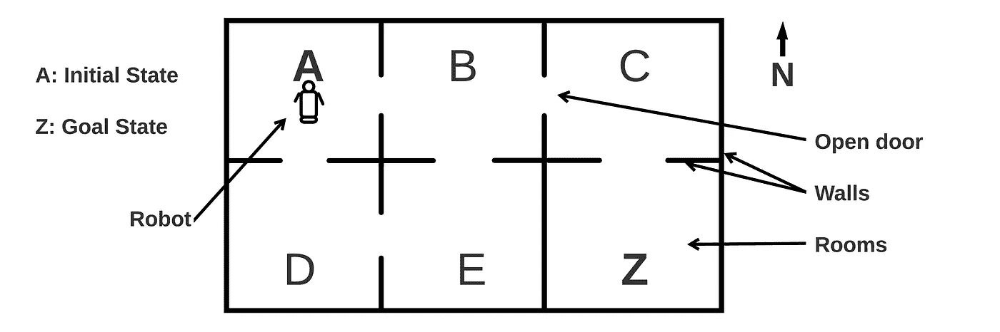

图 2:例题(图片由[作者](/@pawara73)设计)

想象有一个机器人在房间‘A’(初始状态)，它需要去房间‘Z’(目标状态)。如果我们考虑机器人在每个房间(节点)的所有可能运动，我们可以用树的形式画出一个状态空间。例如，当机器人处于初始状态 A 时，他可以去 B 或 d。当机器人移动到下一个状态 B 时，他可以移动到 C、E 或回到 A[图 3]。

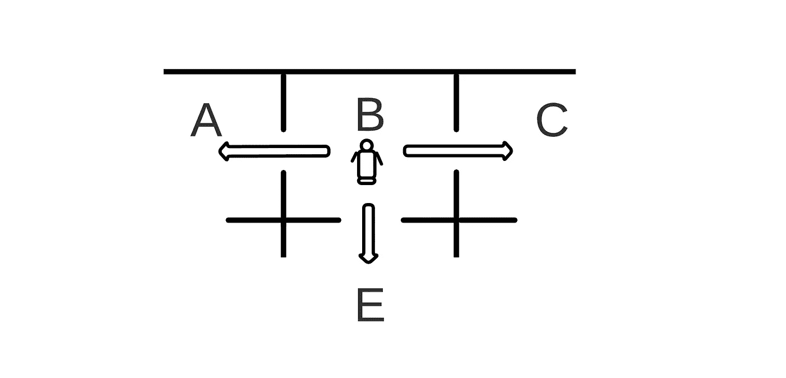

图 3:机器人在状态 B 的可能路径(图片由[作者](/@pawara73)设计)

基于机器人在每个状态下的所有可能运动，我们可以为上述场景绘制状态空间，如下所示:

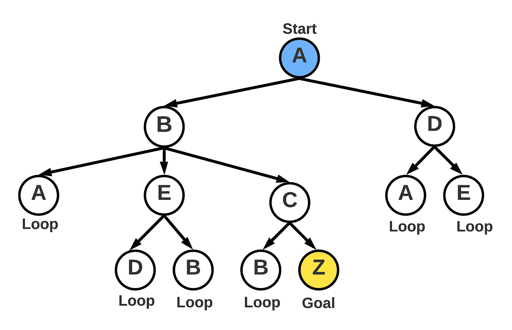

图 4:状态空间图(图片由[作者](/@pawara73)设计)

除了直接路径 A、B、C、z 之外，我们还可以识别许多路径。

```
Ex: A B C Z
    A B A B C Z
    A D E B C Z
    A D E B A B C Z
    ....
```

可以观察到，一些路径较短，而另一些路径较长。真正的问题出现在这里。在上面的例子中，状态空间很小，我们可以算出最佳/最短路径。但是想象一个有几十万个节点的状态空间。我们如何探索这样一个状态空间？

解决办法无非是搜索算法。下一章，我们将讨论人工智能中的 08 大搜索算法。

# 搜索算法

由于状态空间通常非常大，我们采用搜索算法来有效且高效地在状态空间中导航。搜索算法定义了如何找到从初始状态到目标状态的路径(解)。不同的算法定义了从当前状态(节点)移动到下一个状态(节点)的不同方法。一些算法只提供探索状态空间的系统方法，而其他算法告诉如何有效和高效地探索。

搜索算法有两种类型，即无信息搜索算法和有信息搜索算法[图 5]。知情搜索算法仅提供了探索状态空间的系统方法，并且没有提供额外的信息来支持搜索过程。广度优先搜索、均匀搜索、深度优先搜索、深度受限搜索、迭代深化搜索和双向搜索是 06 种主要的无信息搜索算法。

另一方面，诸如贪婪搜索和 A*搜索算法的信息搜索算法是基于附加信息的，这使得搜索过程既系统又有效。

> **注意:**有一些人工智能搜索算法不属于上述任何一个主要类别。因为，有些问题不需要特定的路径来解决，而是关注搜索过程是否能达到目标状态。在应用搜索解决这类问题时，我们只需在附近找到最佳可用节点(局部搜索)，或者在竞争环境中搜索(对抗性搜索)。
> 
> 一些游戏，像国际象棋，爬山，某些设计和时间安排的问题。

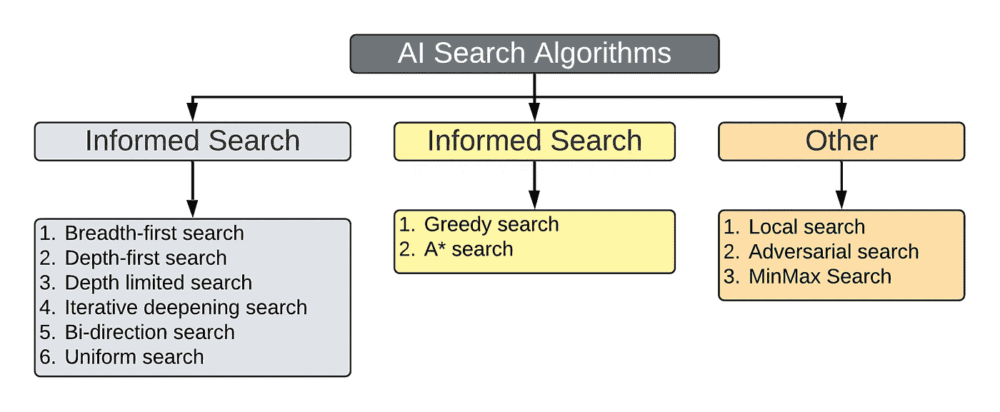

图 5:人工智能搜索算法分类(图片由[作者](/@pawara73)设计)

## **搜索算法评估标准:**

我们采用了 4 个标准来评估上面提到的每种搜索算法的性能。它们是:

1.  **完备性:**在有解的情况下找到解的能力(算法在到达状态空间的任何目标节点/末端之前，不应遗漏任何节点)。
2.  **最优性:**找到最高质量解的能力(算法应该先找到较浅层次的目标节点)。
3.  **时间复杂度:**算法处理节点需要多长时间。(算法的执行时间/ CPU 时间)
4.  **空间复杂度:**算法使用多少内存来存储节点。

为了理解上述算法的应用，首先考虑下面的场景。接下来，我们将应用每种搜索算法来找到解决方案，并根据提到的评估标准比较性能。

## 问题 02:

如何在健身房选择合适的一套运动器材，节省时间，燃烧最大的热量？

“健身房里充满了不同的运动器材，它们的卡路里燃烧率各不相同。锻炼时，重要的是覆盖全身，而不是身体的一部分。选择恢复时间最短的锻炼方法可以减少锻炼的总时间以及对身体的损害。因此，选择正确的运动器材来燃烧目标卡路里，并让整个身体都参与到运动过程中来，并且最不容易造成伤害是很重要的。该场景基于表 1 中给出的信息和状态空间(图 6)。”

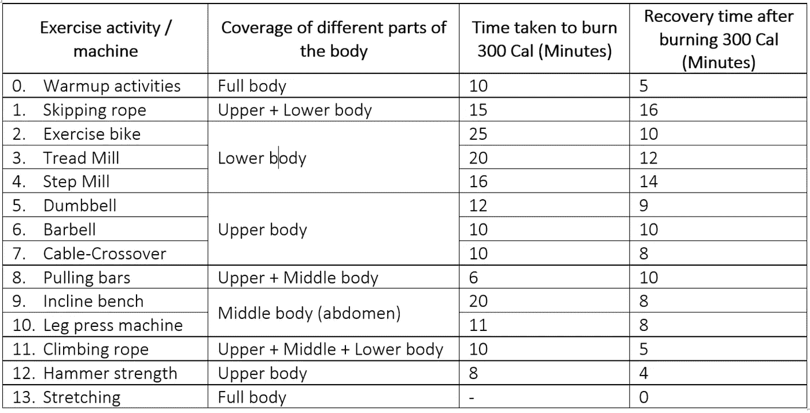

表 1:不同的运动器材与卡路里消耗的对比(由[作者](/@pawara73)设计)

```
**Path Cost:** Time taken to burn 300 Cal (minutes)
**Heuristic Value:** Recovery time required after burning 300 Cal (minutes)
```

> **注意:**路径成本和启发值的单位相同。

基于上述信息，绘制了以下状态空间图[图 6]。这是一个有多个路径但只有一个目标节点的问题。下图包括路径成本和启发式值。但是请注意，只有某些算法需要额外的信息。沿着每条路径，全身部分(上半身、下半身和下半身)都包括在内。

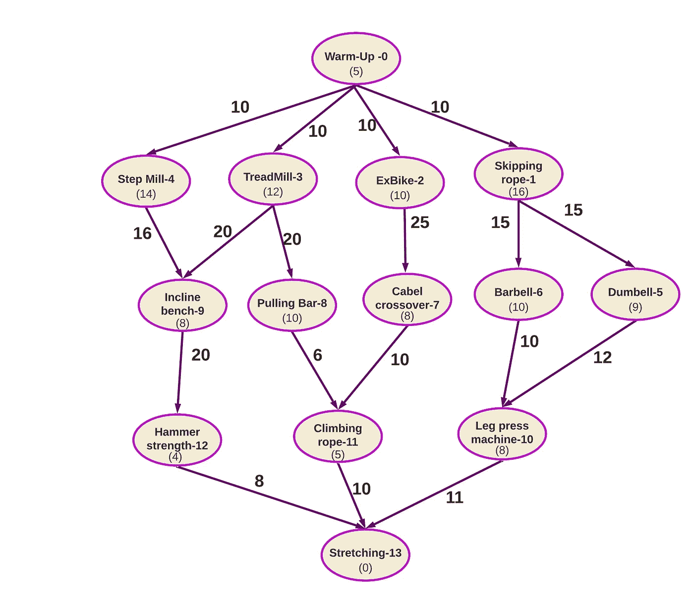

图 6:问题 02 的状态空间(图片由[作者](/@pawara73)设计)

现在我们将讨论无信息和有信息搜索算法的特征，同时将它们应用于上述状态空间。

> **注意:**为了实现搜索，通常我们使用两个列表来存储开放节点(要访问的节点/边缘节点)和关闭节点(已经访问的节点)。

为了演示每个算法，我使用了一个在线模拟工具:[AI Search(Ali-elganzory . github . io)](https://ali-elganzory.github.io/AI-Search/)

# 1.不知情的搜索算法

不知情搜索算法遵循系统的方式在状态空间中进行探索，并且不使用额外的信息(启发式)

## 1.1 广度优先搜索(BFS)

顾名思义，BFS 算法逐层探索状态空间[图 7]。当我们探索一个节点时，子节点总是被添加到开放列表的末尾。当从 OPEN 中删除要添加到 CLOSED 中的节点时，检查它是否是目标节点，如果是，则停止。

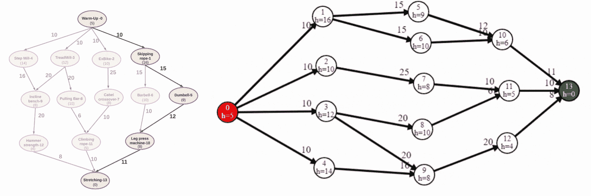

图 7:广度优先搜索中的状态空间(左)和状态空间遍历(右)(图片由[作者](/@pawara73)设计)

```
**Path:** 0, 1, 5, 10, 13
```

遍历在封闭列表中。但是开放列表和封闭列表一起增加了空间复杂度，因为存储在存储器中的节点总数是开放列表和封闭列表的总和。

由于开放列表中目标节点以外的节点不被处理，BFS 的时间复杂度只与封闭列表中的节点数有关。由于状态空间是逐层探索的，如果有解，那就**肯定**找到了。因此 BFS 是完整的。BFS 是最优的，因为较浅层次的目标节点首先被找到。

在 BFS 中，具有分支因子‘b’并且找到的目标节点的级别为‘d’的状态空间的空间复杂度为 **O( *bᵈ⁺* )** 。时间复杂度是 **O( *bᵈ* )** 因为虽然内存包含来自‘d+1’的节点，但是‘d’以外的节点不在 BFS 中处理。

## 1.2 深度优先搜索(DFS)

在 DFS 中，状态空间是沿着分支深度方向探索的。它沿着每个分支检查目标节点。

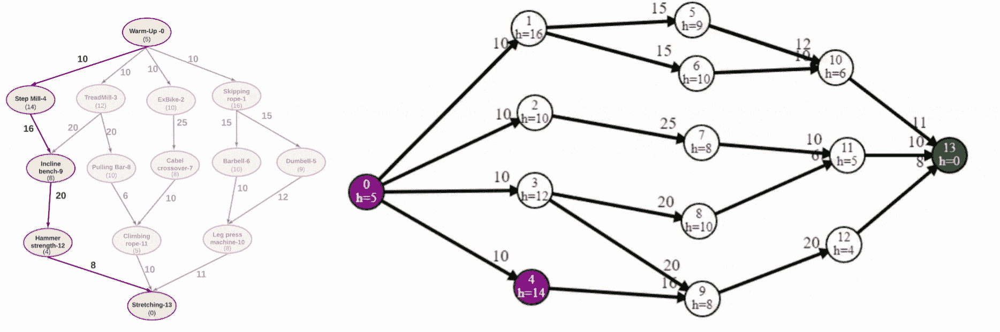

图 8:深度优先搜索中的状态空间(左)和状态空间遍历(右)(图片由[作者](/@pawara73)设计)

```
**Path:** 0, 4, 9, 12, 13
```

因为 DFS 在较浅层次的目标之前识别较深层次的目标，所以它不是最佳的。DFS 也不完整。因为，如果在状态空间中的一个分支中有一个循环，即使我们可以沿着另一个分支找到目标节点，由于这个循环，我们仍然不能到达那个分支。

令人惊讶的是，DFS 的内存使用率非常低。它只存储沿着分支的节点，因此在每一层中存储最小数量的节点，而不像在 BFS 中，所有的节点都存储在每一层中。在最坏的情况下，如果具有分支因子“b”的搜索树的最大深度是“m”，那么 DFS 的空间和时间复杂度分别是 **O( *bm* )** 和 **O( *bᵐ* )** 。

## 1.3 深度限制搜索(DLS)

在 DFS 中，您会注意到它不是最佳的，即:如果目标出现在较浅的级别，则不会首先被发现。如果我们给搜索的深度设定一个极限会怎么样？在 DFS 中，我们可以设置深度限制，这样就不会搜索超出该树的内容。所以，如果目标是在一个较浅的层次，那么就很快找到了。但是如果目标超出了我们设定的水平呢？这也是我们的示例场景中发生的事情[图 9]。在这里，深度被设置为 3 级，但是目标节点在 4 级，所以搜索将永远无法找到目标节点。

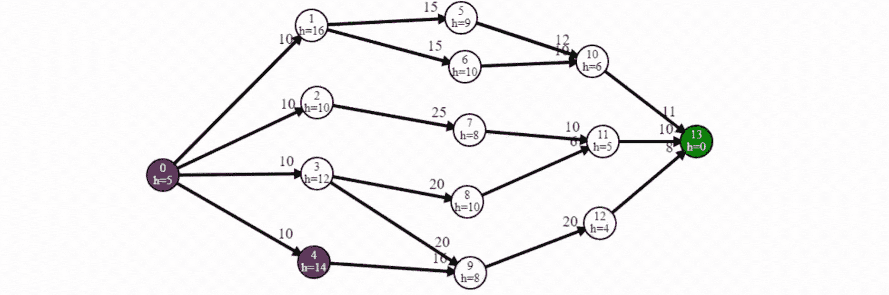

图 9:状态空间遍历深度受限搜索(图片由[作者](/@pawara73)设计)

```
**Path:** Not found
```

在 DLS 中，它既不完整也不是最优的，因为不是图中的所有节点都被检查，并且不能有效地找到目标节点。如果我们为具有分支因子‘b’的状态空间设置深度极限‘l’，那么 DLS 的空间和时间复杂度将分别为 **O( *bl* )** 和 **O( *bˡ* )** 。

## 1.4 迭代深化搜索(IDS)

在 IDS 中，我们迭代地增加深度限制并执行 DFS，直到找到目标节点。使用 DFS 有助于减少存储节点的内存使用。并且由于如果目标节点处于较浅的级别(最优)，则状态空间被迭代地探索(逐层)，所以在深入之前首先找到它，并且完全检查一层中的所有节点(完整性)。

因此，IDS 兼有 DFS(占用较少的存储空间)和 BFS(完全和最优)的优点，并且消除了 DLS 所面临的问题。下面的动画展示了在 IDS 下遍历状态空间的过程[图 10]。

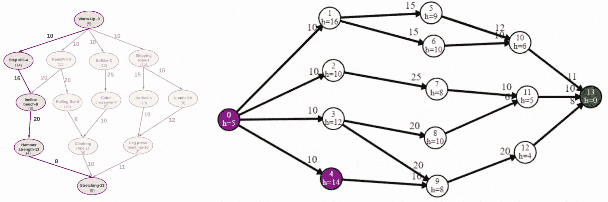

图 10:迭代深化搜索中的状态空间(左)和状态空间遍历(右)(图片由[作者](/@pawara73)设计)

```
**Path:** 0, 4, 9, 12, 13
```

## 1.5 双向搜索(BDS)

如果我们同时运行两个 BFS 搜索算法，则应用 BDS:一个是从“开始节点”向前到“目标节点”,另一个是从“目标”向后到“开始”,等待两个搜索在中间相遇。正因为如此，时间和空间复杂度都变成了那个 BFS 的一半的两倍(比 BFS 的 O( *bᵈ* )小得多)。对于具有分支因子‘b’和深度‘d’的图，BDS 的空间和时间复杂度用 **O( *bᵈ/* )** 表示。

> **注:**既然，2×o(*bᵈ/*)≈o(*bᵈ/*)，我们就用 O( *bᵈ/* )代替 2O( *bᵈ/* )

但是 BDS 不适用于像我们的例子这样的情况，一些子节点有多个父节点(例如:node-9 有 node-3 和 node-4 作为父节点)。因为向后搜索算法不能确定从多个父节点中跟随哪个节点。

## 1.6 统一成本搜索(UCS)

在 UCS 中，从一个节点到另一个节点的每个动作(边)都被赋予一个值。并且每个节点与从“开始节点”到特定节点计算的总路径成本相关联。在 UCS 中，考虑的是总路径开销，而不是深度。

类似于 BFS，我们扩展开放列表中最低成本的节点而不是最浅的节点。虽然在 BFS，图中的交叉连接被忽略，但在这里它们被考虑，因为每条路径都与一个值相关联。

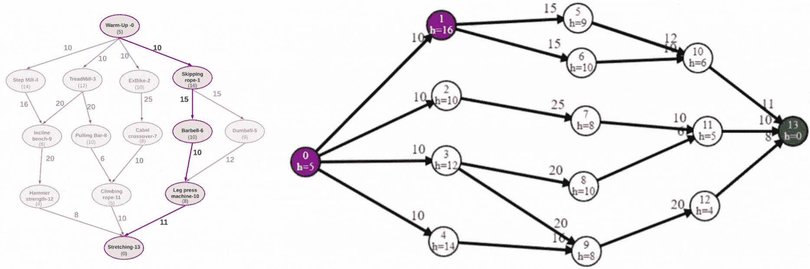

图 11:统一成本搜索中的状态空间(左)和状态空间遍历(右)(图片由[作者](/@pawara73)设计)

```
**f(n) = g(n)
 **    = Summation(total path cost to each node from start node)
 = (Node0-Node1)+(Node1-Node6)+(Node6-Node10)+(Node10-Node13)
     = 10 + 15 + 10 + 11
     = 46 (path cost)
**Path:** 0, 1, 6, 10, 13 (Path with the least path cost)
```

根据我们的场景，上面只计算了最低成本路径。在动画[图 11]中，您可以观察到遍历与 BFS 非常相似，但考虑到了成本。因此，UCS 是完全最优的，其时间和空间复杂度与 BFS 相似，分别为 **O( *bᵈ* )** 和 **O( *bᵈ⁺* )** 。

# 2.知情搜索算法

在知情搜索算法中，使用附加信息来使搜索更加高效和有效。这些额外的信息被称为**启发法**。启发式不是理论，而是一些常识性的经验，比如信息。

**例如:** *如果你开车在两个城市之间旅行，启发式的将是交通水平。(直接路径成本将是两个城市之间的距离。城市间的位移和交通等附加信息被视为启发式信息)*

在知情搜索算法中，为了找到接下来要访问的最佳节点，我们使用一个*评估函数* **f(n)** 来帮助子节点决定接下来要访问哪个节点。然后，我们遍历到具有最小 f(n) 值的下一个节点。根据 f(n ),我们有两种搜索算法，贪婪搜索和 A*搜索算法。

## 2.1 贪婪搜索算法

在贪婪搜索中，考虑子节点的启发值。通过计算具有最低启发值的节点的路径来确定路径。另一个需要注意的事实是，通常初始节点的启发值最高，目标节点的启发值最低。但是也有例外，比如为初始节点获取一个中间值。

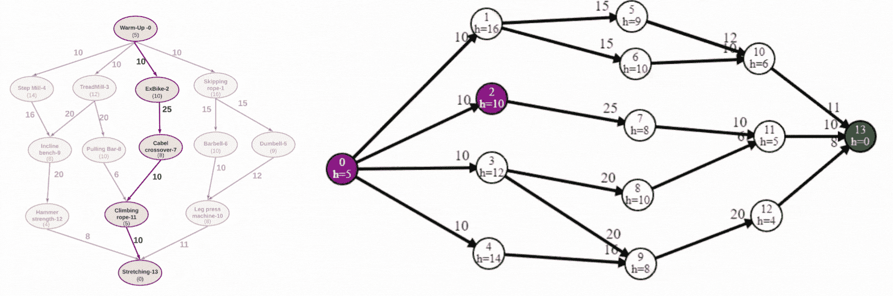

图 12:贪婪搜索中的状态空间(左)和状态空间遍历(右)(图片由[作者](/@pawara73)设计)

```
**f(n) = h(n)** = Summation(Heuristic values of nodes)= Node0 + Node2 + Node7 + Node11 + Node13
     = 5 + 10 + 8 + 5 + 0
     = 28
**Path:** 0, 2, 7, 11, 13
```

在贪婪搜索中，您可以看到我们没有访问特定节点的所有子节点。我们找到每个子节点的试探法，只有具有最低值的子节点被插入到要处理的开放列表中。因此贪婪搜索是不完整的。同样，这也不是最佳路径(不是最短路径——我们在统一成本搜索中找到了这条路径)。因此，贪婪搜索也不是最优的。作为解决方案，我们不仅要考虑启发值，还要考虑路径成本。A*算法来了。

## 2.2 A*搜索算法

在 A*算法中，我们同时考虑了路径成本和启发式算法。在 A*中，f(n)函数包括两个部分:路径成本[g(n)]和启发式值([h(n)]。节点“a”的 f(n)值可计算如下:

```
f(n)ₐ = g(n)ₐ + h(n)ₐf(n)ₐ = Evaluation value at the particular node (node 'a')
g(n)ₐ = Total path cost from start node to particular node(node 'a')
h(n)ₐ = The heuristic value of the particular node(node 'a')
```

现在，我们将根据上一个问题的 A*搜索算法找到最佳路径。我们必须找到每个节点的 f(n)值，并选择具有最小 f(n)值的子节点，然后遍历直到遇到目标节点。在这个例子中，只提到了路径中目标的 f(n)值。

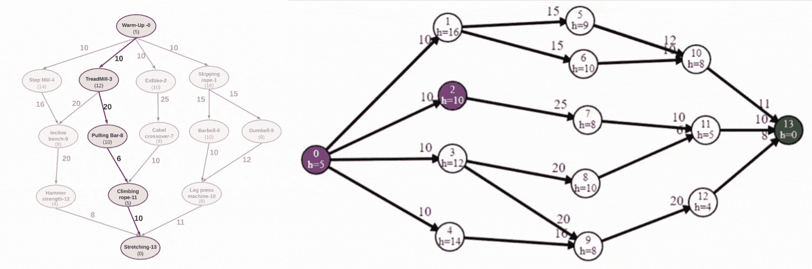

图 13:a*搜索中的状态空间(左)和状态空间遍历(右)(图片由[作者](/@pawara73)设计)

```
At Node-0 :
    f(n)₀ =  0 +  5 = 5
At Node-3:
    f(n)₃ = 10 + 12 = 22
At Node-8:
    f(n)₈ = 30 + 10 = 40
At Node-11:
    f(n)₁₁ = 36 + 5 = 41
At Node-13:
    f(n)₁₃ = 46 + 0 = 46

f(n)ₜₒₜₐₗ = f(n)₀ + f(n)₃ + f(n)₈ + f(n)₁₁ + f(n)₁₃ = 154**Path:** 0, 3, 8, 11, 13
```

A*算法是完整的，因为它在到达目标节点/状态空间的末端之前检查所有节点。这也是最优的，因为考虑到路径成本和启发式值，因此可以用 A*找到具有最低启发式的最低路径。A*的一个缺点是，它将处理的所有节点都存储在内存中。因此，对于分支因子‘b’和深度‘d’的状态空间，A*的空间和时间复杂度由 **O( *bᵈ* )** 表示。A*的时间复杂度取决于启发值。

# 搜索算法比较综述

每种有根据的搜索算法的概要可以总结如下。

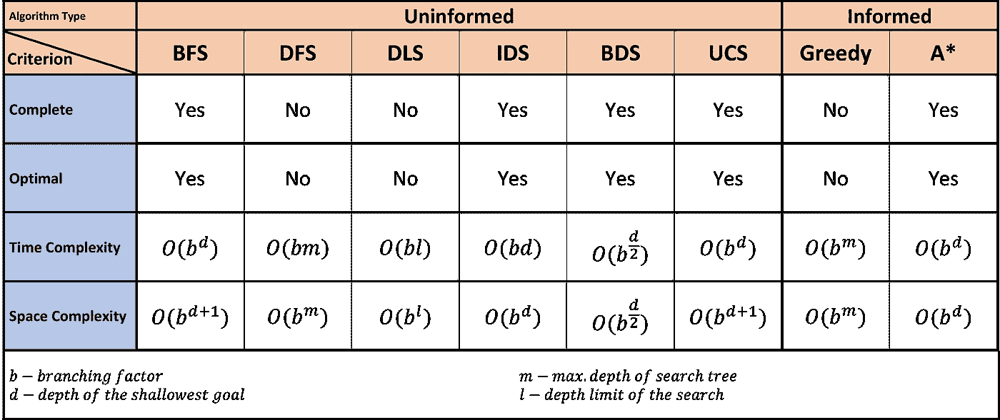

表 2:04 主要评价标准下的搜索算法比较(由[作者](https://pawara73.medium.com/)设计)

> **注:**如果状态空间图的分支因子是有限的，则所有的 BFS、IDS、BDS(如果算法可以双向应用)、UCS 都是完备的。如果算法可以应用于两个方向，并且步骤成本相同，则 BDS 是完整的。

# **结论**

在知情搜索算法中，基于启发式值来执行状态空间上的探索，但是在知情搜索中，特别是以特定于算法的系统方式来执行探索。

当考虑无信息搜索算法时，如果状态空间中的每个子节点只有一个父节点，则在完整性、最优性、时间复杂度和空间复杂度方面最佳的搜索算法是双向搜索算法。但是如果子节点多于父节点，则在状态空间中双向搜索是不适用的，它是 IDS 算法，因为它是最优的、完全的，空间复杂度是(bm)的量级，时间复杂度是(bᵈ)的量级，这与其他算法类似。

最佳搜索算法是 A*，因为它是最优的、完整的并且采用了额外的信息(启发法),所以解决方案优于其他算法。

# 参考资料:

[https://www . CIN . ufpe . br/~ TF L2/artificial-intelligence-modern-approach . 9780131038059.25368 . pdf](https://www.cin.ufpe.br/~tfl2/artificial-intelligence-modern-approach.9780131038059.25368.pdf)

[http://www . ccpo . odu . edu/~ klink/reprings/PDF/Wikipedia nav 2018 . PDF](http://www.ccpo.odu.edu/~klinck/Reprints/PDF/wikipediaNav2018.pdf)