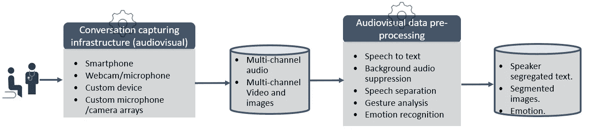
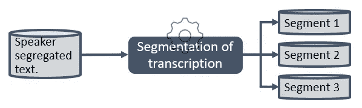
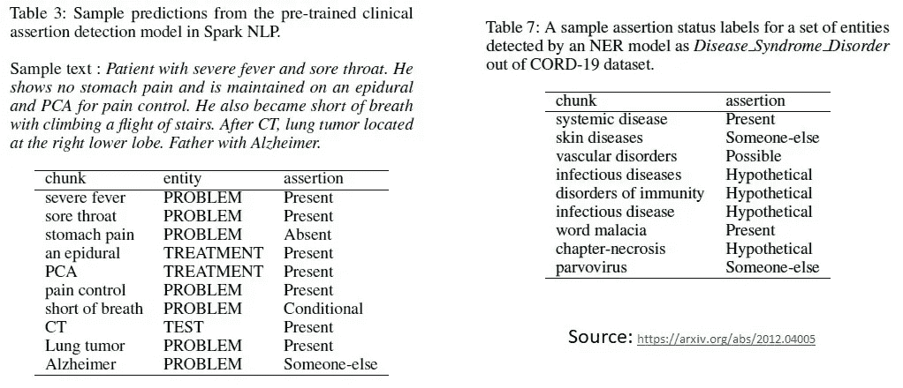
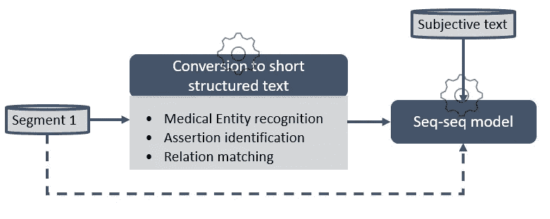

# 人工智能系统设计:面向医生的自然语言处理

> 原文：<https://medium.com/nerd-for-tech/ai-system-design-nlp-for-doctors-5a78eb6621d1?source=collection_archive---------18----------------------->

来源:Getty Images

不得不承认，上面那个未来派的 AI 医生有点吓人！但是不用担心，在这篇文章中，我们将讨论 NLP 如何帮助现在的医生们的日常生活。作为 AI/ML 从业者，即使在实现一个小的子系统或算法时，整体考虑最终产品也是很重要的。在某些情况下，如果对收集输入数据的方式稍作调整，您可能不需要万亿参数模型。看起来需要深度神经网络复杂问题可以分解成两个小的决策树子问题。我们试图证明，在这个系统设计的产品，帮助医生跟踪病人与医生的对话。

医生一天中最乏味的部分之一是记录他们与病人的对话，并将其归档在电子健康记录中(EHR)。医生花在这类文档上的时间高达 35%。虽然这是对医生时间的非生产性使用，但记录每一次医患互动是非常重要的，因为这是患者护理的一部分。传统上，医生自己键入这些交互或使用专业的医疗转录服务，这既昂贵又容易出错。我们提出了一个人工智能系统，它可以捕捉医生和病人的互动，并产生一个 SOAP 报告。

**什么是 SOAP 报告？** SOAP 是主观、客观、评估和计划的缩写。该报告记录了医患互动中所有重要的内容。

**主观**:患者对症状、病史的描述以及任何其他与就诊原因相关的信息。
**目标**:医生观察或测量的信息，如体重、身高、脉搏、体温、呼吸、肿胀、肤色等。目标中还包括已完成的诊断测试的结果。
**评估**:这是医生综合“主观”和“客观”信息做出的初步诊断。这取决于建议测试的待定结果。
它还说明了为治疗患者而采取的任何附加步骤。这一部分帮助未来的医生理解下一步需要做什么。
*详细 SOAP 格式:*[*https://www.ncbi.nlm.nih.gov/books/NBK482263/*](https://www.ncbi.nlm.nih.gov/books/NBK482263/)

**这个产品的目标是捕获医生和病人的对话，并从中生成一个 SOAP 报告。**

为了更好地理解问题的复杂性，下面是一个示例音频文件、原始转录和医生生成的 SOAP 报告。
[原始音频文件](https://drive.google.com/file/d/1Cgzp2scqzEsUs4tXmEQ1gQaLqfKmmMLW/view):::::[转录](https://sites.google.com/view/aitranscription/transcription):::::[SOAP](https://sites.google.com/view/aitranscription/soap)

考虑到问题的复杂性，谨慎的做法是将系统分解成更小的可管理的子系统，并有明确定义的接口。SOAP 生成系统可以分为以下子系统:
1。**数据捕捉**
2。**数据预处理**
3。**为每个输出段建立管道模型**
a .主观
b .客观
c .评估
d .计划
4 .**推理和持续学习**

图 1:数据捕获和预处理

# **1。数据采集**

考虑到我们正在分析的问题的实用性，在不受控的环境中人们之间的对话，尽可能精确地捕捉信息是很重要的。从上面给出的转录来看，显然语音到文本的准确性非常低。考虑到这一点，图 1 显示了多模态数据采集和预处理的一些重要方面。
**分层精确的细分产品:**根据数据收集设备的复杂程度，可以向客户提供不同的产品，为不同的定价方案提供不同的服务质量。web 应用程序/智能手机应用程序/智能设备(音频+视频，可选择在医生办公室的不同位置放置多个连接的摄像头和麦克风阵列。例如:1 台设备位于医生咨询台，1 台设备位于检查床，4 台设备位于房间的四个角落)可以部署从多个设备聚合的数据。

# 2.数据预处理

从捕获的多模态、多流数据中，要提取的最重要的信息是说话者分离文本，该文本可以通过使用音频和视频信息更准确地实现，如在([1](https://arxiv.org/pdf/2101.03149.pdf))([2](https://arxiv.org/abs/2002.08933))中实现的(如果只有音频数据可用，可以使用)。其他预处理任务包括抑制来自其他说话者的音频，过滤掉非单词声音，以及将格式不良的句子转换成格式良好的句子。其他信息，如患者显示的身体部位、情绪等。也可以提取并用于下游任务。

# 3.为每个输出部分建立管道模型

我们可以采用三种方法来生成输出部分。
a .基于端到端学习的方法
b .基于语言规则的方法
c .混合(基于规则+学习)方法

在理想情况下，基于端到端学习的解决方案往往是最好的方法，因为它涉及到建立一个学习模型，该模型可以概括不同的数据变化，甚至可以处理最困难的情况。但是对于许多实际问题来说，建立一个端到端的学习模型可能是不可行的，这主要是因为没有足够的带注释的训练数据，并且因为很难构建复杂的深度学习模型来有效地学习手头的问题。如果可用的带注释的数据至少是 50K-100K 个示例，则端到端学习方法往往工作得很好，并且当带注释的数据>约 1M 训练示例时，执行得非常好。

自然语言处理中传统的基于语言规则的方法对于定义明确的数据很有效，不会出现意外的极端情况。它们需要高水平的人类专业知识来设计规则，并且倾向于使系统复杂并且难以扩展。

对于输出摘要生成问题，端到端学习方法和混合方法都值得尝试。

**端到端学习法:** 分析现有数据，医患对话转录长度为 1500 字，换算成约 2000 个标记，其中主观:~250 个标记，客观:250 个标记，评估:100 个标记，计划:150 个标记。因此，我们需要一个 seq-seq 模型，它可以在～3K-4K 令牌长度下有效地工作。当前 SOTA 序列-序列学习模型如 T5 ( [4](https://arxiv.org/abs/1910.10683) 和 GPT2 ( [5](https://cdn.openai.com/better-language-models/language_models_are_unsupervised_multitask_learners.pdf) )的一个主要限制是它们可以处理的最大序列长度。它们在 512–1024 令牌长度下工作得非常好。但是对于长序列(接近 4K 令牌的序列)，像 Transformer XL、Reformer、Big Bird ( [7](https://arxiv.org/abs/2007.14062) )和 Longformer ( [6](https://arxiv.org/abs/2004.05150) )这样的模型被证明工作良好。如果我们有足够大的训练数据(> 100K)，我们可以通过生成如下训练示例来训练 seq-seq 模型:
1。<转录> …。<主观> …
2。<转录> …。<目标> …
3。<转录> …。<评估> …
4。<转录> …。<计划> …
这些模型的准确性需要评估，因为它们仍在发展中。提高准确性的关键是将注意力集中在每个输出部分的生成上。在端到端学习算法中定位注意力的方法将是一个值得追求的方向。

**混合方法(端到端学习+规则):** 另一种方法是使用基于规则的分类器将输入数据分解成上下文片段，然后为每个片段训练 seq-seq 模型。在这里，我们可以制定 NLP 规则，将医生-患者转录分割成片段，这些片段可以通过不同的输出提示提供给 seq-seq 模型。我们可以使用诸如实体提取和分类、断言提取(肯定/否定意图提取)、关系提取等方法将输入的非结构化数据进一步转换为结构化文本，这些方法在摘要生成部分中有所描述。

图 2:转录分割

**转录分割:**分析转录数据，可以将对话分割成 3 个部分，如图 2 所示:
1 .第一部分:医生和患者之间的互动问答。
2。第二部分:体检时医生的叙述。
3。第三部分:医生讲述评估计划。

三部分分割可以使用简单的试探法来完成。第一部分基于对话的互动性，第三部分从医生说出评估计划开始，并持续交谈一会儿。第二部分介于这两个界限之间。我们可以添加更多的启发，如身体部位的话语，以加强第 2 部分的边界。

**3.a .主观部分生成:** 该部分多从医师与患者的交互问答中生成。如果对于大部分对话，段 1 +主观摘要的长度小于 1K 个标记，则可以如下直接生成训练示例，并且可以训练像 GPT2/GPT3 这样的生成模型来生成主观摘要:

训练举例: <segment>…。 <subjective>…</subjective></segment>

如果段 1 +主观摘要的长度对于大部分对话来说大于 1K 个标记，我们需要探索压缩段 1 数据的方法。几个选项可能是:
1。仅从对话中提取相关的结构化数据。使用类似( [8](https://arxiv.org/abs/2012.04005) 中描述的医疗实体识别模型，以如图 3 所示的结构化格式提取标记的实体(以及断言)。

图 3:带有标签的医疗命名实体识别模型

2.仅使用第 1 部分的患者回答。
3。将对话的医患问答对转换成单个信息句。医生:哪儿疼？病人:在我的鼻子里。转化句:嗓子疼。

**3.b .客观部分生成:** 该部分大多从片段 2 生成，片段 2 是医生在体检时的叙述。SOAP 报告中有明确的子部分，如头部、心血管等。如果 Segment 2 +客观长度> 1K，我们可以探索将 Segment 2 细分成各个身体部分句子的可能性。我们还可以遵循与上面第 3.a 节中呈现的类似的方法，用于从片段 2 生成压缩的结构化文本，并使用它来构建 seq-seq 模型的训练示例。
训练示例:<第二段> …。<目的> …
训练示例:<片段 2:头部> …。<目标:头部> …

**3.c .评估生成:** 该部分主要从段 3 生成，是一个简短的医疗诊断。因为所有可能诊断都可能在训练数据中得到。这可以被构造为多标签分类问题，其中片段 3 作为输入，预定义的诊断作为类别标签。片段 3 也可以首先被转换成结构化文本，如 3.a 中所提到的，并用于构建分类器。这种方法的一个明显的问题是，训练数据中看不见的诊断永远不会被识别。

**3.d .计划生成:** 该部分主要从 3 段生成，将遵循 3.a 中提到的类似方法

图 4:通用 SOAP 部分生成管道

以下是系统设计过程中需要注意的其他几个方面。
**数据分析:** 1。检查数据的一致性，是否可以按照**转录本分段:**中所述，将其分成 3 个明确的分段。
2。在转录的 3 个不同片段中记号长度的最大和百分位数分数。
3。输出摘要的不同部分中令牌长度的最大值和百分比分数。
4。转录中患者反应标记长度的最大值和百分位数。
5。医生提问和患者回答的最高分和百分位数。

**评估生成输出的准确性:**尽管流行各种自动化度量标准，如困惑、BLEU、ROUGE、BLEURT、GEM、GENIE 等。手动评估(非常耗时，并且需要领域专业知识)是衡量生成的输出的准确性的最可靠的方法。

# 参考资料:

1.VISUALVOICE:跨模态一致性的视听语音分离[https://arxiv.org/pdf/2101.03149.pdf](https://arxiv.org/pdf/2101.03149.pdf)

2.Wavesplit:通过说话人聚类的端到端语音分离[https://arxiv.org/abs/2002.08933](https://arxiv.org/abs/2002.08933)

3.生物医学命名实体大规模识别[https://arxiv.org/pdf/2011.06315v1.pdf](https://arxiv.org/pdf/2011.06315v1.pdf)

4.用统一的文本到文本转换器探索迁移学习的极限【https://arxiv.org/abs/1910.10683 

5.gp T2[https://cdn . open ai . com/better-language-models/language _ models _ are _ unsupervised _ multask _ learners . pdf](https://cdn.openai.com/better-language-models/language_models_are_unsupervised_multitask_learners.pdf)

6.龙前:长文档转换器[https://arxiv.org/abs/2004.05150](https://arxiv.org/abs/2004.05150)

7.大鸟:更长序列的变形金刚[https://arxiv.org/abs/2007.14062](https://arxiv.org/abs/2007.14062)

8.通过 Spark NLP[https://arxiv.org/abs/2012.04005](https://arxiv.org/abs/2012.04005)提高对新冠肺炎研究的临床文档理解