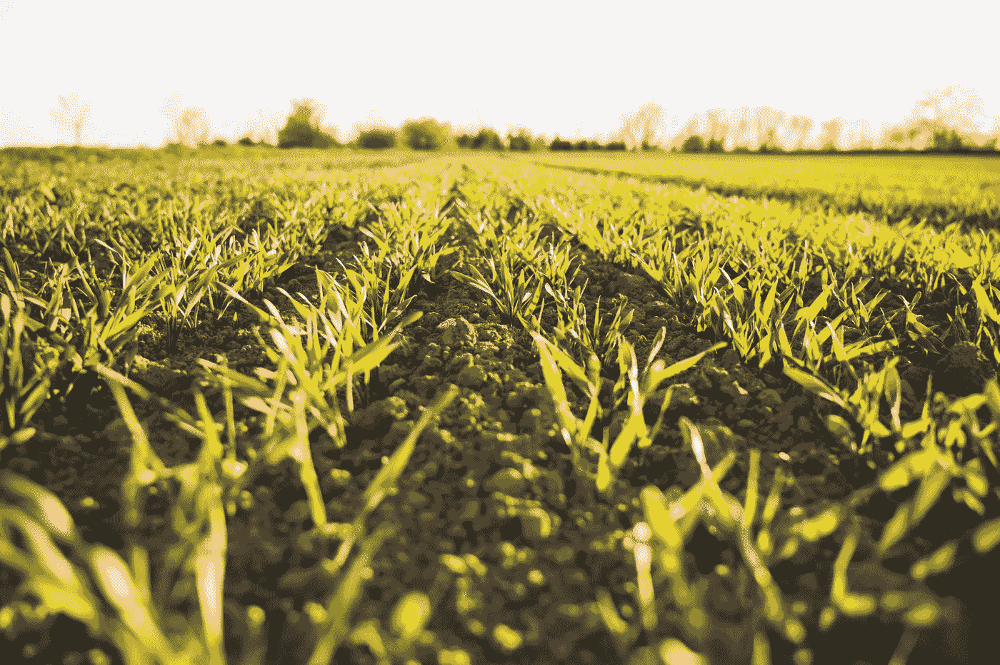

# 人工智能技术助力农业，未来可期——第二部分

> 原文：<https://medium.com/nerd-for-tech/ai-technology-to-help-agriculture-the-future-can-be-expected-part-2-497aec60ed3d?source=collection_archive---------5----------------------->

## “农业”——最有前景的人工智能和人工智能应用场景之一

想象一下，在这些大规模的农业区域中，至少有 40 个基本过程需要同时跟踪、突出显示和监控，这些区域通常以数百英亩为基本规划单位。有一些具有重大现实意义的重大问题，有望由 ML 解决，包括深入分析天气变化、季节日照差异、掌握鸟类和昆虫的迁徙模式、了解特殊肥料的使用、为作物选择正确的农药、监测种植和灌溉周期。迄今为止，**作物生产越来越依赖于卓越的数据收集和分析**。

首先，人工智能和基于机器学习的监控系统用于跟踪每个农田的实时视频记录，以识别动物或人类的违规行为，并立即发出警报。

AI 和 ML 可以降低牲畜或野生动物意外毁坏作物或闯入偏远地区农场的可能性。随着视频分析中算法的快速发展，参与农业生产的每个人都可以保护自己的田地和设施。视频监控系统可以轻松升级，以适应大规模农业作业，覆盖整个农场。随着时间的推移，监控系统可以被编程和训练来识别人和车辆。

作为一站式人工智能平台的领导者，沈燕科技已经证明，这些技术可以有效地保护远程设施，优化作物生产，并识别场上意想不到的入侵者。

其次，AI 和 ML——通过实时无人机传感器数据和数据的可视化分析，改善作物产量预测。

通过智能传感器的实时视频流和无人机捕捉的数据，农业专家可以访问以前无法获得的新数据集。研究人员现在可以结合水分、肥料和自然营养水平等传感器数据，分析每种作物随着时间的推移如何生长。机器学习负责整合大数据集，并根据约束条件提出建议，以优化作物产量。实时视频分析可用于帮助农民获得改善作物健康和每英亩产量的新见解。无人机已经被证明是一个非常可靠的平台，可以收集与特定肥料、灌溉和农药处理对实际作物产量的影响相关的数据。

## 标签数据集:从一般数据集到唯一数据集

如果说之前的算法模型使用的一般数据集是粗粮，那么算法模型目前需要的是定制的营养餐。如果公司想要进一步提高某个模型的商业化，他们必须逐步从通用数据集向前发展，以创建独特的数据集。

## 结束

将你的数据标注任务外包给 [ByteBridge](https://tinyurl.com/58hayp9m) ，你可以更便宜更快的获得高质量的 ML 训练数据集！

*   无需信用卡的免费试用:您可以快速获得样品结果，检查输出，并直接向我们的项目经理反馈。
*   100%人工验证
*   透明标准定价:[有明确的定价](https://www.bytebridge.io/#/?module=price)(含人工成本)

## 为什么不试一试？

来源:https://www . 163 . com/dy/article/gthk 2 djv 0552 ofb 6 . html