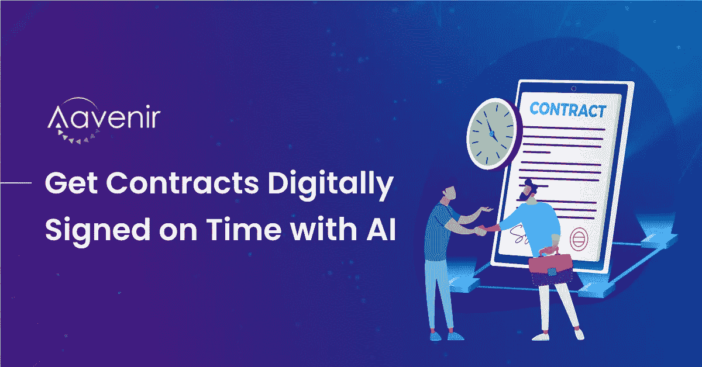
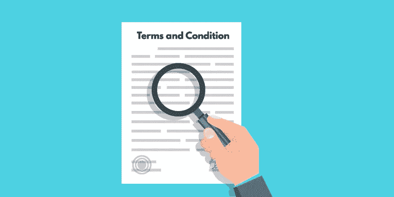
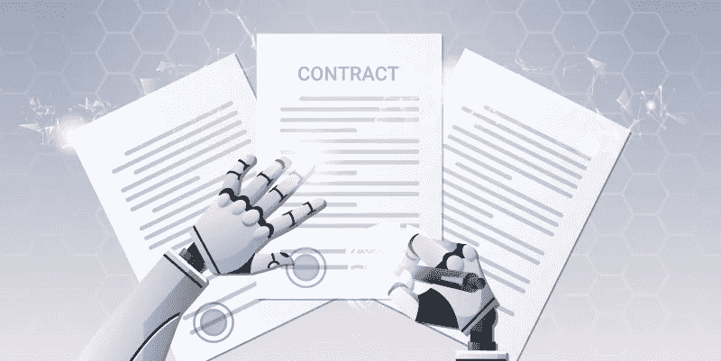

# 人工智能将克服管理合同的挑战&按时获得数字签名

> 原文：<https://medium.com/nerd-for-tech/ai-to-overcome-challenges-of-managing-contracts-getting-digitally-signed-on-time-c8fcc2b16ed8?source=collection_archive---------23----------------------->

当您不得不管理跨越多个办公地点、地理区域或语言的合同时，合同管理的复杂性会激增。您的法律部门努力帮助您跟踪您的合同和协议。合同生命周期管理软件允许您通过提取重要信息来轻松管理您的合同。

使用人工智能，你的整个法律团队可以策划合同的每一个细节，这样他们就可以一起工作，更有效地管理你的合同，无论合同有多复杂，只需点击几下鼠标。如果不加组织，法律文件会很快变得乱七八糟。

根据 Gartner 的预测，到 2024 年，法律部门将实现 50%与主要公司交易相关的法律工作的自动化

我们正处于一个时代的黎明，人工智能(AI)将被用来克服法律合同的挑战。基于人工智能的解决方案的实施将有助于信息孤岛的管理，这是大多数法律合同管理系统中的一个基本挑战。

[**Aavenir 的 ContractFlow**](https://aavenir.com/resources/clm-datasheet/) 帮你保持条理，轻松找到你需要的文件。Aavenir 的合同管理解决方案作为云上的 SaaS 解决方案提供，帮助企业从头到尾简化其法律工作流程，并摆脱手动流程和信息孤岛。合同专家和其他相关团队使用 Aavenir 系统来简化他们的工作，更快地交付结果，并更快地为他们的客户获得他们需要的合同。

# 缺乏对合同条款的了解

当涉及到到期合同及其续签时，缺乏可见性是一个主要问题。当你在处理大量的合同，但没有办法组织它们时，这就成了一个挑战。如果你看不到它，你就无法控制它。如果你不能证明你的合同交易获得了最大的价值，钱就会从你的指尖溜走。

[支持人工智能的合同生命周期管理](https://aavenir.com/servicenow-contract-management-software/)解决方案可以读取和分析最常见的合同文档文件格式。此外，它还提供了在一个位置跟踪和管理所有合同的能力。

# 管理合同并及时获得数字签名

公司失去客户和机会，因为他们的合同没有法律约束力。其中一个棘手的问题是必须会见客户并在纸质文件上收集签名。这是一个耗时的过程，浪费你的时间和客户的钱。法律专业人员的生活是忙碌的。如果你想跟上进度，你需要确保在严格的期限内工作。但是你并不孤单。你的同事，你的客户，甚至你的联系人都需要满足同样严格的期限。

使用 Aavenir 合同生命周期管理软件，您可以通过对法律文件进行数字签名来节省时间和金钱。Aavenir ContractFlow 简化了动态合同创建流程，有助于公司提高合同合规性。

# 您是否在寻找一种简单的方法来管理您的法律合同？

不再需要手动输入数据。不再有错误。别再找借口了。通过一次捕获所有信息，减少错误和信息孤岛。使用 ContractFlow 管理您复杂的法律合同，contract flow 构建于 ServiceNow 之上，可与您现有的所有系统集成，每天可为您节省大量时间。每次都创建最佳合同，并以最高级别的准确性和安全性管理您的法律文档。

*原载于 2021 年 6 月 3 日*[*【https://aavenir.com】*](https://aavenir.com/ai-to-overcome-challenges-of-managing-contracts-getting-digitally-signed-on-time/)*。*