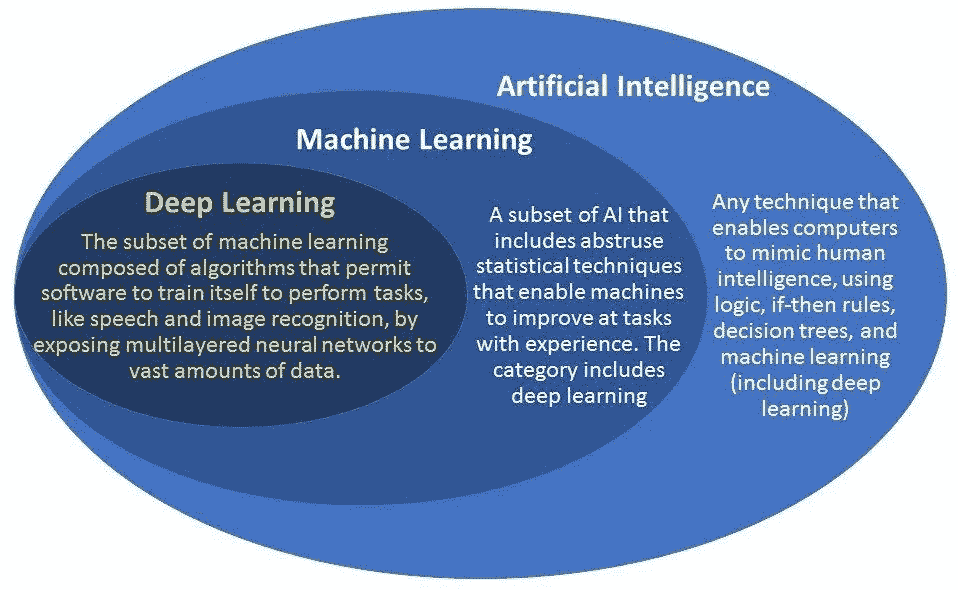
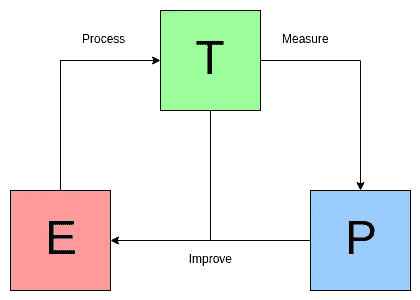
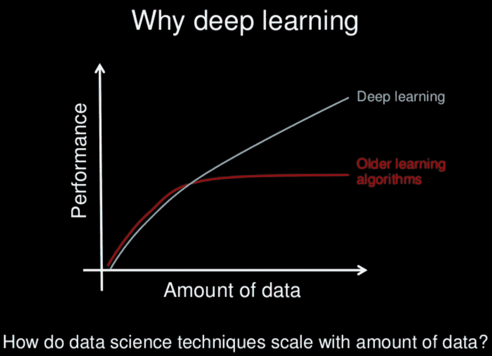

# AI vs .机器学习 vs .深度学习

> 原文：<https://medium.com/nerd-for-tech/ai-vs-machine-learning-vs-deep-learning-60b3d0611fe9?source=collection_archive---------1----------------------->

AI，机器学习和深度学习！这些流行语往往在对话中交替使用，导致它们之间的细微差别有些混乱。AI、机器学习和深度学习是如何相互联系的？人工智能是模仿人类智能的最广泛的科学和工程，包括机器学习和深度学习等子领域。实际上，深度学习也是机器学习的一个子集。下面是一个简单的图解视图，可以澄清这里的一些模糊之处！！

来源:https://www.geospatialworld.net/

让我们继续前进，探索他们之间到底有什么不同！

**什么是人工智能？**

艾伦·图灵的问题“机器能思考吗？”标志着人工智能的诞生在《计算机器与智能》中，谁向世界提供了图灵测试。人工智能是计算机科学和数据集的结合，能够解决问题。自 1956 年以来，人工智能的目标是让计算机执行人类能够独特地完成的需要智能的工作。这个术语本身表示机器展示了人工智能。今天，围绕人工智能的宣传期待着像自动驾驶汽车和改变世界这样的创新！

**什么是机器学习？**

研究人员发现，由于硬编码算法和基于规则的系统，在早期阶段用人工智能技术解决图像识别等问题很困难。它提供了模仿人类如何学习的途径，而不仅仅是模仿人类的行为。机器学习背后的想法是，让算法从数据中学习，提高预测的准确性！

汤姆·米切尔(Tom Mitchell)在《机器学习》(machine learning)一书中对机器学习的定义是:

*“机器学习领域关注的是如何构建能够随着经验自动改进的计算机程序的问题”*

他还提供了一个简短的形式主义:

“对于某类任务 *T* 和性能测量 *P* ，如果由 *P* 测量的计算机程序在 *T* 任务中的性能随着经验*E*而提高，则称该计算机程序从经验 *E* 中学习

来源:[https://www.kdnuggets.com/](https://www.kdnuggets.com/)

我们可以用它作为模板来决定需要收集什么数据(E)，软件应该做什么决定(T)以及我们如何评估结果(P)。

机器学习在企业关键增长指标的决策中发挥着至关重要的作用。经典的机器学习需要人类专家来决定区分不同数据输入的特征，并且需要结构化数据来学习。

**什么是深度学习？**

当研究人员想到模仿人脑时，深度学习的想法出现了。它本质上是一个模拟人脑行为的多层神经网络。

[吴恩达](https://medium.com/u/592ce2a67248?source=post_page-----60b3d0611fe9--------------------------------)将深度学习描述为:

*“利用大脑模拟，希望:*

*–让学习算法变得更好、更容易使用。*

*——在机器学习和人工智能方面取得革命性进展。*

我相信这是我们迈向真正人工智能的最佳机会。

为什么要深度学习？(由[吴恩达](https://medium.com/u/592ce2a67248?source=post_page-----60b3d0611fe9--------------------------------)滑动)

你可能想知道当深度学习是机器学习的子集时，它与机器学习有什么不同。算法学习的方式是关键的区别。深度学习通过数据呈现给系统的方式来区分自己，需要比机器学习需要更多的数据，但机器学习需要结构化数据，深度学习依赖于神经网络，并且机器学习比深度学习需要更少的训练时间。与机器学习不同，深度学习能够在没有人工干预的情况下自动进行特征提取。

希望你现在对人工智能、机器学习和深度学习的定义和关键区别有一个清晰的了解。留下来了解更多信息！