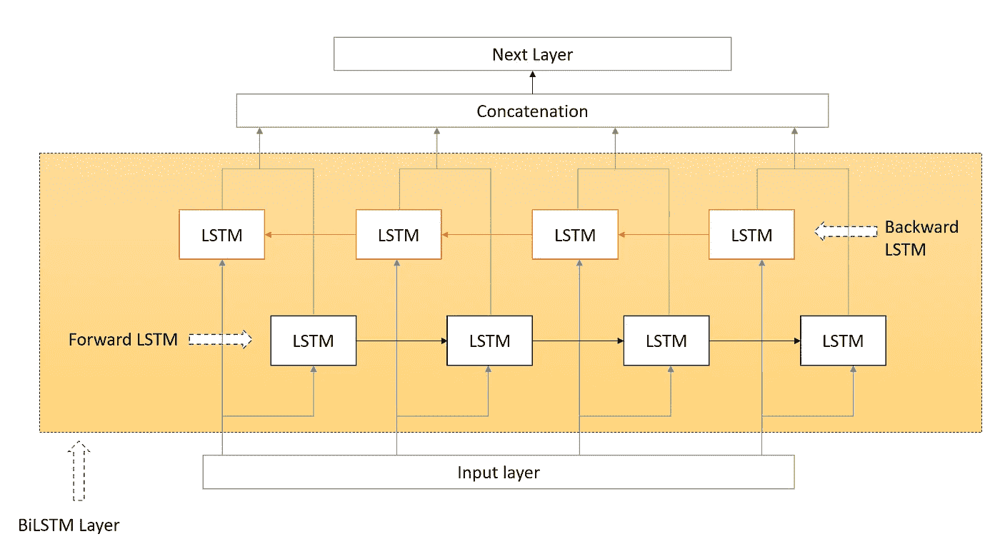
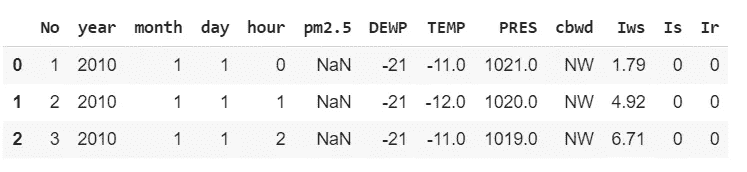
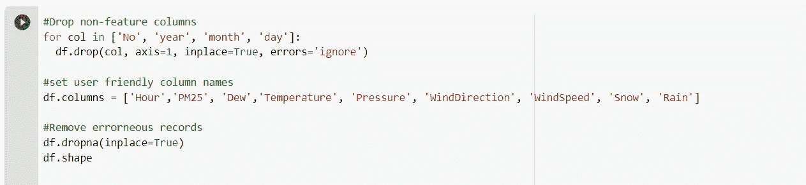
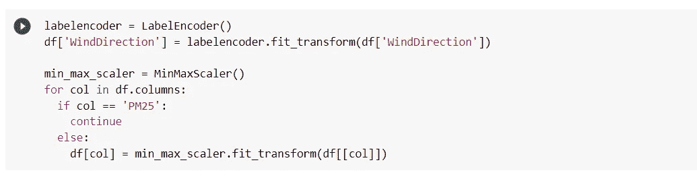
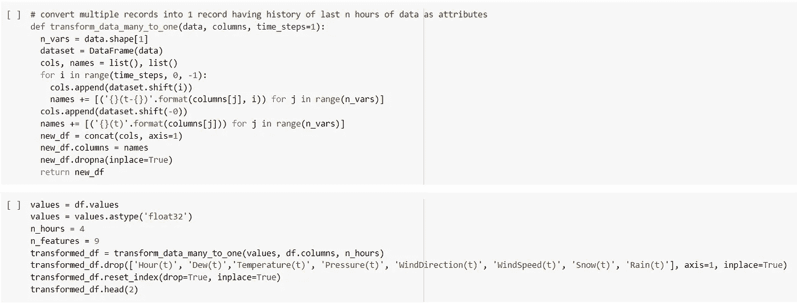
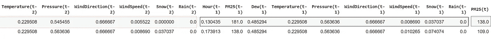
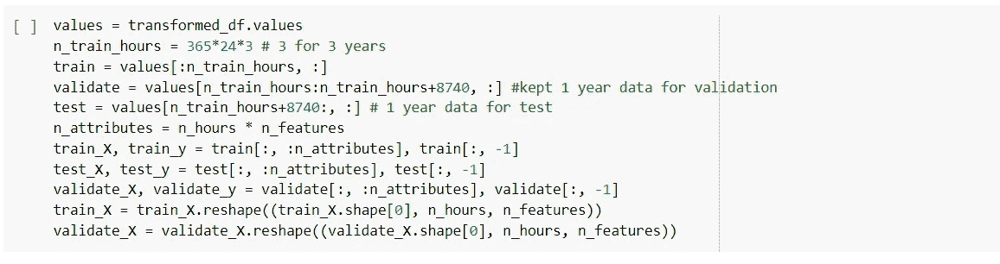
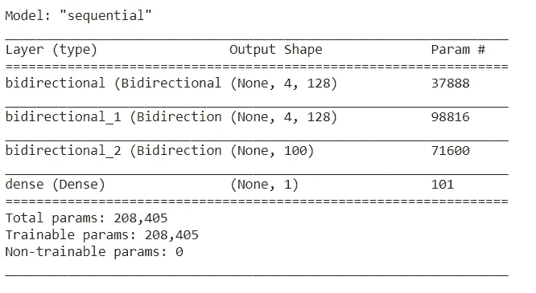
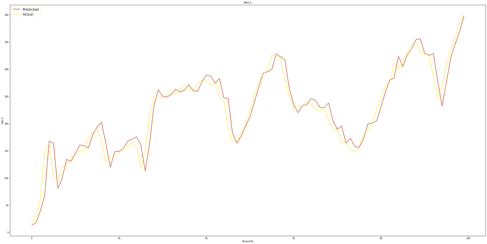

# 用双 LSTM 预报空气污染水平

> 原文：<https://medium.com/nerd-for-tech/air-pollution-level-forecasting-with-bi-lstm-a459e0619338?source=collection_archive---------0----------------------->

巴勃罗·加西亚·萨尔达尼亚在 [Unsplash](https://unsplash.com/s/photos/direction?utm_source=unsplash&utm_medium=referral&utm_content=creditCopyText) 上拍摄的照片

在我之前的[帖子](/the-innovation/lstm-introduction-in-simple-words-fe544a45f1e7)中，我讨论了 LSTM，在这篇帖子中，我们将看到一个长短期记忆算法的变体(BiLSTM)的实现。双向 LSTM 从时间序列数据两个方向学习/更新权重。下图解释了同样的情况。

我们将研究北京 PM2.5 数据集。该数据集包含 2010 年 1 月 1 日至 2014 年 12 月 31 日期间美国驻北京大使馆 PM2.5 水平的每小时数据。数据集的前三行如下。

我们将预测空气污染水平，所以这个问题是回归型的。先说数据准备。

特征转换。

编码和缩放后的数据如下所示。

LSTM 模型需要形状输入(样本、时间步长和特征)。因此，下面的代码将过去四个小时的数据转换为一行，其中包含过去四天的所有属性以及下一小时的 PM2.5 值。

在转换之后，我们得到了以下形状的数据集。我们有 37 个属性(9 个特征 x 4 个时间步长+下一个小时的 PM2.5)。

转换后的数据现在被分成训练、验证和测试数据集。

神经网络创建。

> model = tf.keras.Sequential()
> 
> model . add(TF . keras . layers . bidirectional(TF . keras . layers . lstm(64，activation= '卢瑟'，return_sequences=True)，input_shape=(n_hours，n_features)))
> 
> model . add(TF . keras . layers . bidirectional(TF . keras . layers . lstm(64，activation= '卢瑟'，return_sequences=True)))
> 
> model . add(TF . keras . layers . bidirectional(TF . keras . layers . lstm(50，activation= '卢瑟'))
> 
> model . add(TF . keras . layers . dense(1))
> model . compile(optimizer = ' Adam '，loss='mse '，metrics=['accuracy'])

让我们看看神经网络的形状。

训练模型。

> history = model.fit(train_X，train_y，epochs=50，batch_size=72，validation_data=(validate_X，validate_y)，verbose=0，shuffle=False)

预测后，绘制预测与实际 PM2.5 水平的曲线图。测试数据(过去一年)的 RMSE 约为 19.57。

我们可以通过在 LSTM 之前添加一个 CNN 层来探索更多，并比较结果。希望这对你有帮助。