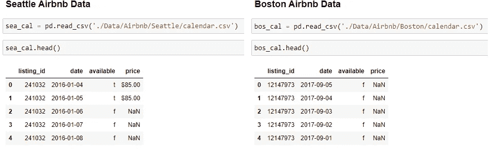
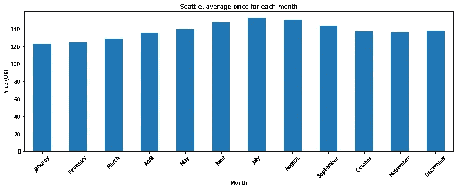
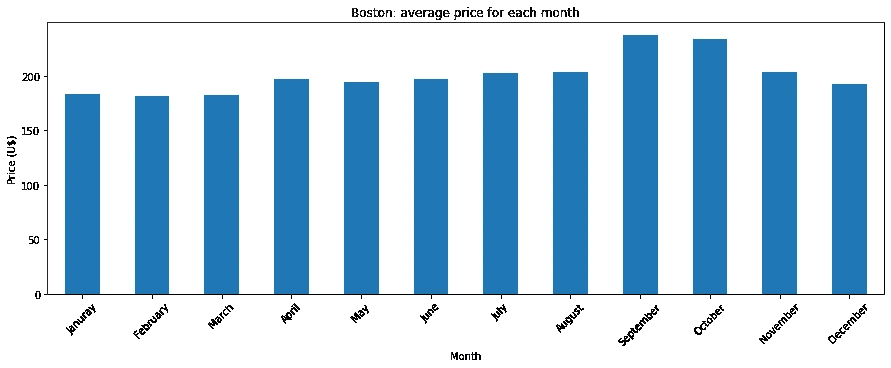
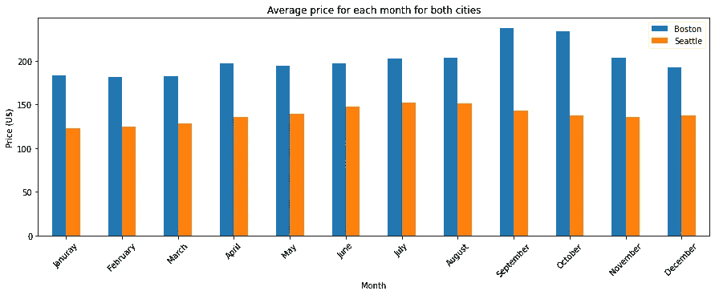
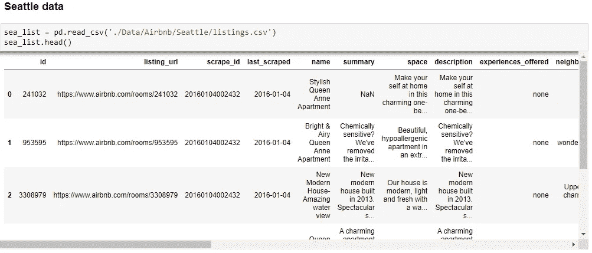
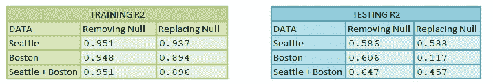
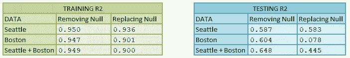

# Airbnb 数据分析—西雅图和波士顿

> 原文：<https://medium.com/nerd-for-tech/airbnb-data-analysis-seattle-and-boston-c9fca3e06707?source=collection_archive---------10----------------------->

# **简介**

作为一个喜欢去 T2 旅游的人，有一件事非常重要，那就是住宿的价格。作为一个有抱负的**数据科学家**和一个喜欢看从**数据**中能提取多少**信息的人，我找到了一种将旅行和数据这两个领域结合到一个小项目中的方法。**

我**分析了美国两个城市**西雅图**和**波士顿**的 **Airbnb** 的租房价格，以回答四个基本问题:**

**问题 1:** 每年的**时间** r 影响房租的**价格**吗？如果是这样的话，每个城市哪几个月最贵？

问题 2: 这两个城市的价格表现是否一致？

**问题 3:** 哪个城市更**贵**(均价更高):波士顿和西雅图？

**问题 4:** 我可以用提供的数据来**预测各个地方的价格**吗？

由[弗兰基·查马基](https://unsplash.com/@franki?utm_source=medium&utm_medium=referral)在 [Unsplash](https://unsplash.com?utm_source=medium&utm_medium=referral) 上拍摄的照片

该项目的**第一步**是加载和**分析**数据。本项目中使用的所有数据都可以在 **Kaggle** 网站中找到，我将在本文的**结尾**留下在哪里找到数据的**链接**，以及带注释的完整**编码**的链接。

# **问题 1**

要回答问题 1，有必要使用**日历**数据集。这个数据集包含一个**时间表**信息，包括在 Airbnb 平台注册的不同地方的**价格**，以及它们何时**可供**出租。

日历数据集中包含的数据示例

随着数据**加载**，需要**提取**每个月的平均**价格**。这是通过**按月分组**行和**计算**每个月的平均值来完成的。

使用**西雅图**数据，可以获得以下图表:

这张**图**显示，对于**西雅图**，当**夏季**临近时(六月、七月和八月)，价格开始上涨，在**七月**达到最大值。

夏季过后，价格趋于**降低**。

分析**波士顿**的数据，我能够得出以下图表:

另一张**图**显示，对于**波士顿**，**秋天**是这个城市接待更多**游客**的季节，导致价格**上涨**。与一年中的其他时间相比，九月和八月的价格要高得多，其中九月是最贵的。

# **问题 2**

如**之前的**分析所示，每个城市的价格在**不同的**季节有其**峰值**。对西雅图来说，最繁忙(也是最昂贵)的月份是夏季，而对 T42 来说，最繁忙的月份是秋季。

# **问题 3**

既然全年的价格行为已经众所周知，那么最大的问题是:哪个城市更昂贵？

约什·阿佩尔在 [Unsplash](https://unsplash.com?utm_source=medium&utm_medium=referral) 上拍摄的照片

回答这个问题的一个**简单的**方法是**比较**先前**创建的**图形。为此，我在每个数据集中添加了一列，**标识它所属的城市。然后，我**连接**它们来创建一个单独的数据集，包含两个**城市每个月的平均价格。

得到的**结果**图如下所示:

分析图表，很明显，在波士顿，在 Airbnb 租房子要贵得多。

# **问题 4**

为了回答这个**最后一个**问题，我使用了**列表**数据集。该数据集包含关于可用于租赁的**公寓**的信息，例如:对该公寓的**描述**，该公寓所在的社区，用户认证，诸如床位、卧室和浴室数量等特征，当然还有**价格**。

数据样本

## **清理数据**

在 [Unsplash](https://unsplash.com?utm_source=medium&utm_medium=referral) 上[创意交流](https://unsplash.com/@thecreative_exchange?utm_source=medium&utm_medium=referral)的照片

加载数据后开始模型开发的第一步**是**清理**数据。**

对数据的初步研究表明:

*   一些特征(比如评论的 url 或者 ID)不会聚集**信息**来预测一个值；
*   一些信息(如平方英尺)有太多的空值。

这些列将被丢弃。**两个**数据集将具有相同的**初始列**用于分析。

下一个步骤是处理**分类变量**和**变量**。首先，有些列，如 summary 和 description，有许多不同的值，被用 0 或 1 替换为**，以通知该行在这些列中是否有值。**

然后，对于**剩余的**分类特征(不包括娱乐设施),我**为每个**分类**列中的每个可能值创建了**新列。这些新列也填充了 0 和 1，以指示行**包含**的可能值。

**便利设施**一栏有关于每个**租赁**中可用的所有**项目**的信息，如电视、Wi-fi、厨房。因此，我采用了 **10 个最常见的元素**并创建了 10 个新列来显示该行是否存在这些元素，并从数据集中删除了 ameneties 列。

数据清理的最后一步是处理**缺失(null)** 值。**采用了两种**方法来处理这个问题，第一种是简单地**从数据集中删除**这些行，另一种是**用相应列的平均值替换**缺失的值。

下一步:模型开发。

马库斯·斯皮斯克在 [Unsplash](https://unsplash.com?utm_source=medium&utm_medium=referral) 上拍摄的照片

**进行了三项**分析来回答问题 4:

*   我可以只使用西雅图的数据来预测价格吗？
*   我可以只用波士顿的数据预测价格吗？
*   我可以用两个城市的数据预测价格吗？

价格的**预测**是一个**回归**问题:模型将尝试使用其他变量来计算价格值，以帮助它完成这项任务。

数据**将**分为两组:一组用于**训练**模型，另一组用于**测试**模型，比例为 70%训练，30%测试。为了分割数据，使用了 **scikit-learn** 库的功能 train_test_split。**价格**列(目标)与每组数据的其余部分分开**。**

为这个项目选择的**分类器**是**随机森林回归器**，这种类型的模型使用不同的决策树来确定输出，而不是只使用一个。

下一步是使用训练特征和训练价格来训练模型。模型定型后，测试数据用于查看模型对在定型阶段不存在的新输入的预测程度。

## 结果

最后，为了查看分类器**执行**的效果如何，有必要使用一些**统计**度量来计算性能，比如**均方误差、** **R2 分数**等等。在这个项目中，我使用 R2 分数作为性能的衡量标准。

每次分析的结果如下所示:

获得的结果:这些值是每组的 R2 分数。

如上所述，当使用西雅图的**和波士顿的**数据组合时，获得了最佳结果。出现这种情况的一个可能的**原因**可能是因为列表数据集中的**数据**的数量相当**小**，每个城市的注册不到 4000 个，并且存在许多变化(社区、住宿类型等)，因此**更多的**数据可以**提高**模型的性能。

此外，考虑到训练和测试结果中的巨大**差异**，模型正遭受**过拟合**。这意味着它正在很好地学习如何处理训练数据，但是当**新数据**被提供时，它在尝试预测价格时失败。

在 [Unsplash](https://unsplash.com?utm_source=medium&utm_medium=referral) 上由 [Miikka Luotio](https://unsplash.com/@mluotio83?utm_source=medium&utm_medium=referral) 拍摄的照片

解决**过拟合**问题的一个方法是使用**交叉验证**技术。对于这个项目，我使用了 **K 倍**方法，该方法将数据分为**训练**和**测试**K 次，对于**每次**，使用不同的数据对模型进行训练和测试。为 **K** 选择的值为 **5** 。

通过取 5 个**结果**的平均值获得**最终**结果。对于每个分析，结果如下图所示。

使用 K 倍交叉验证时的结果

# **结论**

对于这个项目，对于所做的所有分析，与简单地用列的平均值替换缺失值相比，删除空值是一个更好的选择。

即使**在**使用 K-Fold 交叉验证方法后，该模型在处理**新数据**时**仍然表现不佳。这可能是因为使用的数据量**不足以**使模型能够正确解释数据在数据库中的显示方式。**

一个**可能的**解决方案是**增加**数据库**中**的**数据量**，允许更多的样本用于模型开发。

此外，未被分析的不同特征可能被证明是模型价格的**预测**中的**重要**变量。

有很多**不同的模型**执行回归。在这个项目中，只测试了**随机森林回归器**。也许**另一个**模型，使用**相同的**数据，可以提供比这里获得的**更好的**结果。

感谢阅读，我希望你和我一样喜欢。

欢迎任何意见和建议。

**谢谢！**

# **链接:**

[**西雅图 Airbnb 数据集**](https://www.kaggle.com/airbnb/seattle/data)

[**波士顿 Airbnb 数据集**](https://www.kaggle.com/airbnb/boston)

[**代码带注释**](https://github.com/alerlemos/DataScienceNanoDegree_Udacity/blob/main/Project%201%20-%20Writing%20a%20Data%20Scientist%20Blog%20Post/Project%201%20-%20Airbnb%20Analysis.ipynb)