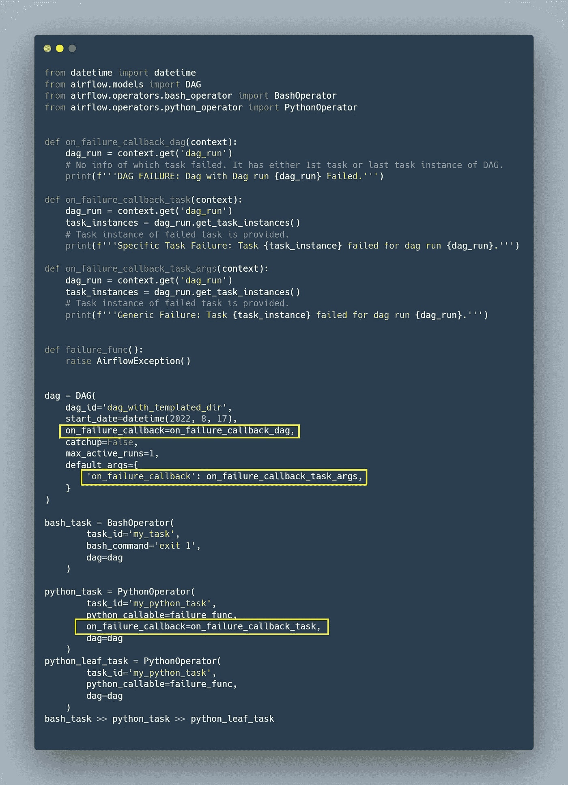
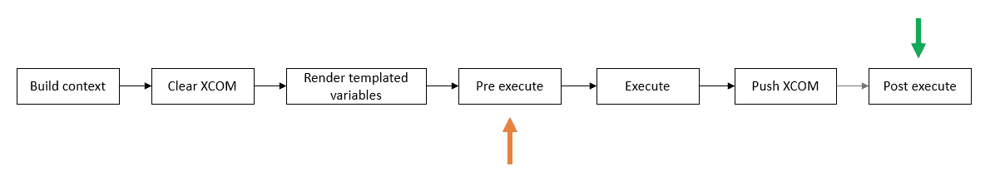
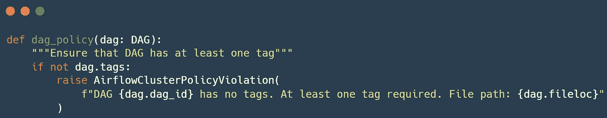
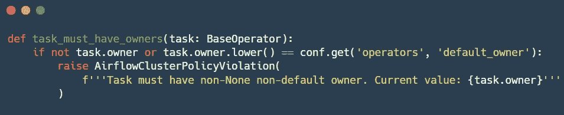
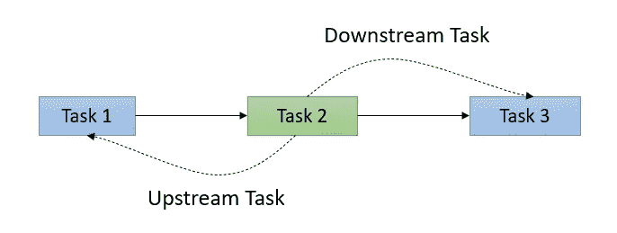
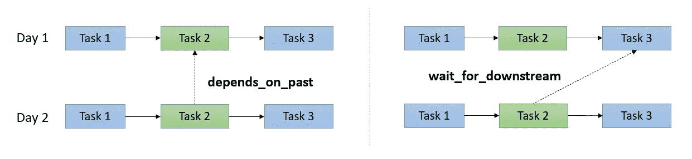
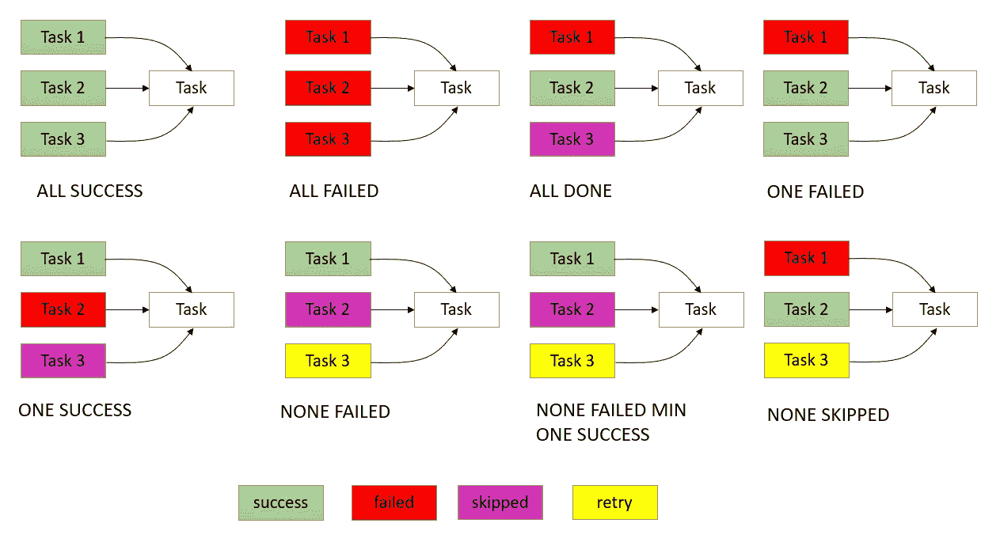

# 气流功能—回拨、触发和集群策略

> 原文：<https://medium.com/nerd-for-tech/airflow-features-callback-trigger-clsuter-policy-cc7f8022e7d3?source=collection_archive---------0----------------------->

较少讨论的气流特征

在这篇博客中，我们将讨论气流的以下特征

*   复试
*   集群策略
*   任务依赖性
*   触发规则

我们走吧！

## 复试

回调提供了一种对给定任务或 DAG 的状态变化进行操作的方式。使用回调有三种方式

1.  通过 DAG 初始化—所有叶任务完成后将调用操作/功能
2.  通过任务初始化—任务完成后将调用动作/功能
3.  通过默认参数，这些参数作为关键字参数传递给所有运算符

**有 5 大回调**

*   在执行回调时
*   在 _ 成功 _ 回调时
*   on _ 重试 _ 回调
*   打开 _ 失败 _ 回调
*   sla _ 错过 _ 回调

**操作员挂钩**

上面提到的回调是在任务/dag 级别定义的。气流在操作员级执行任务(操作员的 execute 方法)之前为某些操作提供了一种机制。我们有在实际执行函数之前被调用的钩子。

我们主要有三种类型的钩子。

*   pre_execute —这将在实际任务开始之前调用所需的函数。如果我们希望在不中断依赖关系的情况下跳过某些 dag 运行的某些任务，这可能会很有用。
*   post _ 执行
*   on_kill —用于清理线程或进程等资源。

## 集群策略

*   Dag 策略—作为 DAG 加载时间运行。

*   任务策略—作为 DAG 加载时间运行。

*   任务实例变异—这仅在调度任务时变异任务属性。如果您手动运行该任务，它不会生效。挂钩仅在创建 dag 运行时调用。突变就发生在任务执行之前。

## 任务相关性

在 DAG 中，节点是任务，依赖关系是有向边。边决定了我们如何在图中移动。从属关系是定义柔性管线的关键。

我们可以设置任务之间的依赖关系或者更精确地说是流水线流程，使用以下两种方法。

*   设置 _ 下游
*   设置 _ 上游

我们还可以设置 DAG 当前运行和之前运行中的任务之间的依赖关系。

*   **depends_on_past** —如果设置为 true，则当前 DAG 运行中的任务将仅在同一任务在先前运行中成功或被跳过的情况下运行。
*   **wait_for_downstream** —如果设置为 true，则当前运行中的任务将仅在同一任务在前一次运行中成功或被跳过并且前一次运行中的**直接下游**任务也成功或被跳过的情况下运行。

## 触发规则

*   **all_success(默认)**:如果所有上游任务都成功，则执行相关任务，否则跳过的任务将导致相关任务被跳过。`All upstream task == all successful up stream task`。
*   **all_failed:** 当所有上游任务都处于`failed`或`upstream_failed`状态时，依赖任务运行。
*   **all_done:** 所有上游任务执行完毕后，相关任务运行，成功、失败或跳过都无关紧要。他们一定已经被处决了。在这个案例中`all upstream task ≤ count of succeeded, failed, upstream_failed, skipped tasks`。
*   **one_failed:** 当至少一个上游任务失败时，相关任务运行(不等待所有上游任务完成)。
*   **one_success:** 当至少一个上游任务成功时，相关任务运行(不等待所有上游任务完成)。
*   **none_failed:** 依赖任务仅在所有上游任务都没有`failed`或`upstream_failed`时运行——即所有上游任务都有`succeeded` 或`skipped`。
*   **none _ failed _ min _ one _ success**:依赖任务只有在所有上游任务都没有`failed`或`upstream_failed`且至少有一个上游任务成功时才运行。
*   **none_skipped** :依赖任务仅在没有上游任务处于`skipped`状态时运行——即所有上游任务都处于`success`、`failed`或`upstream_failed`状态。
*   **总是**:依赖任务会随时运行。

快乐的工作流程！！！