# 气流(MWAA)——自动化数据仓库的 ETL

> 原文：<https://medium.com/nerd-for-tech/airflow-mwaa-automating-etl-for-a-data-warehouse-f5e50d14713c?source=collection_archive---------0----------------------->


[田宽](https://unsplash.com/@realaxer?utm_source=unsplash&utm_medium=referral&utm_content=creditCopyText)在 [Unsplash](https://unsplash.com/s/photos/duct?utm_source=unsplash&utm_medium=referral&utm_content=creditCopyText) 上拍照

Airflow 是一个开源的工作流管理平台。我们使用用 python 编写的 DAGs“配置为代码”来定义这些工作流。

Apache Airflow 在较高层次上具有以下相互通信的组件。

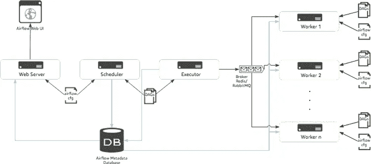

[来自 aws 博客](https://aws.amazon.com/blogs/machine-learning/build-end-to-end-machine-learning-workflows-with-amazon-sagemaker-and-apache-airflow/)

要运行 Airflow 的一个基本实例，我们需要一个 EC2/ECS 集群、一个 RDS 实例、workers、schedulers 和 web 服务器、EFS，以便让 Dag 可用于所有 worker 容器等。下图就是这样一个部署。

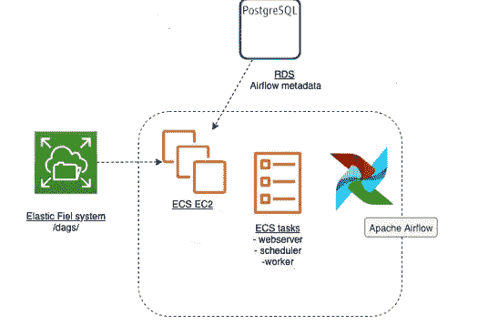

如上所述，我们有许多移动组件，我们必须自己管理所有这些组件。随着我们不断拥有复杂的设置和工作流程，这变成了一种痛苦。为了减轻痛苦，AWS 推出了一项托管服务——Amazon Managed Workflow for Apache air flow。这是一个完全托管的数据管道编排服务，简化了在 AWS 上运行开源版本的 Apache Airflow。下图描述了我们从 MWAA 得到的东西。所有工作器、调度器、队列、数据库、网络服务器都在 AWS 管理的 VPC 中，并且完全由 AWS 管理。

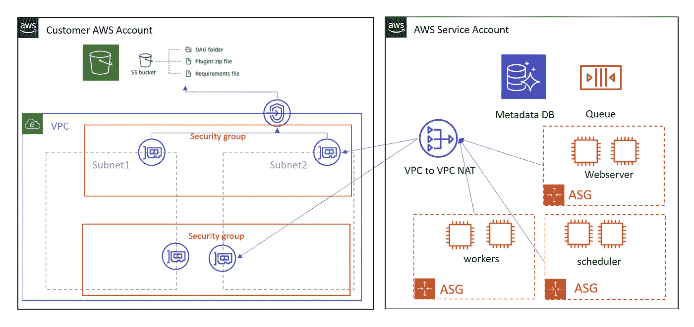

请注意，在上图中，在您的帐户中，MWAA 服务将创建一些 ENI(用于子网安全组对)。这类似于 lambda 网络(VPC 的 Lambda 与 ENI 的超平面)。在你的 AWS 账户中，你需要一个 S3 桶来存储 Dag 和气流补充工件(插件)。

在我们创建 MWAA 和运行任何东西之前，让我们复习一下气流概念:

## **网络服务器**

为用户和维护人员提供控制界面。气流 UI 是一个烧瓶+ Gunicorn 设置。它列出了 Dag、它们的运行历史、计划、暂停启动选项。这是一个我们可以管理气流管道的中心位置。它还处理 API。您可以通过设置`APP_THEME = "[theme-name].css"`(在`webserver_config.py`中的最后一行)并在此 处设置 [**列出的主题之一来应用自定义主题。**](https://github.com/dpgaspar/Flask-AppBuilder/tree/v1.12.1/flask_appbuilder/static/appbuilder/css/themes)

## **元数据库**

Airflow 使用 SQLAlchemy 库支持的数据库，例如 PostgreSQL 或 MySQL。这个 DB 为 UI 提供了动力，并充当工作器和调度器的后端。元数据数据库存储配置，例如**变量**和**连接**。它存储用户信息、**角色**和**策略**。它还存储 DAG 相关的元数据，如**调度间隔、任务、来自各种运行的统计数据**等。

## 调度程序

一个守护程序，使用 python 守护程序库构建。通过执行器在 worker 节点上调度和委派任务。还负责其他日常工作，如并发性检查、依赖性检查、回调、重试等。调度程序的三个主要组件是:

*   调度作业
*   DagFileProcessor
*   执行者

## 工人

这些是气流的主力。它们是执行任务的实际节点。

## **执行者**

执行者是“任务”的“工作站”。执行者充当中间人来处理资源分配和分发任务完成。对于执行者来说，在气流中有很多选择。执行器在调度程序内部运行。

> *顺序执行器
> 调试执行器
> 本地执行器(单节点 Arch)
> Dask 执行器
> 芹菜执行器
> Kubernetes 执行器
> 使用 Mesos 扩展(社区贡献)*

注意: **Executor 在内存中维护状态。**这可能会造成一些不一致。

MWAA 使用**芹菜执行器**。

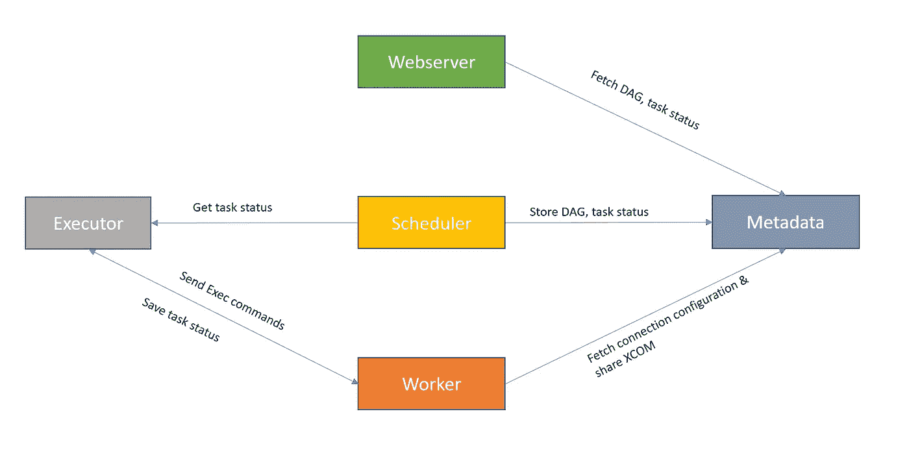

## 操作顺序

*   计划程序启动基于 Dag 的触发器(计划的或外部的)。
*   调度器加载 DAG 中的步骤/任务，并解析依赖性
*   调度程序将可运行的任务放在队列中。
*   工作人员从队列中选取这些任务并运行它们。
*   工人一旦完成任务，就更新任务的状态
*   基于任务的状态，决定总体 DAG 状态。

## 十克

有向无环图(DAG)是表示气流中的工作流的图形对象。它是任务的集合，以某种方式显示每个任务的关系和依赖关系。Dag 包含任务执行的上下文。在 MWAA，我们会把狗留在 S3。对于新的 DAG 文件，亚马逊 MWAA 大约需要一分钟时间来开始使用新文件。对于现有的 DAG 文件，识别对现有 DAG 文件的更新大约需要 10 秒钟。

## **操作员**

这些是 DAG 的构造块。它们定义了 DAG 将执行的实际工作。操作员决定任务的性质。它用一个 Python 类来表示，该类充当任务类型的模板。它们是幂等的。

> **BashOperator** —执行 bash 语句
> **PythonOperator** —运行 python 函数
> **spark submit operator**—spark-submit
> …

有三类操作符:动作、转移和传感器。

**任务** —操作员或传感器的实例。

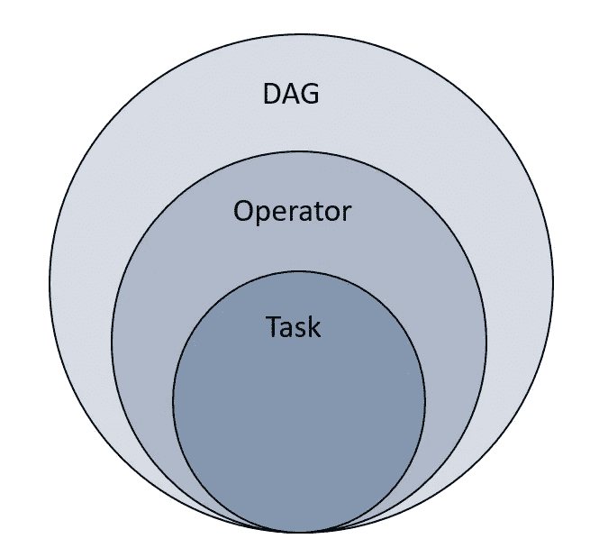

## 插件

插件被用作编写、共享和激活运行时自定义行为的简单方法。

```
__init__.py
    |-- airflow_plugin.py
hooks/
    |-- __init__.py
    |-- airflow_hook.py
operators/
    |-- __init__.py
    |-- airflow_operator.py
sensors/
    |-- __init__.py
    |-- airflow_sensor.py
```

注意:因为在 MWAA，我们不能直接访问工作人员处理任务的运行时。我们可以使用 requirement.txt 来安装可用的 python 模块。对于不可用的 python 模块或自定义模块，我们可以在本地压缩包，然后推送到 S3，然后在需要时使用它。

## **挂钩**

挂钩允许您将 DAG 连接到您的环境。这些意味着作为与外部系统交互的接口。我们可以创建一个 S3 连接，并使用 S3 钩子来获取连接信息并完成我们的任务。有各种各样的钩子(HTTP、Hive、Slack、MySQL ),社区还在不断增加钩子。

## **传感器**

传感器可以被描述为特殊的操作符，用于监视(轮询)长时间运行的任务、文件、数据库行、S3 键、另一个 DAG/任务等。

**XComs**

XComs(交叉通信)是为任务之间的通信而设计的。我们使用`xcom_push`和`xcom_pull`来推送和检索变量。

运行 DAG 时，任务会从一种状态转换到另一种状态。下图解释了这种转变。

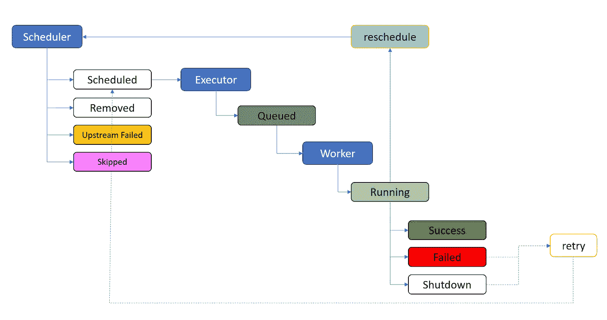

在上图中，`reschedule`州一般不为很多人所知。这是使用`mode='reschedule'`的传感器任务。这种模式意味着，如果不符合传感器的标准，传感器将释放工作人员，让其执行其他任务，并在以后重新安排时间。这对于传感器可能等待很长时间的情况非常有用。

## 写入 DAG:

```
with DAG(
    dag_id='DAG_NAME', 
    default_args=default_args, 
    max_active_runs=3,
    schedule_interval='@daily'
) as dag:
```

上面的代码片段将初始化一个名为(dag_id)的 DAG。它会将名为“default_args”的字典传递给每个任务或使其可用。键值对可以被任务单独覆盖。计划间隔说明何时运行此 dag，max_active_run 说明可以同时运行多少 Dag 实例。

让我们展开 default_arg。

```
default_args **=** {
    'owner': 'airflow',  
    'start_date': datetime(2021, 01, 31),  
    'retries': 1, 
    'retry_delay': timedelta(minutes=5),
    'on_failure_callback': notification_helper,
    'tags'=['platform']
}
```

*   **所有者**:任务的所有者，使用 Unix 用户名
*   **开始日期**:第一次运行 DAG 的执行日期
*   **重试次数**:可以执行的重试次数
*   **retry_delay** :重试之间的延迟时间。
*   **on_failure_callback** :任务实例失败时调用的函数。

添加任务和依赖关系:

```
 t1 = BashOperator(
        task_id='print_date',
        bash_command='date'
    )

    t2 = BashOperator(
        task_id='sleep',
        depends_on_past=False,
        bash_command='sleep 5',
        retries=3
    ) t1 >> t2
```

让我们看看达格在行动。我们将在这里利用 MWAA。为了使用它，我们将执行以下三个操作。


**创建环境**

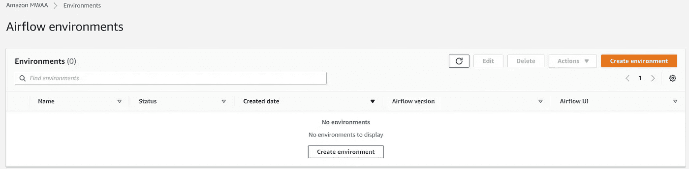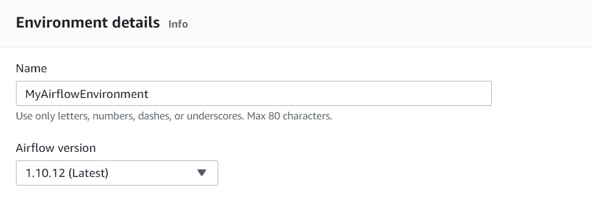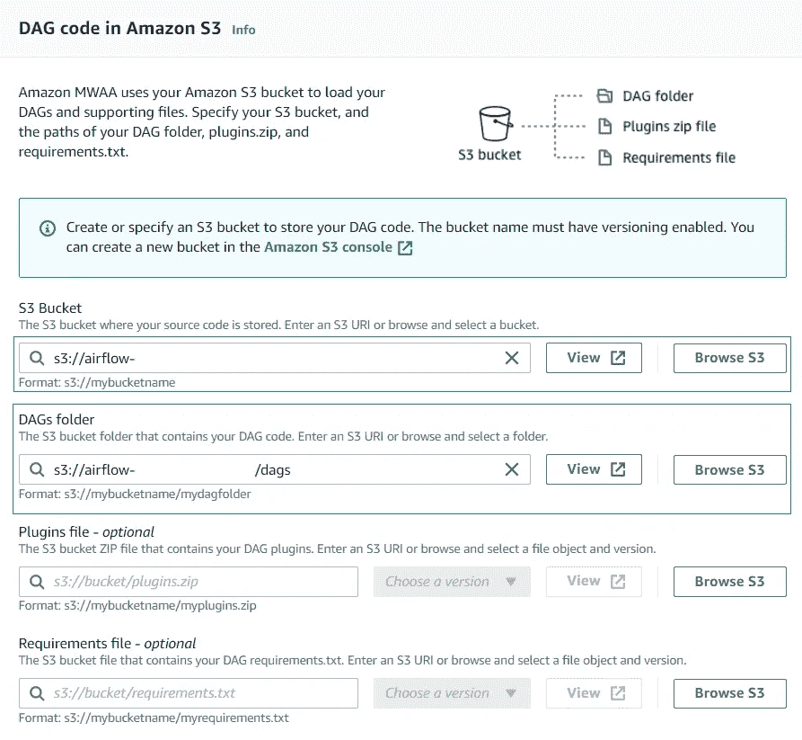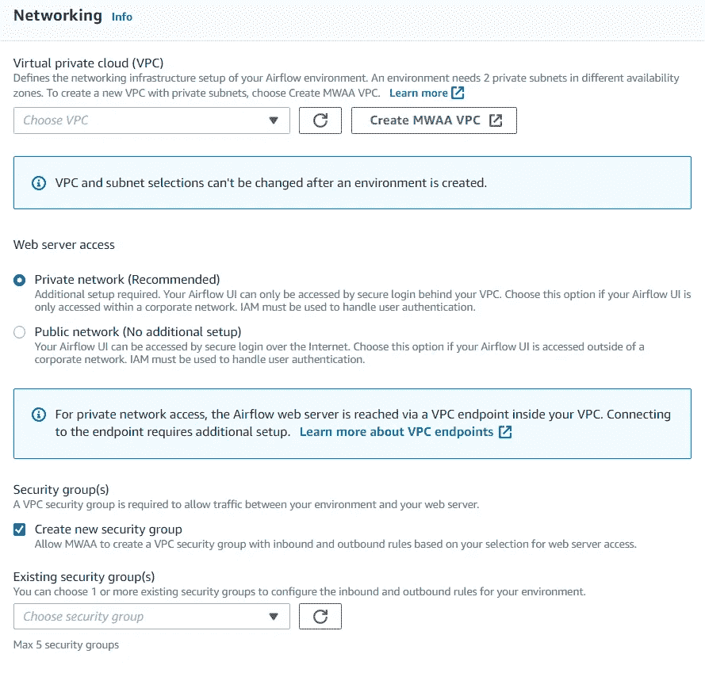

**将 Dag 上传到 S3**

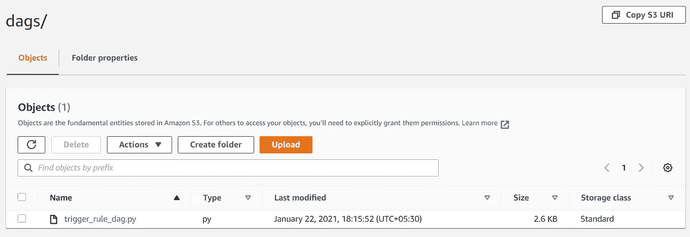

**在气流中运行您的 DAG**

打开 DAG，工作流将会触发。

单击单个任务，查看其进度和详细信息。

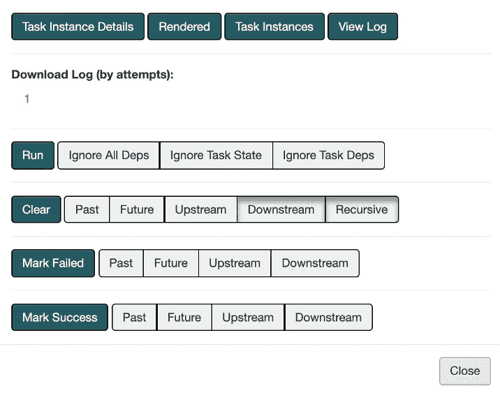

## 优势

程序化管道定义—所有 Dag 都基于 python。

通过 Jinja 模板实现动态——Jinja 模板使管道变得动态和可重用。

社区贡献的解决方案—有许多社区提供的解决方案

可通过插件扩展——我们可以上传带有所有自定义模块的压缩文件

智能调度——它远不止 cron。它是“数据感知的”。

依赖性管理、优雅的故障处理和重试

现成的监控和审计功能

[补土&回填](/nerd-for-tech/airflow-catchup-backfill-demystified-355def1b6f92)

**Catchup** — Airflow 将从您在“default_args”中指定的 start_date 开始，运行它没有记录状态的所有计划的 DAG 运行实例。

**回填** —我们可以在指定的历史时期运行 dag。

— — — — — — — — — — — — — — — — — — — — — — — — —

## 气流替代品

*   路易吉
*   凯德罗
*   节奏/时间
*   指挥(网飞)
*   达格斯特/省长
*   尼菲
*   凯斯特拉
*   AWS 阶跃函数

快乐学习！！