# Swift 中的代数数据类型

> 原文：<https://medium.com/nerd-for-tech/algebraic-data-types-in-swift-2a777b24253d?source=collection_archive---------6----------------------->

由其他类型组合而成的类型

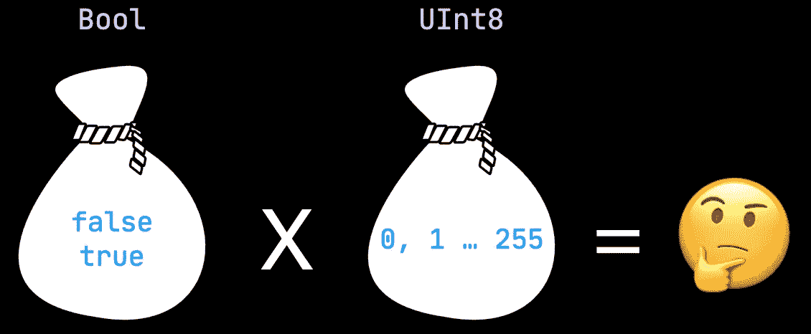

# 什么是类型？

当我们使用静态类型的编程语言时，比如 Swift，我们可以用两种不同的方式来考虑类型。一种是从集合代数的角度，另一种是从内存布局的角度。

首先，我们快速看一下后者。这不是本文的主题，但我认为区分这两种观点是有好处的。从内存布局的角度来看，类型只是程序运行时解释内存中原始字节的规则。它允许程序说:“好的，这 120 个字节是一个`Person`类型，前 4 个字节分配给`age`，接下来的 116 个字节分配给`name`”。这提供了内存安全并有助于避免内存损坏。

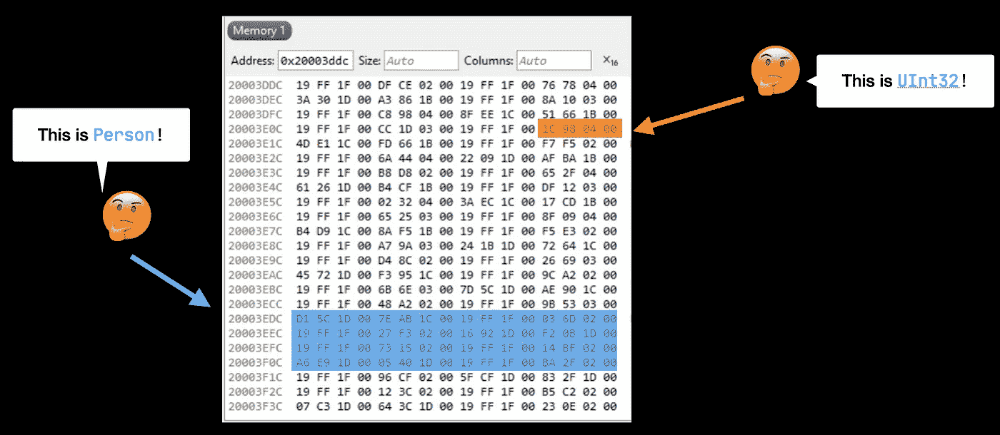

但是我们想把重点放在类型上，因为它们是在集合代数中定义的。在这里，类型只是它们可以保存的值的集合。我喜欢把它们想象成价值袋。我们可以这样来说明这一点:

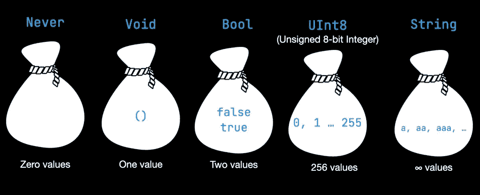

从集合代数的观点来看，简单地说，类型是值的集合(包)

# 原始和复合类型

每种编程语言都有基本类型。它们通常是简单的和“原子的”,因为它们不能被分成更小的类型。

还有复合类型，顾名思义，由多个基本类型或复合类型组成。比如一个整数数组或者一个带有`age`和`name`字段的`Person`。**代数数据类型是复合类型。**

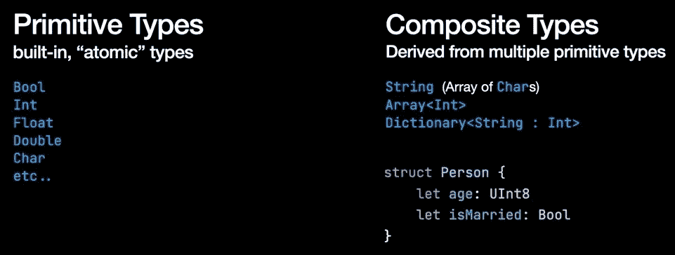

原始和复合类型

有两种代数数据类型。乘积和总和类型。

# 产品类型

首先，让我们熟悉一下产品类型，因为它们出现在几乎所有的编程语言中。**产品类型将基本类型与 AND 连接词结合起来。**比如一个人既有`age` **又有**可以是`married`。在 Swift 中，产品类型由元组、结构和类表示。

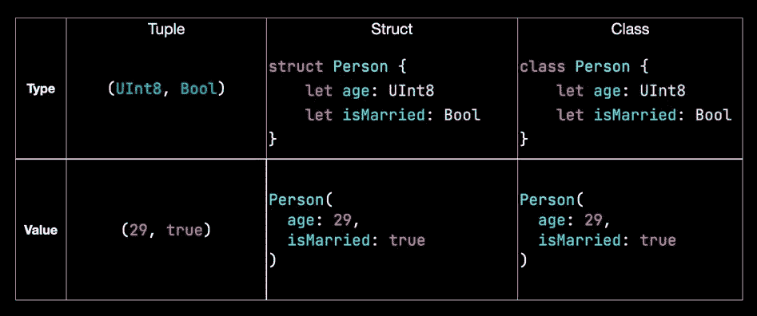

产品类型

为了计算类型`Person`可以容纳的所有可能值，我们需要将`isMarried`字段和`age`字段的值相乘。我们需要得到他们的产品。

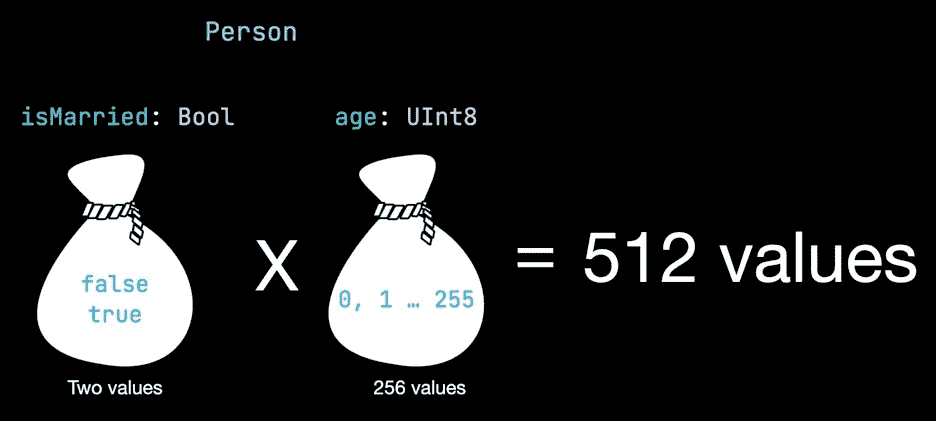

人员类型的所有可能值

我们可以有 256 个已婚和 256 个未婚的人。人们可以活到 255 岁😄。

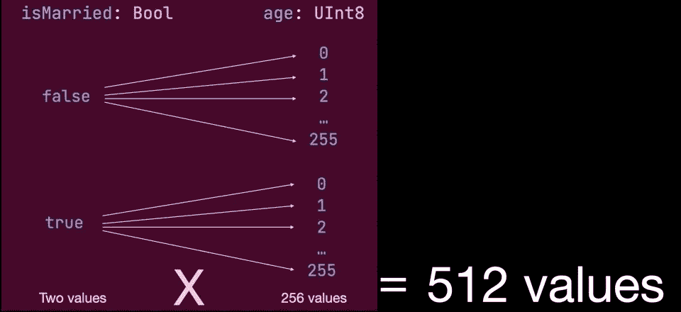

人员类型说明的所有可能值

# 总和类型

**Sum 类型将原始类型与 OR 连词组合在一起。他们代表了一种选择。在这个例子中，我们有一个文档的枚举。一张`Document`可以是出生证明**也可以是驾驶执照**。文档不能同时是两者。它们是互斥的。**

Swift 支持带有关联值的枚举。在这个例子中，出生证明带有`age`和驾驶执照——带有`isExpired`布尔值。

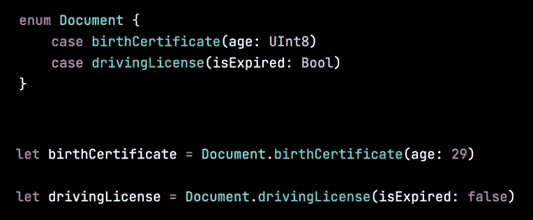

总和类型

为了计算一个`Document`类型的所有可能值，我们需要将每种情况的值相加。

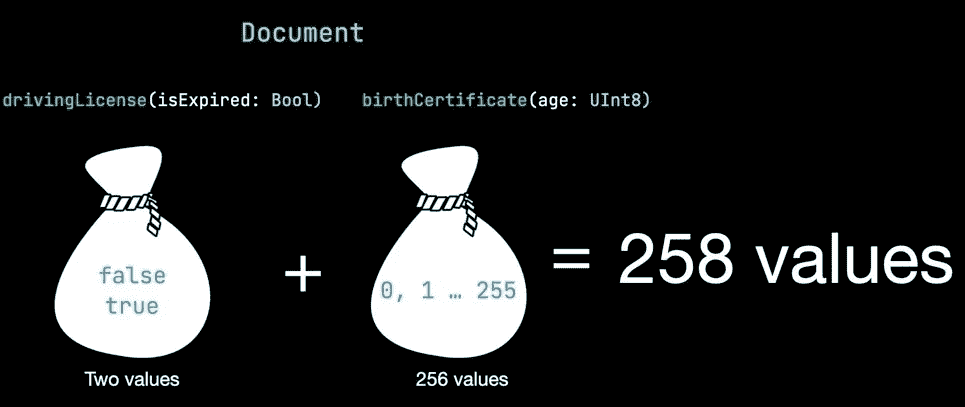

文档类型的所有可能值

驾驶执照可以过期也可以不过期，出生证明的年龄可以从 0 到 255，这与现实生活有一点距离，但作为一个例子就足够了。我们总共得到 258 个可能的值。

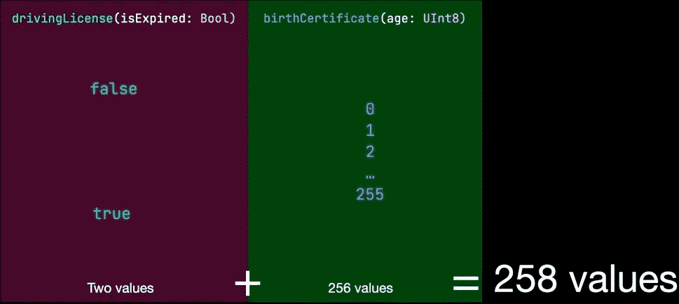

文档类型的所有可能值

# 现实生活中的例子

当然，我们可以组合 Sum 和 Product 类型。结构中可以有枚举值，枚举中可以有结构值。这为应用程序状态建模提供了极大的灵活性。在这个例子中，我们有 3 个互斥的`ScreenState`。当屏幕处于`loaded`状态时，我们可以访问一个`Journey`数组，它本身是`start`和`end`位置的产物。当屏幕为`loading`时，旅程甚至不存在。这使得不可能的状态在类型系统中无法表示。当数据仍在加载时，我们永远不会意外地渲染旅程。

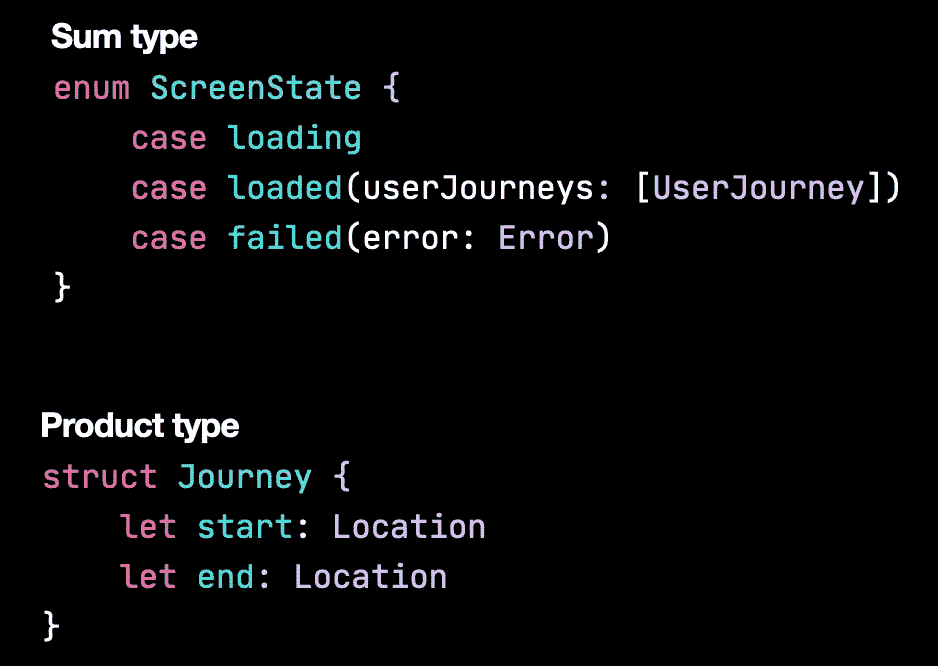

这是另一个例子，伟大的[自由点](https://www.pointfree.co)团队在第[集](https://www.pointfree.co/episodes/ep4-algebraic-data-types)中讨论过。这是苹果的一个有问题的 API，它不使用代数数据类型。这个 API 创建一个网络请求，并允许在完成处理程序中有多个非法状态。是用 Objective-C 实现的，它不支持 ADT，所以不能怪他们。

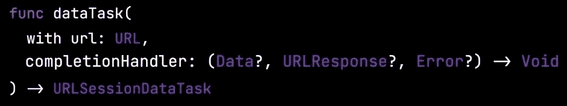

[URL session data task(with:completion handler:)](https://developer.apple.com/documentation/foundation/urlsession/1410330-datatask)

让我们来关注一下`completionHandler`。它接受可选`Data`、可选`URLResponse`和可选`Error`。以下是所有 8 种可能的组合，其中大多数实际上是非法的。

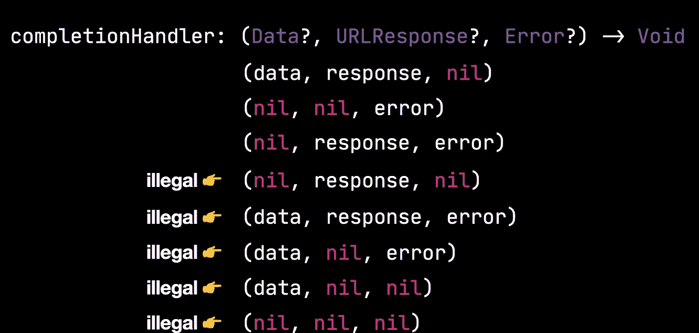

如果我们像 Ole Begemann 在他的[博客文章](https://oleb.net/blog/2018/03/making-illegal-states-unrepresentable/)中建议的那样引入两种新产品类型，我们可以解决这个问题并避免非法状态。一个保存响应的`Success`值，另一个保存`Failure`值。

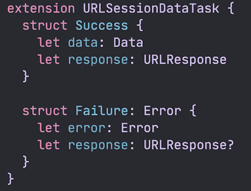

然后，我们可以将它们组合成 Swift 的内置 Sum 类型，用于此类用例— `Result`。

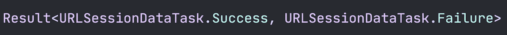

让我们来看看新旧 API 是如何比较的:

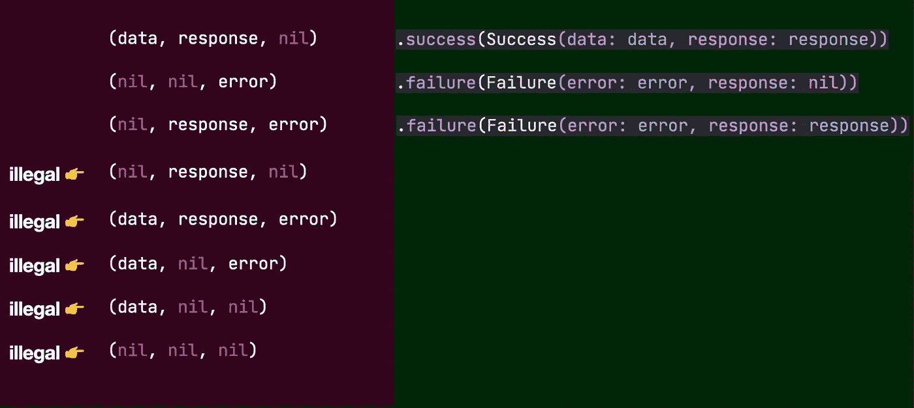

好多了！

**感谢您阅读本文。如果你喜欢，请鼓掌并评论🙂**

**可以在**[**Github**](https://github.com/Anastasia-Petrova)**和**[**LinkedIn**](https://www.linkedin.com/in/anastasia-ios/)上联系我