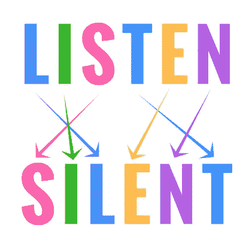

# 算法问题复习#3:字谜

> 原文：<https://medium.com/nerd-for-tech/algorithm-problem-review-2-anagram-c7264bc895f2?source=collection_archive---------8----------------------->



本周，我在柯尔特·斯蒂尔大学的课程中研究另一个算法问题。这是另一个频率计数器类型的问题，但这一次我的工作是看看两个字符串是否是彼此的变位。

# 频率计数器—有效图形

> 给定两个字符串，编写一个函数来确定第二个字符串是否是第一个字符串的变位词。变位词是通过重新排列另一个词的字母而形成的单词、短语或名称，如“cinema”由“iceman”形成

## 例子

**输入:** string1= " "，string 2 = " "
输出:真

**输入:** string1="aaz "，string2="zza"
**输出**:假

**输入:** string1="anagram "，string2="nagaram"
**输出** : true

**输入:**string 1 = " awesom "，string2="awesom"
**输出**:假

## 限制

*   所有输入都是单词
*   所有输入都是小写的
*   所有输入都没有空格、标点符号或数字

```
**function validAnagram(string1, string2){****}**
```

# 我的过程

## 理解问题

在开始编码之前，让我们重申一下这个问题。我需要创建一个函数来告诉我我的两个字符串输入 **string1** 和 **string2** 是否是彼此的变位组合。如果它们是字谜，我的函数必须返回 **true** 如果它们不是字谜，我的函数必须返回 **false** 。我的字符串将是没有空格，数字，标点符号和所有小写字母的单词。

## 分解它

是时候评论一下我需要为这个问题做的事情了。

```
**function validAnagram(string1, string2){
**   
   *// Do something...* */* return true if string1 and string2 are anagrams, return false otherwise */***}**
```

我在“做点什么…”部分的第一个行动计划是检查两个字符串的长度是否相同，如果不同，我将自动返回 false。然后下一步是创建一个对象，该对象具有字母 **string1** 的键，以及它们在该单词中出现的次数的值。然后让另一个对象做同样的事情，但是用的是 **string2** 。

```
**function validAnagram(string1, string2){
**   
   **if (string1.length !== string2.length){
      return false
   }** *// 1\. Create empty objects* **let stringFreq1 = {}
   let stringFreq2 = {}** *// 2\. Loop through string1 and then string2 to add to the objects* */* return true if string1 and string2 are anagrams, return false otherwise */***}**
```

我希望我的对象看起来像这样。

```
EXAMPLE
inputs: validAnagram('anagram', 'nagaram')stringFreq1 = {'a':3, 'n':1, 'g':1, 'r':1, 'm': 1}
stringFreq2 = {'n':1, 'a':3, 'g':1, 'r':1, 'm': 1}
```

所以这次我将使用一个 **for…of** 循环来遍历我的两个字符串。如果字符串中的字母已经是对象中的一个键，我将在值上加 1。如果不是，我会把它设置为 0，然后加 1。然后我将比较两个对象的键和值。

```
**function validAnagram(string1, string2){
**   
   **if (string1.length !== string2.length){
      return false
   }** *// 1\. Create empty objects* **let stringFreq1 = {}
   let stringFreq2 = {}** *// 2\. Loop through string1 and then string2 to add to the objects* **for (let *letter* of *string1*){
      stringFreq1[letter] = (stringFreq1[letter] || 0) + 1
   }** **for (let *letter* of *string2*){
      stringFreq2[letter] = (stringFreq2[letter] || 0) + 1
   }** *// 3\. Compare the keys and values in both objects* */* return true if string1 and string2 are anagrams, return false otherwise */***}**
```

现在我的对象已经创建好了，我将比较两个对象中的键值，看看它们是否有完全相同的键，如果有，它将立即返回 false。如果它们没有相同的键值，那么它将立即返回 false。如果这两个测试都没有返回 false，那么它将返回 true，两个字符串都是彼此的 true 变位。

我将在中使用**来循环我的对象**

```
**function validAnagram(string1, string2){
**   
   **if (string1.length !== string2.length){
      return false
   }** *// 1\. Create empty objects* **let stringFreq1 = {}
   let stringFreq2 = {}** *// 2\. Loop through string1 and then string2 to add to the objects* **for (let *letter* of *string1*){
      stringFreq1[letter] = (stringFreq1[letter] || 0) + 1
   }** **for (let *letter* of *string2*){
      stringFreq2[letter] = (stringFreq2[letter] || 0) + 1
   }** *// 3\. Compare the keys and values in both objects* **for (let *key*****in *stringFreq1*){** * // 3a. checking if the keys of stringFreq1 are missing from   stringFreq2*
      **if(!(*key* in *stringFreq2*)){
         return false
      }***// 3b. checking if the key's value of stringFreq1 is different from the key's value in stringFreq2* **if (stringFreq2[key] !== stringFreq1[key]){
         return false
      }
   }** */* return true if string1 and string2 are anagrams, return false otherwise */* **return true****}**
```

## 解决

```
**function validAnagram(string1, string2){
**   
   **if (string1.length !== string2.length){
      return false
   }****let stringFreq1 = {}
   let stringFreq2 = {}****for (let *letter* of *string1*){
      stringFreq1[letter] = (stringFreq1[letter] || 0) + 1
   }** **for (let *letter* of *string2*){
      stringFreq2[letter] = (stringFreq2[letter] || 0) + 1
   }****for (let *key*****in *stringFreq1*){** **if(!(*key* in *stringFreq2*)){
         return false
      }****if (stringFreq2[key] !== stringFreq1[key]){
         return false
      }** **}****return true****}**
```

# 我的想法

这是一个相当简单的问题，它帮助我加强了对对象的处理，避免了与某件事情的频率有关的嵌套循环问题。这个函数有一个 O(n)的 O 符号，这是相当不错的。

# 编码快乐！


照片由[丹尼尔·托马斯](https://unsplash.com/@dtbosse?utm_source=medium&utm_medium=referral)在 [Unsplash](https://unsplash.com?utm_source=medium&utm_medium=referral) 上拍摄