# 算法 II:基本数据结构

> 原文：<https://medium.com/nerd-for-tech/algorithms-ii-fundamental-data-structures-9e2382babc2a?source=collection_archive---------11----------------------->

src:今日美国:亚马逊仓库

在我程序员生涯的早期，我是用 C 编程语言写的。这是我编程的第一门语言，我并不讨厌这种体验。我着手构建的一个项目是一个销售点系统，类似于你当地超市的收银台，作为学习这门语言的关键部分和测试我的掌握程度的一种方式。

与 C 合作建立这样一个系统的唯一问题是如何存储和管理数据。例如，像任何其他收银台一样，我需要存储商品及其匹配价格的主列表，我必须存储元数据，例如，商品是否有折扣以及折扣是多少。当时，我知道如何在 C 编程语言中使用的唯一数据结构是**原始数组。**这让事情变得非常困难，最终我放弃了开发游戏的项目。

设计没有适当数据结构的算法真的很有挑战性。这就是为什么大多数有经验的程序员在决定将一种编程语言用于一个项目之前会考虑它所支持的数据结构，至少，这是我在体验了 **C** 之后一直做的事情。考虑到用例及问题类型的变化，使用支持多种数据结构的语言是很重要的。确保语言以最佳性能实现默认算法也很重要，例如，我们应该优先考虑为数据结构(如 list)上的搜索、获取、插入、删除和排序操作提供最佳整体性能的语言，这是因为在实际生产环境中，软件系统很可能每秒至少执行这些操作几百万次或几十亿次。

考虑以下语言性能基准。我不想在这里挑起争端，但是根据这些基准，如果性能在你的清单上是最重要的，你可能会远离 **python3** 。

我不是第一个注意到这一点的人。在这里了解更多关于 python 性能和效率的不足:[http://jakevdp . github . io/blog/2014/05/09/why-python-is-slow/](http://jakevdp.github.io/blog/2014/05/09/why-python-is-slow/)

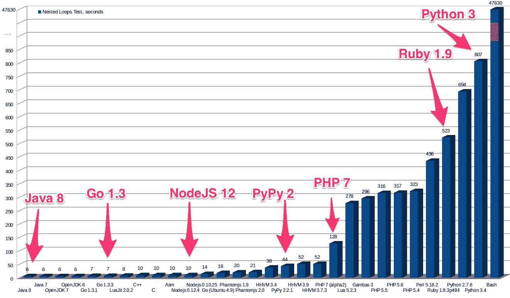

Java Vs Python tryed and true Vs " modern and new "[https://belit soft . com/Java-development-services/Java-Vs-Python-tryed and true-Vs-modern and new](https://belitsoft.com/java-development-services/java-vs-python-tried-and-true-vs-modern-and-new)

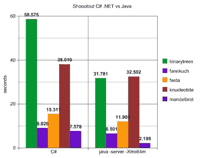

编程语言与工具:Medium[https://Medium . com/traveling-developers/top-5-programming-languages-to-learn-in-2019-70247 ec3e 729](/travelling-developers/top-5-programming-languages-to-learn-in-2019-70247ec3e729)

后来，在我的职业生涯中，我选定 Java 作为对这些数据结构提供最佳支持的语言，事实证明，这些数据结构对于设计哪怕是最简单的算法都是至关重要的。有了 Java 集合，我觉得(现在仍然如此)面对任何抛给我的特定领域的问题都是不可战胜的。我只需要从集合 API 中选择一个数据结构(Map、HashMap、List、ArrayList、Set e.t.c ),就可以了。值得注意的是，大多数(我认为是所有)现代编程语言都广泛支持数据结构，区别因素是不同语言对这些数据结构的操作的速度和效率如何不同。

一个**数据结构**可以定义为一个组织其他数据项的**方案**。在这篇文章中，我们将看到一些关键的数据结构，它们定义了程序员的日常生活，而不管他们使用哪种语言来设计和实现算法。

这些是线性数据结构、图形、树、集合和字典。

# **线性数据结构**

# **数组**

**数组**和**链表**可以说是最重要的数据结构。该阵列可以是一维或多维的，通常是二维的。一维数组是连续存储的相同数据类型的项目 **n** 的序列，其值可以通过指示数组的**索引**的数字来访问。

可以假设数组的元素使用相同数量的计算机内存，并且数组的每个元素都可以在可预测的恒定时间内被访问，而不管它们在数组中的位置或索引。这些属性将数组与链表和其他数据结构区分开来。该数组用于定义其他类型的数据结构，如**字符串**。

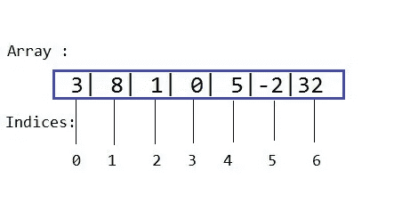

array:Medium:[https://Medium . com/@ vandersonramos/move-the-first-item-to-last-position-in-the-array-JavaScript-c8ba 435 efee 3](/@vandersonramos/moving-the-first-item-to-the-last-position-in-the-array-javascript-c8ba435efee3)

# **链表**

单链表:来源[https://www . educative . io/edpresso/什么是单链表](https://www.educative.io/edpresso/what-is-a-singly-linked-list)

**链表**是一个零个或多个元素的序列，称为**节点**，每个节点包含两种信息；一些数据和一个或多个到其他节点的链接(称为**指针** ) 到链表中的其他节点。一个名为“ **null** ”的特殊指针用于指示该节点后继节点的缺失(链表的末尾)。

要访问链表中的一个元素，首先必须从链表的第一个节点开始，遍历链表，直到到达目标节点。因此，访问链表中的元素所需的时间取决于该元素的节点在链表中的位置。

链表的优点是它们不需要预先保留计算机内存，因为与数组相反，节点可以动态地添加或删除。

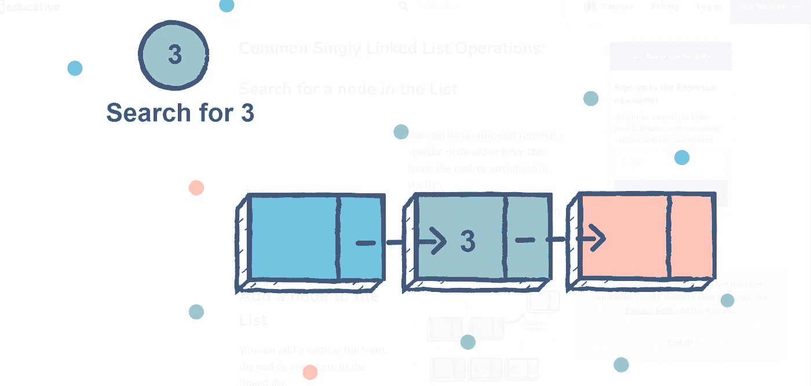

访问单个链表

链表有时包含一个**头**，它可以提供关于链表的信息，例如，链表的大小，指向包含链表的第一个和最后一个元素的节点的指针。

链表可以增强为**双向链表，**其中每个节点都包含一个指向下一个和上一个节点的指针。

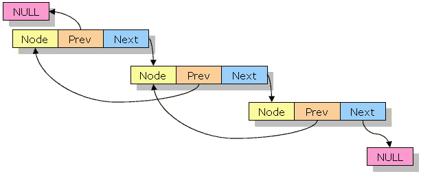

双向链表

**简单或线性列表**

链表和数组用于表示一种更抽象的数据结构，称为线性列表或简单列表。列表支持基本操作，如在列表中插入、删除和搜索元素。

该列表允许我们导出更重要的数据结构，如**队列**和**堆栈**。

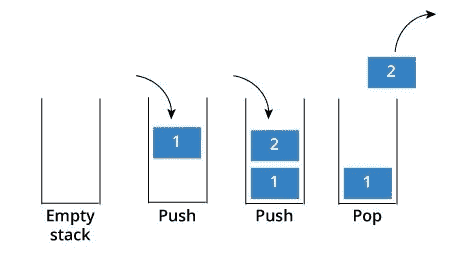

堆栈是一种数据结构，它只允许在数据结构的一端，即顶部进行操作。数据结构采用 **LI-FO** 格式，即 ***后进先出。*** 添加(也称为推送操作)和删除(也称为弹出操作)发生在顶部元素。

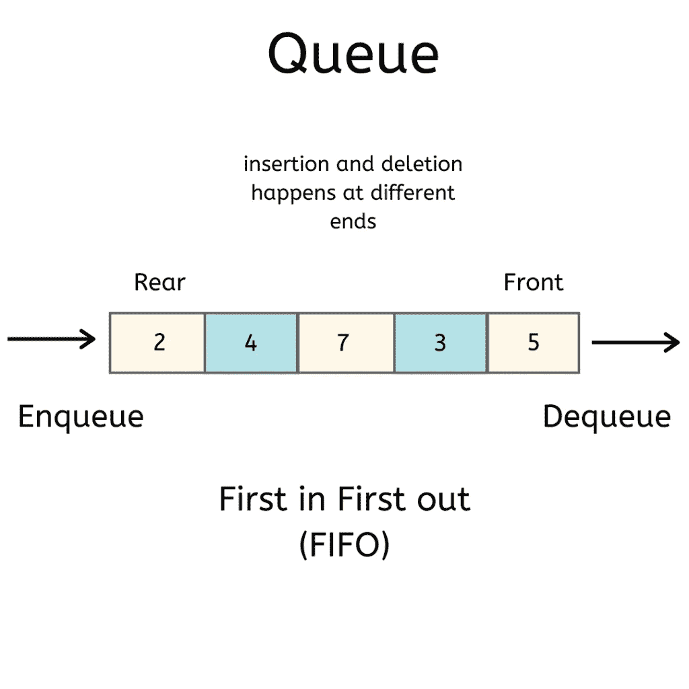

队列是一种支持在线性数据结构两端操作的数据结构。元素的添加在数据结构的**后**端完成，该操作称为 **en 队列**，而元素的删除从数据结构的**前**端完成，也称为 **de 队列。**因此，队列以 **FIFO** 格式运行，(*先进先出*)。

# **图表**

图可以(非正式地)定义为由线段(**边或弧**)连接的点(**节点或顶点**)的集合。

一个图也可以(正式地)定义为一个**G**=【V，E】。 **G** 是由一对两个集合表示的图， **V** 是顶点的集合， **E** 是边的集合。

如果顶点对( *u，v* )等于顶点对(v，u)，则该图被认为是**有向图，**否则，该图被认为是**无向图。**有向图也叫**有向图。**

**图形表示**

计算机算法可以用两种格式表示图形；**邻接矩阵**或**邻接链表。**图的邻接矩阵是一个 **n 乘 n** 布尔矩阵(用 1 和 0 表示)，每个顶点占一行一列。如果从第 ***行*到第 ***第 j*列**有连接边，则值为 **1** 如果连接边不存在，则值为 **0** 。**

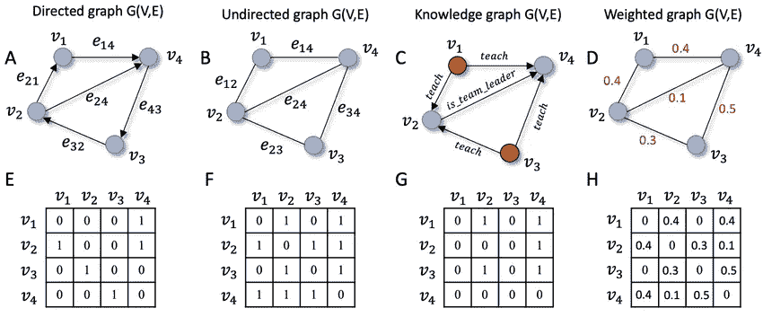

使用邻接矩阵的图示。来源。研究门:[https://www . research gate . net/figure/Different-types-of-graphs-and-its-communication-adjacency-matrix-representations-The _ fig 1 _ 347300725](https://www.researchgate.net/figure/Different-types-of-graphs-and-their-corresponding-adjacency-matrix-representations-The_fig1_347300725)

另一方面，**邻接链表**是每个顶点的一个链表集合，它包含与链表顶点相邻的所有顶点，即通过一条边连接到所述顶点。图形表示利用链表头，在该链表头上添加导出链表的顶点的名称。

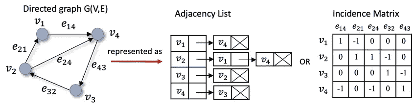

邻接链表图解。来源，研究门:[https://www . Research gate . net/figure/Different-ways-to-representation-a-static-graph-Beyond-the-adjacency-matrix-representation-as _ fig 2 _ 347300725](https://www.researchgate.net/figure/Different-ways-to-represent-a-static-graph-Beyond-the-adjacency-matrix-representation-as_fig2_347300725)

**图形:加权图形**

加权图(或称加权有向图)是一个图或有向图，它的边被赋予了数字。分配给其边缘的数字称为**重量**和**成本**。要在邻接矩阵中表示加权图，如果一条边不存在(因此没有分配给它的权重)，可以使用特殊符号，如 **∞** 。

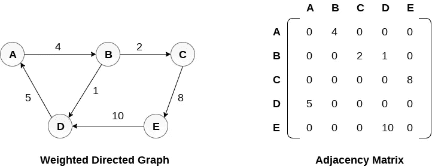

加权图。源代码 Java point[https://www.javatpoint.com/graph-representation](https://www.javatpoint.com/graph-representation)

加权图在现实世界中有许多应用，例如在交通或通信网络中寻找两点之间的最短路径，或者旅行推销员问题。

**图:路径和循环**

从顶点 ***u*** 到图 **G** 的顶点 ***v*** 的路径可以定义为以**开始，以 ***v*** *结束的相邻顶点序列。*路径的长度是定义路径的顶点序列中的顶点总数减 1，这与所选路径中的边总数相同。**

**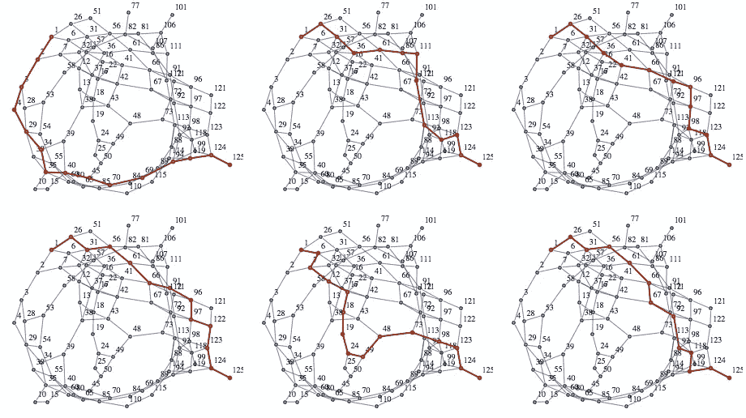**

**[寻找两个顶点之间的“非最短”路径](https://mathematica.stackexchange.com/questions/4084/finding-a-not-shortest-path-between-two-vertices):[https://Mathematica . stack exchange . com/questions/4084/Finding-a-not-shortest-path-between-two-vertices](https://mathematica.stackexchange.com/questions/4084/finding-a-not-shortest-path-between-two-vertices)**

**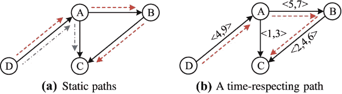**

**时间相关图:[https://link . springer . com/article/10.1007/s 41019-019-00105-0](https://link.springer.com/article/10.1007/s41019-019-00105-0)**

**如果每对顶点(u，v)都有一条连接边，那么这个图就是连通的。**

**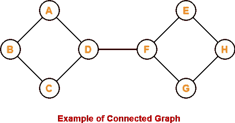**

**[https://www.gatevidyalay.com/tag/cyclic-graph-definition/](https://www.gatevidyalay.com/tag/cyclic-graph-definition/)**

****图中的一个圈**是在图中的同一个顶点开始和结束的一条路径。没有圈的图称为**无圈图。****

**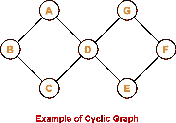**

**【https://www.gatevidyalay.com/tag/cyclic-graph-definition/ **

****树木****

**树是一个连通的非循环图。**

**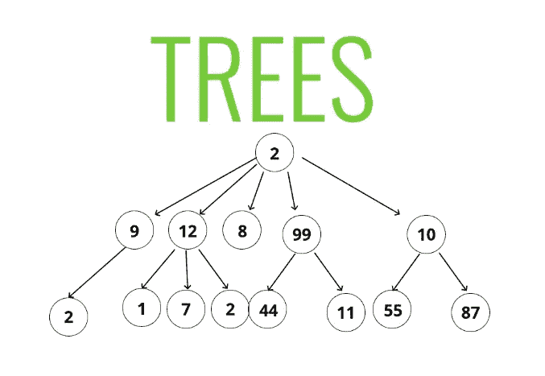**

**没有圈但不连通的图称为**森林，**因为它的每个连通部分都是一棵树。**

**对于树中的每两个顶点，总是存在一条从这些顶点中的一个到另一个的简单路径。这使得可以选择树中的一个顶点，并使其成为树的**根**，从而将树转换为**根树。****

**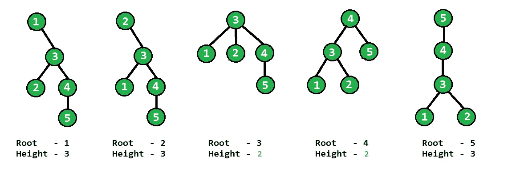**

**根树:[https://media . geeks forgeeks . org/WP-content/uploads/minheighttree . png](https://media.geeksforgeeks.org/wp-content/uploads/minHeightTree.png)**

**树在计算机科学中的一个常见应用是描述企业的文件目录和组织结构图中的层次结构。**

****点了棵树****

**有序树是一个有根的树，其中每个顶点的所有子节点都是有序的。**

**一棵**二叉树**是一棵有序树，其中每个顶点有不超过两个孩子，并且每个孩子要么被指定为其父顶点的**左孩子**要么被指定为其父顶点的**右孩子**。**

****

**二叉树:[https://www.geeksforgeeks.org/binary-tree-data-structure/](https://www.geeksforgeeks.org/binary-tree-data-structure/)**

# ****集合和字典****

**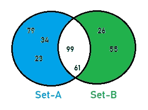**

**设置**

**集合直接来源于数学。集合可以描述为不同项目的无序集合。集合的符号不同，一个涉及元素的显式列表，像这样；**

****s = {1，2，3，4，5}****

**或者通过声明集合中所有元素共有的属性；**

****s = {n:n 是质数，n < 10}****

**最重要的集合操作是检查成员资格和寻找多个集合之间的联合。一些编程语言会提供现成的集合数据结构，但是如果必须显式定义一个集合，有几种方法可以做到。一个涉及位串，也称为**位向量，即****

**s = {2，3，5，7}变成了 011010100**

**表示集合的另一种方式是使用**列表**数据结构。**

****字典****

**实现集合操作(搜索、插入、删除等)的数据结构称为字典。**

****结论****

**在计算机科学中，数据和操作之间存在着非常密切的关系。因此，算法的设计、实现和应用在很大程度上依赖于用于这些操作的数据结构。**

**数据结构会影响算法的速度和效率。因此，在定义一个策略来开发一个领域问题的算法解决方案之前，考虑可用的数据结构是非常重要的。**

**因此，不要只看受欢迎程度以及脸书和谷歌是否声称高度利用了一种新的、时髦的编程语言，重要的是你要询问这种语言支持哪些数据结构(准确地说是 ADT ),这些 ADT 的速度和效率如何，以及在定义新问题的新解决方案时它们对我们来说有多容易。**

**这是关于算法主题的四部分系列的第二部分。如果你还没有，请查看本文的前传:[https://medium . datadriveninvestor . com/algorithm-problem-types-AFD fc 811 D8 af](https://medium.datadriveninvestor.com/algorithm-problem-types-afdfc811d8af)**

**支持我，看看我的小应用:[人生规划师](https://thelifeplanner.co)**

**感谢您的阅读…**