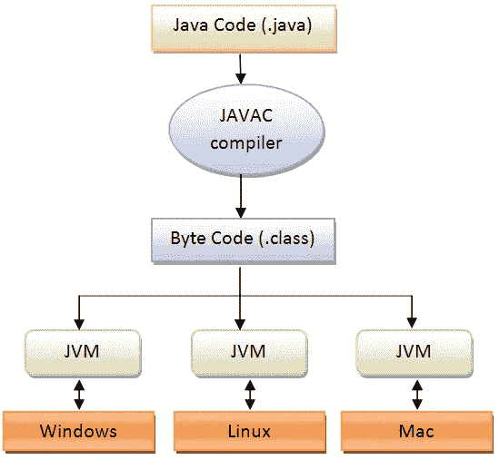
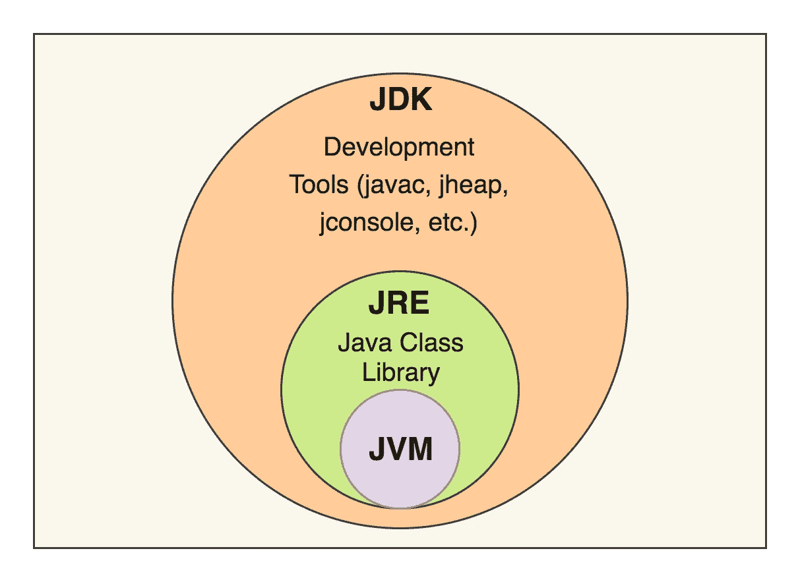
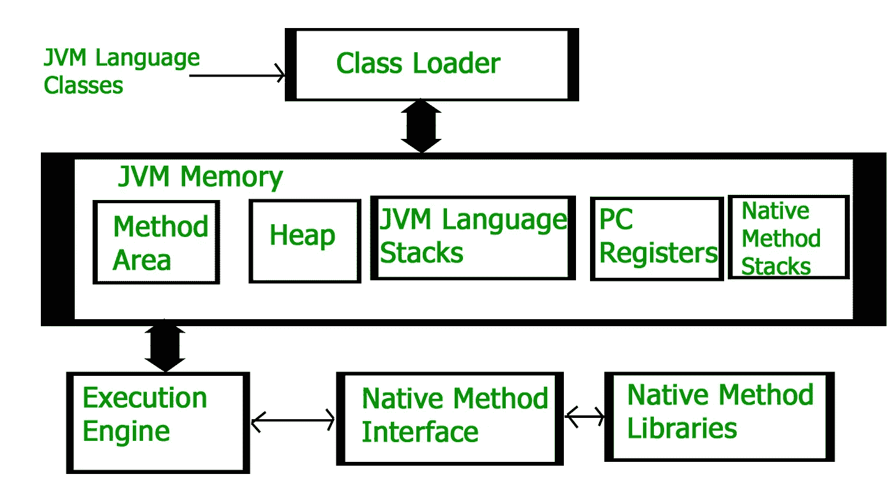

# 关于 JAVA 虚拟机的一切

> 原文：<https://medium.com/nerd-for-tech/all-about-java-virtual-machine-jvm-2ef665c770b8?source=collection_archive---------14----------------------->

在我们开始学习 JVM (Java 虚拟机)之前，我们需要了解什么是虚拟机。所以虚拟意味着不在现实中。这台机器是完成我们工作的某种装置。所以虚拟机是不存在的东西。虚拟机主要可以分为两类。

1.  **基于系统的**
2.  **基于应用/基于流程**

基于系统的虚拟机可能有一个或多个硬件，它会创建多个彼此完全独立的环境。

基于应用程序的虚拟机不涉及任何硬件。但是可能有软件可以帮助你创建一个运行其他程序的平台。

因为这是基于应用的，我们可以把它看作一个程序。所以 JVM 是一个基于应用的 VM。JVM 是一个规范，它说明了应该如何去做。当我们安装 Java 运行时环境(JRE)时，它会部署特定的代码来为特定的平台创建一个 JVM。

当你启动一个 java 程序时，它会在你的计算机上创建一个 JVM 实例。你的程序退出的时候，JVM 实例也被破坏了。假设你同时在电脑上运行三个 Java 程序。那么那时有多少 JVM 实例呢？

**答案是 3。因为那时您计算机上将有 3 个不同的 JVM 实例。**

我们使用**javac<Filename>将 java 文件编译成类文件。**

为了运行我们使用 **java <文件名>**

所以当你给 java 的时候，意味着你告诉你的操作系统给我一个 JVM 实例。当 JVM 创建它时，创建一个非恶魔线程。在我们的类中应该有 public static void main 方法。所以当 JVM 创建时，它执行 main 方法。

JVM 可以通过两种方式被破坏。

1.  如果所有非恶魔线程都被破坏。
2.  当应用程序调用 System.exit()时

# JAVA 虚拟机内部

JVM 的高级图

在 JVM 中，我们主要有 3 个部分。

1.  类装入器
2.  存储区
3.  执行引擎

JVM 内部

先说一下类加载器。

# 1.类装入器

类装入器的主要职责是将类装入内存。除此之外，还有一些其他的责任。这些可以分为三个部分。

1.  装货
2.  连接
3.  初始化

## **加载**

当 JVM 读取文件来加载它时，

1.  读取完全限定的类名

2.读取变量信息

3.读取直系父代信息

4.读取这是类还是接口

所以读取这些信息并加载到主存区。当每一个类被加载时，JVM 从类类型中创建对象。(每个类只有一个对象正在创建)

## **链接**

链接主要分为三个部分。

1.  **验证**
2.  **准备**
3.  **分辨率**

**验证**

在验证中，它有一个叫做字节码验证器的子程序，

这个类是否来自一个有效的编译器？

这个类是否有正确的结构？

该调用文件的格式是否正确？

如果以上不满足，JVM 将抛出一个异常，称为验证器异常。如果一切顺利，它将进入准备阶段。

**准备**

准备意味着如果你在你的类中使用了任何实例级变量或者静态变量，这个准备部分会给它们分配一个默认值。

例如:

object -> null，int -> zero，boolean -> false

**决议**

在 java 中，我们可以创建一个类，我们可以给它命名，比如雇员，学生等等。但是当涉及到机器代码时，就没有所谓的雇员或学生了，因为一切都是领域特定的对象。JVM 也不理解学生或雇员。所以在类转换为机器级 JVM 之前，用直接链接替换那些符号链接。

## **初始化**

在初始化部分，它将分配实数值并执行静态块。每个类在使用之前都必须初始化一个规则。那么什么是主动使用。积极使用意味着它可以是，

1.  使用新关键字。
2.  调用静态方法。
3.  为静态字段赋值
4.  初始化类
5.  获取实例
6.  实例化子类

在任何这些主动使用之前，它必须经过初始化阶段。

还有一些其他的事情也发生在初始化部分。当编译器编译一个类时，它将创建一个匿名方法，并在该方法中存储实例级变量和静态变量。因此，如果我们没有任何类型的静态变量或实例变量，这个匿名方法将不会被创建。

JVM 还会为每个构造函数创建一个名为 init 的方法。在 init 方法()中，

1.  可以有一段代码来调用一些其他的构造函数 init 方法()。
2.  对于特定的实现，可以有字节码。
3.  可以有初始化实例变量的代码。

这两种方法都不能被开发者访问。

# 2.存储区

JVM 存储区主要分为 5 个子部分。

1.  方法区域—保留类别信息(常量池、方法数据、方法代码、字段数据)
2.  堆区域—保存所有对象信息
3.  堆栈—保留方法和变量信息
4.  PC 寄存器—仅当执行方法不是本机方法时，保存关于下一次执行的信息。
5.  本机方法区域—存储有关本机信息的详细信息。

# 3.执行引擎

执行引擎执行分配给运行时数据区的字节码。执行引擎主要包含三个部分。

1.  解释者
2.  JIT 编译器(实时编译器)
3.  垃圾收集工

解释者

解释器解释字节码并逐行执行指令。解释器的问题是它每次都要解释，甚至多次解释同一个方法，这降低了系统的性能。

JIT 编译器

JIT 编译器弥补了解释器执行速度慢的缺点，提高了性能。JIT 编译器能够在运行时将字节码转换为机器码的同时执行某些简单的优化。

垃圾收集工

垃圾收集器检查堆中未使用的对象，并移除和回收内存。垃圾收集器是一个自动管理内存的 java 程序。这是一个后台运行的守护线程。

# 参考

执行引擎(https://www . geeks forgeeks . org/execution-Engine-in-Java/)

即时编译器(https://www . geeks forgeeks . org/just-In-Time-Compiler/)

CodeLabs(https://www . YouTube . com/watch？v = butiwbafkc & list = PLD-myte BG 3 x-RF 1 Hu 16 AC 3 RF 9 e-maak XJ)