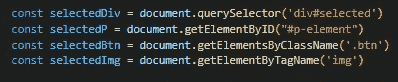
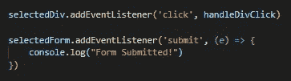
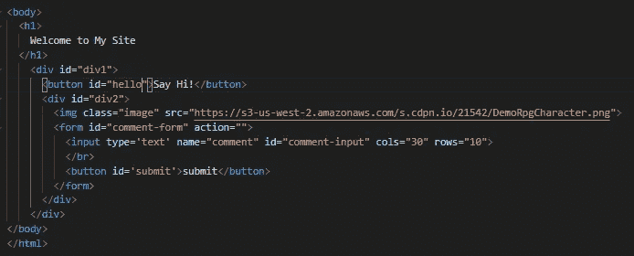

# 关于 Javascript 事件侦听器、传播和冒泡的所有内容

> 原文：<https://medium.com/nerd-for-tech/all-about-javascript-event-listeners-propagation-and-bubbling-19801c8558a1?source=collection_archive---------5----------------------->

**留在圈子里。听事件。**

用 Javascript 编写的 Web 应用程序具有惊人的交互性。用户动作、鼠标点击、悬停、表单提交、滚动都有可能触发一些代码来执行一些工作，然后操纵 DOM 作为响应。

然而，前端 Javascript 代码不知道何时或者如何执行，直到 DOM 上发生的特定事件告诉它这样做。我们告诉 Javascript 代码运行并在用户屏幕上发生什么的方式是通过事件监听器。

你可以把这个过程想象成听收音机的过程。你调到一个特定的电台，听到一首你想听的歌曲或一个脱口秀节目，然后你利用这些信息做些事情，跟着唱，和朋友讨论，等等。事件侦听器遵循相同的步骤。

# 有效倾听的步骤

## **调到**

首先，找到您想要监听的 HTML 元素。元素应该分配给全局变量，并可以放在 Javascript 代码文件的顶部，以便组织。元素选择语句包含要搜索的 HTML 文档部分、一个选择器方法和一个 CSS 选择器或指定属性作为其参数。以下是一些可能的例子:

Javascript 选择代码

## **听一首歌**

接下来，确定您想要监听的事件类型。Javascript 知道要听大量不同的[事件](https://developer.mozilla.org/en-US/docs/Web/Events)，诀窍是知道你想听哪首歌。常见的事件类别包括:资源事件(load)、表单事件(submit、reset)、鼠标事件(click、hover)、键盘事件(keydown、keyup)。一旦选择了合适的元素，并确定了事件，`addEventListener`就是我们在元素上调用的 Javascript 方法。该方法有两个主要的参数部分:

1)事件名称
2)回调函数

添加事件侦听器

## **尽情跳舞**

最后一步，回调函数，可以编写为事件侦听器中的嵌套匿名函数，也可以是在单独的函数中完全定义的指定函数。回调处理您希望在事件发生后发生的结果工作。回调还可以访问事件对象，该对象包含各种有价值的数据，这些数据随后可以用于有条件地执行不同的工作，或者保存到变量中并发送到数据库。

# **冒泡**

**仔细倾听与泛泛而谈**

更恰当的说法是事件传播，冒泡指的是所有 HTML 子元素都可以被它们的父元素“听到”,这意味着发生在元素上的任何事件都可以被它们的任何一个祖先节点访问。事件从起点向上遍历 DOM，直到到达事件侦听器所在的节点。

考虑下面一组嵌套的 HTML 元素。

HTML 示例

我们可能会假设，为了响应对元素
`<button id=”hello”>Say Hi!</button>`的点击，事件监听器需要连接到那个特定的按钮。然而，使用冒泡，在`
`上设置一个事件监听器会达到同样的效果，并且能够监听位于 div 或其子元素上任何其他位置的点击事件。

当选择一个元素作为事件侦听器的目标时，记住周围环境中可能正在发生的事件是有帮助的，因为我们可能希望同时侦听多个事件并触发对多个事件的响应。在这种情况下，我们可以将事件侦听器放在它们最近的共同祖先上，而不是放在每个单独的元素上。这被称为事件委托。

有许多方法可以完成事件侦听和处理中涉及的步骤。因此，对于一个事件如何从发生到在网页上反映出来，这主要取决于个人偏好(当然，只要达到了预期的结果)。

一定要记住

气泡