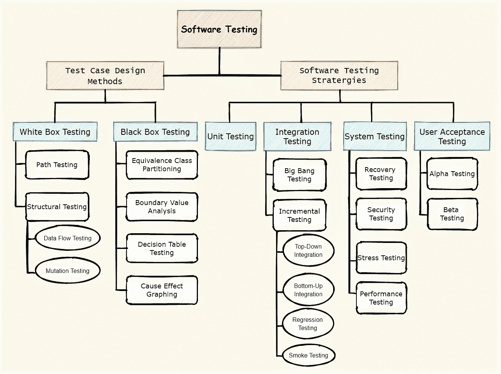

# 关于软件测试的一切

> 原文：<https://medium.com/nerd-for-tech/all-about-software-testing-a85f55d8263b?source=collection_archive---------4----------------------->

—软件测试概念的初学者友好指南

凯文·卡纳斯在 [Unsplash](https://unsplash.com?utm_source=medium&utm_medium=referral) 上的照片

W 在我接受本科教育的时候，我遇到了术语*[***软件测试***](https://en.wikipedia.org/wiki/Software_testing)*，我觉得很有趣，并开始寻找各种来源来获得足够的知识。在我的路上，我发现没有一个具体的来源包括所有关于软件测试基础的概念。这就是为什么这里有一篇文章总结了软件测试的基本概念及其重要性。**

# **什么是软件测试？**

**按照技术定义，软件测试是评估系统或其组件以发现它是否满足指定需求的过程。它是*[***验证和确认***](https://en.wikipedia.org/wiki/Verification_and_validation)*的一个要素。软件测试是必不可少的，因为它表明软件质量和可靠性，从而提高客户满意度。****

## *****软件可测试性*****

***如果你要发布无错误的软件，测试是至关重要的，但是并不是所有的软件都是容易测试的。软件支持测试的程度被称为软件可测试性。软件的可测试性由以下一些因素决定:***

*   *****可分解性**:软件的不同组件可以隔离测试。***
*   *****可观察性:**输入的任何变化都会反映到软件的输出中。***
*   *****可控性:**是能够控制被测组件状态的程度。***
*   *****简单性:**软件的每一个组件都是不言自明的(证据充分)。***
*   *****稳定性:**软件变化很少，但控制得很好。***

## *****良好测试的品质*****

***测试是为了发现错误而执行程序的过程。一个好的测试既不太简单也不太复杂，并且最有可能在一组测试中发现一整类错误。***

> ***在写测试的时候，试着回答这个问题:一组特定的测试对产品的覆盖有多充分？***
> 
> ***这将帮助你为软件编写一个有效的测试。***

# ***软件测试生命周期***

***它是在测试过程中进行的一系列特定活动，以确保满足软件质量目标。STLC 包括:***

*   ***产品需求分析***
*   ***测试计划***
*   ***测试用例开发***
*   ***测试环境设置***
*   ***测试的执行***
*   ***结果评估***

***在整个测试过程中，最基本的任务是设计一个好的测试用例，并采用合适的策略来测试软件产品。这两个术语将在下面进一步解释:***

******

***软件测试分类(图表由作者提供)***

# *****测试用例设计方法*****

***测试用例通常是一个单独的步骤，或者偶尔是一系列步骤，用来测试应用程序的正确功能和特性。***

> ***一个成功的测试用例是检测到一个尚未发现的错误。***

***测试用例设计是软件测试的一个重要方面，因为它为开发人员提供了一个系统的测试方法。任何工程产品都可以通过以下两种方式之一进行测试:***

## ***1.白盒测试(玻璃盒测试)***

***它是一种测试用例设计方法，包括对软件内部逻辑和结构的详细调查，即在软件源代码的逻辑和结构中发现错误。它进一步分为两类:***

*   *****路径测试**:这是一种使测试用例设计者能够推导出程序逻辑复杂性度量的方法。在这种方法中，我们确保程序中的每一条路径都至少用最少的测试用例执行了一次。***
*   *****结构测试:**与软件的内部设计和实现有关。它主要包括数据流测试(关注数据流中的错误，即变量声明和使用)和变异测试(通过确保程序不通过变异/编辑的源代码来确保程序的健壮性)。***

## ***2.黑盒测试(行为测试)***

***它是一种测试用例设计方法，侧重于软件的功能需求，而不需要了解软件产品的内部工作原理。它包括:***

*   *****等价类划分**:这是一种黑盒测试方法，将一个程序的输入域划分为数据类，从中可以导出测试用例。它定义了一个测试用例，揭示了错误的类别，从而减少了测试用例的总数。***
*   *****边界值分析:**补充等价类划分。不是选择等价类的任何元素，而是选择类边缘的测试用例。***
*   *****决策表测试:**以表格形式捕获各种输入条件及其各自系统行为的系统方法。它覆盖了所有可能的测试用例。(完整性属性)***
*   *****因果图(鱼骨图):**它图形化地说明了给定结果与影响该结果(输出/效果)的所有因素(输入条件)之间的关系。***

# ***软件测试策略***

***软件测试策略将软件测试用例设计方法集成到一系列精心设计的步骤中，从而成功构建软件。软件测试从组件级开始，向外发展到整个基于计算机的系统的集成。它包括:***

## *****1。单元测试(组件测试)*****

***在这种测试方法中，软件的单个单元(组件)被测试。它是面向白盒的，由开发人员完成。***

> ***单元可以是单独的函数、方法、模块或对象。***

## *****2。集成测试*****

***它是一种系统化的技术，用于构建程序结构，同时进行测试以发现与不同软件单元之间的交互相关的错误。它包括:***

*   *****大爆炸集成:**所有组件同时集成并作为一个单元进行测试***
*   *****增量集成:**当两个或多个逻辑上相关的组件被集成和测试时。它包括两种方法，即自顶向下(首先测试较高的模块)和自底向上(首先测试较低的模块)。***
*   *****回归测试:**为确保最近的代码变更不会对软件的现有特性产生负面影响而进行的测试。***
*   *****冒烟测试:**确定软件构建是否稳定的测试。***

> ***一个版本包括实现一个或多个产品功能所需的所有数据文件、库和模块。***

## ***3.系统试验***

***这是一种黑盒测试技术，用于评估整个系统是否符合规定的要求。它包括:***

*   *****恢复测试:**验证在出现任何故障的情况下，软件恢复是否正确执行。***
*   *****安全测试:**揭示系统的漏洞。***
*   *****压力测试:**旨在应对程序的异常情况。***
*   *****性能测试:**旨在测试程序的速度、稳定性和可扩展性。***

## ***4.用户验收测试(UAT)***

***它由最终用户(客户端)执行，在将软件转移到生产环境之前对其进行验证。它包括:***

*   ***Alpha 测试:测试人员通过执行典型用户可能执行的任务来识别软件中所有可能存在的错误。***
*   *****Beta 测试:**由真实用户在真实环境下进行。它包括向有限数量的用户发布软件的过程，以获得反馈，通过反馈可以改进产品。***

# ***结论***

***软件测试是一个广泛而多样的领域，它关注交付给客户的产品的质量。客户满意度主要取决于产品的质量，这使得软件测试成为 IT 行业中最具挑战性和最令人满意的工作之一。这篇文章涵盖了软件测试的基础知识及其分类，这可能会帮助你发展对这个领域的兴趣或者完成大学作业！！！***

# ***参考***

***[1]罗杰·普雷斯曼..软件工程:实践者的方法。联合王国，麦格劳·希尔，2001 年。***

***[2] [软件测试教程](https://www.tutorialspoint.com/software_testing/software_testing_quick_guide.htm)***

***[3] [手动测试教程播放列表](https://www.youtube.com/watch?v=DKXkyzBV5Hw&list=PLQ7x7oTdExNIcM1lhKw1KdBeAq_VYD6fX)***