# 10 分钟内完成 MongoDB 的所有基础知识

> 原文：<https://medium.com/nerd-for-tech/all-basics-of-mongodb-in-10-minutes-baddaf6b6625?source=collection_archive---------0----------------------->

MongoDB 是一个丰富的面向文档的开源数据库，也是被广泛认可的 NoSQL 数据库之一。它是用 C++编程语言编写的。

今天，我想分享一些关于 MongoDB 概念和命令的基本知识

# 重要术语

## 数据库ˌ资料库

数据库是集合的物理容器。每个数据库在文件系统上都有自己的文件集。一台 MongoDB 服务器通常有多个数据库。

## 收藏品

集合是一组文档，类似于 RDBMS 表。集合存在于单个数据库中。集合不强制架构。集合中的文档可以有不同的字段。

## 文件

文档是一组键值对。文档具有动态模式。动态模式意味着同一集合中的文档不需要具有相同的字段集或结构，并且集合文档中的公共字段可以保存不同类型的数据。

# 数据类型

(参考:tutorialsPoint)

MongoDB 支持许多数据类型，例如:

*   **字符串**——这是存储数据最常用的数据类型。MongoDB 中的字符串必须是 UTF-8 有效。
*   **整数**——该类型用于存储数值。整数可以是 32 位或 64 位，具体取决于您的服务器。
*   **布尔值**—该类型用于存储一个布尔值(真/假)。
*   **Double**——该类型用于存储浮点值。
*   **最小/最大键**—该类型用于将数值与最低和最高 BSON 元素进行比较。
*   **数组**—该类型用于将数组或列表或多个值存储到一个键中。
*   **时间戳**—ctimestamp。当文档被修改或添加时，这对于记录非常方便。
*   **对象**——该数据类型用于嵌入文档。
*   **空值**—该类型用于存储空值。
*   **符号**——该数据类型的用法与字符串相同；然而，它通常是为使用特定符号类型的语言保留的。
*   **日期**—该数据类型用于以 UNIX 时间格式存储当前日期或时间。您可以通过创建日期对象并向其中传递日、月、年来指定您自己的日期时间。
*   **对象 ID**—该数据类型用于存储文档的 ID。
*   **二进制数据**——该数据类型用于存储二进制数据。
*   **Code** 该数据类型用于将 JavaScript 代码存储到文档中。
*   **正则表达式**——该数据类型用于存储正则表达式。

# 设置

在进入 MongoDB 之前，您需要首先在您的计算机上安装 MongoDB。为此，请使用 brew 访问【mongo 官方网站或[，并根据特定操作系统下载版本。这里，我用过 Mac。](https://docs.mongodb.com/manual/tutorial/install-mongodb-on-os-x/)

```
brew tap mongodb/brew
brew install mongodb-community@4.4
```

有几个有趣的可执行二进制文件:

*   mongod 服务器——Mongo 守护进程或 mongod 是 MongoDB 使用的后台进程。它管理所有的 MongoDB 服务器任务。
*   mongo shell——这是一个命令行 shell，有助于与客户端进行交互
*   mongos 分片集群查询路由器

现在，让我们看看如何启动并运行该服务器。要在 Windows 上做到这一点，首先需要在 c 盘上创建几个目录。打开 c 盘中的命令提示符，执行以下操作:

```
mkdir data
cd data
mkdir db
```

`/data/db`的目的是 MongoDB 需要一个文件夹来存储所有数据。这是驱动器上的默认数据目录路径。因此，我们有必要提供这些目录。

如果在没有这些目录的情况下启动 MongoDB 服务器，您可能会看到错误。

创建目录后，运行以下命令:

```
mongod
```

现在您的 MongoDB 服务器已经启动并运行了！

为了使用这个服务器，我们需要一个可以充当客户端的中介。因此，打开另一个终端窗口并运行以下命令:

```
mongo
```

运行该命令后，导航到运行 mongod 命令的窗口。您将在最后看到一条“连接已接受”的消息。这意味着我们的安装和配置是成功的！

只需在 mongo shell 中运行:

```
db
```

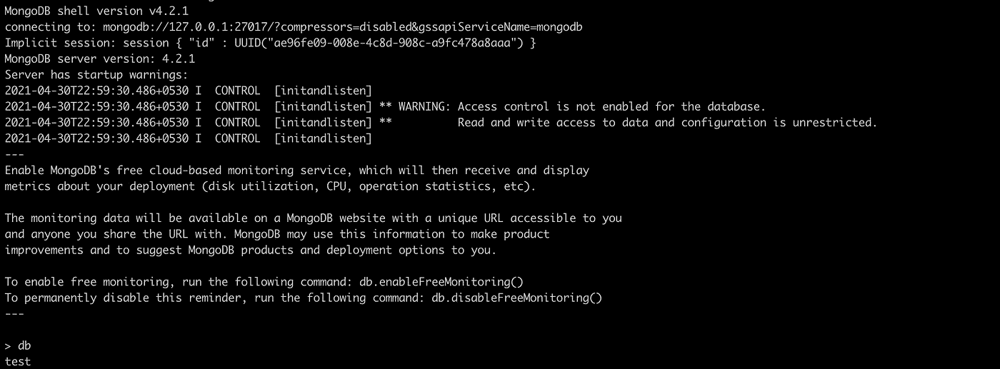

最初，您有一个名为 **test** 的默认数据库。

# 命令

## 1.查找您当前所在的数据库

```
db
```


该命令将显示您当前所在的数据库。`test`是默认出现的初始数据库。

## 2.列出数据库

```
show databases
```

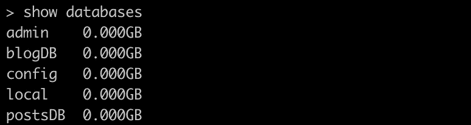

我目前有五个数据库。分别是:`blogDB`、`postsDB`、`admin`、`config`和`local`。

## 3.转到特定的数据库

```
use <your_db_name>
eg: use blogDB
```


在这里，我已经转移到了`blogDB`数据库。

## 4.创建数据库

在关系数据库中，我们有数据库、表、行和列的概念。但是在 NoSQL 数据库中，数据是以 BSON 格式存储的，这是 JSON 的二进制版本。它们存储在**集合**中。

在 SQL 数据库中，这些类似于表。

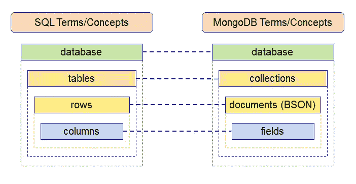

SQL 术语和 NoSQL 术语由[维多利亚马来亚](https://www.blogger.com/profile/18437865869379626284)

要在 mongo shell 中创建数据库，请使用以下命令:

```
use <new_db_name>
```

如果带有<new_db_name>的数据库已经存在，上述命令将导航到现有数据库。但是如果数据库不存在，那么它将创建新的数据库并导航到其中。</new_db_name>

创建新数据库后，运行`show database`命令不会显示新数据库，直到它有任何数据。

## 5.删除数据库

以下命令用于删除现有数据库。

```
db.dropDatabase()
```

## 6.创建收藏

您可以使用`use` 命令切换到您新创建的数据库。创建集合的一种方法是将数据插入到集合中:

```
db.testCollection.insert({"name": "dove", "age" : 26, "email": "test@gmail.com"})
```


这将首先创建您的收藏`testCollection` 如果收藏不存在。然后它会插入一个带有`name, age and email`的文档。

创建集合的其他方法如下所示:

```
db.createCollection("testCollection")
```

这样，您将在不插入数据的情况下创建一个集合。

## 7.插入数据

我们可以将数据插入到新的集合中，或者插入到以前创建的集合中。有三种插入数据的方法。

1.  `insertOne()`仅用于插入单个文档。
2.  `insertMany()`用于插入多份文件。
3.  `insert()`用于插入任意数量的文件。

以下是一些例子:

*   **insertOne()**

```
db.testCollection.insertOne(
      {
       "name": "bhim", 
       "age": 22,
       "email": "tewst@gmail.com"
      }
)
```

*   **insertMany()**

```
db.testCollection.insertMany([
      {
        "name": "navindu", 
        "age": 22,
        "email": "nav@gmail.com"
      },      {
        "name": "kovid", 
        "age": 27,
        "email": "kovig@gmail.com"
      },
      {
        "name": "john doe", 
        "age": 25,
        "city": "Hyderabad"
      }
   ]
)
```


`insert()`方法类似于`insertMany()`方法。

另外，注意我们在文档中为`john doe` *插入了一个名为`city` 的新属性。*所以如果你使用*`find`*那么你只会看到对于*`john doe``city`*属性的附加。****

***对于 MongoDB 这样的 NoSQL 数据库，这可能是一个优势。它允许可伸缩性。***

## ***8.在集合中查找数据***

***以下是查询集合中所有数据的方法:***

```
***db.testCollection.find()***
```

******

***如果你想在一个更干净的地方看到这个数据，只需要在它的末尾加上`.pretty()` 就可以了。这将以漂亮的 JSON 格式显示文档。***

```
**db.testCollection.find().pretty()**
```

****

**在上述文档中，每个文档中都有一个名为`_id`的额外字段。每当您插入一个文档时，MongoDB 都会自动添加一个`_id` 字段来惟一地标识每个文档。**

**如果您想要显示某个特定的文档，您可以指定想要显示的文档的单个细节。**

```
**db.testCollection.find(
        {
          name: "john doe"
        }
)**
```

****

**如果只想显示 25 岁以下的人，可以使用`$lt`根据条件过滤掉文档。**

```
**db.testCollection.find(         
       {
           age : {$lt : 25}         
       })**
```

**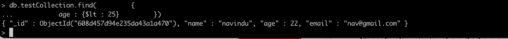**

**同样，`$gt`代表大于，`$lte`是“小于等于”，`$gte`是“大于等于”，`$ne`是“不等于”。**

## **9.更新文档**

**假设你想更新某人的地址或年龄，你该怎么做呢？好吧，看下一个例子:**

```
**db.testCollection.update({age : 22}, {$set: {age: 24}})**
```

**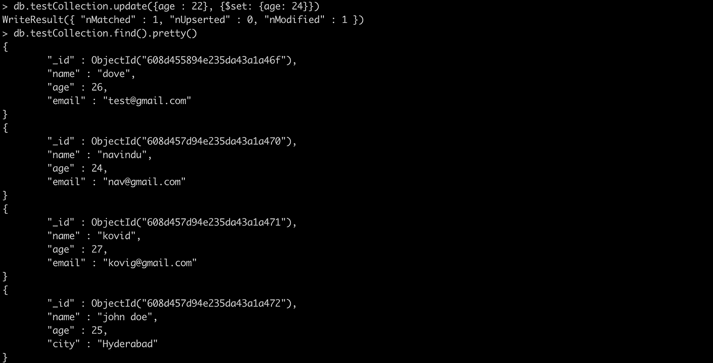**

**第一个参数是要更新哪个文档的字段。如果您需要从单个文档中删除一个属性，您可以这样做(假设您希望`age` 消失):**

```
**db.testCollection.update({name: "navindu"}, {$unset: {age:""}});**
```

**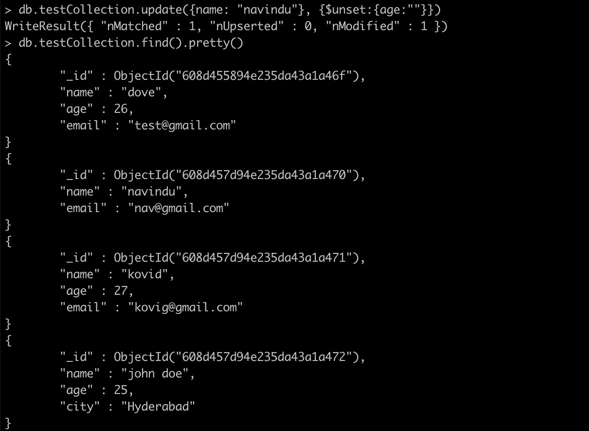**

## **10.删除文档**

**当您更新或删除一个文档时，您只需要指定`_id`，而不仅仅是`name`、`age`、`email`或`city`。**

```
**db.testCollection.remove({name: "navindu"});**
```

**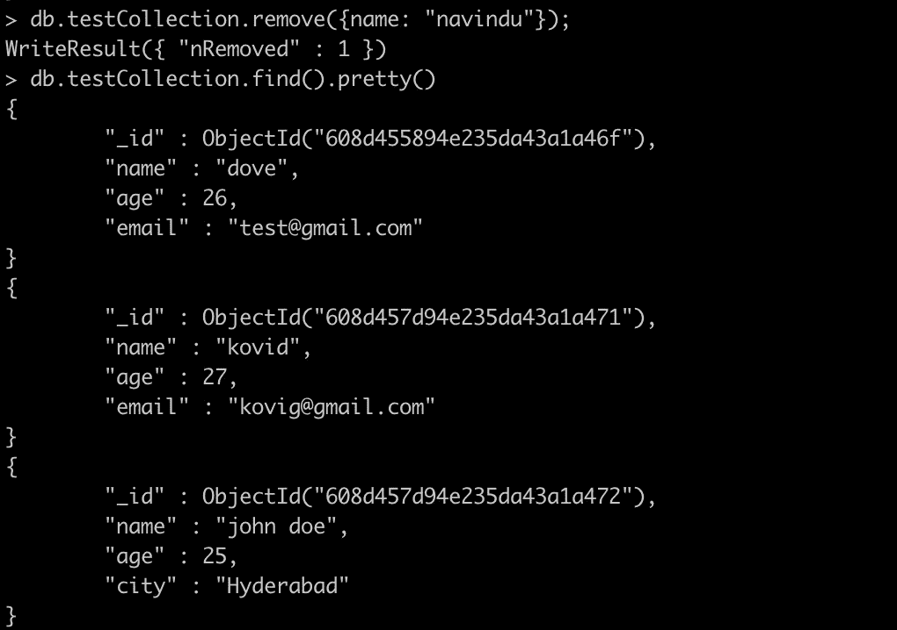**

## **11.移除收藏**

```
**db.testCollection.remove({});**
```

**上述命令不等同于用于删除集合中所有文档的`drop()`方法，而是使用`remove()`方法删除所有文档以及集合本身。**

## **12.删除收藏**

```
**db.testCollection.drop()**
```

## **13.极限方法**

**要限制 MongoDB 中的记录，需要使用 **limit()** 方法。该方法接受一个 number 类型的参数，这是您希望显示的文档数。**

```
**db.testCollection.find().limit(2)**
```

****

## **14.排序方法**

**在 MongoDB 中对文档进行排序，需要使用 **sort()** 方法。该方法接受包含字段列表及其排序顺序的文档。使用 1 和-1 来指定排序顺序。1 用于升序，而-1 用于降序。**

```
**db.testCollection.find().sort({name: 1})**
```

****

# **索引**

**索引支持高效的查询解析。如果没有索引，MongoDB 必须扫描集合中的每个文档，以选择那些与查询语句匹配的文档。这种扫描效率非常低，需要 MongoDB 处理大量数据。**

**索引是特殊的数据结构，它以易于遍历的形式存储一小部分数据集。索引存储特定字段或字段集的值，按照索引中指定的字段值排序。**

## **createIndex()方法**

**要创建索引，需要使用 MongoDB 的 createIndex()方法。 **createIndex()** 方法的基本语法如下()。**

```
**db.testCollection.createIndex({"name":1})**
```

**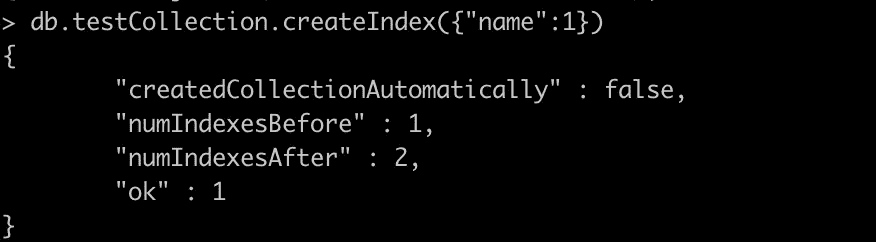**

**这里 key 是你要创建索引的字段的名称，1 表示升序。要按降序创建索引，需要使用-1。**

## **dropIndex()方法**

**您可以使用 MongoDB 的 dropIndex()方法删除特定的索引。DropIndex()方法的基本语法如下()。**

```
**db.testCollection.dropIndex({"name":1})**
```

**这里 key 是你要创建索引的文件的名字，1 代表升序。要按降序创建索引，需要使用-1。**

****

## **dropIndexes()方法**

**此方法删除集合中的多个(指定的)索引。DropIndexes()方法的基本语法如下()**

```
**db.testCollection.dropIndexes()**
```

**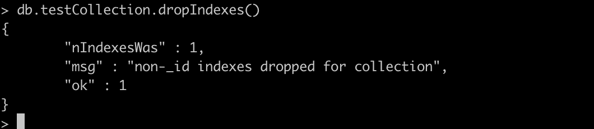**

# **getIndexes()方法**

**该方法返回集合中所有索引的描述。下面是 getIndexes()方法的基本语法**

```
**db.testCollection.getIndexes()**
```

**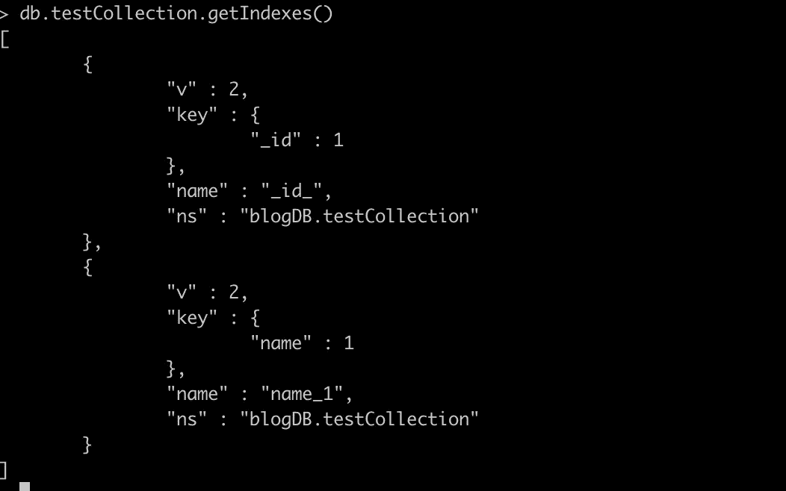**

# **逻辑运算符**

**MongoDB 提供了逻辑运算符。下图总结了不同类型的逻辑运算符。**

**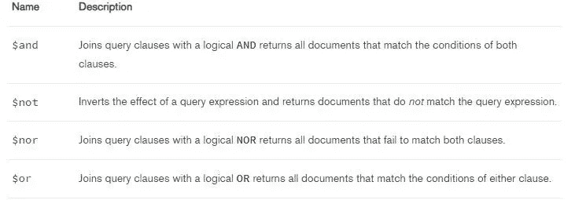**

**参考:MongoDB 手册**

**假设您想要显示年龄小于 25 岁的人，并且他们的位置在科伦坡。我们能做什么？**

**我们可以使用`$and` 运算符！**

```
**db.testCollection.find({$and:[{age : {$lt : 25}}, {city: "colombo"}]});**
```

# **MongoDB 相对于 RDBMS 的优势**

**(参考:TutorialsPoint)**

*   ****无模式**—MongoDB 是一个文档数据库，其中一个集合包含不同的文档。文档的字段数量、内容和大小可以因文档而异。**
*   **单个对象的结构是清楚的。**
*   **没有复杂的连接。**
*   **深度查询能力。MongoDB 支持使用基于文档的查询语言对文档进行动态查询，这种语言几乎和 SQL 一样强大。**
*   **调音。**
*   ****易于扩展**—MongoDB 易于扩展。**
*   **不需要应用程序对象到数据库对象的转换/映射。**
*   **使用内部内存存储(窗口)工作集，支持更快的数据访问。**

*****感谢阅读！*****