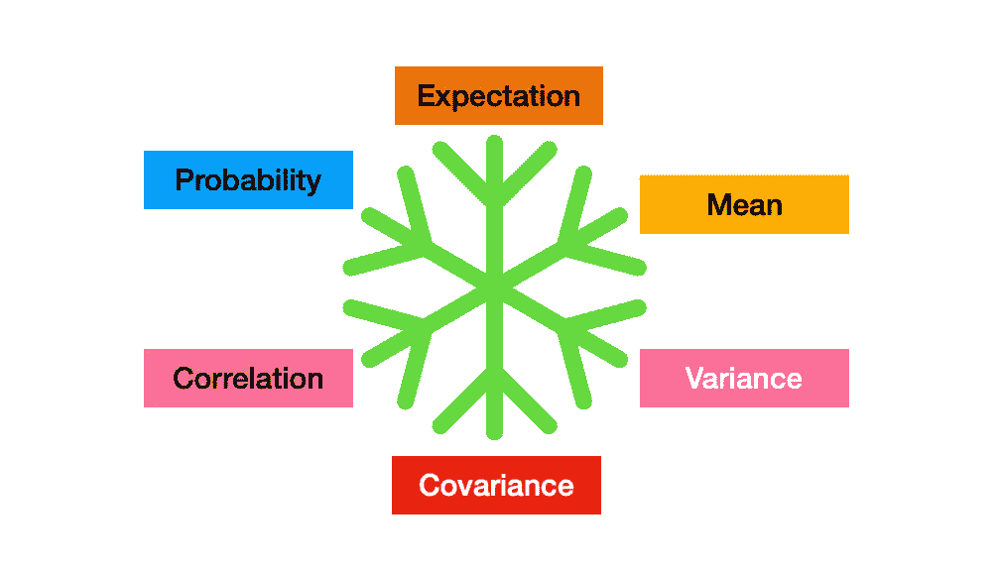

# ML 族的所有概率项

> 原文：<https://medium.com/nerd-for-tech/all-probability-terms-for-ml-folks-9cff712c82e5?source=collection_archive---------19----------------------->

当我们遇到各种各样的 ML 算法时，有些术语实际上来源于概率和统计，作为 ML 工程师或数据科学家的词典。我们将努力理解每个术语的含义，并从数学上对它们进行定义。条款包括:-

1.  期望值|平均值
2.  方差|标准偏差
3.  协方差