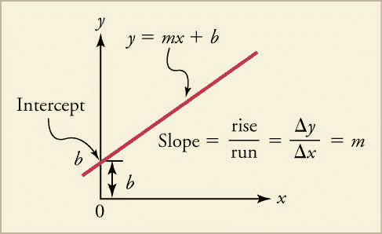
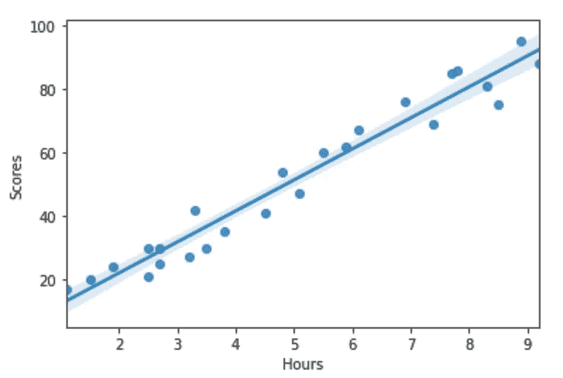
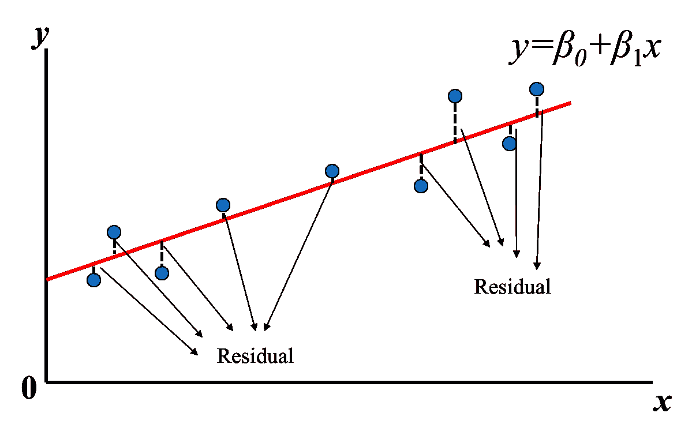
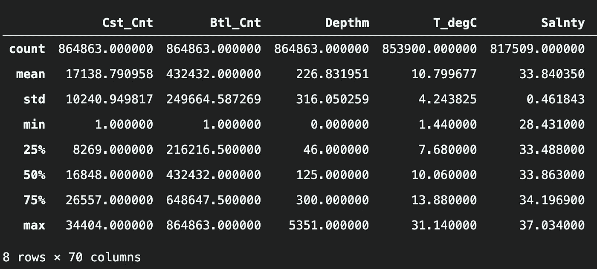
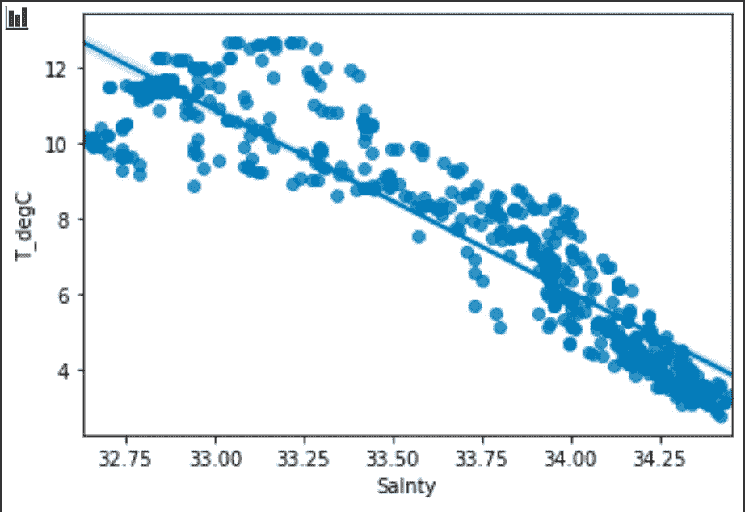
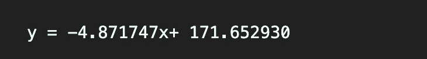
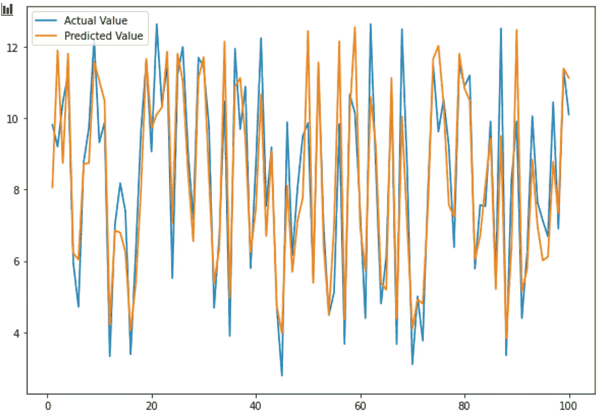

# 关于 ML 的简单线性回归，你需要知道的所有数学知识

> 原文：<https://medium.com/nerd-for-tech/all-the-math-you-need-to-know-about-simple-linear-regression-for-ml-378d77995f3b?source=collection_archive---------8----------------------->

当我开始学习数据科学的旅程时，我意识到我对数学太生疏了，无法完全理解算法是如何工作的，例如 *k* -NN、线性回归算法等等。就好像我对它有一个模糊的概念，但是作为一个优等生，我需要理解每个概念到底是如何运作的！这就是为什么我决定写这篇文章，我要邀请你和我一起重温那些数学公式！

# 从八年级的数学开始



资源:[德州网关](https://www.texasgateway.org/resource/23-position-vs-time-graphs)

没错，这就是我有多认真，我们要用这个从 0 到 100！如果我有两点，那么我可以计算斜率，截距，得到这条线的一个方程，格式为`**y = mX + b**` **，**也就是**线性度**。

这时，预测的想法就出现了。我们刚刚做的是在给定的信息中找到模式，我们得到了方程。有了这个等式，我们可以用任何给定的`**x**`值来计算`**y**`的值。考虑到这一点，我们已经为大学水平的数学做好了准备！

# 什么是简单线性回归？

我们说 x 是自变量，y 是因变量，因为`x`会影响`y`的结果。例如，我们可以说你学习的时间越多，你可能得到的分数越高。或者地段越大，房价就越大。



学习时间和百分比分数的散点图

然而，这并不保证这两个变量之间会有因果关系。我们只能说它们是相关的，因为`x`可能不是导致结果`y`的唯一原因。这也解释了为什么当你看散点图时，这些点没有完全落在一条线上。正如你从上面的图表中看到的，在点和线之间有一些空间，我们称这些空间为残差或误差。

# **最适合**的线

因此，我们的下一个问题将是:我们如何找到一条可以最小化所有点的残差的线？现在是时候介绍著名的线性回归函数了！



[resource: 線性回歸(Linear Regression) by Tommy Huang](https://chih-sheng-huang821.medium.com/%E7%B7%9A%E6%80%A7%E5%9B%9E%E6%AD%B8-linear-regression-3a271a7453e)

`*ŷi =β0+β1xi，i=1, …,n*`

请不要被方程式吓倒，因为它只是成人版的`y=mx+b`。让我为你脱下它的伪装。`β0`是截距，`β1`是回归系数，你可以把它想成斜率，`*ŷ*` 是 y 的预测值，是你从方程`*β0+β1x*`中得到的 y 的值，我们称之为“ *y 帽”很简单，对吧？戴帽子的 y！*

回到问题，我们想知道如何最小化残差，我们可以把它表示为方程为`εi *= yi* — *ŷi*` *，* y 是实际值。

为了获得最小值`εi`，我们将使用**普通最小二乘法、**和**T21，它涉及最小化残差平方和。因为残差可以是正的，也可以是负的，为了避免求和时出现的问题，我们对残差求平方。**


为了得到`β0`和`*β1*`的值，我们对`B̂0`和`B̂1`进行偏导数。接下来我们设置偏导数等于 0，然后就可以开始求解了！要看如何一步一步解方程，可以看下面的视频。

# 让我们进入正题

既然我们已经对什么是线性回归有了一个概念，我们就可以开始动手了！我们要用`scikit-learn`库实现一个线性回归机器学习模型。

## 根据盐度数据预测水温

在这个项目中，我将使用线性回归算法用 [CalCOFI 数据集](https://www.kaggle.com/sohier/calcofi?select=cast.csv)训练一个模型。如果你想查看完整的代码，这里是我的 Github repo:[CalCOFI-Regression-ML](https://github.com/yinnyC/CalCOFI-Regression-ML)

```
*import* pandas *as* pd
*import* numpy *as* np
*import* seaborn *as* sns
*import* matplotlib.pyplot *as* pltdf = pd.read_csv('bottle.csv') # Load in data
df.describe() 
```



在定型模型之前，我们可以先浏览数据，以便更好地了解对此数据集使用线性回归算法是否是个好主意。

```
*# Data Cleaning* df = df[['Salnty', 'T_degC']]
df.dropna(axis = 0,inplace = True)
df.shape *# (814247, 2) too many data, we just take 500 rows* df = df[:][:500]
sns.regplot(x="Salnty", y="T_degC", data=df);
df.corrwith(df['T_degC']) *# -0.921586*
```

从下面的图表中，我们可以看到盐分和温度之间的关系。



接下来，我们需要准备用于训练和测试的数据。请注意，我们将 X 设置为 salty 的原因是，我们希望根据 salty 来预测温度。

```
*from* sklearn.model_selection *import* train_test_splitX = df['Salnty'].values.reshape(-1,1)
y = df['T_degC'].values
X_train, X_test, y_train, y_test = train_test_split(X, y, test_size=0.2)
```

现在，请击鼓！我们正式开始训练模特了！

```
*from* sklearn.linear_model *import*  LinearRegressionregessor = LinearRegression()
regessor.fit(X_train, y_train) # Here is where the magic happens
print(f"y = {regessor.coef_[0]:2f}x+ {regessor.intercept_:2f}")
```

这里我们得到的输出是基于我们上面讨论的线性回归算法的最佳拟合线。



接下来，我们将使用我们之前准备的测试数据集来测试该模型，以便我们可以了解该模型可以做出多准确的预测。

```
y_pred = regessor.predict(X_test.reshape(-1,1))x = np.arange(1, 101, 1)
plt.plot(x,y_test,label='Actual Value')
plt.plot(x,y_pred,label='Predicted Value')
regessor.score(X_test, y_test) *# Accuracy Score = 80.36*
```



从上面得到的结果来看，我们可以说这个模型做得不错。然而，这只是一个演示，展示了我们如何用线性回归算法来训练一个模型。希望这篇文章对你有所帮助！

# 参考

1.  [線性回歸(Linear Regression) by Tommy Huang](https://chih-sheng-huang821.medium.com/%E7%B7%9A%E6%80%A7%E5%9B%9E%E6%AD%B8-linear-regression-3a271a7453e)
2.  线性方程由[德克萨斯网关](https://www.texasgateway.org/resource/23-position-vs-time-graphs)
3.  [卡尔科菲数据集](https://www.kaggle.com/sohier/calcofi?select=cast.csv)