# SQL 中用于面试的所有重要窗口函数

> 原文：<https://medium.com/nerd-for-tech/all-windows-functions-in-sql-6b4da1cfedd7?source=collection_archive---------0----------------------->


几个月前，当我开始准备面试时，我意识到掌握分析功能对于在任何分析公司就业都是极其重要的。

我开始在互联网上寻找资源，并意识到几乎没有任何有组织的数据资源可用。所以我决定把这些函数写在这里，以防有人准备面试。

# 介绍

我有一个基本的期望，你在编写 SQL 查询经验丰富。在讨论函数之前，我们先来谈谈一些基本概念。

我假设您知道 SQL 命令的执行顺序。万一你没有让我们讨论一次。查询执行从“from”子句开始，并按如下所示的顺序结束。

1.  `FROM`条款
2.  `ON`条款
3.  `OUTER`条款
4.  `WHERE`条款
5.  `GROUP BY`条款
6.  `HAVING`条款
7.  `SELECT`子句(使用 select 子句执行窗口功能)
8.  `DISTINCT`条款
9.  `ORDER BY`条款
10.  条款

语法是不言自明的，因为**窗口函数**是在 select 子句中编写的，因此与 select 语句一起执行。需要记住的重要一点是，不能在 windows 函数创建的列上编写 **where** 子句，因为 **where** 在 select 之前执行。例如，在下面的示例中，我们不能在 **rnk** 列上写入 where 条件，因为 where 将在 **rnk** 列创建之前执行。

```
select empno, ename, job, hiredate, sal,
rank()
    over( order by hiredate
    )rnk

from emp
order by sal;
```

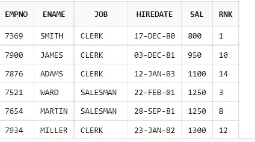

这里 **rnk** 只是另一个列名。计算将由函数进行，结果将显示在列中。

windows 函数的标准语法是

```
window_function (<column_name>) OVER (
   [ PARTITION BY expr_list ]
   [ ORDER BY order_list ]
   [ windows clause )
```

你以后会习惯的。只是看一看，然后继续前进。

# 排名功能

有多个函数可用于对行进行排序。当值相同时， **Rank()** 函数将显示相同的等级值，但如果前两个值相同，则下一个值将等于行号，例如 1、1、3 等等。

而在 **dense_rank()** we 值是连续的。例如，如果前两个值相同，则为 1、1、2 等

在 **row_number()** 函数中，这些值与行值 1、2、3 等一致，即使前两个值相同。

## 等级函数

**表格结构**

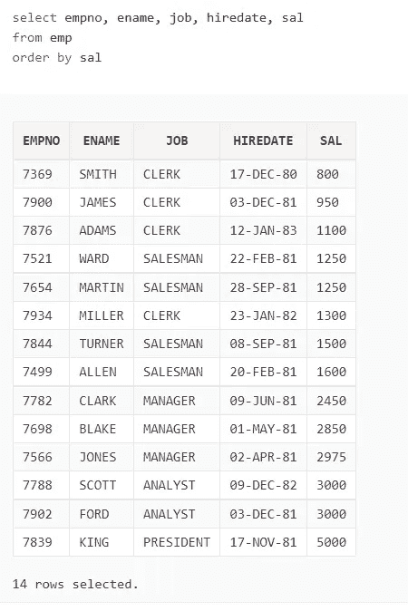

**问题陈述:**根据员工入职日期计算排名，按员工工资排序

```
select empno, ename, job, hiredate, sal,
rank()
    over( order by hiredate
    )rnk

from emp
order by sal;
```


## 密集 _ 秩

**问题陈述:**按员工工资计算排名，按员工工资升序排序

```
select empno, ename, job, hiredate, sal,
rank()over(order by sal) as rnk,
dense_rank()
    over( order by sal
    )as sal_dense_rnk

from emp
order by sal
;
```

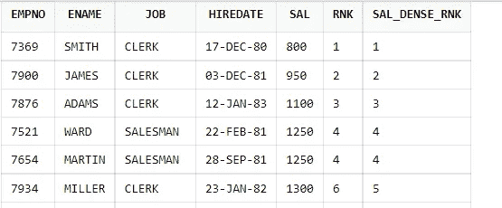

## 行数

**问题陈述:**按员工工资计算排名，按员工工资升序排序。sal 相同时使用 Empno。

```
select empno, ename, job, hiredate, sal,
row_number() over(
order by sal, empno) as row_num,
rank()over(order by sal) as rnk,
dense_rank()
    over( order by sal
    )as sal_dense_rnk

from emp
order by sal
;
```

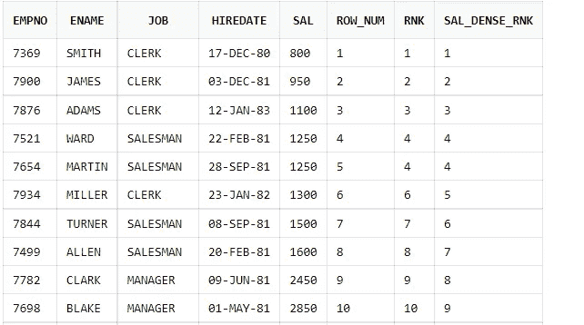

## Percent_Rank，Cume_Dist，NTILE

**表格结构**


**问题陈述:**使用 PERCENT_RANK、CUME_DIST 和 NTILE(四分位数、十分位数、三分位数等)显示好莱坞电影票房销售的分布

```
select name, gross_sales,
percent_rank()
over(
order by gross_sales
) as pct,
cume_dist()
over(order by gross_sales
) as cum_dist,ntile(4)
over(
order by gross_sales) as ntil
from movies;
```

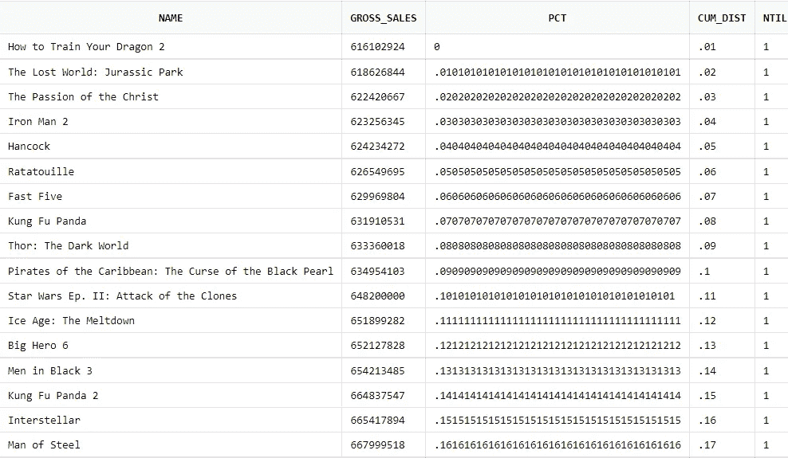

## 处理空值

**表格结构**

**表 1** :月亮

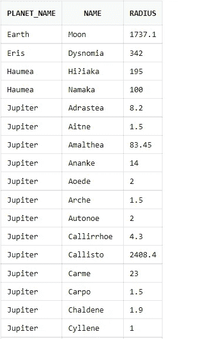

**表 2** :行星


**问题陈述**:按照行星(火星、金星、冥王星、水星、海王星)的半径按 Desc 顺序排列。空值应该最后显示。

```
select p.name as planet,m.name as moon,  m.radius,
row_number()
over(
order by m.radius desc) as rnk
from 
planets p, moons m
where p.name =m.planet_name(+)
and p.name in ('Mars','Venus','Pluto', 'Mercury', 'Neptune')
```


```
select p.name as planet,m.name as moon,  m.radius,
row_number()
over(
order by m.radius desc nulls last) as rnk
from 
planets p, moons m
where p.name =m.planet_name(+)
and p.name in ('Mars','Venus','Pluto', 'Mercury', 'Neptune');
```

# 分割条款

Partition 子句类似于 group by，但是尽管两个子句都聚合数据，但 Partition by 不会减少行数，而 group by 会汇总数据。partition by 只是创建了一个窗口，我们可以在这个窗口上进行计算。让我们通过例子来理解这个。

**问题陈述**:我需要按员工姓名统计的部门工资总额

表格结构:

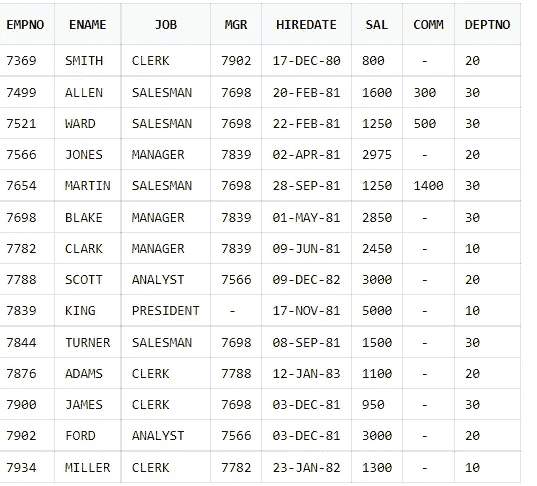

```
select deptno,empno,ename, job,sal,
sum(sal)
over(
partition by deptno
order by ename) as total
from emp
order by deptno, ename;
```

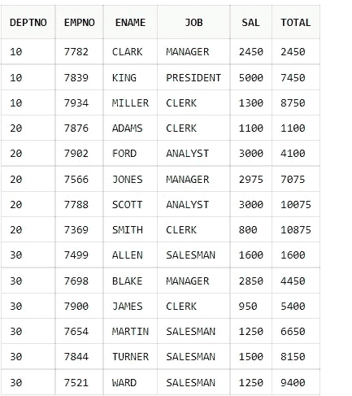

## 窗口聚合

我们现在将开始使用 windows 子句。我们可以对行的范围执行数学运算。

**问题陈述:**我需要一个全世界海洋覆盖范围的运行总数，从最大到最小

**表格结构**:

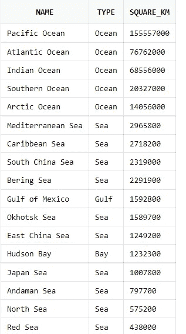

```
select name, type, square_km,        
sum(square_km) over ( order by square_km desc            
rows between unbounded preceding and current row ) as tot from water;
```

**问题陈述:**我需要一个世界范围内水域类型的海洋总覆盖范围的运行总数，从最大到最小

```
select name, type, square_km,
       sum(square_km) over ( 
       partition by type
       order by square_km desc 
          rows between 1 preceding and 1 following 
) as tot
from water
order by square_km desc
;
```

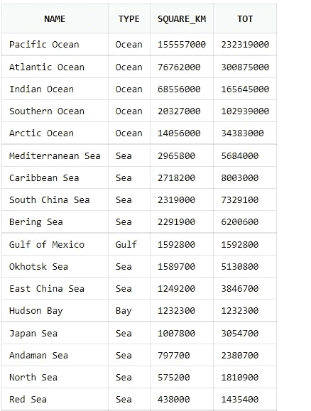

**问题陈述**:每日推文的 6 个月移动平均值。

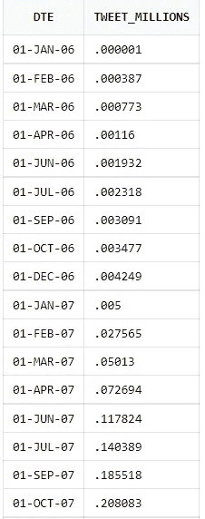

```
select dte, tweet_millions,
avg(tweet_millions)
over(
order by dte
range between interval '6' month preceding and current row) as averagefrom tweets;
```

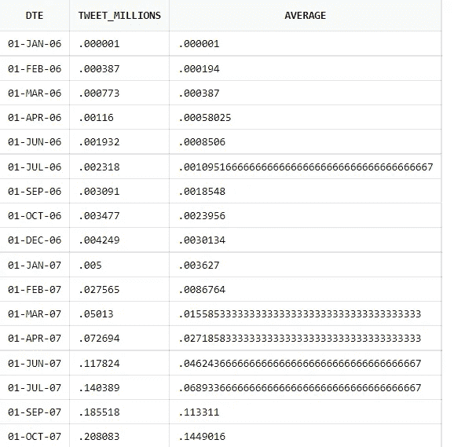

问题陈述:让我看看英国历史上的预期寿命，并与两边的 5 年进行比较

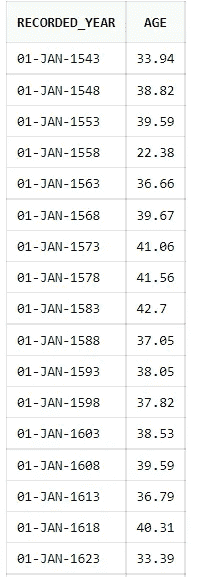

```
select recorded_year, age,
first_value(age)
over(
order by recorded_year
range between interval '5' year preceding and interval '5' year following
)as fv,
last_value(age)
over(
order by recorded_year
range between interval '5' year preceding and interval '5' year following) as lv
from life_expectancy;
```

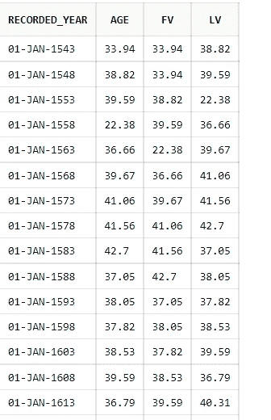

问题陈述:将纽约市的每日优步出行与 7 月至 9 月的第二低/最高进行比较

表格结构:

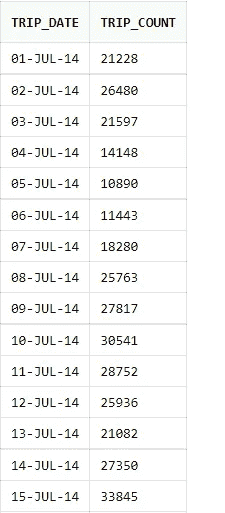

```
select trip_Date, trip_count,nth_value(trip_count, 2)
over(
order by trip_count
rows between unbounded preceding and unbounded following)as secnd_lowestfrom trips
order by trip_date
```

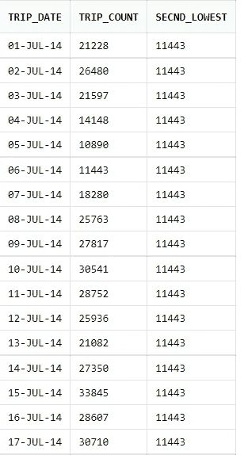

# 处理空值

**问题陈述**:填写 DEPTNPO 表中的空值，按部门统计员工。

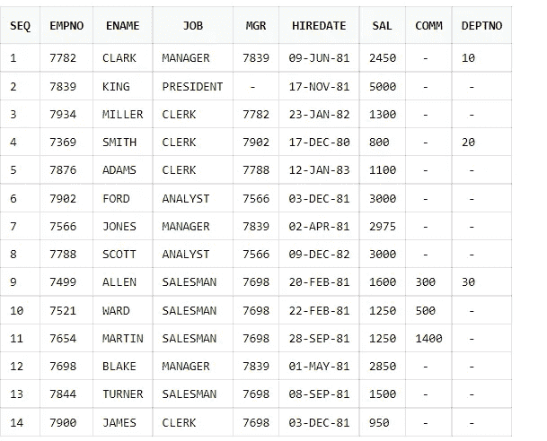

```
select seq, empno, ename, job, mgr, hiredate, sal, deptno,
last_value(deptno ignore nulls)
over(order by seq) as dept
from external_emp
```

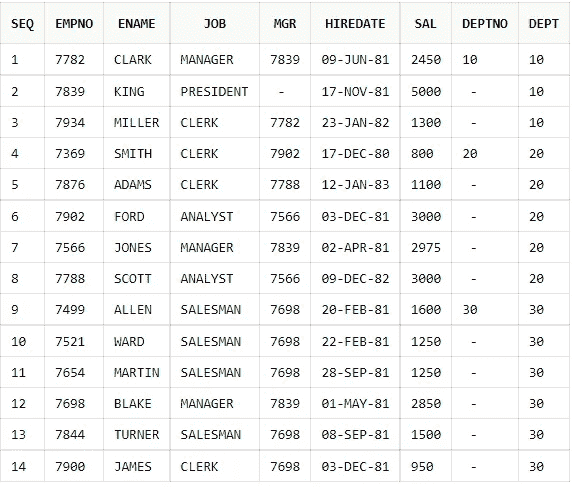

```
select dept, count(dept)from 
(select seq, empno, ename, job, mgr, hiredate, sal, deptno,
last_value(deptno ignore nulls)
over(order by seq) as deptfrom external_emp) agroup by dept
order by dept
```

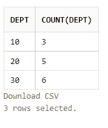

# 滞后和超前

这是 windows 最重要的功能之一。在我最近的 SQL 面试中，我被问了 3 个关于提前和滞后的问题。lag 函数将只提供上面一行的数据。

```
LAG(*expression* [,*offset*[,*default_value*]]) OVER(ORDER BY *columns*)
```

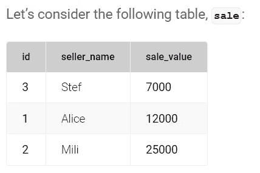

```
**SELECT** seller_name, sale_value,LAG(sale_value) OVER(**ORDER** **BY** sale_value) **as** previous_sale_value**FROM** sale;
```

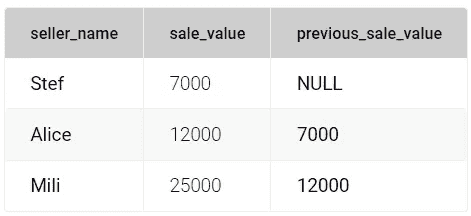

lead 函数将做相反的事情。它将为我提供下面一行的值。现在来做一道复杂的题。

**问题陈述**:仅显示该特定订单的订单状态发生变化的日期。删除剩余的数据。

**表格结构**


```
select order_id, status_date,lead_status,status,
lag(status_date)
over(partition by order_id order by status_date ) from_date,
status_date to_date
from(select 
    order_id,
    status_date,
    status,
    lag(status) over (partition by order_id order by status_date) lag_status,
    lead(status) over (partition by order_id order by status_date) lead_status
  from ORDERS)a

where lag_status is null
       or lead_status is null
       or lead_status <> status
  order by order_id, from_date nulls first
```

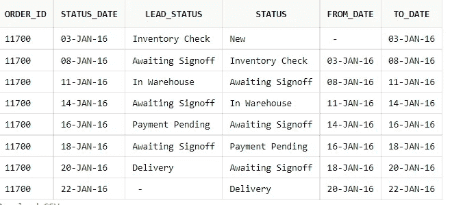

# 结论

如果你能明智地使用这些功能，你的生活会变得更轻松。我在所有的面试中都被问到窗口功能，所以一定要练习它们。让我去掉对掌握这些功能有很大帮助的 youtube 频道名称。你可以 [**点击这里**](https://www.youtube.com/watch?v=0cjxYMxa1e4&list=PLJMaoEWvHwFIUwMrF4HLnRksF0H8DHGtt&index=1) 观看视频