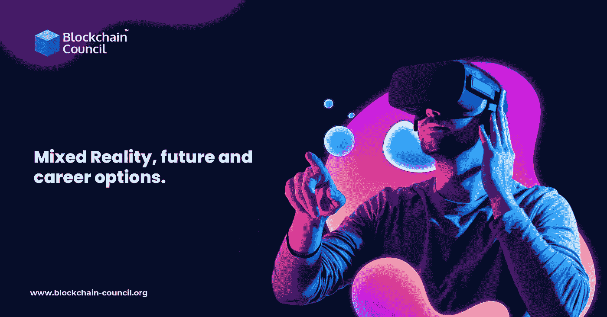

# 你所需要知道的关于混合现实，它的未来，和职业选择

> 原文：<https://medium.com/nerd-for-tech/all-you-need-to-know-about-mixed-reality-its-future-and-career-options-c6dfd9eb6cc9?source=collection_archive---------5----------------------->

你有兴趣在混合现实中建立职业生涯，但不知道从哪里开始？放心吧！阅读这篇博客，了解虚拟现实如何逐渐改变周围的一切，一次一场革命。学习如何获得和提高基本的混合现实能力，以便在成为 [**认证的混合现实专家**](https://www.blockchain-council.org/certifications/certified-mixed-reality-expert/) **后，您可以释放您的技术超能力，并创造利润丰厚的职业生涯。**但是，如果你对这个概念不熟悉，让我们先简单介绍一下。

# 什么是混合现实？

当你想到混合现实时，你会想到什么？它是计算机和人类之间的一种交互类型，还是一种混合？生活在混合现实中意味着什么？

简单地说，它是物理世界和数字世界的融合。通常，混合现实体验是计算机处理、环境因素和人类参与的融合。

好吧，让我们把它变得更简单。考虑一个有真实和虚拟物体的房间，例如一个数字世界地球仪，一个变成计算机化身的人，以及一只热情地摇尾巴的狗的逼真数字复制品。

你目前正在描绘混合现实(MR)，一种将物理现实与数字领域紧密结合的技术。听起来不可能？嗯，不再是了。有了**区块链教育的高级课程，**就完全说得通了——相信它！

# 混合现实的潜力:到底有没有？

在过去的几年里，技术领域发生了巨大的变化。

**区块链专业人士**几十年来一直在寻找弥合数字世界和物理世界之间鸿沟的方法。3D 视频、VR 和 AR 等技术越来越多地通过应用程序、视频游戏和互联网体验融入到今天的日常生活中。

根据专家的说法，疫情在 2020 年将数字过渡推向了一个新的水平，将世界推向了大约七年后的未来。因此，不仅 VR 和 AR 的接受度提高了，混合现实的演变也是如此:MR。

MR 是沉浸式技术的后起之秀，它将 ar 和 VR 的所有优势结合到一个单一的惊人体验中。毫无疑问，它的未来看起来很有希望，不是吗？

# 这就是未来的情况

越来越多的企业将运营重点放在数字化转型上。数据和知识的无限制可用性彻底改变了商业模式。但是越来越数字化的不仅仅是程序和产品。未来的工作场所也将具备所有这些特征。增强现实、虚拟现实和混合现实等沉浸式媒体将在未来的工作中至关重要。所以，这是一个很好的时机，让有志于事业的人报名参加高级 [**区块链技术培训**](https://www.blockchain-council.org/blockchain-certification/) ，为未来的世界做好准备。

从表面上看，混合现实提供了许多类似于其他沉浸式技术的优势。当你能在几秒钟内感觉到你和你的同事在同一个房间时，你就不需要在旅行上花太多的钱或时间。当你能面对面而不是隔着屏幕看到你的同事时，你会觉得自己是团队的一员。

混合现实还将更多的 3D 内容引入了工作场所，使我们能够更深入地研究各种项目和想法的细节，而不必依赖于永无止境的复杂蓝图、解释或草图。

# 认证混合现实专家的几个惊人的职业选择

*   **混合现实艺术家**

混合现实艺术家开发和设计技术，使人机交互更加有效。他们负责 3D 设计和虚拟现实的几乎每一个方面。他们擅长最大限度地利用技术和软件，为用户创造流畅、难忘的增值体验。你想成为有创造力的科技极客之一吗？成为**认证混合现实专家**有很多高级课程。

*   **产品设计中的 MR**

设计师将不再依赖传统的计算机 3D 程序。通过高端培训和正确的技能组合，他们将有能力直接检查和优化设计。

设计师可以用 MR 潜入他们的作品，从各个角度观察并优化它。与传统的展示方式相比，如此靠近一个物体会让你对它的构成和功能有一种全新的感受。

*   **虚拟现实音效专家**

顾名思义，这些专家为虚拟现实应用和游戏生成定制音频。他们是模拟实时环境和增强界面视觉吸引力的大师。这是一个要求很高的职位，需要广泛的领域知识和有利可图的创造力。

**成为认证混合现实专家的好处**

互联网上有许多混合现实课程，但来自像区块链委员会这样的知名机构的认证将有助于你推进你的职业。有了 MR 认证，你可以对混合现实的原理、好处和未来的职业范围有一个透彻的理解。此外，获得正式的虚拟现实认证可以帮助你理解虚拟现实的复杂方面，如 3D 图形，映射和用例。它让你有机会与来自世界各地的其他虚拟现实爱好者和专家互动。那么，你还在等什么？