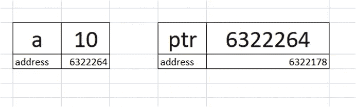
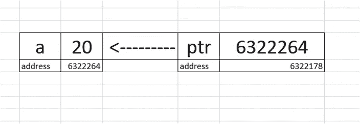

# 关于指针你需要知道的一切-第 1 部分

> 原文：<https://medium.com/nerd-for-tech/all-you-need-to-know-about-pointers-part-1-1470d2d24d78?source=collection_archive---------2----------------------->

## 使用地址和了解动态内存分配

C 语言中最重要的概念之一是指针。此外，这一概念被认为是最令人困惑和最难理解的概念之一。我说，这是一种误解。这并不真的很难理解。这篇文章真的很有帮助，会让你很容易理解！

所以，让我们开始吧！

# 处理地址和对指针的需求

我们在编程时一直在隐式地使用地址。这可以通过一个简单的例子来实现。

在上面的程序中，变量 a 是一个名为的**位置，并在内存中被赋予一个位置(即地址)。存储在该地址的值是 10。**

现在，我们经常遇到需要显式处理地址的情况。这就是我们需要意识到需要**指针**的地方。

在我们看到指针的必要性之前，让我们先来探讨一下什么是指针？

> 一种能够保存另一个变量地址的变量/标识符。

据说那个**变量**将**指针**指向另一个变量的地址，因此得名**指针**。也称为**解引用**。

在上面的程序中， **&** 表示的**地址， ***** 表示该地址的**值。****

指针演示

从上图可以清楚地看到，a 保存的是值 10，存储在地址 6322264(比如说)。变量 **ptr** 存储该地址，并被称为**指向该地址**。

现在，让我们考虑发生重新初始化的情况。

在上面的程序中，当*ptr = 20 时，那么当我们打印 a 时，打印的是 20。

变量的重新初始化

那么，指针有哪些应用呢？

> 1.引用调用
> 
> 2.动态存储分配

我们将在文章的下一部分(第 2 部分)看到指针的使用以及关于这些主题的更多细节。此外，我们还将了解所谓的“双指针”(通俗地说就是这样)。所以，在第二部分中我们有很多东西要学。敬请期待！

如果您有任何疑问，请在下面的**评论**部分发表。在 [LinkedIn](https://www.linkedin.com/in/vaidhyanathansm/) 上和我联系。此外，如果你想看看我开发的惊人的应用程序集，不要忘了检查[谷歌 Play 商店](https://play.google.com/store/apps/developer?id=Programmers+Gateway)。

在这里了解我更多[。](https://vaidhyanathansm.tech/)

话虽如此，感谢您阅读我的文章和*快乐编码！*